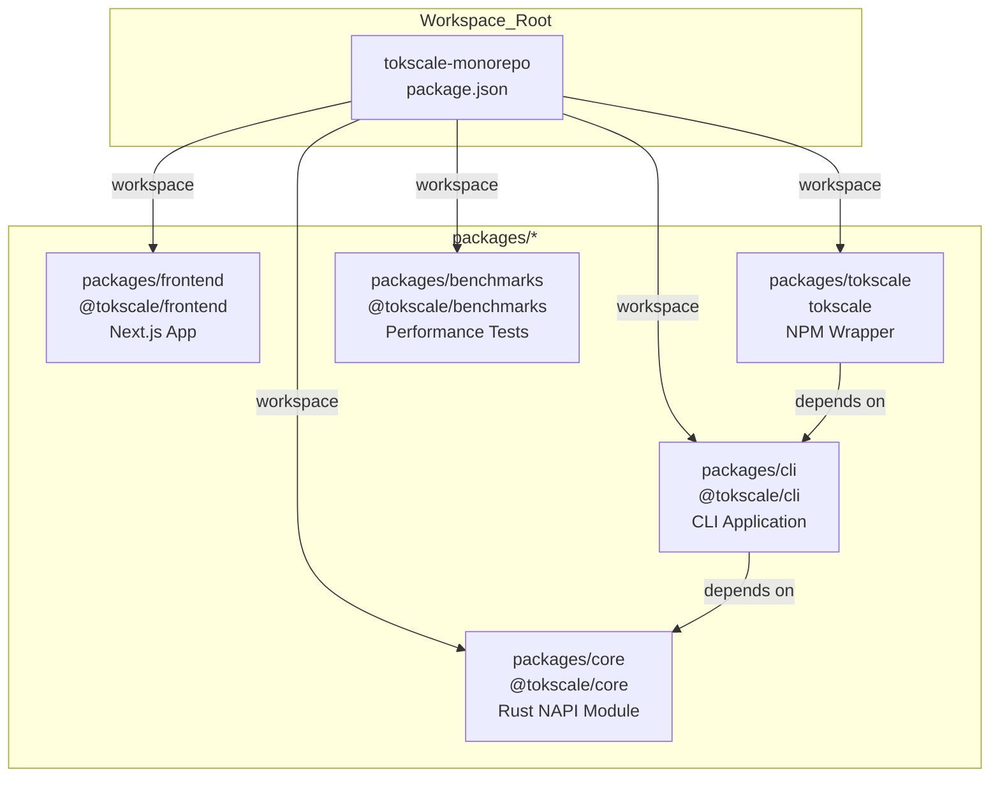
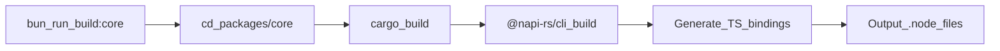
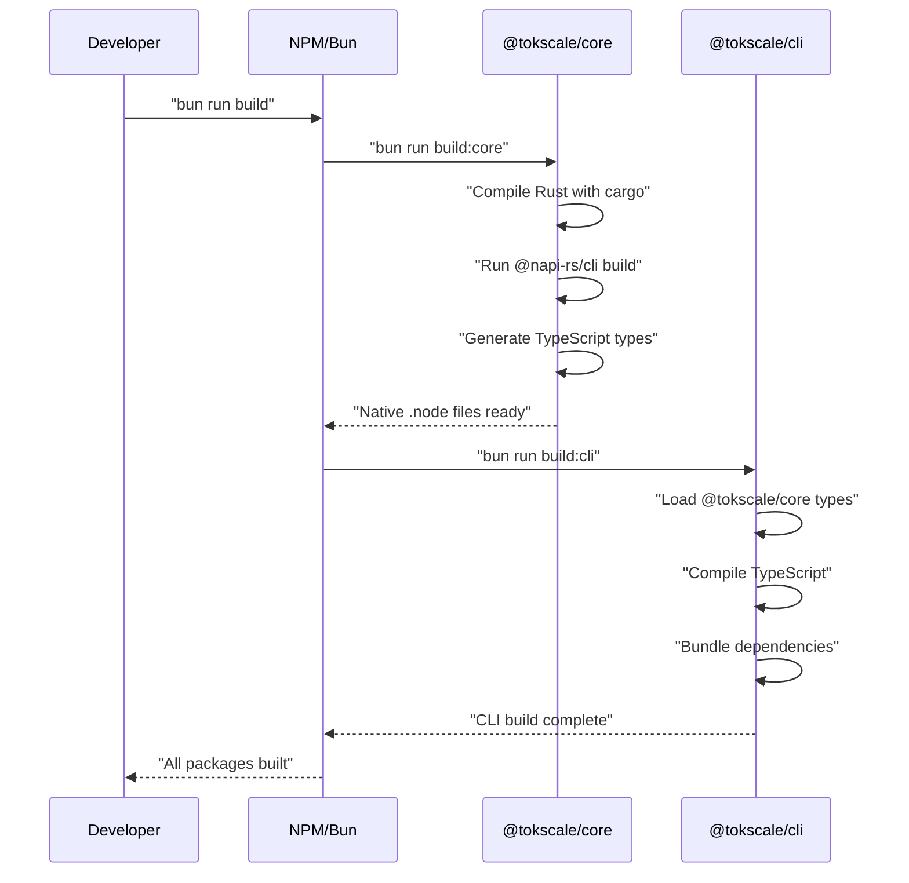

# 로컬 개발 설정

<details>
<summary>관련 소스 파일</summary>

다음 파일들은 이 위키 페이지를 생성하기 위한 컨텍스트로 사용되었습니다.

- [packages/benchmarks/README.md](packages/benchmarks/README.md)
- [packages/benchmarks/generate.ts](packages/benchmarks/generate.ts)
- [packages/benchmarks/runner.ts](packages/benchmarks/runner.ts)
- [packages/cli/bunfig.toml](packages/cli/bunfig.toml)
- [packages/cli/tsconfig.json](packages/cli/tsconfig.json)
- [scripts/cli.sh](scripts/cli.sh)

</details>


이 페이지는 Tokscale 모노레포의 로컬 개발 환경을 설정하는 방법을 제공합니다. 필수 조건, 설치 단계, 네이티브 모듈 빌드, 개발 서버 실행, 벤치마크 인프라 사용을 다룹니다.

## 개요

Tokscale은 Bun workspaces로 관리되는 모노레포를 사용합니다. 개발 설정에서는 CLI 또는 프론트엔드 애플리케이션을 실행하기 전에 네이티브 Rust 모듈(`@tokscale/core`)을 빌드해야 합니다. 이 가이드는 초기 clone부터 개발 서버 실행까지 전체 설정 과정을 안내합니다.

## 필수 조건

### 필요한 도구

| 도구 | 최소 버전 | 목적 |
|------|----------------|---------|
| **Bun** | 최신 | 패키지 관리자 및 JavaScript 런타임 |
| **Node.js** | 20.x | TypeScript 컴파일 및 도구 |
| **Rust** | 1.70+ | 네이티브 NAPI 모듈 빌드 |
| **NAPI-RS CLI** | 3.4.1+ | 네이티브 모듈 빌드 도구 |

### 플랫폼별 요구 사항

네이티브 `@tokscale/core` 모듈은 사용자의 플랫폼에 맞게 컴파일되어야 합니다. 빌드 시스템은 다음을 지원합니다.
- macOS (x64, ARM64)
- Linux GNU (x64, ARM64)
- Linux MUSL (x64, ARM64)
- Windows (x64, ARM64)

## 저장소 구조

모노레포는 다음 workspaces로 구성되어 있습니다.



**Workspace Configuration Diagram**

각 workspace에는 독립적인 의존성과 스크립트를 가진 자체 `package.json`이 있습니다.

## 설치 단계

### 1. 저장소 Clone

```bash
git clone https://github.com/junhoyeo/tokscale.git
cd tokscale
```

### 2. 의존성 설치

```bash
bun install
```

이 명령은 모든 workspace 의존성을 설치하고 `postinstall` 스크립트를 자동으로 실행합니다. `postinstall` 훅은 `$VERCEL` 환경 변수를 확인하고 조건부로 core 모듈을 빌드합니다.

### 3. 네이티브 Core 모듈 빌드

postinstall 스크립트가 건너뛰어졌거나 다시 빌드해야 하는 경우:

```bash
bun run build:core
```

빌드 과정:
1. Rust 소스를 네이티브 `.node` 바이너리로 컴파일합니다.
2. NAPI-RS TypeScript 바인딩을 생성합니다.
3. 산출물을 `packages/core/` 디렉터리에 배치합니다.



**Build Script Execution Flow**

### 4. CLI 패키지 빌드

```bash
bun run build:cli
```

이는 TypeScript CLI 애플리케이션과 그 의존성을 컴파일합니다. CLI는 core 모듈이 먼저 빌드되어 있어야 합니다. CLI 설정은 `packages/cli/tsconfig.json`에 정의되어 있으며, `NodeNext` 모듈 해석과 함께 `ES2022`를 대상으로 합니다 [packages/cli/tsconfig.json:3-5]().

**출처:** [packages/cli/tsconfig.json:1-20]()

## 개발 워크플로

### 로컬에서 CLI 실행

모노레포는 설치 없이 CLI를 실행하기 위한 개발 스크립트를 제공합니다.

```bash
./scripts/cli.sh [command] [options]
```

`scripts/cli.sh` 헬퍼는 다음을 수행하는 bash 스크립트입니다.
1. Perl `Time::HiRes`를 사용해 시작 시간을 기록합니다 [scripts/cli.sh:2]().
2. Bun을 사용해 CLI 엔트리 포인트 `packages/cli/src/index.ts`를 직접 실행합니다 [scripts/cli.sh:3]().
3. 모든 명령줄 인수(`"$@"`)를 엔트리 포인트에 전달합니다 [scripts/cli.sh:3]().
4. 종료 코드를 캡처합니다 [scripts/cli.sh:4]().
5. 총 실행 시간을 밀리초 단위로 계산하고 출력합니다 [scripts/cli.sh:5-6]().

**출처:** [scripts/cli.sh:1-8]()

### 프론트엔드 개발 서버 실행

```bash
bun run dev:frontend
```

이는 `packages/frontend`의 웹 애플리케이션용 Next.js 개발 서버를 시작합니다.

### 벤치마크 실행

벤치마크 인프라는 실제 또는 합성 데이터를 사용해 성능을 측정할 수 있게 합니다.

```bash
# Generate synthetic data (~6,000 messages)
bun run generate

# Run benchmark with synthetic data
bun run run:synthetic
```

`packages/benchmarks/generate.ts` 스크립트는 OpenCode, Claude Code, Codex, Gemini 같은 지원 클라이언트에 대한 현실적인 테스트 데이터를 생성합니다 [packages/benchmarks/generate.ts:5-10](). `--scale` 플래그로 데이터 볼륨을 조절할 수 있습니다 [packages/benchmarks/generate.ts:24]().

`packages/benchmarks/runner.ts` 스크립트는 다음을 측정합니다.
- **Wall-clock time**: 총 실행 시간 [packages/benchmarks/runner.ts:38]().
- **Peak memory usage**: 실행 중 최대 RSS [packages/benchmarks/runner.ts:39]().

TypeScript와 Rust 양쪽의 그래프 생성 로직 구현을 모두 테스트할 수 있습니다 [packages/benchmarks/runner.ts:166-228]().

**출처:** [packages/benchmarks/generate.ts:1-76](), [packages/benchmarks/runner.ts:1-94](), [packages/benchmarks/README.md:1-30]()

## 전체 빌드 순서

올바른 의존성 순서로 모든 패키지를 빌드하려면:

```bash
bun run build
```



**Build Dependency Sequence**

## 일반적인 개발 작업

| 작업 | 명령 | 참고 |
|------|---------|-------|
| 모든 의존성 설치 | `bun install` | postinstall 훅 실행 |
| 전체 빌드 | `bun run build` | Core → CLI 순서 |
| 개발 모드로 CLI 실행 | `./scripts/cli.sh [args]` | Bun을 사용해 TS를 직접 실행 |
| 테스트 데이터 생성 | `bun run generate` | `packages/benchmarks`에서 실행 |
| 벤치마크 실행 | `bun run run:synthetic` | 시간과 메모리 측정 |

**출처:** [scripts/cli.sh:1-8](), [packages/benchmarks/README.md:11-26]()

## 문제 해결

### 네이티브 모듈 빌드 실패
- Rust toolchain이 설치되어 있는지 확인하세요: `rustc --version`.
- NAPI-RS CLI를 확인하세요: `bunx @napi-rs/cli --version`.
- 빌드 산출물을 지우세요: `rm -rf packages/core/target`.

### CLI 스크립트 실행 오류
`./scripts/cli.sh`가 permission denied로 실패하는 경우:
```bash
chmod +x scripts/cli.sh
```
스크립트가 `packages/cli/src/index.ts`를 실행하려면 `bun`이 `$PATH`에 있어야 합니다 [scripts/cli.sh:3]().

**출처:** [scripts/cli.sh:1-8]()
