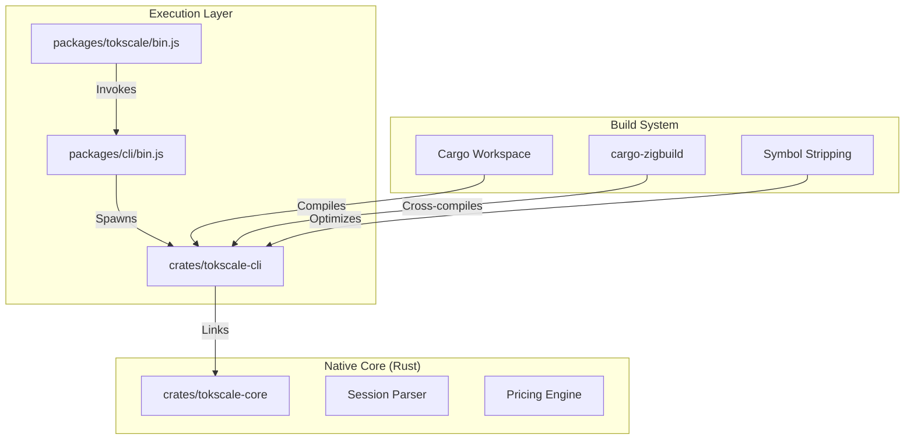
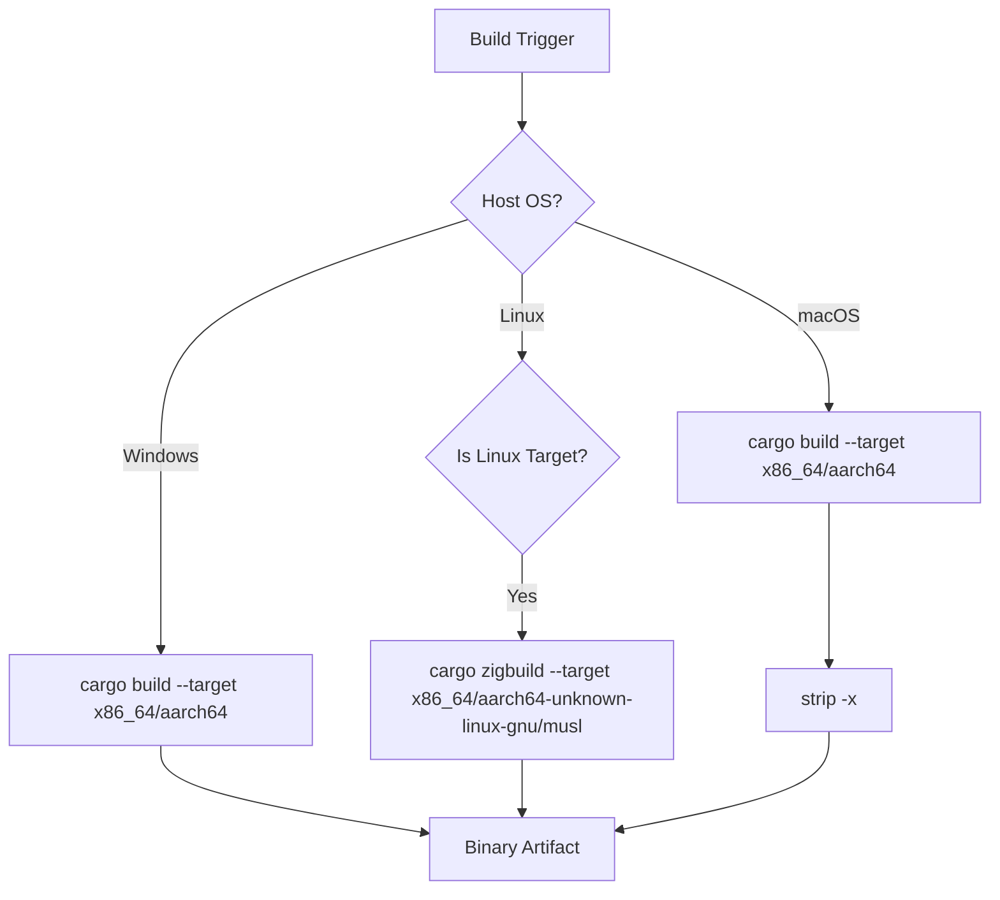
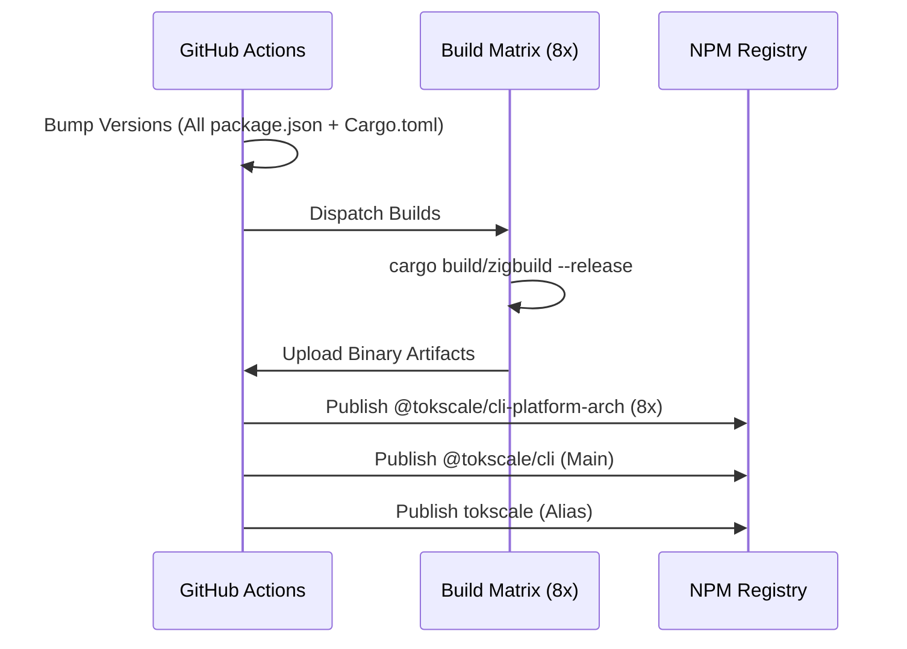

# 빌드 파이프라인과 네이티브 모듈 컴파일

관련 소스 파일

다음 파일들은 이 위키 페이지를 생성하기 위한 컨텍스트로 사용되었습니다.

- [.github/workflows/build-native.yml](.github/workflows/build-native.yml)
- [.github/workflows/launcher_validation.yml](.github/workflows/launcher_validation.yml)
- [.github/workflows/publish-cli.yml](.github/workflows/publish-cli.yml)
- [.github/workflows/test_coverage.yml](.github/workflows/test_coverage.yml)
- [.gitignore](.gitignore)
- [.npmrc](.npmrc)
- [Cargo.toml](Cargo.toml)
- [package.json](package.json)
- [packages/cli-darwin-arm64/package.json](packages/cli-darwin-arm64/package.json)
- [packages/cli-darwin-x64/package.json](packages/cli-darwin-x64/package.json)
- [packages/cli-linux-arm64-gnu/package.json](packages/cli-linux-arm64-gnu/package.json)
- [packages/cli-linux-arm64-musl/package.json](packages/cli-linux-arm64-musl/package.json)
- [packages/cli-linux-x64-gnu/package.json](packages/cli-linux-x64-gnu/package.json)
- [packages/cli-linux-x64-musl/package.json](packages/cli-linux-x64-musl/package.json)
- [packages/cli-win32-arm64-msvc/package.json](packages/cli-win32-arm64-msvc/package.json)
- [packages/cli-win32-x64-msvc/package.json](packages/cli-win32-x64-msvc/package.json)
- [packages/cli/bin.js](packages/cli/bin.js)
- [packages/tokscale/bin.js](packages/tokscale/bin.js)
- [scripts/check-version-coherence.sh](scripts/check-version-coherence.sh)
- [scripts/post-discord-release.sh](scripts/post-discord-release.sh)
- [scripts/test-package-launchers.sh](scripts/test-package-launchers.sh)

## 목적과 범위

이 문서는 Tokscale CLI와 핵심 컴포넌트를 위한 다중 플랫폼 네이티브 빌드 과정을 자세히 설명합니다. 시스템은 Rust 기반 core(`tokscale-core`)와 CLI 래퍼(`tokscale-cli`)를 사용하며, 둘 다 Cargo workspace 안에서 관리됩니다. 파이프라인은 8개의 서로 다른 플랫폼 대상에 대한 크로스 컴파일을 처리하고, 모노레포 전반의 버전 동기화를 관리하며, 플랫폼별 optional dependency 형태로 바이너리를 npm에 게시하는 과정을 자동화합니다.

## 네이티브 모듈 아키텍처 개요

Tokscale CLI는 고성능 네이티브 바이너리로 빌드됩니다. 프로젝트가 Node.js 패키지를 포함한 모노레포 구조를 사용하지만, 실행 core는 SIMD 가속 JSON 파싱(`simd-json`)과 병렬 처리(`rayon`)를 활용하기 위해 Rust로 작성되어 있습니다.

**출처:** [Cargo.toml:1-6](), [packages/tokscale/bin.js:1-16](), [packages/cli/bin.js:1-12]()

## 빌드 대상과 플랫폼 지원

Tokscale은 8가지 플랫폼-아키텍처 조합을 지원합니다. 이들은 메인 `@tokscale/cli` 패키지가 `optionalDependencies`로 나열하는 개별 패키지 형태로 npm을 통해 배포됩니다.

| 플랫폼 | 아키텍처 | Target Triple | Libc | NPM 패키지 |
|----------|-------------|---------------|------|-------------|
| macOS | x86_64 | `x86_64-apple-darwin` | - | `@tokscale/cli-darwin-x64` |
| macOS | ARM64 | `aarch64-apple-darwin` | - | `@tokscale/cli-darwin-arm64` |
| Linux | x86_64 | `x86_64-unknown-linux-gnu` | glibc | `@tokscale/cli-linux-x64-gnu` |
| Linux | x86_64 | `x86_64-unknown-linux-musl` | musl | `@tokscale/cli-linux-x64-musl` |
| Linux | ARM64 | `aarch64-unknown-linux-gnu` | glibc | `@tokscale/cli-linux-arm64-gnu` |
| Linux | ARM64 | `aarch64-unknown-linux-musl` | musl | `@tokscale/cli-linux-arm64-musl` |
| Windows | x86_64 | `x86_64-pc-windows-msvc` | - | `@tokscale/cli-win32-x64-msvc` |
| Windows | ARM64 | `aarch64-pc-windows-msvc` | - | `@tokscale/cli-win32-arm64-msvc` |

**출처:** [.github/workflows/publish-cli.yml:66-74](), [packages/cli-linux-arm64-gnu/package.json:2-15]()

## 빌드 과정과 최적화

### 릴리스 프로필 설정
최대 성능과 최소 바이너리 크기를 보장하기 위해 `Cargo.toml`은 고도로 최적화된 release profile을 정의합니다.

[Cargo.toml:88-93]()

- `lto = true`: 전체 workspace에 걸쳐 Link Time Optimization을 활성화합니다.
- `opt-level = 3`: 속도를 위한 최대 최적화입니다.
- `codegen-units = 1`: 빌드 시간은 느려지지만 최적화 가능성을 높입니다.
- `strip = true`: 바이너리에서 debug symbol을 자동으로 제거합니다.

### 크로스 컴파일 전략
파이프라인은 호스트와 대상에 따라 서로 다른 전략을 사용합니다.

1.  **macOS Native**: `macos-latest` runner에서 표준 `cargo build`를 사용합니다.
2.  **Linux Cross-Compilation**: 복잡한 Docker 설정 없이 단일 `ubuntu-latest` runner에서 `gnu`와 `musl` 환경을 모두 대상으로 하기 위해 `cargo-zigbuild`와 `zig`를 활용합니다.
3.  **Windows Native**: `windows-latest`에서 MSVC toolchain을 사용합니다.

**출처:** [.github/workflows/build-native.yml:24-63](), [.github/workflows/build-native.yml:84-95]()

## CI/CD 파이프라인: 게시 워크플로

게시 과정은 `.github/workflows/publish-cli.yml`에서 관리됩니다. 이 과정은 모노레포의 모든 컴포넌트가 정확히 같은 버전 문자열로 업데이트되도록 보장합니다.

### 1. 버전 증가와 일관성
`bump-versions` 작업은 source of truth 역할을 합니다. 새 버전을 계산하고 다음을 업데이트합니다.
- `packages/cli/package.json` 및 모든 `optionalDependencies` 참조.
- 8개 플랫폼별 `package.json` 파일 전체.
- `packages/tokscale/package.json`.
- Python 헬퍼 스크립트를 통한 Rust `Cargo.toml` workspace 버전.

[.../.github/workflows/publish-cli.yml:65-115]()

bump 끝에는 모든 파일이 예상 버전과 일치하는지 확인하는 일관성 검사가 수행됩니다.

**출처:** [.github/workflows/publish-cli.yml:34-139](), [scripts/check-version-coherence.sh:1-10]()

### 2. 병렬 바이너리 컴파일
`build-cli-binary` 작업은 8개의 병렬 runner 매트릭스를 실행합니다. 각 runner는 특정 대상에 맞게 `tokscale-cli` crate를 컴파일합니다.

[.../.github/workflows/publish-cli.yml:159-223]()

### 3. Artifact 관리와 NPM 게시
모든 바이너리가 빌드되면 artifact로 업로드됩니다. 게시 작업(`publish-platform-packages`, `publish-cli-package`, `publish-wrapper-package`)은 이러한 바이너리를 다운로드하고 올바른 디렉터리 구조에 배치한 뒤 `npm publish`를 실행합니다.

- **플랫폼 패키지**: 컴파일된 바이너리만 포함합니다(예: `bin/tokscale`).
- **CLI 패키지**: JS 엔트리 포인트와 메타데이터를 포함합니다.
- **래퍼 패키지**: `tokscale` alias 패키지입니다.

**출처:** [.github/workflows/publish-cli.yml:225-349]()

## 버전 일관성 검증

JS 래퍼가 게시되지 않은 바이너리 버전을 기대하는 깨진 릴리스를 방지하기 위해, `scripts/check-version-coherence.sh` 스크립트가 linting 단계와 publishing 단계 모두에서 사용됩니다.

검사 항목:
1. `packages/`의 모든 `package.json` 파일이 동일한 버전을 가지는지.
2. Rust `Cargo.toml` workspace 버전이 JS 버전과 일치하는지.
3. 메인 CLI 패키지의 `optionalDependencies`가 플랫폼 패키지의 올바른 버전을 가리키는지.

**출처:** [scripts/check-version-coherence.sh:1-10](), [.github/workflows/test_coverage.yml:50-51]()
