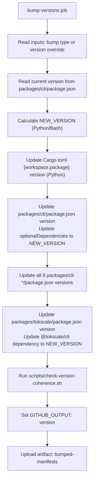
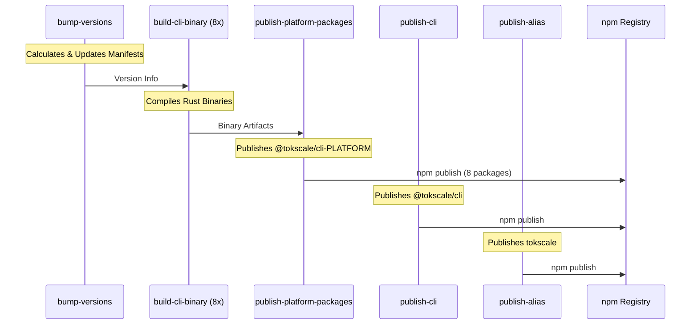

# CI/CD 및 게시

관련 소스 파일

다음 파일들은 이 위키 페이지를 생성하기 위한 컨텍스트로 사용되었습니다.

- [.github/workflows/build-native.yml](.github/workflows/build-native.yml)
- [.github/workflows/launcher_validation.yml](.github/workflows/launcher_validation.yml)
- [.github/workflows/publish-cli.yml](.github/workflows/publish-cli.yml)
- [.github/workflows/test_coverage.yml](.github/workflows/test_coverage.yml)
- [.gitignore](.gitignore)
- [.npmrc](.npmrc)
- [package.json](package.json)
- [packages/cli/bin.js](packages/cli/bin.js)
- [packages/tokscale/bin.js](packages/tokscale/bin.js)
- [scripts/check-version-coherence.sh](scripts/check-version-coherence.sh)
- [scripts/generate-release-notes.ts](scripts/generate-release-notes.ts)
- [scripts/post-discord-release.sh](scripts/post-discord-release.sh)
- [scripts/test-package-launchers.sh](scripts/test-package-launchers.sh)
- [tarpaulin.toml](tarpaulin.toml)

이 문서는 8개 플랫폼 대상 전반에서 네이티브 Rust 바이너리를 빌드하고 동기화된 npm 패키지를 게시하기 위한 자동화된 CI/CD 파이프라인을 설명합니다. 이 워크플로는 버전 증가, 병렬 네이티브 컴파일, 버전 일관성 검증, npm 게시, Discord와 GitHub용 릴리스 노트 자동 생성을 처리합니다.

로컬 빌드 과정과 네이티브 모듈 컴파일에 대한 정보는 [7.2]()를 참조하세요. 일반적인 개발 설정은 [7.1]()을 참조하세요.

## 개요

Tokscale은 전체 릴리스 과정을 조율하는 GitHub Actions 워크플로를 사용합니다.

- Rust workspace와 모든 npm 패키지의 **자동 버전 증가**를 lockstep으로 수행합니다.
- 8개 플랫폼/아키텍처 조합에 대해 네이티브 Rust CLI를 **병렬 컴파일**합니다.
- 모든 manifest 파일(Cargo.toml, package.json)이 동기화되었는지 보장하기 위한 **버전 일관성 검사**를 수행합니다.
- git history와 GitHub PR 메타데이터를 사용해 **릴리스 노트를 생성**합니다.
- 플랫폼별 optional dependency와 함께 npm에 **순차 게시**합니다.

메인 워크플로는 [.github/workflows/publish-cli.yml:5-20]()의 `workflow_dispatch`를 통해 수동으로 트리거됩니다.

출처: [.github/workflows/publish-cli.yml:1-25](), [.github/workflows/test_coverage.yml:1-30]()

## 버전 관리 전략

### Workspace 전체 동기화

워크플로는 Rust workspace와 여러 npm 패키지 전반의 버전을 동기화된 상태로 유지합니다. 버전은 수동 override 또는 semantic bump 타입(patch, minor, major)을 기반으로 계산됩니다 [.github/workflows/publish-cli.yml:42-63]().

| 엔티티 | 위치 | 역할 |
| :--- | :--- | :--- |
| `tokscale-cli` (Rust) | `Cargo.toml` | Core 로직 버전(CLI `--version`에서 보고됨) |
| `@tokscale/cli` | `packages/cli/package.json` | 메인 로직 래퍼 및 바이너리 디스패처 |
| `tokscale` | `packages/tokscale/package.json` | Alias/편의 패키지 |
| 플랫폼 패키지 | `packages/cli-*/package.json` | 호스트 플랫폼별 바이너리 |

### Bump Versions 작업 흐름

출처: [.github/workflows/publish-cli.yml:26-158](), [scripts/check-version-coherence.sh:16-120]()

## 다중 플랫폼 빌드 매트릭스

### 플랫폼 대상

`build-cli-binary` 작업은 Linux 크로스 컴파일을 위해 `cargo build` 또는 `cargo zigbuild`를 사용하여 8개 대상에 대한 Rust 바이너리를 컴파일합니다 [.github/workflows/publish-cli.yml:159-180]().

| 대상 | Host Runner | 도구 |
| :--- | :--- | :--- |
| `x86_64-apple-darwin` | `macos-latest` | `cargo build`, `strip -x` |
| `aarch64-apple-darwin` | `macos-latest` | `cargo build`, `strip -x` |
| `x86_64-unknown-linux-gnu` | `ubuntu-latest` | `cargo zigbuild`, `strip` |
| `x86_64-unknown-linux-musl` | `ubuntu-latest` | `cargo zigbuild`, `strip` |
| `aarch64-unknown-linux-gnu` | `ubuntu-latest` | `cargo zigbuild` |
| `aarch64-unknown-linux-musl` | `ubuntu-latest` | `cargo zigbuild` |
| `x86_64-pc-windows-msvc` | `windows-latest` | `cargo build` |
| `aarch64-pc-windows-msvc` | `windows-latest` | `cargo build` |

출처: [.github/workflows/publish-cli.yml:159-180](), [.github/workflows/build-native.yml:17-64]()

### 캐싱 및 최적화

워크플로는 `actions/cache@v5`를 사용해 Cargo registry와 target 디렉터리를 저장하며, 캐시 키는 `Cargo.lock` 해시를 기준으로 합니다 [.github/workflows/build-native.yml:73-82](). Linux 대상의 경우 glibc 호환성을 보장하고 musl 빌드를 지원하기 위해 `mlugg/setup-zig`와 `cargo-zigbuild`를 활용합니다 [.github/workflows/build-native.yml:84-96]().

## 게시 및 릴리스

### 릴리스 노트 생성

Tokscale은 changelog 자동화를 위해 커스텀 Bun 스크립트 `scripts/generate-release-notes.ts`를 사용합니다. 이 스크립트는 다음을 수행합니다.
1. 마지막 태그와 `HEAD` 사이의 commit을 식별합니다 [scripts/generate-release-notes.ts:71-87]().
2. 이메일 검색으로 GitHub username을 해석합니다 [scripts/generate-release-notes.ts:89-102]().
3. commit을 merge된 Pull Request에 연결합니다 [scripts/generate-release-notes.ts:104-136]().
4. 최초 기여자를 감지합니다 [scripts/generate-release-notes.ts:138-164]().

생성된 노트는 `scripts/post-discord-release.sh`를 통해 Discord에 게시되며, 이 스크립트는 콘텐츠가 Discord의 2000자 제한을 초과할 경우 메시지 분할을 처리합니다 [scripts/post-discord-release.sh:22-71]().

출처: [scripts/generate-release-notes.ts:1-210](), [scripts/post-discord-release.sh:1-72]()

### 게시 순서

출처: [.github/workflows/publish-cli.yml:159-349]()

## 검증 및 품질 보증

### 버전 일관성 검사
`scripts/check-version-coherence.sh` 스크립트(linting과 publishing 중 호출됨)는 다음을 보장합니다.
- Rust `workspace.package.version`이 모든 `package.json` 파일과 일치합니다 [scripts/check-version-coherence.sh:35-42]().
- `tokscale` alias 패키지가 올바른 버전의 `@tokscale/cli`에 의존합니다 [scripts/check-version-coherence.sh:61-66]().
- 8개 플랫폼별 optional dependency가 메인 CLI manifest에 올바르게 나열되어 있습니다 [scripts/check-version-coherence.sh:78-93]().

### 런처 스모크 테스트
`scripts/test-package-launchers.sh` 스크립트는 게시된 패키지가 서로 다른 환경(Node.js vs Bun)에서 올바르게 작동하고, `node_modules` 구조 안에서 네이티브 바이너리를 제대로 찾는지 검증합니다 [scripts/test-package-launchers.sh:130-168]().

### 커버리지 및 린팅
`Test & Coverage` 워크플로는 `cargo test`와 `cargo clippy`를 실행합니다 [/.github/workflows/test_coverage.yml:87-119](). `main` 브랜치에서는 `cargo-tarpaulin`을 사용해 커버리지 보고서를 생성하고 저장소의 커버리지 배지를 업데이트합니다 [/.github/workflows/test_coverage.yml:121-185]().

출처: [scripts/check-version-coherence.sh:1-121](), [scripts/test-package-launchers.sh:1-168](), [.github/workflows/test_coverage.yml:1-194]()
