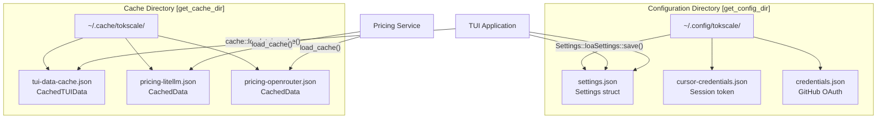
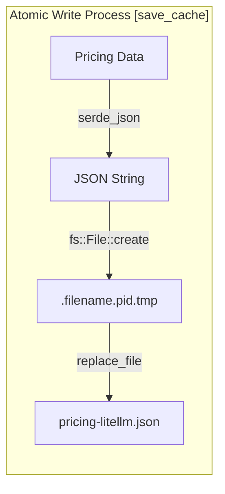

# 구성 및 사용자 지정

관련 소스 파일

다음 파일들은 이 위키 페이지를 생성하기 위한 컨텍스트로 사용되었습니다.

- [crates/tokscale-cli/src/tui/cache.rs](crates/tokscale-cli/src/tui/cache.rs)
- [crates/tokscale-cli/src/tui/settings.rs](crates/tokscale-cli/src/tui/settings.rs)
- [crates/tokscale-core/src/pricing/cache.rs](crates/tokscale-core/src/pricing/cache.rs)
- [packages/frontend/.env.example](packages/frontend/.env.example)

이 문서는 Tokscale CLI 도구와 TUI의 구성 시스템을 다루며, 영구 설정, 환경 변수, 자격 증명 저장, 사용자 지정 옵션을 포함합니다. 프론트엔드 환경 변수와 구성은 [Frontend Environment Variables](#8.2)를 참조하세요.

## 개요

Tokscale은 플랫폼 관례를 따르는 표준 사용자 디렉터리에 구성을 저장합니다. CLI는 영구 설정(세션 간 저장)과 런타임 구성(환경 변수)을 모두 지원합니다. TUI는 시각 테마, 자동 새로고침 동작, 표시 옵션에 대한 사용자 기본 설정을 유지합니다.

**구성 유형:**
- **영구 설정**: `~/.config/tokscale/settings.json`의 JSON 파일 [crates/tokscale-cli/src/tui/settings.rs:134-142]()
- **자격 증명**: 인증된 서비스(Cursor IDE, social platform)를 위한 세션 토큰
- **환경 변수**: 고급 사용자를 위한 런타임 재정의(예: `TOKSCALE_CONFIG_DIR`) [crates/tokscale-cli/src/tui/settings.rs:165-167]()
- **캐시 데이터**: 가격 데이터와 TUI 상태 캐시 [crates/tokscale-cli/src/tui/cache.rs:1-4]()

출처: [crates/tokscale-cli/src/tui/settings.rs:1-64](), [crates/tokscale-cli/src/tui/cache.rs:22-35]()

---

## 구성 파일 위치

**플랫폼별 경로:**

| 플랫폼 | Config Directory | Cache Directory |
|----------|-----------------|-----------------|
| Unix/Linux | `~/.config/tokscale/` | `~/.cache/tokscale/` |
| macOS | `~/.config/tokscale/` | `~/.cache/tokscale/` |
| Windows | `%USERPROFILE%\.config\tokscale\` | `%USERPROFILE%\.cache\tokscale\` |

출처: [crates/tokscale-cli/src/tui/settings.rs:134-149](), [crates/tokscale-cli/src/tui/cache.rs:26-35](), [crates/tokscale-core/src/pricing/cache.rs:8-14]()

---

## 설정 파일 구조

`~/.config/tokscale/settings.json` 파일은 `Settings` 구조체를 사용해 영구 TUI 기본 설정을 저장합니다 [crates/tokscale-cli/src/tui/settings.rs:29-64]().

### Settings 필드

| 필드 | 타입 | 기본값 | 범위/값 | 설명 |
|-------|------|---------|--------------|-------------|
| `colorPalette` | string | `"blue"` | `ThemeName` 참조 | TUI 기여 그래프 색상 테마 [crates/tokscale-cli/src/tui/settings.rs:32-33]() |
| `autoRefreshEnabled` | boolean | `false` | true/false | TUI에서 자동 데이터 새로고침 활성화 [crates/tokscale-cli/src/tui/settings.rs:34-35]() |
| `autoRefreshMs` | u64 | `60000` | 30초 - 1시간 | 자동 새로고침 간격(밀리초) [crates/tokscale-cli/src/tui/settings.rs:11-13]() |
| `nativeTimeoutMs` | u64 | `300000` | 5초 - 1시간 | 네이티브 파싱 작업 제한 시간 [crates/tokscale-cli/src/tui/settings.rs:15-17]() |
| `scanner` | Object | `{}` | `ScannerSettings` | SQLite 데이터베이스용 사용자 지정 경로 [crates/tokscale-cli/src/tui/settings.rs:49-50]() |
| `defaultClients` | Array | `[]` | 클라이언트 ID | 매 실행마다 미리 필터링되는 클라이언트 [crates/tokscale-cli/src/tui/settings.rs:60-61]() |

### Scanner 구성

`scanner` 필드는 사용자가 매번 환경 변수를 설정하지 않고도 OpenCode 같은 도구에 대한 추가 경로를 고정할 수 있게 합니다 [crates/tokscale-cli/src/tui/settings.rs:42-44]().

출처: [crates/tokscale-cli/src/tui/settings.rs:29-64](), [crates/tokscale-cli/src/tui/settings.rs:171-180]()

---

## 캐시 관리

Tokscale은 백그라운드에서 새 데이터가 로드되는 동안 TUI의 "instant startup"을 가능하게 하기 위해 디스크 기반 캐싱을 구현합니다 [crates/tokscale-cli/src/tui/cache.rs:1-4]().

### TUI 데이터 캐시
`tui-data-cache.json` 파일은 직렬화된 `CachedTUIData` 객체를 저장합니다 [crates/tokscale-cli/src/tui/cache.rs:50-60](). 여기에는 다음이 포함됩니다.
- **스키마 버전**: 현재 버전은 `7`입니다 [crates/tokscale-cli/src/tui/cache.rs:24]().
- **Staleness**: 캐시는 5분 후 stale로 간주됩니다 [crates/tokscale-cli/src/tui/cache.rs:23]().
- **데이터**: 집계된 `models`, `daily` 사용량, `hourly` 사용량, `graph` 데이터를 포함합니다 [crates/tokscale-cli/src/tui/cache.rs:65-77]().

### 가격 캐시
LiteLLM과 OpenRouter의 가격 데이터는 3600초(1시간)의 TTL로 캐시됩니다 [crates/tokscale-core/src/pricing/cache.rs:6](). 시스템은 충돌 시 손상을 방지하기 위해 원자적 임시 파일 rename 패턴을 사용합니다 [crates/tokscale-core/src/pricing/cache.rs:86-89]().

출처: [crates/tokscale-cli/src/tui/cache.rs:22-35](), [crates/tokscale-core/src/pricing/cache.rs:1-103]()

---

## 프론트엔드 환경 변수

웹 애플리케이션(Next.js)은 데이터베이스 연결과 인증을 위해 여러 환경 변수가 필요합니다. 자세한 내용은 [Frontend Environment Variables](#8.2)를 참조하세요.

### 핵심 변수
| 변수 | 설명 |
|----------|-------------|
| `DATABASE_URL` | PostgreSQL 연결 문자열 [packages/frontend/.env.example:7]() |
| `GITHUB_CLIENT_ID` | GitHub 로그인을 위한 OAuth Client ID [packages/frontend/.env.example:13]() |
| `GITHUB_CLIENT_SECRET` | GitHub 로그인을 위한 OAuth Client Secret [packages/frontend/.env.example:14]() |
| `NEXT_PUBLIC_URL` | 애플리케이션의 공개 URL [packages/frontend/.env.example:19]() |

출처: [packages/frontend/.env.example:1-23]()

---

## CLI 구성 세부 사항

CLI 구성은 특히 이전 버전에서 전환하는 macOS 사용자를 위해 레거시 fallback 경로를 지원합니다 [crates/tokscale-cli/src/tui/settings.rs:147-149](). 자세한 내용은 [CLI Configuration](#8.1)을 참조하세요.

### 기본 동작
- **색상 팔레트**: 기본값은 `blue`입니다 [crates/tokscale-cli/src/tui/settings.rs:85-87]().
- **자동 새로고침**: 기본적으로 비활성화되어 있으며, 활성화하면 기본값은 60초입니다 [crates/tokscale-cli/src/tui/settings.rs:98-103]().
- **손실 허용 역직렬화**: `defaultClients` 목록은 단일 잘못된 항목 때문에 전체 설정 로드가 실패하지 않도록 손실 허용 역직렬화기를 사용합니다 [crates/tokscale-cli/src/tui/settings.rs:73-83]().

출처: [crates/tokscale-cli/src/tui/settings.rs:97-110](), [crates/tokscale-cli/src/tui/settings.rs:151-182]()
