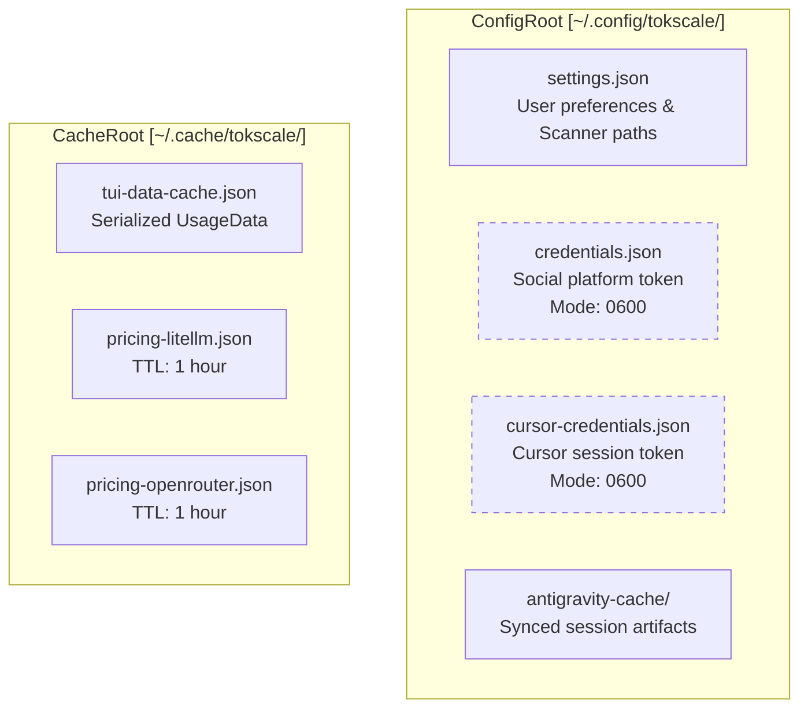
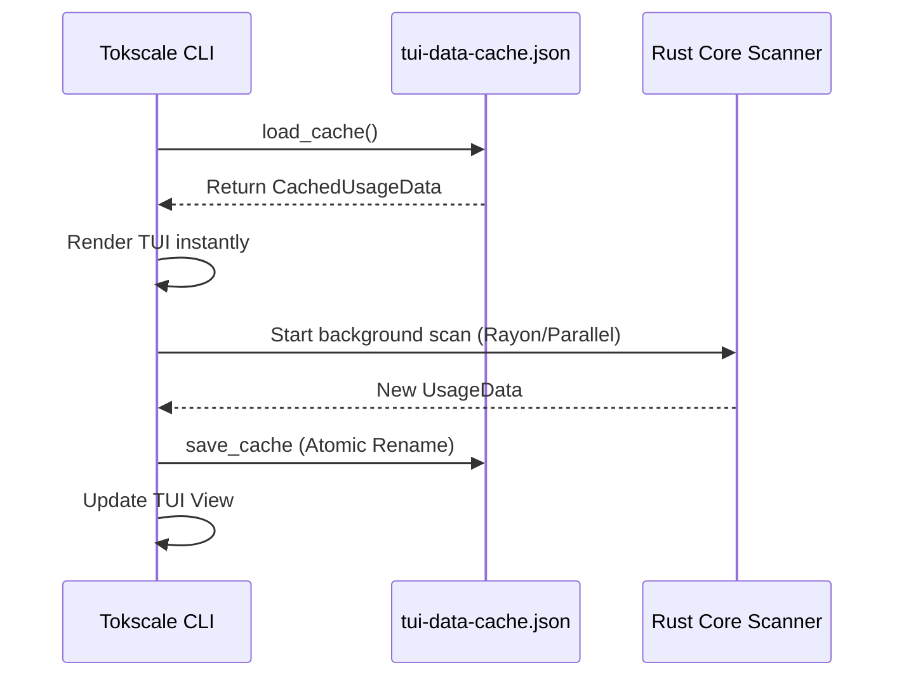

# CLI 구성

<details>
<summary>관련 소스 파일</summary>

다음 파일들은 이 위키 페이지를 생성하기 위한 컨텍스트로 사용되었습니다.

- [README.ja.md](README.ja.md)
- [README.ko.md](README.ko.md)
- [README.md](README.md)
- [README.zh-cn.md](README.zh-cn.md)
- [crates/tokscale-cli/src/antigravity.rs](crates/tokscale-cli/src/antigravity.rs)
- [crates/tokscale-cli/src/paths.rs](crates/tokscale-cli/src/paths.rs)
- [crates/tokscale-cli/src/tui/cache.rs](crates/tokscale-cli/src/tui/cache.rs)
- [crates/tokscale-cli/src/tui/config.rs](crates/tokscale-cli/src/tui/config.rs)
- [crates/tokscale-cli/src/tui/settings.rs](crates/tokscale-cli/src/tui/settings.rs)
- [crates/tokscale-core/src/pricing/cache.rs](crates/tokscale-core/src/pricing/cache.rs)

</details>


이 페이지는 설정 파일, 자격 증명 저장, 디렉터리 구조를 포함한 Tokscale CLI 구성 시스템을 문서화합니다. 프론트엔드 환경 변수에 대한 정보는 [Frontend Environment Variables](#8.2)를 참조하세요.

## 목적과 범위

CLI 구성 시스템은 JSON 파일 모음을 통해 사용자 기본 설정, 인증 자격 증명, 캐시된 데이터를 관리합니다. v2에서는 고성능 TUI와 네이티브 스캔 기능을 지원하기 위해 구성 로직이 Rust core와 CLI crate로 이동했습니다. 이 시스템은 다음을 처리합니다.

- **사용자 기본 설정**: 색상 테마, 자동 새로고침 설정, 기본 클라이언트 필터.
- **인증**: social platform용 OAuth 토큰과 Cursor IDE 세션 토큰.
- **스캐너 설정**: SQLite 데이터베이스(예: OpenCode)용 사용자 지정 경로와 기타 스캐너 재정의.
- **데이터 캐싱**: 즉시 시작을 가능하게 하는 TUI 데이터와 모델 가격의 디스크 기반 캐싱.

---

## 구성 디렉터리 구조

Tokscale은 XDG Base Directory 명세를 따릅니다. macOS에서는 원활한 업그레이드를 보장하기 위해 레거시 경로로의 투명한 fallback을 포함합니다.



**출처**: [crates/tokscale-cli/src/tui/settings.rs:134-142](), [crates/tokscale-cli/src/tui/cache.rs:26-35](), [crates/tokscale-cli/src/antigravity.rs:22-31]()

---

## 설정 파일(`settings.json`)

`Settings` 구조체는 전역 CLI 동작을 관리합니다. `Settings::load()`를 통해 로드되며, 이 함수는 값을 안전한 범위로 제한합니다(예: 새로고침 간격) [crates/tokscale-cli/src/tui/settings.rs:151-182]().

### 설정 스키마와 기본값

| 필드 | 타입 | 기본값 | 설명 |
|-------|------|---------|-------------|
| `colorPalette` | `String` | `"blue"` | TUI 테마(예: blue, green, halloween) |
| `autoRefreshEnabled` | `bool` | `false` | TUI에서 백그라운드 데이터 폴링 활성화 |
| `autoRefreshMs` | `u64` | `60,000` | 간격(최소: 30초, 최대: 1시간) [crates/tokscale-cli/src/tui/settings.rs:11-13]() |
| `defaultClients` | `Vec<String>` | `[]` | 특정 클라이언트 고정(예: `["opencode", "claude"]`) |
| `scanner` | `ScannerSettings` | `default` | OpenCode용 추가 SQLite 경로 저장 [crates/tokscale-cli/src/tui/settings.rs:50-61]() |
| `nativeTimeoutMs` | `u64` | `300,000` | 네이티브 Rust core 작업 제한 시간 |

### 스캐너 구성
`scanner` 필드는 사용자가 환경 변수 없이도 AI agent 데이터베이스의 추가 검색 경로를 영구 저장할 수 있게 합니다. `LocalParseOptions`를 빌드하는 모든 CLI 엔트리 포인트에서 로드됩니다 [crates/tokscale-cli/src/tui/settings.rs:112-121]().

**출처**: [crates/tokscale-cli/src/tui/settings.rs:31-64](), [crates/tokscale-cli/src/tui/settings.rs:97-110]()

---

## TUI 데이터 캐싱

"instant startup"을 달성하기 위해 CLI는 처리된 `UsageData`를 `tui-data-cache.json`에 직렬화합니다.

### 구현 흐름
1. **시작**: TUI는 `~/.cache/tokscale/tui-data-cache.json`에서 `CachedTUIData` 로드를 시도합니다 [crates/tokscale-cli/src/tui/cache.rs:28-35]().
2. **Staleness 확인**: 캐시가 5분(`CACHE_STALE_THRESHOLD_MS`)보다 오래되면 stale로 간주되지만, 새 스캔이 백그라운드에서 실행되는 동안 초기 렌더링에 계속 사용될 수 있습니다 [crates/tokscale-cli/src/tui/cache.rs:22-24]().
3. **원자적 쓰기**: 캐시 업데이트는 충돌 중 손상을 방지하기 위해 임시 파일 rename 패턴을 사용합니다 [crates/tokscale-core/src/pricing/cache.rs:86-96]().



**출처**: [crates/tokscale-cli/src/tui/cache.rs:1-60](), [crates/tokscale-core/src/pricing/cache.rs:86-96]()

---

## 고급 UI 사용자 지정(`.tokscale`)

`settings.json`이 기능적 기본 설정을 처리하는 반면, 별도의 TOML 기반 config 파일(`~/.tokscale`)은 provider와 client의 색상 및 표시 이름에 대한 깊은 UI 사용자 지정을 가능하게 합니다.

### 구성 구조
`TokscaleConfig` 구조체는 `OnceLock`을 통해 한 번 로드됩니다 [crates/tokscale-cli/src/tui/config.rs:9-17]().

```toml
# ~/.tokscale
[colors.providers]
anthropic = "#D97757"
openai = "#10A37F"

[display_names.clients]
opencode = "OpenCode (Local)"
```

### 색상 해석
색상은 hex 문자열에서 `ratatui::style::Color`로 파싱됩니다 [crates/tokscale-cli/src/tui/config.rs:78-87](). TUI는 이러한 재정의를 사용해 기여 막대와 모델 목록에 테마를 적용합니다.

**출처**: [crates/tokscale-cli/src/tui/config.rs:11-33](), [crates/tokscale-cli/src/tui/config.rs:40-47]()

---

## 자격 증명 및 캐시 영속성

### 자격 증명 저장
`tokscale.ai`와 Cursor의 자격 증명은 `credentials.json`과 `cursor-credentials.json`에 저장됩니다. v2는 무단 접근을 방지하기 위해 이러한 파일이 제한된 권한으로 관리되도록 보장합니다.

### Antigravity 동기화 캐시
`antigravity sync` 명령은 세션 artifact를 `~/.config/tokscale/antigravity-cache/`에 로컬로 캐시합니다. 
- **Manifest**: `manifest.json`은 세션 ID, 해시, 동기화 타임스탬프를 추적합니다 [crates/tokscale-cli/src/antigravity.rs:37-48]().
- **원자적 동기화**: 동시 sync 프로세스가 로컬 캐시를 손상시키는 것을 방지하기 위해 `SyncLockGuard`를 사용합니다 [crates/tokscale-cli/src/antigravity.rs:161-163]().

### 가격 캐시
LiteLLM과 OpenRouter의 가격 데이터는 1시간 TTL(`CACHE_TTL_SECS`)로 캐시됩니다 [crates/tokscale-core/src/pricing/cache.rs:6-14]().

**출처**: [crates/tokscale-cli/src/antigravity.rs:22-40](), [crates/tokscale-core/src/pricing/cache.rs:1-20]()

---

## 경로 해석 및 마이그레이션

Tokscale은 크로스 플랫폼 경로 차이를 처리하고 레거시 데이터를 자동으로 마이그레이션합니다.

| 유형 | Linux/macOS | Windows | Fallback/Legacy |
|------|-------------|---------|-----------------|
| Config | `~/.config/tokscale/` | `%USERPROFILE%\.config\tokscale\` | `~/Library/Application Support/tokscale/` (macOS) |
| Cache | `~/.cache/tokscale/` | `%USERPROFILE%\.cache\tokscale\` | `~/.tokscale/` (Legacy v1) |

**마이그레이션 로직**: `Settings::load()`는 먼저 기본 경로를 확인합니다. 파일이 없으면 `TOKSCALE_CONFIG_DIR`이 설정되지 않은 경우 레거시 macOS 경로에서 읽기를 시도합니다 [crates/tokscale-cli/src/tui/settings.rs:164-170]().

**출처**: [crates/tokscale-cli/src/paths.rs:18-31](), [crates/tokscale-cli/src/tui/settings.rs:151-170]()
