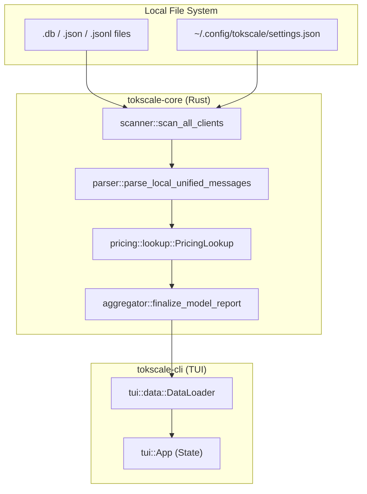
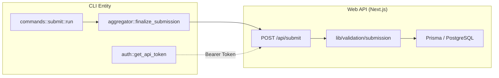

# 용어집

관련 소스 파일

다음 파일들은 이 위키 페이지를 생성하기 위한 컨텍스트로 사용되었습니다.

- [AGENTS.md](AGENTS.md)
- [README.ja.md](README.ja.md)
- [README.ko.md](README.ko.md)
- [README.md](README.md)
- [README.zh-cn.md](README.zh-cn.md)
- [crates/tokscale-cli/src/antigravity.rs](crates/tokscale-cli/src/antigravity.rs)
- [crates/tokscale-cli/src/commands/wrapped.rs](crates/tokscale-cli/src/commands/wrapped.rs)
- [crates/tokscale-cli/src/main.rs](crates/tokscale-cli/src/main.rs)
- [crates/tokscale-cli/src/paths.rs](crates/tokscale-cli/src/paths.rs)
- [crates/tokscale-cli/src/tui/client_ui.rs](crates/tokscale-cli/src/tui/client_ui.rs)
- [crates/tokscale-cli/src/tui/data/mod.rs](crates/tokscale-cli/src/tui/data/mod.rs)
- [crates/tokscale-cli/src/tui/ui/widgets.rs](crates/tokscale-cli/src/tui/ui/widgets.rs)
- [crates/tokscale-cli/tests/cli_tests.rs](crates/tokscale-cli/tests/cli_tests.rs)
- [crates/tokscale-core/src/aggregator.rs](crates/tokscale-core/src/aggregator.rs)
- [crates/tokscale-core/src/clients.rs](crates/tokscale-core/src/clients.rs)
- [crates/tokscale-core/src/lib.rs](crates/tokscale-core/src/lib.rs)
- [crates/tokscale-core/src/message_cache.rs](crates/tokscale-core/src/message_cache.rs)
- [crates/tokscale-core/src/pricing/litellm.rs](crates/tokscale-core/src/pricing/litellm.rs)
- [crates/tokscale-core/src/pricing/lookup.rs](crates/tokscale-core/src/pricing/lookup.rs)
- [crates/tokscale-core/src/pricing/mod.rs](crates/tokscale-core/src/pricing/mod.rs)
- [crates/tokscale-core/src/pricing/openrouter.rs](crates/tokscale-core/src/pricing/openrouter.rs)
- [crates/tokscale-core/src/provider_identity.rs](crates/tokscale-core/src/provider_identity.rs)
- [crates/tokscale-core/src/scanner.rs](crates/tokscale-core/src/scanner.rs)
- [crates/tokscale-core/src/sessions/codex.rs](crates/tokscale-core/src/sessions/codex.rs)
- [crates/tokscale-core/src/sessions/gemini.rs](crates/tokscale-core/src/sessions/gemini.rs)
- [crates/tokscale-core/src/sessions/mod.rs](crates/tokscale-core/src/sessions/mod.rs)
- [crates/tokscale-core/src/sessions/opencode.rs](crates/tokscale-core/src/sessions/opencode.rs)
- [packages/frontend/__tests__/api/submit.test.ts](packages/frontend/__tests__/api/submit.test.ts)
- [packages/frontend/src/components/SourceLogo.tsx](packages/frontend/src/components/SourceLogo.tsx)
- [packages/frontend/src/lib/constants.ts](packages/frontend/src/lib/constants.ts)
- [packages/frontend/src/lib/types.ts](packages/frontend/src/lib/types.ts)
- [packages/frontend/src/lib/validation/submission.ts](packages/frontend/src/lib/validation/submission.ts)

이 용어집은 Tokscale 코드베이스 전반에서 사용되는 기술 용어, 도메인 개념, 구현별 전문 용어를 정의합니다.

## 도메인 개념

### Unified Message
원본 소스 형식과 관계없이 단일 AI 상호작용(요청/응답 쌍)을 표현하는 데 사용되는 내부 표준화 데이터 구조입니다. 모든 클라이언트별 파서는 aggregator가 처리할 수 있도록 `UnifiedMessage` 객체를 출력해야 합니다.

*   **구현**: Rust core의 `UnifiedMessage` 구조체로 정의됩니다.
*   **주요 필드**: `client`, `model_id`, `provider_id`, `tokens`(`TokenBreakdown`), `cost`.
*   **코드 포인터**: [crates/tokscale-core/src/sessions/mod.rs:33-52]()

### Token Breakdown
LLM 실행 파이프라인에서의 구체적인 역할별로 분류된, 상호작용 중 소비된 토큰의 세분화된 집계입니다.

| 범주 | 설명 |
| :--- | :--- |
| `input` | 모델로 전송된 prompt 토큰입니다. |
| `output` | 모델이 생성한 completion 토큰입니다. |
| `cache_read` | provider 측 캐시에서 가져온 토큰입니다(예: Anthropic Prompt Caching). |
| `cache_write` | 향후 재사용을 위해 provider 측 캐시에 기록된 토큰입니다. |
| `reasoning` | OpenAI o1 같은 모델이 사용하는 내부 "thinking" 토큰입니다. |

*   **구현**: `TokenBreakdown` 구조체.
*   **코드 포인터**: [crates/tokscale-core/src/lib.rs:138-144]()

### Client (Source)
AI 세션 데이터를 생성하는 외부 도구 또는 IDE입니다. Tokscale은 CLI 도구(Claude Code, OpenCode)부터 IDE(Cursor, Roo Code)까지 25개 이상의 클라이언트를 지원합니다. 각 클라이언트는 `ClientId` enum으로 식별됩니다.

*   **구현**: `ClientId` enum과 `ClientDef` 구조체.
*   **코드 포인터**: [crates/tokscale-core/src/clients.rs]()([crates/tokscale-core/src/lib.rs:15]()에서 참조)

### Provider
AI 모델을 호스팅하는 백엔드 엔티티입니다(예: `openai`, `anthropic`, `google`). 단일 모델(예: `llama-3`)이 여러 provider(예: `groq`, `together`, `vertex_ai`)에서 제공될 수 있다는 점에 유의하세요.

*   **코드 포인터**: [crates/tokscale-core/src/provider_identity.rs]()

---

## 기술 용어 및 로직

### Grouping Strategy
개별 메시지를 보고서 행으로 집계하는 데 사용되는 로직입니다. 사용자는 `--group-by` 플래그로 이를 전환할 수 있습니다.

*   **전략**: `model`, `client,model`, `client,provider,model`, `workspace,model`.
*   **코드 포인터**: [crates/tokscale-core/src/lib.rs:100-106]()

### Multi-Step Pricing Resolution
`PricingLookup`이 모델 비용을 찾는 데 사용하는 알고리즘입니다. 모델 ID는 클라이언트마다 다르기 때문에(예: `claude-3-5-sonnet` vs `anthropic/claude-3.5-sonnet`), 시스템은 우선순위가 있는 fallback을 사용합니다.
1.  **정확한 일치**: 알려진 ID와 대소문자를 구분하지 않고 일치시킵니다.
2.  **별칭 해석**: 내부 이름을 표준 ID에 매핑합니다.
3.  **퍼지 매치**: 기본 모델을 찾기 위해 `openai/` 같은 prefix와 날짜 또는 `-beta` 같은 suffix를 제거합니다.

*   **구현**: `PricingLookup::lookup_with_provider`.
*   **코드 포인터**: [crates/tokscale-core/src/pricing/lookup.rs:172-215]()

### Workspace Detection
세션을 특정 프로젝트 또는 디렉터리와 연결하는 과정입니다. 이는 "Workspace" 보고서에 사용됩니다. CLI 도구의 경우 세션 메타데이터에서 찾은 Current Working Directory(`cwd`)에서 파생되는 경우가 많습니다.

*   **구현**: `workspace_bucket`과 `normalize_workspace_key`.
*   **코드 포인터**: [crates/tokscale-cli/src/tui/data/mod.rs:161-176]() 및 [crates/tokscale-core/src/sessions/mod.rs]()

---

## 아키텍처 다이어그램

### 데이터 흐름: 로컬 파일에서 TUI까지
이 다이어그램은 물리적 파일 시스템("Natural Language Space")을 내부 Rust 처리 엔티티("Code Entity Space")와 연결합니다.

제목: 로컬 세션 파싱 데이터 흐름

출처: [crates/tokscale-core/src/scanner.rs:59-77](), [crates/tokscale-core/src/lib.rs:205-215](), [crates/tokscale-cli/src/tui/data/mod.rs:151-156]()

### 웹 제출 흐름
이 다이어그램은 로컬 데이터가 준비되어 `tokscale.ai` 플랫폼으로 전송되는 방식을 보여줍니다.

제목: 데이터 제출 파이프라인

출처: [crates/tokscale-cli/src/main.rs:205-215](), [packages/frontend/src/lib/validation/submission.ts](), [crates/tokscale-core/src/aggregator.rs]()

---

## 약어 참고

| 약어 | 전체 용어 | 맥락 |
| :--- | :--- | :--- |
| **TUI** | Terminal User Interface | 대화형 Rust 기반 대시보드(`tokscale tui`)입니다. |
| **ISR** | Incremental Static Regeneration | `tokscale.ai`의 리더보드에 사용되는 Next.js 전략입니다. |
| **JSONL** | JSON Lines | 많은 AI agent(예: Codex, Copilot)가 세션 로그에 사용하는 형식입니다. |
| **NAPI** | Node API | Node.js CLI가 네이티브 Rust `tokscale-core`를 호출할 수 있게 하는 브리지입니다. |
| **WAL** | Write-Ahead Logging | 스캔 중 필터링되는 SQLite sidecar 파일(`-wal`)입니다. |

출처: [crates/tokscale-cli/src/main.rs:198-203](), [crates/tokscale-core/src/scanner.rs:37-39](), [README.md:9-14]()
