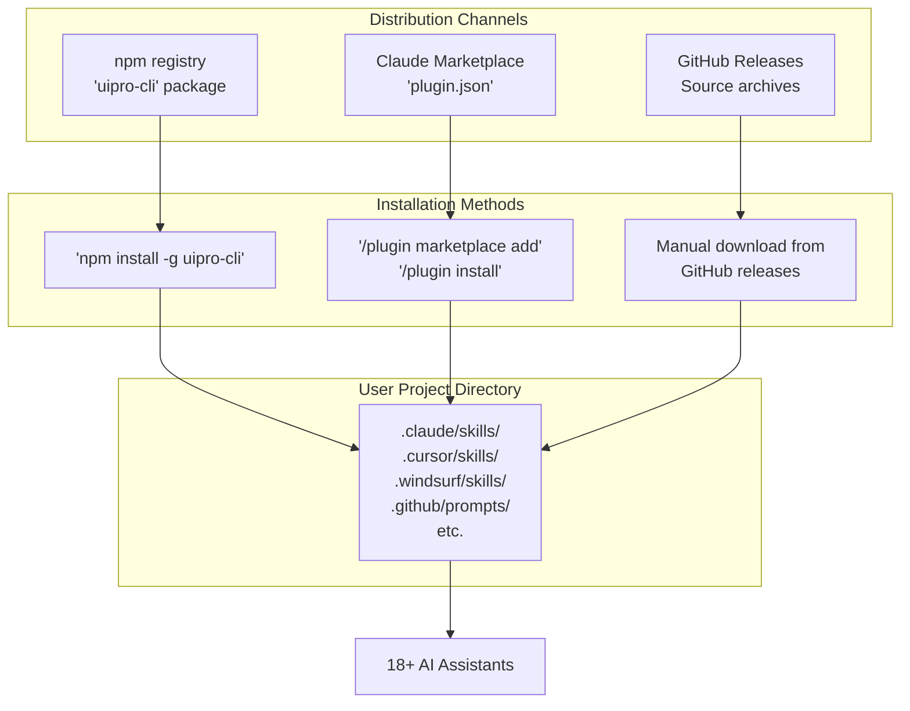
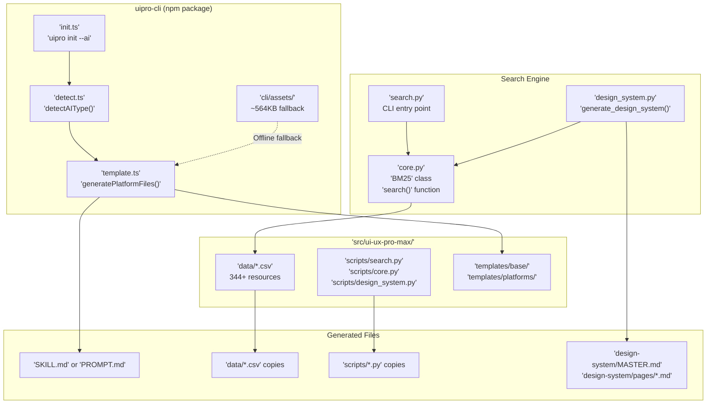
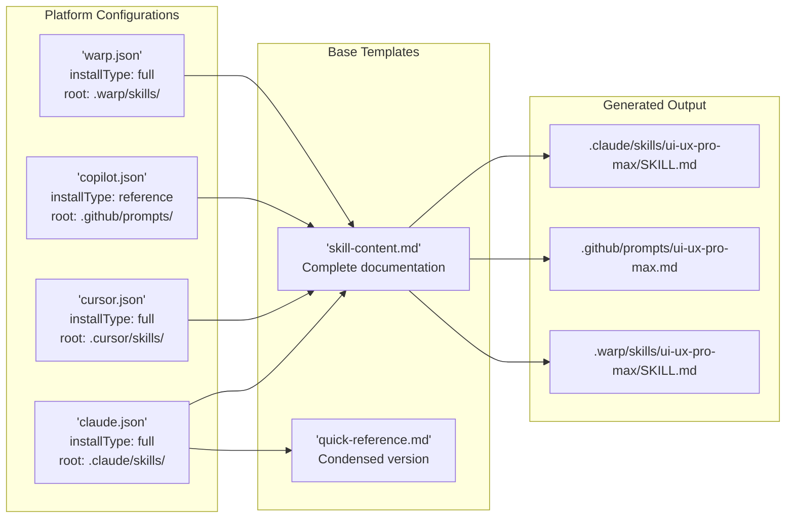

# 개요

<details>
<summary>관련 소스 파일</summary>

다음 파일들은 이 위키 페이지를 생성하기 위한 컨텍스트로 사용되었습니다.

- [CLAUDE.md](CLAUDE.md)
- [README.md](README.md)
- [cli/.npmignore](cli/.npmignore)
- [cli/README.md](cli/README.md)
- [cli/assets/templates/platforms/augment.json](cli/assets/templates/platforms/augment.json)
- [cli/assets/templates/platforms/kilocode.json](cli/assets/templates/platforms/kilocode.json)
- [cli/assets/templates/platforms/warp.json](cli/assets/templates/platforms/warp.json)
- [cli/package.json](cli/package.json)
- [cli/src/commands/init.ts](cli/src/commands/init.ts)
- [cli/src/commands/uninstall.ts](cli/src/commands/uninstall.ts)
- [cli/src/index.ts](cli/src/index.ts)
- [cli/src/types/index.ts](cli/src/types/index.ts)
- [cli/src/utils/detect.ts](cli/src/utils/detect.ts)
- [cli/src/utils/extract.ts](cli/src/utils/extract.ts)
- [cli/src/utils/github.ts](cli/src/utils/github.ts)
- [cli/src/utils/template.ts](cli/src/utils/template.ts)
- [skill.json](skill.json)
- [src/ui-ux-pro-max/templates/platforms/augment.json](src/ui-ux-pro-max/templates/platforms/augment.json)
- [src/ui-ux-pro-max/templates/platforms/kilocode.json](src/ui-ux-pro-max/templates/platforms/kilocode.json)
- [src/ui-ux-pro-max/templates/platforms/warp.json](src/ui-ux-pro-max/templates/platforms/warp.json)

</details>


## 목적과 범위

UI/UX Pro Max는 AI 코딩 어시스턴트에 UI/UX 리소스(스타일, 색상, 타이포그래피, 패턴)의 검색 가능한 데이터베이스를 제공하는 AI 기반 디자인 인텔리전스 툴킷입니다. 이 페이지에서는 시스템 아키텍처, 배포 방식, 설치 모드, 핵심 기능을 소개합니다. 구체적인 설치 지침은 [Getting Started](#1.1)를 참조하세요. 자세한 아키텍처 다이어그램은 [System Architecture](#1.2)를 참조하세요.

Sources: [README.md:18-18](), [CLAUDE.md:7-7]()

## UI/UX Pro Max란 무엇인가

UI/UX Pro Max는 세 가지 주요 구성 요소로 이루어져 있습니다.

1. **Knowledge Base** — 스타일, 색상, 타이포그래피, 랜딩 패턴, 차트, UX 가이드라인, 아이콘, 제품, 추론 규칙 등 10개 도메인과 16개 기술 스택을 다루는 CSV 데이터베이스에 저장된 344개 이상의 디자인 리소스입니다. [CLAUDE.md:14-28](), [CLAUDE.md:34-36]()
2. **Search Engine** — `core.py`에 구현된 BM25 기반 랭킹 시스템으로, 도메인 자동 감지와 스택별 필터링을 제공합니다. [CLAUDE.md:39-40](), [CLAUDE.md:60-61]()
3. **Design System Generator** — `design_system.py`의 추론 엔진으로, 여러 도메인 검색을 수행하고 Master + Overrides 패턴으로 완전한 디자인 시스템을 합성합니다. [README.md:38-40](), [CLAUDE.md:40-40]()

이 시스템은 skill/workflow 패턴을 통해 18개 이상의 AI 코딩 어시스턴트와 통합되며, 사용자가 UI/UX 작업을 요청하면 자동으로 활성화됩니다. [cli/src/types/index.ts:1-1]()

Sources: [README.md:36-40](), [CLAUDE.md:7-7](), [CLAUDE.md:31-57]()

## 배포 채널



**배포 방식**

| 방식 | 패키지 | 대상 사용자 |
|--------|---------|-----------------|
| npm | `uipro-cli` | `uipro init`을 통한 CLI 설치를 선호하는 사용자. [cli/package.json:2-7]() |
| GitHub Releases | 소스 아카이브(.zip) | 수동으로 설치하거나 오프라인으로 설치하는 사용자. [cli/src/utils/github.ts:45-46]() |
| Claude Marketplace | 직접 플러그인 설치 | `.claude-plugin/`을 통해 사용하는 Claude Code 사용자 전용. [CLAUDE.md:57-57]() |

CLI 도구(`uipro-cli`)는 권장 설치 방식입니다. `detectAIType()`을 통해 플랫폼 감지를 처리하고 템플릿에서 플랫폼별 파일을 생성하기 때문입니다. [cli/src/utils/detect.ts:10-10]()

Sources: [README.md:1-16](), [cli/src/utils/detect.ts:10-65](), [cli/package.json:1-8]()

## 핵심 시스템 구성 요소



**구성 요소 책임**

| 구성 요소 | 파일 경로 | 책임 |
|-----------|-----------|----------------|
| CLI Tool | `cli/src/commands/init.ts` | 설치 오케스트레이션, 플랫폼 감지, 템플릿 생성. [cli/src/commands/init.ts:117-117]() |
| Platform Detection | `cli/src/utils/detect.ts` | `.claude/`, `.cursor/` 등 디렉터리를 스캔합니다. [cli/src/utils/detect.ts:10-65]() |
| Template Engine | `cli/src/utils/template.ts` | 기본 템플릿에서 플랫폼별 파일을 렌더링합니다. [cli/src/utils/template.ts:187-187]() |
| Search Engine | `src/ui-ux-pro-max/scripts/core.py` | BM25 랭킹, 도메인 감지, CSV 쿼리. [CLAUDE.md:39-40]() |
| Design System Generator | `src/ui-ux-pro-max/scripts/design_system.py` | 다중 도메인 검색, 추론 규칙, Master+Overrides 출력. [CLAUDE.md:40-40]() |
| Knowledge Base | `src/ui-ux-pro-max/data/` | 10개 도메인과 16개 스택에 걸친 344개 이상의 리소스. [CLAUDE.md:34-36]() |

Sources: [CLAUDE.md:31-57](), [cli/src/utils/detect.ts:10-65](), [cli/src/utils/template.ts:187-218]()

## 플랫폼 통합 아키텍처

시스템은 템플릿 기반 구성 시스템을 통해 18개 AI 플랫폼을 지원합니다. 각 플랫폼에는 `src/ui-ux-pro-max/templates/platforms/`에 JSON 구성 파일이 있으며, 다음을 정의합니다.

- `folderStructure` — 루트 디렉터리(`.claude/`, `.cursor/` 등)와 파일 이름 지정 방식. [cli/src/types/index.ts:29-33]()
- `installType` — `"full"`(완전한 knowledge base) 또는 `"reference"`(빠른 참조만). [cli/src/types/index.ts:28-28]()
- `frontmatter` — YAML 메타데이터(GitHub Copilot 같은 플랫폼에 필요). [cli/src/types/index.ts:35-35]()
- `scriptPath` — 검색 스크립트에 대한 상대 경로. [cli/src/types/index.ts:34-34]()



**지원 플랫폼(일부 목록)**

| 플랫폼 | 루트 디렉터리 | 파일명 | 설치 유형 | 감지 경로 |
|----------|----------------|----------|--------------|----------------|
| Claude Code | `.claude/` | `SKILL.md` | full | [cli/src/utils/detect.ts:13-15]() |
| Cursor | `.cursor/` | `SKILL.md` | full | [cli/src/utils/detect.ts:16-18]() |
| Windsurf | `.windsurf/` | `SKILL.md` | full | [cli/src/utils/detect.ts:19-21]() |
| GitHub Copilot | `.github/` | `PROMPT.md` | reference | [cli/src/utils/detect.ts:25-27]() |
| Warp | `.warp/` | `SKILL.md` | full | [cli/src/utils/detect.ts:61-63]() |
| Trae | `.trae/` | `SKILL.md` | full | [cli/src/utils/detect.ts:43-45]() |

Sources: [cli/src/utils/detect.ts:10-65](), [cli/src/types/index.ts:25-42](), [cli/src/types/index.ts:49-68]()

## 상호작용 모드

시스템은 플랫폼 기능에 따라 두 가지 구별되는 모드로 작동합니다.

**Skill Mode(자동 활성화)**
플랫폼은 `installType: "full"` 콘텐츠를 받습니다. AI 어시스턴트는 툴킷을 네이티브 기능으로 취급하며, 디자인 요구가 식별되면 검색 스크립트를 자동으로 호출합니다. [cli/src/types/index.ts:3-3](), [cli/src/utils/template.ts:13-13]()

**Workflow Mode(명시적 호출)**
플랫폼은 컨텍스트 창 사용량을 최소화하기 위해 `installType: "reference"` 콘텐츠를 받습니다. 사용자는 일반적으로 슬래시 명령이나 명시적인 프롬프트 참조를 통해 툴킷을 호출합니다. [cli/src/types/index.ts:3-3](), [cli/src/utils/template.ts:13-13]()

Sources: [cli/src/types/index.ts:3-3](), [cli/src/utils/template.ts:10-27]()

## 검색 및 생성 워크플로

```mermaid
sequenceDiagram
    participant User
    participant AI["AI Assistant<br/>(Claude/Cursor/etc)"]
    participant SkillMd["'SKILL.md'"]
    participant SearchPy["'scripts/search.py'"]
    participant CorePy["'scripts/core.py'"]
    participant DesignSystemPy["'scripts/design_system.py'"]
    participant CSV["'data/*.csv'"]
    
    User->>AI: "Build landing page for SaaS"
    AI->>SkillMd: Read skill instructions
    SkillMd->>AI: Workflow: Analyze→Generate→Search→Stack
    
    AI->>SearchPy: python3 search.py "SaaS"<br/>--design-system -p "MyApp"
    SearchPy->>DesignSystemPy: 'generate_design_system()'
    
    DesignSystemPy->>CorePy: 'search(domain="product")'
    CorePy->>CSV: Query 'products.csv'
    CSV-->>CorePy: Top matches (BM25 rank)
    CorePy-->>DesignSystemPy: 'product_results'
    
    DesignSystemPy->>CSV: Load 'ui-reasoning.csv'
    CSV-->>DesignSystemPy: Matching rules (JSON)
    
    DesignSystemPy->>CorePy: 'search(domain="style")' etc.
    CorePy->>CSV: Parallel domain queries
    CSV-->>CorePy: Ranked matches
    
    DesignSystemPy->>DesignSystemPy: Synthesize results
    DesignSystemPy-->>SearchPy: Complete design system
    SearchPy-->>AI: Markdown output
    
    AI->>User: Present design system<br/>+ Generate code
```

Sources: [README.md:93-119](), [CLAUDE.md:9-28]()

## 개발 아키텍처

로컬 개발에서는 `src/ui-ux-pro-max/`의 변경 사항이 symlink를 통해 `.claude/`와 `.shared/`에 자동으로 전파됩니다. 하지만 CLI assets는 npm에 게시하기 전에 수동 동기화가 필요합니다. [CLAUDE.md:64-83]()

**동기화 규칙**
1. **Data & Scripts**: `src/ui-ux-pro-max/`에서 편집합니다. [CLAUDE.md:68-71]()
2. **Templates**: `src/ui-ux-pro-max/templates/`에서 편집합니다. [CLAUDE.md:73-76]()
3. **CLI Assets**: 게시 전에 `cli/assets/`로 수동 `cp` 명령을 실행합니다. [CLAUDE.md:78-83]()

Sources: [CLAUDE.md:58-98](), [cli/package.json:9-12]()

---

**다음 단계:**
- [Getting Started](#1.1) — 빠른 시작 설치와 기본 사용법.
- [System Architecture](#1.2) — 상세한 기술 심층 분석.
