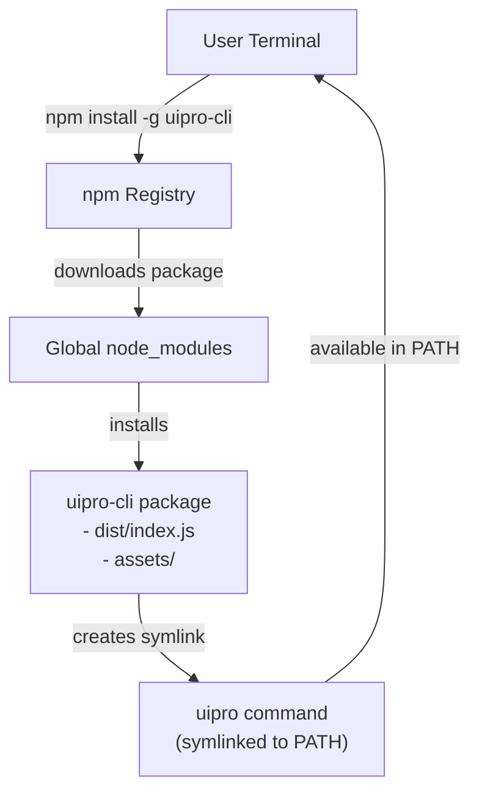
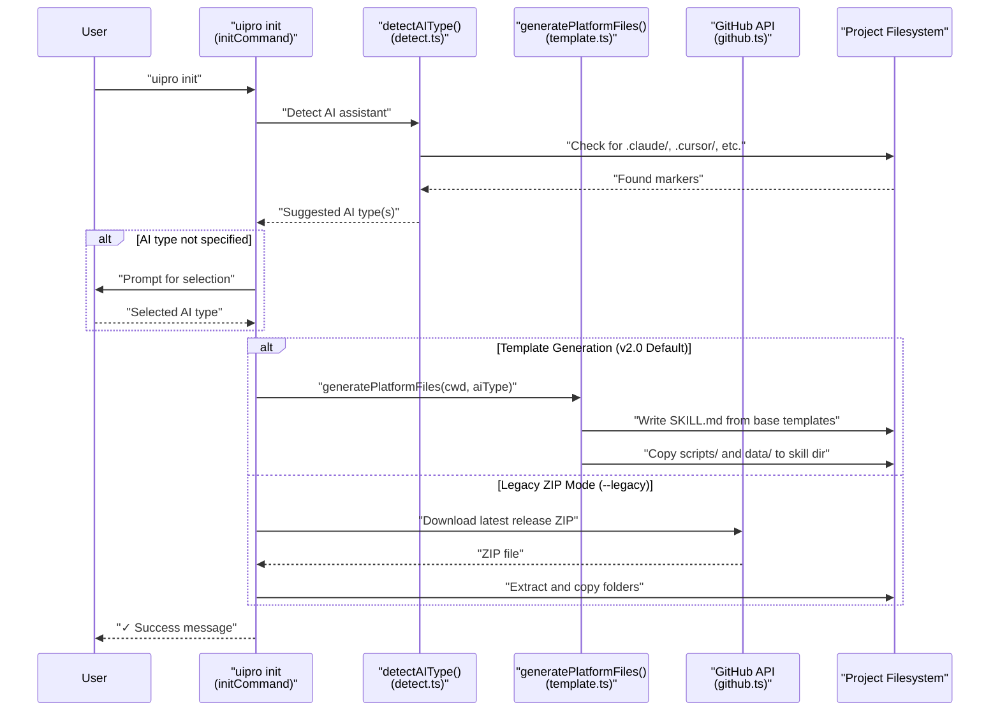
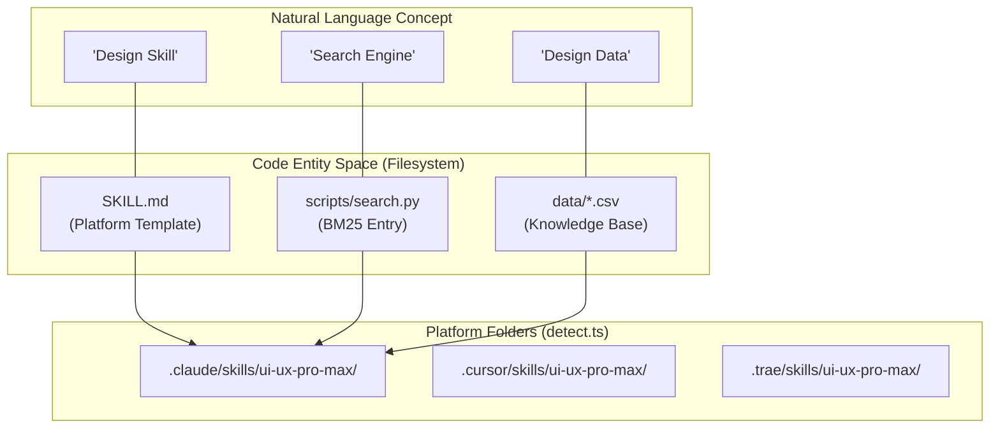
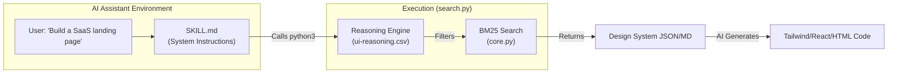

# 시작하기

<details>
<summary>관련 소스 파일</summary>

다음 파일들은 이 위키 페이지를 생성하기 위한 컨텍스트로 사용되었습니다.

- [README.md](README.md)
- [cli/.npmignore](cli/.npmignore)
- [cli/README.md](cli/README.md)
- [cli/assets/templates/platforms/augment.json](cli/assets/templates/platforms/augment.json)
- [cli/assets/templates/platforms/kilocode.json](cli/assets/templates/platforms/kilocode.json)
- [cli/assets/templates/platforms/warp.json](cli/assets/templates/platforms/warp.json)
- [cli/package.json](cli/package.json)
- [cli/src/commands/init.ts](cli/src/commands/init.ts)
- [cli/src/commands/uninstall.ts](cli/src/commands/uninstall.ts)
- [cli/src/index.ts](cli/src/index.ts)
- [cli/src/types/index.ts](cli/src/types/index.ts)
- [cli/src/utils/detect.ts](cli/src/utils/detect.ts)
- [cli/src/utils/extract.ts](cli/src/utils/extract.ts)
- [cli/src/utils/github.ts](cli/src/utils/github.ts)
- [cli/src/utils/template.ts](cli/src/utils/template.ts)
- [skill.json](skill.json)
- [src/ui-ux-pro-max/templates/platforms/augment.json](src/ui-ux-pro-max/templates/platforms/augment.json)
- [src/ui-ux-pro-max/templates/platforms/kilocode.json](src/ui-ux-pro-max/templates/platforms/kilocode.json)
- [src/ui-ux-pro-max/templates/platforms/warp.json](src/ui-ux-pro-max/templates/platforms/warp.json)

</details>


이 문서는 `uipro-cli` 도구의 설치와 최초 사용 과정을 안내합니다. 18개 지원 AI 플랫폼을 위한 사전 요구 사항, 설치 명령, 초기화 워크플로, 기본 검증 단계를 다룹니다.

## 사전 요구 사항

`uipro-cli`를 설치하기 전에 시스템에서 다음 항목을 사용할 수 있는지 확인하세요.

| 요구 사항 | 버전 | 목적 |
|------------|---------|---------|
| Python | 3.x 이상 | BM25 검색을 수행하기 위해 `search.py` 스크립트에 필요 [cli/assets/templates/platforms/kilocode.json:10]() |
| Node.js | 18.x 이상 | CLI 런타임에 필요(Bun 호환) [cli/package.json:43-44]() |
| npm / bun | 최신 | `uipro-cli` 설치를 위한 패키지 관리자 [cli/package.json:14-15]() |

### 사전 요구 사항 확인

```bash
# Check Python installation
python3 --version

# Check Node.js and npm
node --version
npm --version
```

Sources: [cli/package.json:1-48](), [cli/assets/templates/platforms/kilocode.json:1-21]()

---

## 설치

`uipro-cli` 패키지는 npm을 통해 배포되며, `uipro` 명령을 시스템 전역에서 사용할 수 있도록 전역으로 설치됩니다.

### uipro-cli 설치

```bash
npm install -g uipro-cli
```

이 명령은 [cli/package.json:1-48]()에 정의된 패키지를 설치합니다. 바이너리 진입점은 [cli/package.json:6-8]()에 있으며, `uipro` 명령을 `./dist/index.js`에 매핑합니다.

### 설치 확인

```bash
# Check CLI version
uipro --version
# Expected output: 2.5.0 (or current version)

# View available commands
uipro --help
```

버전 번호는 [cli/package.json:3]()에서 관리되며 [cli/src/index.ts:16-23]()에서 명령 프로그램으로 로드됩니다.

**설치 흐름 다이어그램:**



Sources: [cli/package.json:1-48](), [cli/src/index.ts:1-23]()

---

## 최초 초기화

설치 후 프로젝트 디렉터리로 이동한 다음 `init` 명령을 실행하여 UI/UX Pro Max skill을 설치합니다.

### 기본 초기화

```bash
# Navigate to your project
cd /path/to/your/project

# Initialize with auto-detection
uipro init
```

[cli/src/index.ts:26-44]()의 `init` 명령 구현은 여러 옵션을 받습니다.

| 옵션 | 플래그 | 설명 |
|--------|------|-------------|
| AI Type | `--ai <type>` | 대상 AI 어시스턴트(예: claude, cursor, trae) [cli/src/types/index.ts:1]() |
| Force | `--force` | 기존 파일 덮어쓰기 [cli/src/index.ts:29]() |
| Offline | `--offline` | GitHub 다운로드를 건너뛰고 번들 assets 사용 [cli/src/index.ts:30]() |
| Global | `--global` | 프로젝트 대신 홈 디렉터리(`~/`)에 설치 [cli/src/index.ts:31]() |

### 지원되는 AI 유형

CLI는 18개 AI 어시스턴트 유형을 지원하며, [cli/src/types/index.ts:44]()의 `AI_TYPES`에 대해 검증됩니다.

```bash
uipro init --ai claude      # Claude Code (.claude/skills/)
uipro init --ai cursor      # Cursor (.cursor/skills/)
uipro init --ai windsurf    # Windsurf (.windsurf/skills/)
uipro init --ai trae        # Trae (.trae/skills/)
uipro init --ai roocode     # Roo Code (.roo/skills/)
uipro init --ai copilot     # GitHub Copilot (.github/prompts/)
uipro init --ai warp        # Warp (.warp/skills/)
uipro init --ai augment     # Augment (.augment/skills/)
uipro init --ai all         # Install for all detected assistants
```

### 초기화 워크플로

**초기화 프로세스 다이어그램:**



Sources: [cli/src/commands/init.ts:117-216](), [cli/src/utils/detect.ts:10-77](), [cli/src/utils/template.ts:187-218]()

---

## 설치 결과

시스템은 **자체 포함 설치 모델**을 사용합니다 [cli/src/utils/template.ts:215](). 모든 skill 설치에는 의존성 없는 동작을 보장하기 위해 검색 엔진과 디자인 데이터베이스의 자체 복사본이 포함됩니다.

**자연어에서 코드 엔티티로의 매핑:**



| AI 유형 | 루트 디렉터리 | Skill 파일명 |
|---------|----------------|----------------|
| Claude | `.claude` | `SKILL.md` |
| Cursor | `.cursor` | `SKILL.md` |
| Trae | `.trae` | `SKILL.md` |
| GitHub Copilot | `.github` | `ui-ux-pro-max.prompt.md` |
| KiloCode | `.kilocode` | `SKILL.md` |

Sources: [cli/src/types/index.ts:49-68](), [cli/src/utils/detect.ts:79-120](), [cli/assets/templates/platforms/kilocode.json:5-9]()

---

## 기본 사용 워크플로

설치가 끝나면 skill은 4단계 자동 워크플로를 통해 디자인 인텔리전스를 제공합니다.

### 사용 워크플로 다이어그램



### 예시 프롬프트

1. **지능형 디자인 시스템 생성**:
   `"Analyze my project requirements for a 'Meditation App' and generate a full design system."`
   
2. **컴포넌트 검색**:
   `"Find the best accessible color palette for a financial dashboard using the ui-ux-pro-max skill."`

3. **스택별 구현**:
   `"Build a hero section for a spa website using React and Tailwind, following the UI/UX Pro Max guidelines."`

Sources: [README.md:36-91](), [cli/assets/templates/platforms/warp.json:15-17]()

---

## 설치 검증

skill이 올바르게 설치되고 작동하는지 확인하려면 다음을 수행합니다.

### 1. 파일 존재 확인
프로젝트 루트에 skill 디렉터리가 있는지 확인합니다.
```bash
# Example for Cursor
ls -la .cursor/skills/ui-ux-pro-max/
```
예상 파일: `SKILL.md`, `scripts/search.py`, `data/` [cli/src/utils/template.ts:198-215]().

### 2. 검색 스크립트 직접 테스트
검색 스크립트는 터미널에서 독립적으로 테스트할 수 있습니다.
```bash
python3 .cursor/skills/ui-ux-pro-max/scripts/search.py --domain style "glassmorphism"
```

### 3. 제거
skill을 제거해야 하는 경우 내장 제거 프로그램을 사용합니다.
```bash
uipro uninstall --ai cursor
```
[cli/src/commands/uninstall.ts:39-135]()의 `uninstallCommand`는 플랫폼별 `ui-ux-pro-max` skill 디렉터리를 삭제하기 전에 확인을 요청합니다.

Sources: [cli/src/commands/uninstall.ts:20-37](), [cli/src/utils/template.ts:187-218]()
