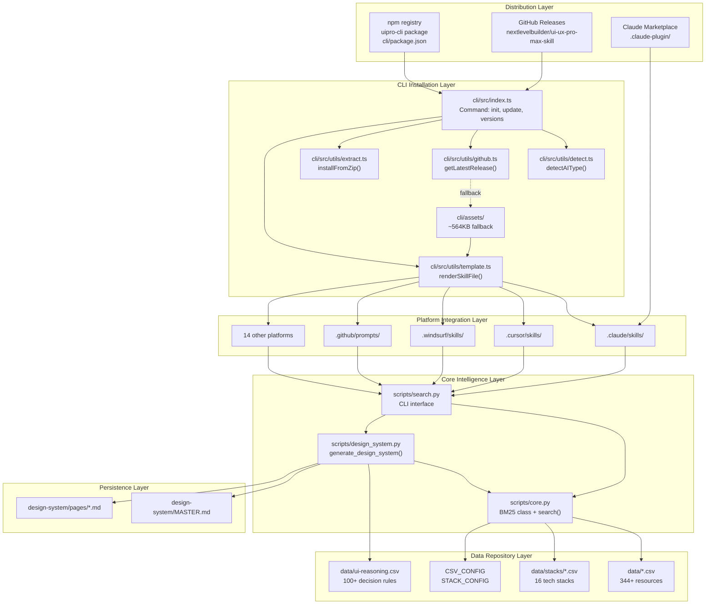
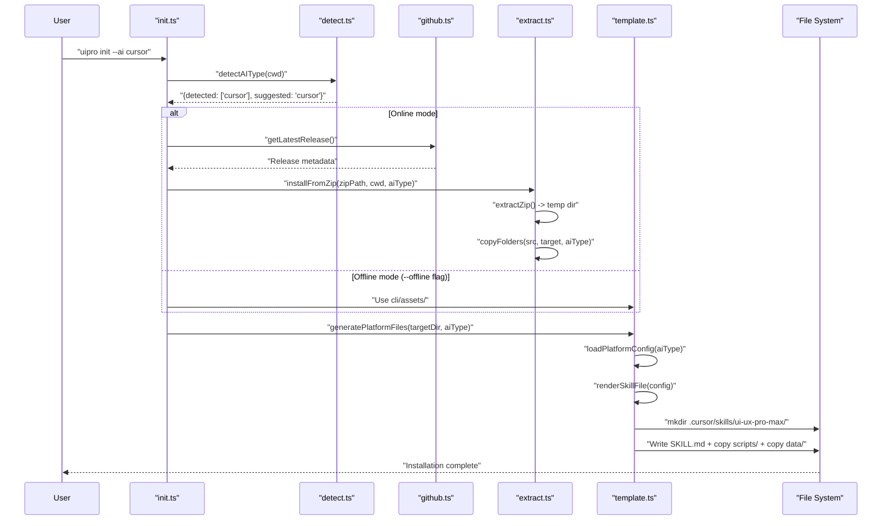
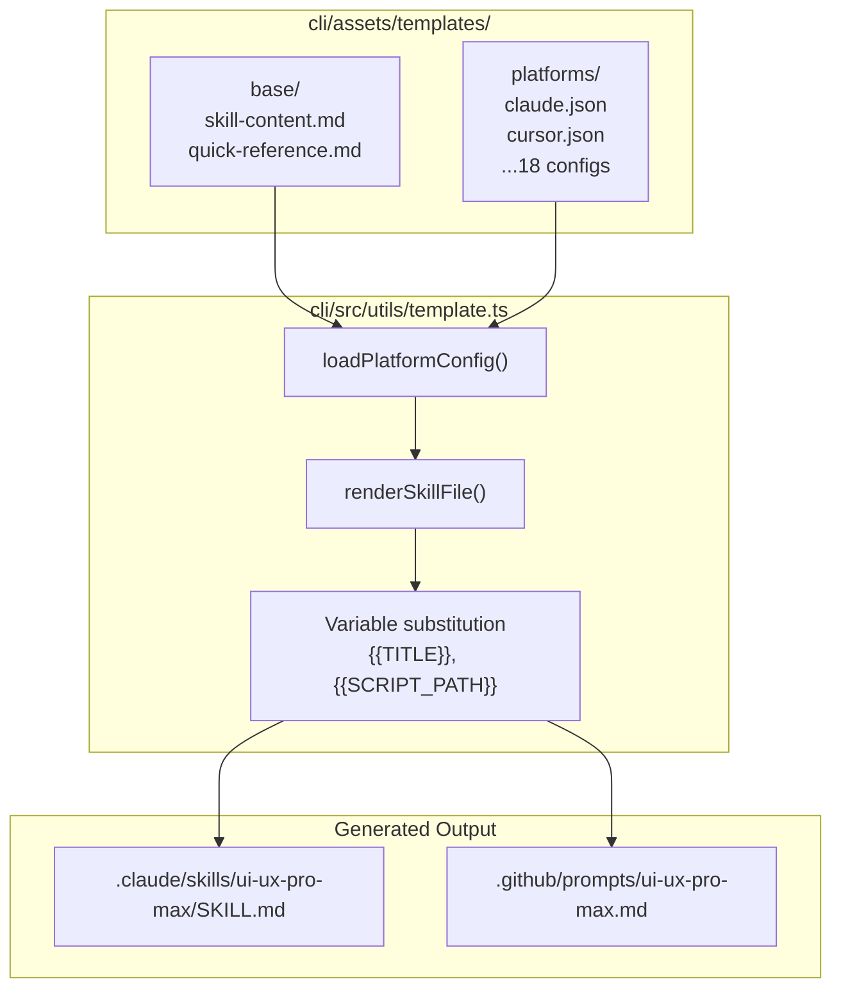
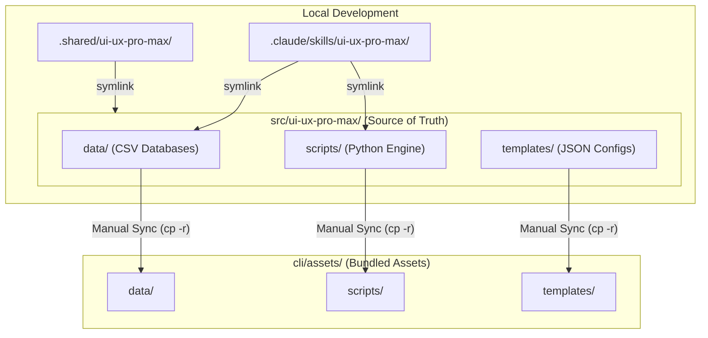

# 시스템 아키텍처

관련 소스 파일

다음 파일들은 이 위키 페이지를 생성하기 위한 컨텍스트로 사용되었습니다.

- [CLAUDE.md](CLAUDE.md)
- [README.md](README.md)
- [cli/.npmignore](cli/.npmignore)
- [cli/README.md](cli/README.md)
- [cli/assets/scripts/search.py](cli/assets/scripts/search.py)
- [cli/package.json](cli/package.json)
- [cli/src/index.ts](cli/src/index.ts)
- [cli/src/types/index.ts](cli/src/types/index.ts)
- [cli/src/utils/detect.ts](cli/src/utils/detect.ts)
- [cli/src/utils/extract.ts](cli/src/utils/extract.ts)
- [cli/src/utils/github.ts](cli/src/utils/github.ts)
- [cli/src/utils/template.ts](cli/src/utils/template.ts)
- [src/ui-ux-pro-max/data/stacks/flutter.csv](src/ui-ux-pro-max/data/stacks/flutter.csv)
- [src/ui-ux-pro-max/data/stacks/jetpack-compose.csv](src/ui-ux-pro-max/data/stacks/jetpack-compose.csv)
- [src/ui-ux-pro-max/data/stacks/shadcn.csv](src/ui-ux-pro-max/data/stacks/shadcn.csv)
- [src/ui-ux-pro-max/scripts/core.py](src/ui-ux-pro-max/scripts/core.py)
- [src/ui-ux-pro-max/scripts/search.py](src/ui-ux-pro-max/scripts/search.py)

이 문서는 UI/UX Pro Max 시스템의 기술 아키텍처를 설명하며, 배포 메커니즘, 핵심 인텔리전스 구성 요소, 플랫폼 통합 계층, 데이터 영속성 패턴을 포함합니다. 이 시스템은 템플릿 기반 생성과 중앙화된 Source of Truth를 통해 18개 이상의 AI 코딩 어시스턴트 플랫폼에서 작동하는 분산 AI skill로 설계되었습니다.

---

## 시스템 개요

UI/UX Pro Max 시스템은 배포, 설치, 인텔리전스, 통합, 영속성이라는 다섯 가지 주요 계층으로 구성됩니다. 이 계층들은 함께 작동하여 중앙화된 knowledge base의 디자인 인텔리전스를 여러 AI 플랫폼에 전달합니다.

### 고수준 시스템 토폴로지

**Sources:** [README.md:1-103](), [CLAUDE.md:30-58](), [cli/src/index.ts:20-81]()

---

## 배포 및 설치 계층

시스템은 세 가지 배포 채널을 제공하며, 각각 서로 다른 설치 워크플로를 지원합니다.

### 배포 채널

| 채널 | 패키지 | 설치 방식 | 대상 사용자 |
|---------|---------|----------------|-----------------|
| npm registry | `uipro-cli` | `npm install -g uipro-cli` | 일반 사용자 [cli/package.json:2-7]() |
| GitHub Releases | 소스 아카이브 + ZIP assets | `uipro init`이 API를 통해 다운로드 | 오프라인/엔터프라이즈 사용자 [cli/src/utils/github.ts:1-10]() |
| Claude Marketplace | 플러그인 디렉터리 | Marketplace Integration | Claude Code 사용자 전용 [CLAUDE.md:57-57]() |

### CLI 진입점 아키텍처

CLI는 TypeScript/Bun 애플리케이션으로 구현되어 있습니다 [cli/package.json:13-17](). 주요 진입점 [cli/src/index.ts:1-83]()은 `commander` 라이브러리를 사용해 명령을 정의합니다.

- `init` - 현재 프로젝트 또는 전역 위치에 skill을 설치합니다 [cli/src/index.ts:26-44]().
- `update` - 기존 설치를 최신 버전으로 업그레이드합니다 [cli/src/index.ts:52-64]().
- `uninstall` - 프로젝트 또는 홈 디렉터리에서 skill을 제거합니다 [cli/src/index.ts:67-81]().
- `versions` - 사용 가능한 모든 GitHub 릴리스를 나열합니다 [cli/src/index.ts:47-49]().

**Sources:** [cli/src/index.ts:1-83](), [cli/package.json:1-48]()

### 플랫폼 감지 시스템

`detectAIType()` 함수 [cli/src/utils/detect.ts:10-77]()는 현재 작업 디렉터리에서 플랫폼별 폴더를 스캔하여 어떤 AI 어시스턴트가 있는지 판단합니다. Claude Code, Cursor, Windsurf 등 18개 플랫폼을 지원합니다.

| 플랫폼 | 감지 경로 | 상수 |
|----------|---------------|----------|
| Claude Code | `.claude/` | `'claude'` |
| Cursor | `.cursor/` | `'cursor'` |
| Windsurf | `.windsurf/` | `'windsurf'` |
| Antigravity | `.agents/` | `'antigravity'` |
| GitHub Copilot | `.github/` | `'copilot'` |
| Trae | `.trae/` | `'trae'` |
| Roo Code | `.roo/` | `'roocode'` |
| Warp | `.warp/` | `'warp'` |

**Sources:** [cli/src/utils/detect.ts:10-77](), [cli/src/types/index.ts:44-68]()

---

## CLI 설치 파이프라인

설치 흐름은 asset 획득, 추출, 템플릿 렌더링으로 구성됩니다.

### 설치 시퀀스 다이어그램

**Sources:** [cli/src/index.ts:26-44](), [cli/src/utils/extract.ts:125-149](), [cli/src/utils/template.ts:187-218]()

### Asset 추출 및 파일 복사

`extract.ts` 모듈은 아카이브 추출과 폴더 작업을 처리합니다 [cli/src/utils/extract.ts:1-150]().
- `extractZip`: Windows에서는 `Expand-Archive`, Unix에서는 `unzip`을 사용합니다 [cli/src/utils/extract.ts:13-24]().
- `copyFolders`: `AI_FOLDERS`에 정의된 폴더를 재귀적으로 복사합니다 [cli/src/utils/extract.ts:35-88]().
- `AI_FOLDERS`: symlink 지원을 위한 `.shared` 폴더를 포함하여 플랫폼을 필요한 디렉터리에 매핑합니다 [cli/src/types/index.ts:49-68]().

**Sources:** [cli/src/utils/extract.ts:1-150](), [cli/src/types/index.ts:49-68]()

---

## 템플릿 기반 생성 시스템

UI/UX Pro Max는 단일 기반에서 플랫폼별 파일을 생성하기 위해 템플릿 시스템을 사용합니다.

### 템플릿 아키텍처

**Sources:** [cli/src/utils/template.ts:6-157]()

### 플랫폼 구성 스키마

`PlatformConfig` 인터페이스 [cli/src/types/index.ts:25-42]()는 각 플랫폼이 처리되는 방식을 정의합니다.
- `installType`: `'full'`(Skill 모드) 또는 `'reference'`(Workflow 모드) [cli/src/types/index.ts:28-28]().
- `folderStructure`: 대상 플랫폼의 `root`, `skillPath`, `filename`을 정의합니다 [cli/src/types/index.ts:29-33]().
- `frontmatter`: Copilot 같은 플랫폼을 위한 YAML 메타데이터입니다 [cli/src/utils/template.ts:103-117]().

**Sources:** [cli/src/types/index.ts:25-42](), [cli/src/utils/template.ts:123-157]()

---

## 핵심 인텔리전스 시스템

인텔리전스 계층은 검색과 추론을 구현하는 Python 모듈로 구성됩니다.

### BM25 검색 엔진

`core.py` 모듈은 `BM25` 랭킹 알고리즘을 구현합니다 [src/ui-ux-pro-max/scripts/core.py:104-160]().
- `tokenize`: 텍스트를 정규화하고 짧은 단어를 필터링합니다 [src/ui-ux-pro-max/scripts/core.py:117-120]().
- `fit`: 문서에서 IDF 인덱스를 구축합니다 [src/ui-ux-pro-max/scripts/core.py:122-140]().
- `score`: 쿼리에 대해 문서의 순위를 매깁니다 [src/ui-ux-pro-max/scripts/core.py:141-160]().

**Sources:** [src/ui-ux-pro-max/scripts/core.py:104-160]()

### Search CLI 인터페이스

`search.py`는 AI 어시스턴트를 위한 주요 진입점 역할을 합니다 [src/ui-ux-pro-max/scripts/search.py:56-115]().
- `--domain`: `style`, `color`, `ux` 같은 특정 카테고리를 검색합니다 [src/ui-ux-pro-max/scripts/search.py:59-59]().
- `--stack`: 기술별 가이드라인(예: `react`, `shadcn`)을 검색합니다 [src/ui-ux-pro-max/scripts/search.py:60-60]().
- `--design-system`: 추론 엔진을 트리거하여 완전한 시스템을 생성합니다 [src/ui-ux-pro-max/scripts/search.py:64-64]().

**Sources:** [src/ui-ux-pro-max/scripts/search.py:56-115](), [src/ui-ux-pro-max/scripts/core.py:17-92]()

---

## Source of Truth와 Symlink 아키텍처

프로젝트는 개발 환경과 설치 간의 일관성을 보장하기 위해 엄격한 "Source of Truth" 모델을 유지합니다.

### 디렉터리 매핑 및 Symlink

**동기화 규칙:**
1. **Data & Scripts**: 수정은 `src/ui-ux-pro-max/`에서 이루어집니다. 변경 사항은 symlink를 통해 로컬 개발 환경에 즉시 반영됩니다 [CLAUDE.md:68-71]().
2. **CLI Assets**: `uipro-cli` 패키지를 게시하기 전에 assets를 `src/ui-ux-pro-max/`에서 `cli/assets/`로 수동 동기화해야 합니다 [CLAUDE.md:78-83]().
3. **Reference Folders**: 수동 동기화가 필요 없습니다. CLI가 `uipro init` 중 템플릿에서 이를 생성합니다 [CLAUDE.md:85-85]().

**Sources:** [CLAUDE.md:32-58](), [CLAUDE.md:62-86]()
