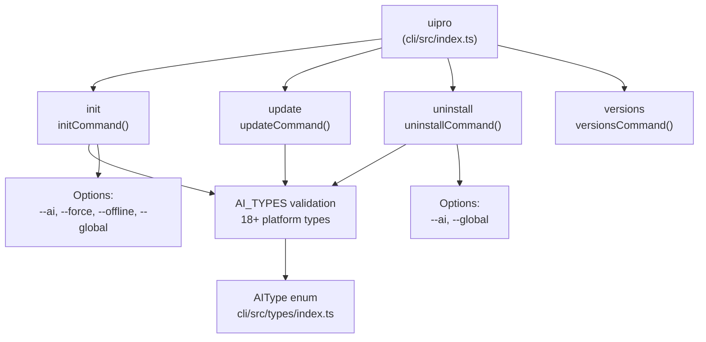
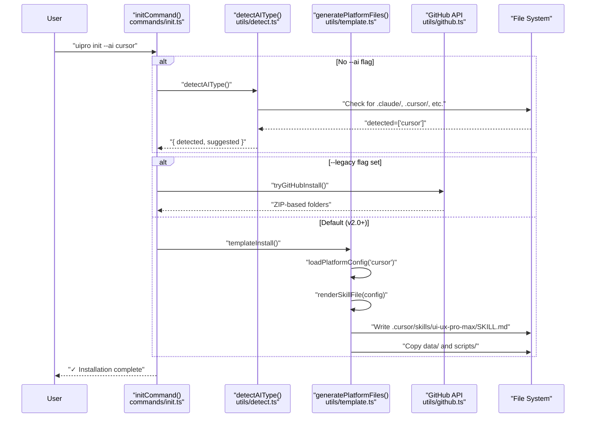

# uipro-cli 도구

<details>
<summary>관련 소스 파일</summary>

다음 파일들은 이 위키 페이지를 생성하기 위한 컨텍스트로 사용되었습니다.

- [README.md](README.md)
- [cli/.npmignore](cli/.npmignore)
- [cli/README.md](cli/README.md)
- [cli/assets/templates/platforms/augment.json](cli/assets/templates/platforms/augment.json)
- [cli/assets/templates/platforms/kilocode.json](cli/assets/templates/platforms/kilocode.json)
- [cli/assets/templates/platforms/warp.json](cli/assets/templates/platforms/warp.json)
- [cli/package.json](cli/package.json)
- [cli/src/commands/init.ts](cli/src/commands/init.ts)
- [cli/src/commands/uninstall.ts](cli/src/commands/uninstall.ts)
- [cli/src/index.ts](cli/src/index.ts)
- [cli/src/types/index.ts](cli/src/types/index.ts)
- [cli/src/utils/detect.ts](cli/src/utils/detect.ts)
- [cli/src/utils/extract.ts](cli/src/utils/extract.ts)
- [cli/src/utils/github.ts](cli/src/utils/github.ts)
- [cli/src/utils/template.ts](cli/src/utils/template.ts)
- [skill.json](skill.json)
- [src/ui-ux-pro-max/templates/platforms/augment.json](src/ui-ux-pro-max/templates/platforms/augment.json)
- [src/ui-ux-pro-max/templates/platforms/kilocode.json](src/ui-ux-pro-max/templates/platforms/kilocode.json)
- [src/ui-ux-pro-max/templates/platforms/warp.json](src/ui-ux-pro-max/templates/platforms/warp.json)

</details>


`uipro-cli` 도구는 npm을 통해 배포되는 Node.js 명령줄 인터페이스로, 18개 이상의 AI 코딩 플랫폼 전반에 UI/UX Pro Max skill의 설치와 관리를 자동화합니다. 이 도구는 플랫폼 감지, 번들 fallback을 포함한 GitHub 릴리스 다운로드, 플랫폼별 구성 파일 생성을 위한 v2.0 템플릿 기반 생성 시스템을 처리합니다.

이 페이지에서는 CLI의 패키지 구조, 명령 아키텍처, 고수준 설치 워크플로를 다룹니다. 특정 하위 시스템에 대한 자세한 정보는 다음을 참조하세요.
- CLI 명령 옵션과 사용법: [CLI Commands](#2.1)
- 설치 파이프라인 단계: [Installation Flow](#2.2)
- 플랫폼 디렉터리 감지 로직: [Platform Detection](#2.3)
- 템플릿 기반 파일 생성: [Template Generation](#2.4)

---

## 패키지 구조

`uipro-cli` 패키지는 `dist/index.js`에 바이너리 진입점이 있는 ES 모듈로 구성됩니다. 패키지에는 두 개의 중요한 디렉터리가 포함됩니다.

| 디렉터리 | 목적 |
|-----------|---------|
| `dist/` | `src/`에서 컴파일된 TypeScript 출력물 [cli/package.json:10]() |
| `assets/` | 템플릿, 플랫폼 JSON 구성, 번들 데이터/스크립트 [cli/package.json:11]() |

`package.json`은 컴파일된 진입점에 매핑되는 바이너리 명령 `uipro`를 정의합니다.

```json
"bin": {
  "uipro": "./dist/index.js"
}
```

### 주요 의존성

| 패키지 | 목적 |
|---------|---------|
| `commander@^12.1.0` | 명령줄 인수 파싱과 하위 명령 라우팅 [cli/package.json:37]() |
| `chalk@^5.3.0` | 성공/오류 메시지를 위한 터미널 색상 출력 [cli/package.json:38]() |
| `ora@^8.1.1` | 비동기 작업 중 애니메이션 스피너 표시 [cli/package.json:39]() |
| `prompts@^2.4.2` | 대화형 플랫폼 선택과 확인 [cli/package.json:40]() |

**Sources:** [cli/package.json:1-48]()

---

## 명령 아키텍처

### 진입점과 명령 등록

[cli/src/index.ts:1-84]()의 CLI 진입점은 `commander`를 사용하여 네 가지 주요 하위 명령인 `init`, `versions`, `update`, `uninstall`을 등록합니다.

**명령 계층 다이어그램**



### 명령 구현 파일

각 명령은 `src/commands/` 아래의 별도 모듈에 구현됩니다.

| 명령 | 모듈 | 목적 |
|---------|--------|---------|
| `init` | `commands/init.ts` | 프로젝트 또는 홈 디렉터리에 skill 설치 [cli/src/commands/init.ts:117]() |
| `update` | `commands/update.ts` | 기존 설치를 최신 버전으로 업데이트 [cli/src/commands/update.ts:9]() |
| `uninstall` | `commands/uninstall.ts` | 프로젝트 또는 전역 위치에서 skill 파일 제거 [cli/src/commands/uninstall.ts:39]() |
| `versions` | `commands/versions.js` | 사용 가능한 GitHub 릴리스를 가져와 표시 [cli/src/commands/versions.ts:8]() |

**Sources:** [cli/src/index.ts:1-84](), [cli/src/types/index.ts:1-44](), [cli/README.md:13-37]()

---

## 설치 아키텍처

CLI는 여러 단계의 설치 프로세스를 오케스트레이션합니다. v2.0 이상에서 기본 모드는 **Template Generation**이며, 정적 assets를 단순히 복사하는 대신 skill 파일을 동적으로 구성합니다.

**코드 엔티티를 포함한 설치 흐름**



### 설치 모드

| 모드 | 트리거 | 로직 |
|------|---------|-------|
| **Template** | 기본값 | `generatePlatformFiles`를 사용하여 템플릿과 플랫폼 JSON에서 Markdown을 렌더링합니다 [cli/src/utils/template.ts:187-218](). |
| **Legacy ZIP** | `--legacy` | `getLatestRelease`를 통해 GitHub에서 ZIP을 다운로드하고 [cli/src/utils/github.ts:35](), `installFromZip`으로 추출합니다 [cli/src/utils/extract.ts:125](). |
| **Global** | `--global` | `homedir()`에 설치하고 [cli/src/utils/template.ts:196](), 스크립트 경로를 절대 `~/` 경로로 다시 작성합니다 [cli/src/utils/template.ts:148-154](). |

**Sources:** [cli/src/commands/init.ts:159-183](), [cli/src/utils/template.ts:123-157]()

---

## 플랫폼 감지 및 구성

### 감지 로직
`detectAIType` 함수는 현재 작업 디렉터리에서 숨김 플랫폼 폴더(예: `.cursor`, `.windsurf`, `.trae`)를 스캔하여 적절한 설치 대상을 제안합니다 [cli/src/utils/detect.ts:10-77]().

### 플랫폼 JSON 스키마
지원되는 각 플랫폼(v2.5.0 기준 총 18개)은 `assets/templates/platforms/`의 JSON 구성 파일로 정의됩니다. 이 파일들은 다음을 정의합니다.
- `folderStructure`: skill과 해당 파일들이 위치해야 할 곳 [cli/assets/templates/platforms/warp.json:5-9]().
- `installType`: 플랫폼이 `full` 또는 `reference` skill을 지원하는지 여부 [cli/src/types/index.ts:28]().
- `frontmatter`: skill 파일을 위한 플랫폼별 메타데이터(YAML) [cli/src/utils/template.ts:103-117]().

**Sources:** [cli/src/utils/detect.ts:1-77](), [cli/src/utils/template.ts:10-49](), [cli/assets/templates/platforms/warp.json:1-18]()

---

## ZIP 추출 및 Fallback

Template Generation이 주요 모드이지만, CLI는 레거시 지원과 수동 업데이트를 위해 견고한 ZIP 처리를 유지합니다.

**추출 유틸리티**
`extractZip` 함수는 플랫폼별 추출을 처리합니다 [cli/src/utils/extract.ts:13-24]().
- **Windows**: PowerShell `Expand-Archive`를 사용합니다.
- **Unix**: `unzip`을 사용합니다.

**Fallback 전략**
레거시 모드에서 GitHub 다운로드가 속도 제한(`GitHubRateLimitError`) 또는 네트워크 문제로 실패하면, CLI는 자동으로 `ASSETS_DIR`의 번들 assets로 fallback합니다 [cli/src/commands/init.ts:174-178]().

**Sources:** [cli/src/utils/extract.ts:1-150](), [cli/src/commands/init.ts:69-95]()

---

## 개발 및 빌드

CLI는 TypeScript와 Bun 런타임을 사용해 개발됩니다.

| 작업 | 명령 |
|--------|---------|
| **Build** | `bun run build` (`dist/`로 컴파일) [cli/package.json:14]() |
| **Dev** | `bun run src/index.ts` [cli/package.json:15]() |
| **Link** | `bun link` (`uipro` 명령의 로컬 테스트용) [cli/README.md:58]() |

`prepublishOnly` hook은 npm에 게시하기 전에 `dist/` 디렉터리가 항상 최신 상태인지 보장합니다 [cli/package.json:16]().

**Sources:** [cli/package.json:13-17](), [cli/README.md:45-59]()
