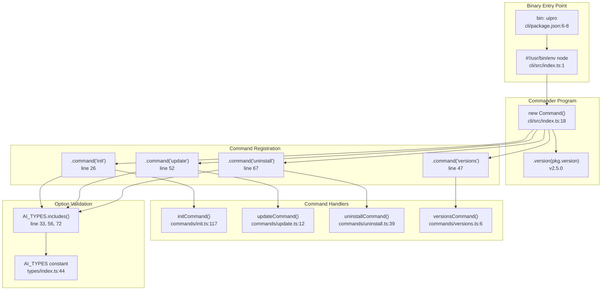
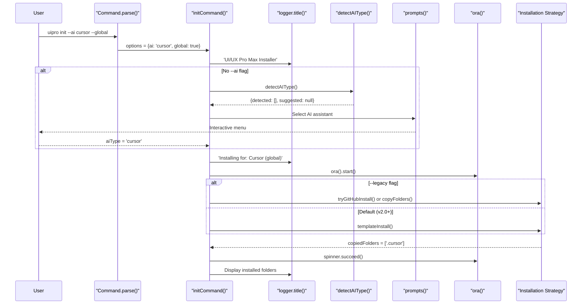
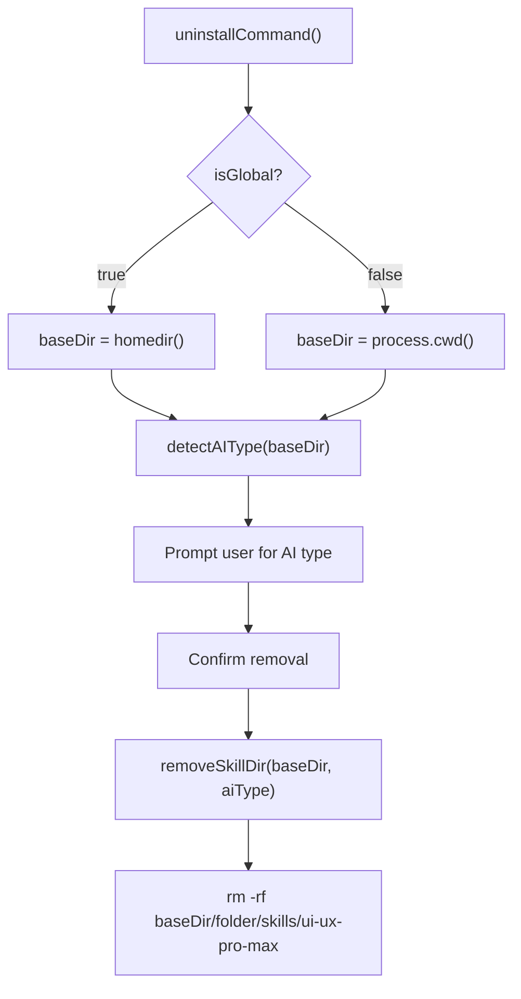

# CLI 명령

<details>
<summary>관련 소스 파일</summary>

다음 파일들은 이 위키 페이지를 생성하기 위한 컨텍스트로 사용되었습니다.

- [LICENSE](LICENSE)
- [README.md](README.md)
- [cli/.gitignore](cli/.gitignore)
- [cli/.npmignore](cli/.npmignore)
- [cli/README.md](cli/README.md)
- [cli/assets/templates/platforms/augment.json](cli/assets/templates/platforms/augment.json)
- [cli/assets/templates/platforms/kilocode.json](cli/assets/templates/platforms/kilocode.json)
- [cli/assets/templates/platforms/warp.json](cli/assets/templates/platforms/warp.json)
- [cli/bun.lock](cli/bun.lock)
- [cli/package.json](cli/package.json)
- [cli/src/commands/init.ts](cli/src/commands/init.ts)
- [cli/src/commands/uninstall.ts](cli/src/commands/uninstall.ts)
- [cli/src/commands/update.ts](cli/src/commands/update.ts)
- [cli/src/commands/versions.ts](cli/src/commands/versions.ts)
- [cli/src/index.ts](cli/src/index.ts)
- [cli/src/types/index.ts](cli/src/types/index.ts)
- [cli/src/utils/detect.ts](cli/src/utils/detect.ts)
- [cli/src/utils/extract.ts](cli/src/utils/extract.ts)
- [cli/src/utils/github.ts](cli/src/utils/github.ts)
- [cli/src/utils/template.ts](cli/src/utils/template.ts)
- [skill.json](skill.json)
- [src/ui-ux-pro-max/templates/platforms/augment.json](src/ui-ux-pro-max/templates/platforms/augment.json)
- [src/ui-ux-pro-max/templates/platforms/kilocode.json](src/ui-ux-pro-max/templates/platforms/kilocode.json)
- [src/ui-ux-pro-max/templates/platforms/warp.json](src/ui-ux-pro-max/templates/platforms/warp.json)

</details>


이 문서는 AI 코딩 어시스턴트 전반에서 UI/UX Pro Max를 설치하고 관리하기 위한 네 가지 주요 명령을 제공하는 `uipro` CLI 도구의 명령줄 인터페이스를 자세히 설명합니다. CLI는 npm을 통해 `uipro-cli`로 배포되며 [cli/package.json:1-8](), 자동 플랫폼 감지, GitHub 통합, 템플릿 기반 파일 생성을 포함한 설치 오케스트레이션을 제공합니다.

설치 파이프라인과 asset 다운로드 메커니즘에 대한 정보는 [Installation Flow](#2.2)를 참조하세요. 플랫폼 감지 로직은 [Platform Detection](#2.3)을 참조하세요. 템플릿 기반 파일 생성은 [Template Generation](#2.4)을 참조하세요.

---

## 명령 개요

CLI는 `uipro` 실행 파일을 통해 네 가지 명령을 노출합니다.

| 명령 | 목적 | 주요 옵션 |
|---------|---------|-------------|
| `uipro init` | 현재 프로젝트 또는 전역 위치에 UI/UX Pro Max 설치 | `--ai`, `--force`, `--offline`, `--legacy`, `--global` |
| `uipro update` | 최신 버전으로 업데이트(force가 적용된 init의 alias) | `--ai` |
| `uipro uninstall` | 프로젝트 또는 홈 디렉터리에서 skill 파일 제거 | `--ai`, `--global` |
| `uipro versions` | 사용 가능한 GitHub 릴리스 나열 | 없음 |

**Sources:** [cli/src/index.ts:20-81](), [cli/package.json:6-8]()

---

## CLI 프로그램 구조

다음 다이어그램은 명령줄 진입점을 코드 엔티티에 매핑합니다.



**Sources:** [cli/src/index.ts:1-84](), [cli/package.json:1-8]()

---

## init 명령

`init` 명령은 플랫폼을 감지하고, skill 파일을 생성하며, 데이터 assets를 복사하여 현재 작업 디렉터리 또는 사용자의 홈 디렉터리에 UI/UX Pro Max를 설치합니다.

### 구문

```bash
uipro init [options]
```

### 옵션

| 옵션 | 유형 | 설명 | 기본값 |
|--------|------|-------------|---------|
| `-a, --ai <type>` | string | 대상 AI 플랫폼(예: `cursor`, `claude`, `all`) | 대화형 프롬프트 |
| `-f, --force` | boolean | 확인 없이 기존 파일 덮어쓰기 | `false` |
| `-o, --offline` | boolean | GitHub 다운로드를 건너뛰고 번들 assets만 사용 | `false` |
| `-g, --global` | boolean | 프로젝트 대신 홈 디렉터리(`~/`)에 설치 | `false` |
| `--legacy` | boolean | 템플릿 대신 ZIP 기반 설치 사용 | `false` |

**Sources:** [cli/src/index.ts:26-44](), [cli/src/commands/init.ts:24-30]()

### 실행 흐름



**Sources:** [cli/src/commands/init.ts:117-216](), [cli/src/index.ts:26-44]()

### 설치 전략

#### Template Generation(기본값)
이 방식은 `generatePlatformFiles` [cli/src/utils/template.ts:187]()를 사용하여 플랫폼별 Markdown 파일을 생성하고 로컬 scripts/data를 복사합니다. `--global`이 설정된 경우 Python 스크립트 경로를 절대 홈 디렉터리 경로로 다시 작성합니다 [cli/src/utils/template.ts:148-154]().

#### ZIP 기반 설치(레거시)
`--legacy` 플래그로 제어됩니다. `tryGitHubInstall` [cli/src/commands/init.ts:36]()을 통해 GitHub에서 릴리스를 다운로드하고 추출을 시도합니다. 오프라인이거나 GitHub가 실패하면 `copyFolders` [cli/src/utils/extract.ts:35]()를 사용하여 CLI 패키지에서 대상으로 assets를 이동합니다.

**Sources:** [cli/src/commands/init.ts:98-115](), [cli/src/utils/template.ts:123-157]()

---

## uninstall 명령

`uninstall` 명령은 특정 AI 어시스턴트 폴더에서 `ui-ux-pro-max` skill 디렉터리를 제거합니다.

### 구문

```bash
uipro uninstall [options]
```

### 옵션

| 옵션 | 유형 | 설명 |
|--------|------|-------------|
| `-a, --ai <type>` | string | 제거할 특정 AI 어시스턴트 |
| `-g, --global` | boolean | 홈 디렉터리(`~/`)에서 제거 |

**Sources:** [cli/src/index.ts:67-81](), [cli/src/commands/uninstall.ts:12-15]()

### 구현: removeSkillDir
핵심 로직은 `removeSkillDir` [cli/src/commands/uninstall.ts:20]()에 있으며, `AI_FOLDERS` [cli/src/types/index.ts:49]()에 매핑된 폴더를 순회하고 `skills/ui-ux-pro-max` 하위 디렉터리를 삭제합니다.



**Sources:** [cli/src/commands/uninstall.ts:20-135]()

---

## update 명령

`update` 명령은 GitHub에서 최신 릴리스 버전을 가져오고, 기존 파일을 덮어쓰기 위해 `force` 플래그를 활성화한 상태로 설치 프로세스를 다시 실행합니다.

### 구문

```bash
uipro update [options]
```

**Sources:** [cli/src/index.ts:52-64](), [cli/src/commands/update.ts:12-36]()

---

## versions 명령

`versions` 명령은 GitHub Releases API를 쿼리하여 사용 가능한 버전을 표시합니다. `fetchReleases` [cli/src/utils/github.ts:34]()를 사용하며 `checkRateLimit` [cli/src/utils/github.ts:22]()을 통해 rate limit을 처리합니다.

**Sources:** [cli/src/commands/versions.ts:6-42](), [cli/src/utils/github.ts:34-51]()

---

## 명령줄 옵션 검증

### AI Type 검증
CLI는 `--ai` 옵션을 `AI_TYPES` 상수 [cli/src/types/index.ts:44]()에 대해 검증합니다. 지원되는 유형은 다음과 같습니다.
`claude`, `cursor`, `windsurf`, `antigravity`, `copilot`, `roocode`, `kiro`, `codex`, `qoder`, `gemini`, `trae`, `opencode`, `continue`, `codebuddy`, `droid`, `kilocode`, `warp`, `augment`, `all`.

**Sources:** [cli/src/index.ts:33-37](), [cli/src/types/index.ts:1]()

### 종료 코드

| 종료 코드 | 조건 | 위치 |
|-----------|-----------|----------|
| `0` | 성공적인 실행 | 암시적 |
| `1` | 잘못된 `--ai` 유형 제공 | [cli/src/index.ts:36, 59, 75]() |
| `1` | 설치/제거 실패 | [cli/src/commands/init.ts:214](), [cli/src/commands/uninstall.ts:133]() |

**Sources:** [cli/src/index.ts:36-75](), [cli/src/commands/init.ts:214]()
