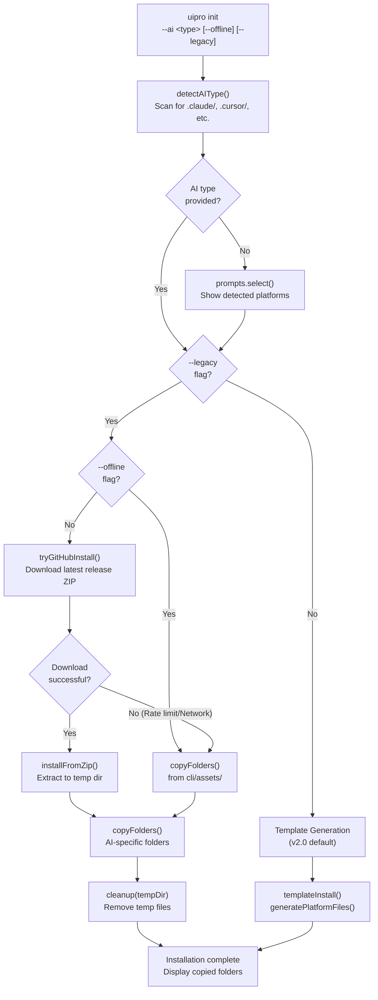
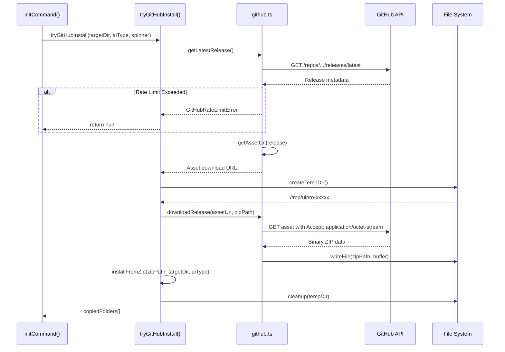
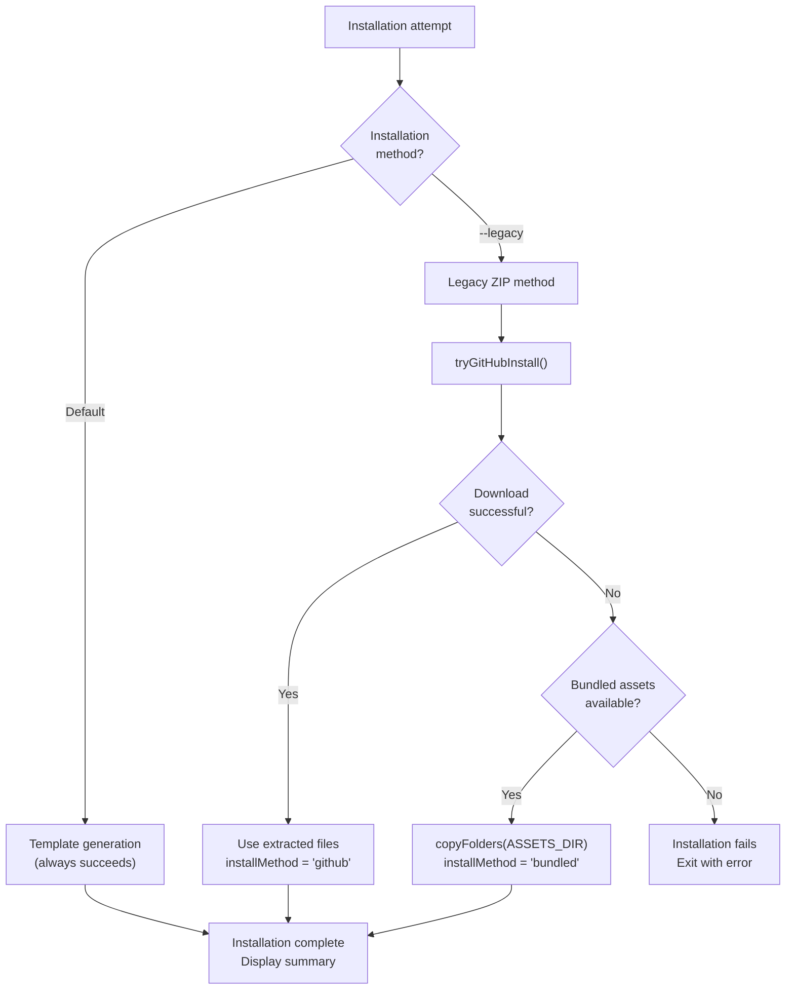
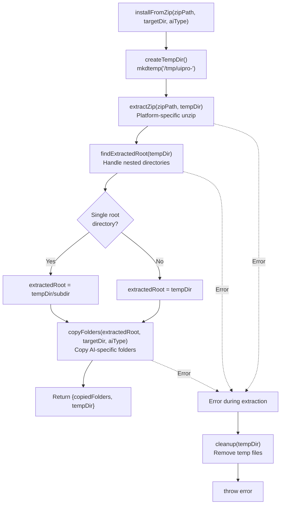
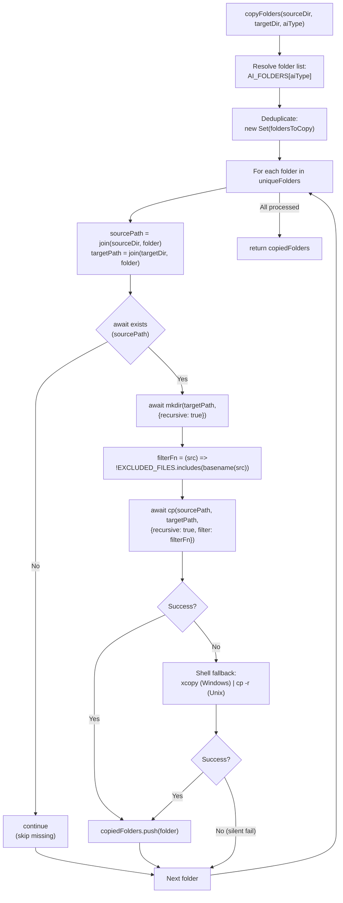
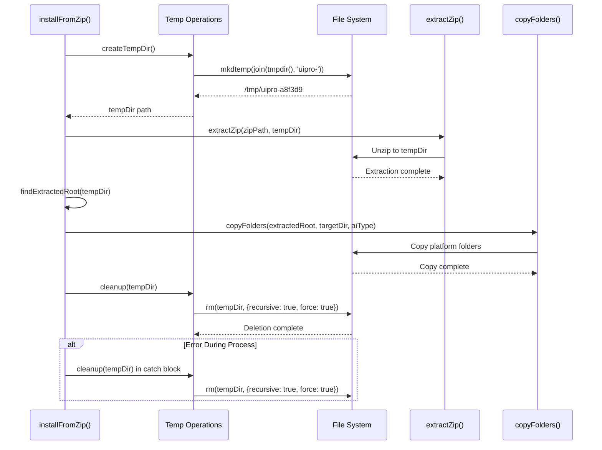
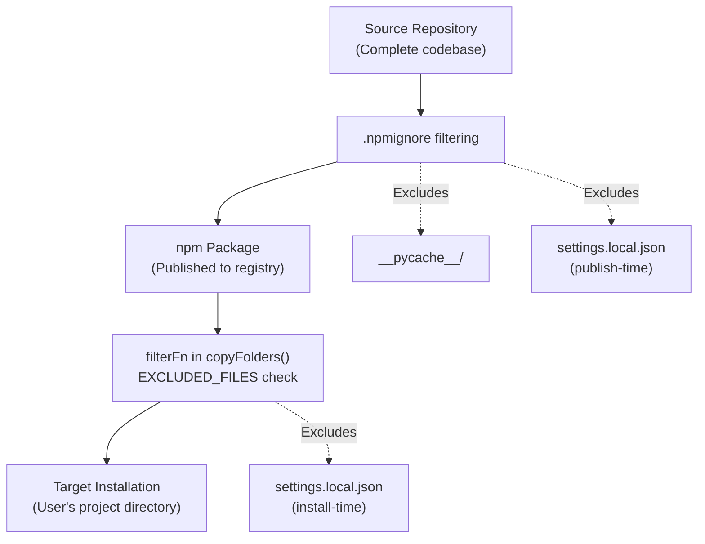

# 설치 흐름

<details>
<summary>관련 소스 파일</summary>

다음 파일들은 이 위키 페이지를 생성하기 위한 컨텍스트로 사용되었습니다.

- [README.md](README.md)
- [cli/.npmignore](cli/.npmignore)
- [cli/README.md](cli/README.md)
- [cli/assets/templates/platforms/augment.json](cli/assets/templates/platforms/augment.json)
- [cli/assets/templates/platforms/kilocode.json](cli/assets/templates/platforms/kilocode.json)
- [cli/assets/templates/platforms/warp.json](cli/assets/templates/platforms/warp.json)
- [cli/package.json](cli/package.json)
- [cli/src/commands/init.ts](cli/src/commands/init.ts)
- [cli/src/commands/uninstall.ts](cli/src/commands/uninstall.ts)
- [cli/src/index.ts](cli/src/index.ts)
- [cli/src/types/index.ts](cli/src/types/index.ts)
- [cli/src/utils/detect.ts](cli/src/utils/detect.ts)
- [cli/src/utils/extract.ts](cli/src/utils/extract.ts)
- [cli/src/utils/github.ts](cli/src/utils/github.ts)
- [cli/src/utils/template.ts](cli/src/utils/template.ts)
- [skill.json](skill.json)
- [src/ui-ux-pro-max/templates/platforms/augment.json](src/ui-ux-pro-max/templates/platforms/augment.json)
- [src/ui-ux-pro-max/templates/platforms/kilocode.json](src/ui-ux-pro-max/templates/platforms/kilocode.json)
- [src/ui-ux-pro-max/templates/platforms/warp.json](src/ui-ux-pro-max/templates/platforms/warp.json)

</details>


`uipro-cli` 설치 파이프라인은 GitHub asset 다운로드(fallback 처리 포함), 레거시 모드용 선택적 ZIP 추출, 기본 v2.0 방식인 템플릿 기반 생성을 포함한 여러 단계를 오케스트레이션합니다. 이 문서는 `uipro init` 명령 호출부터 사용자의 프로젝트 디렉터리에 최종 파일이 배치되기까지의 전체 흐름을 자세히 설명합니다.

설치 시스템은 v2.0에서 도입된 템플릿 생성을 기본 방식으로 우선하며, `--legacy` 플래그를 통해 레거시 ZIP 기반 설치를 사용할 수 있습니다. 관련 문서: 명령 옵션은 [CLI Commands](#2.1), AI 유형 감지는 [Platform Detection](#2.3), v2.0 템플릿 시스템은 [Template Generation](#2.4)을 참조하세요.

Sources: [cli/src/commands/init.ts:1-217](), [cli/src/utils/extract.ts:1-150]()

## 설치 파이프라인 개요

설치 흐름은 자동 fallback 메커니즘이 있는 여러 단계로 구성됩니다. 파이프라인은 `initCommand()` [cli/src/commands/init.ts:117-216]()를 통해 호출되며 다음 의사 결정 트리를 실행합니다.

**전체 설치 흐름**



파이프라인은 `initCommand` [cli/src/commands/init.ts:156-189]()에 정의된 세 가지 설치 방식을 사용합니다.

| 방식 | 트리거 | 설명 | 파일 소스 |
|--------|---------|-------------|--------------|
| **Template Generation** | 기본값(`--legacy` 없음) | 플랫폼 configs를 사용해 템플릿에서 파일을 생성 | `cli/src/utils/template.ts` |
| **GitHub ZIP** | `--legacy` 플래그 + 네트워크 사용 가능 | 최신 릴리스를 다운로드하고 추출 | GitHub API + `extractZip()` |
| **Bundled Assets** | `--legacy --offline` 또는 GitHub 실패 | npm에 미리 패키징된 파일 사용 | `cli/assets/` 디렉터리 |

Sources: [cli/src/commands/init.ts:156-189](), [cli/src/index.ts:26-44]()

## 설치 방식 선택

v2.0부터 CLI는 ZIP 기반 설치가 아니라 **template generation**을 기본값으로 사용합니다. 이 전환은 중복 파일을 배포하지 않고도 단일 Source of Truth 유지 관리와 플랫폼별 사용자 지정을 가능하게 합니다.

### Template Generation 방식(기본값)

`--legacy` 플래그 없이 호출하면 `initCommand()`는 `templateInstall()` [cli/src/commands/init.ts:181-182]()를 호출합니다.

```typescript
// Default: template-based generation
copiedFolders = await templateInstall(cwd, aiType, spinner, isGlobal);
installMethod = 'template';
```

`templateInstall` 함수 [cli/src/commands/init.ts:100-115]()는 다음 중 하나로 라우팅합니다.
- `generatePlatformFiles(targetDir, aiType, isGlobal)` - 단일 플랫폼
- `generateAllPlatformFiles(targetDir, isGlobal)` - 모든 플랫폼(`aiType === 'all'`인 경우)

이 방식은 [Template Generation](#2.4)에서 자세히 다룹니다.

### Legacy ZIP 방식(--legacy 플래그)

`--legacy` 플래그가 제공되면 CLI는 원래의 ZIP 기반 설치를 시도합니다 [cli/src/commands/init.ts:160-178]().

```typescript
if (options.legacy) {
  if (isGlobal) {
    spinner.warn('--global is not supported with --legacy mode, installing locally instead');
  }
  // Try GitHub download first (unless offline mode)
  if (!options.offline) {
    const githubResult = await tryGitHubInstall(cwd, aiType, spinner);
    if (githubResult) {
      copiedFolders = githubResult;
      installMethod = 'github';
    }
  }
  
  // Fall back to bundled assets if GitHub failed or offline mode
  if (installMethod !== 'github') {
    spinner.text = 'Installing from bundled assets...';
    copiedFolders = await copyFolders(ASSETS_DIR, cwd, aiType);
    installMethod = 'bundled';
  }
}
```

**방식 비교**

| 측면 | Template Generation | Legacy ZIP |
|--------|---------------------|------------|
| **기본값** | 예(v2.0+) | 아니요(`--legacy` 필요) |
| **네트워크 필요** | 아니요 | 예(`--offline` 제외) |
| **파일 크기** | 최소(대상 플랫폼만) | 더 큼(전체 릴리스 아카이브) |
| **사용자 지정** | JSON configs를 통한 플랫폼별 설정 | ZIP의 정적 파일 |
| **유지 관리** | `src/ui-ux-pro-max/`의 단일 소스 | `cli/assets/`로 동기화 필요 |
| **속도** | 더 빠름(다운로드/추출 없음) | 더 느림(다운로드 + unzip) |

Sources: [cli/src/commands/init.ts:160-183](), [cli/src/utils/template.ts:187-218]()

## GitHub 다운로드 단계

`tryGitHubInstall()` 함수 [cli/src/commands/init.ts:36-95]()는 포괄적인 오류 처리를 포함한 GitHub 릴리스 다운로드 파이프라인을 오케스트레이션합니다.

**GitHub 다운로드 파이프라인**



### GitHub API 상호작용

`github.ts` 모듈은 GitHub API와 상호작용하기 위한 핵심 함수를 정의합니다.

| 함수 | 엔드포인트 | 목적 |
|----------|----------|---------|
| `getLatestRelease()` | `/repos/{owner}/{repo}/releases/latest` | 최신 릴리스 메타데이터 가져오기 [cli/src/utils/github.ts:34-45]() |
| `downloadRelease(url, dest)` | Asset URL | 바이너리 ZIP을 디스크로 다운로드 [cli/src/utils/github.ts:80-105]() |

모든 요청에는 `checkRateLimit()` [cli/src/utils/github.ts:10-18]()를 통한 rate limit 감지가 포함됩니다.

### Asset URL 해석

`getAssetUrl()` 함수 [cli/src/utils/github.ts:60-78]()는 2단계 fallback 전략을 구현합니다.

1. **업로드된 ZIP asset** - `.zip` 확장자가 있는 `release.assets` 검색
2. **자동 생성 아카이브** - URL 구성: `https://github.com/{owner}/{repo}/archive/refs/tags/{tag}.zip`

이를 통해 릴리스에 ZIP이 명시적으로 업로드되지 않았더라도 설치가 작동합니다.

Sources: [cli/src/commands/init.ts:36-95](), [cli/src/utils/github.ts:1-105]()

## 오류 처리 및 Fallback 전략

설치 파이프라인은 설치 성공률을 최대화하기 위해 여러 fallback 계층을 통한 graceful degradation을 구현합니다.

### 오류 유형과 응답

| 오류 유형 | 발생 위치 | 처리 동작 | Fallback 동작 |
|------------|-----------|------------------|-----------------|
| `GitHubRateLimitError` | `checkRateLimit()` | reset 시간을 포함해 사용자에게 경고 | Template generation [cli/src/commands/init.ts:75-78]() |
| `GitHubDownloadError` | `downloadRelease()` | "GitHub download failed" 경고 | Template generation [cli/src/commands/init.ts:80-83]() |
| `TypeError` (fetch) | `fetch()` 호출 | 네트워크 문제 감지 | Template generation [cli/src/commands/init.ts:86-89]() |
| 알 수 없는 오류 | 모든 단계 | 일반 "Download failed" 경고 | Template generation [cli/src/commands/init.ts:92-93]() |

**Fallback 의사 결정 트리**



### 오류 복구 로직

`tryGitHubInstall()` 함수 [cli/src/commands/init.ts:36-95]()는 세밀한 오류 분류와 함께 모든 작업을 try-catch 블록으로 감쌉니다. 예외를 던지는 대신 `null`을 반환하므로 `initCommand()`가 template generation 또는 bundled assets로 자연스럽게 fallback할 수 있습니다.

Sources: [cli/src/commands/init.ts:69-94](), [cli/src/utils/github.ts:10-32]()

## ZIP 추출(레거시 모드)

`--legacy` 플래그를 사용할 때 `installFromZip()` 함수 [cli/src/utils/extract.ts:125-149]()가 전체 추출 파이프라인을 처리합니다.

### installFromZip() 파이프라인

이 함수는 여러 추출 단계를 조정합니다.

**레거시 설치 파이프라인**



### 플랫폼별 추출

`extractZip()` 함수 [cli/src/utils/extract.ts:13-24]()는 `process.platform`에 따라 서로 다른 셸 명령을 사용합니다.

| 플랫폼 | 감지 | 명령 | 플래그 |
|----------|-----------|---------|-------|
| Windows | `process.platform === 'win32'` | `powershell -Command "Expand-Archive..."` | `-Force`(덮어쓰기) |
| Unix/Linux/macOS | 그 외 모든 값 | `unzip -o "..." -d "..."` | `-o`(프롬프트 없이 덮어쓰기) |

### 추출된 Root 감지

GitHub 릴리스 ZIP에는 종종 단일 루트 디렉터리가 포함됩니다. `findExtractedRoot()` 함수 [cli/src/utils/extract.ts:109-120]()는 이를 처리하여 `copyFolders()`가 올바른 소스 경로에서 작동하도록 보장합니다.

Sources: [cli/src/utils/extract.ts:125-149](), [cli/src/utils/extract.ts:109-120](), [cli/src/utils/extract.ts:13-24]()

## 폴더 복사 로직

`copyFolders()` 함수 [cli/src/utils/extract.ts:35-88]()는 레거시 설치 방식에서 플랫폼별 디렉터리를 선택적으로 복사하는 데 사용됩니다.

### AI별 폴더 선택

`AI_FOLDERS` 매핑 [cli/src/types/index.ts:49-68]()은 어떤 디렉터리를 복사할지 결정합니다. `.shared/` 디렉터리에는 여러 플랫폼에서 사용하는 핵심 scripts와 data가 포함됩니다.

### 복사 작업 흐름

이 함수는 3단계 복사 전략을 구현합니다. Node.js 네이티브 API(`cp`), 플랫폼별 셸 fallback(`xcopy` 또는 `cp -r`), 누락된 소스에 대한 silent failure입니다.

**copyFolders() 실행 흐름**



### 파일 제외 필터

`filterFn` 콜백 [cli/src/utils/extract.ts:63-66]()은 `settings.local.json` [cli/src/utils/extract.ts:11]() 같은 특정 파일이 복사되지 않도록 방지합니다.

Sources: [cli/src/utils/extract.ts:35-88](), [cli/src/types/index.ts:49-68]()

## 임시 디렉터리 관리

설치 파이프라인은 ZIP 추출을 위해 임시 디렉터리를 사용하여 사용자의 파일시스템을 오염시키지 않습니다.

### 임시 디렉터리 생명주기

**Temp Directory Lifecycle**



### 임시 디렉터리 함수

| 함수 | 목적 | 구현 |
|----------|---------|----------------|
| `createTempDir()` | 고유한 임시 디렉터리 생성 | `mkdtemp(join(tmpdir(), 'uipro-'))` [cli/src/utils/extract.ts:101-103]() |
| `cleanup(tempDir)` | 임시 디렉터리와 콘텐츠 제거 | `rm(tempDir, {recursive: true, force: true})` [cli/src/utils/extract.ts:90-96]() |

정리는 성공 경로 [cli/src/utils/extract.ts:143]()와 오류 경로 [cli/src/commands/init.ts:71-73]() 모두에서 발생합니다.

Sources: [cli/src/utils/extract.ts:90-103](), [cli/src/commands/init.ts:64-73]()

## 파일 제외 규칙

시스템은 민감하거나 불필요한 파일이 복사되지 않도록 여러 계층의 파일 제외를 유지합니다.

### 제외 파일 목록

`EXCLUDED_FILES` 상수 [cli/src/utils/extract.ts:11]()는 덮어쓰면 안 되는 `settings.local.json` 같은 파일을 정의합니다.

### 다중 계층 제외 전략

**파일 제외 계층**



이 다중 계층 접근 방식은 build artifacts와 로컬 구성 파일이 배포되거나 덮어써지지 않도록 보장합니다.

Sources: [cli/src/utils/extract.ts:11](), [cli/.npmignore:1-2]()

## 버전 관리

패키지는 semantic versioning을 사용합니다. 현재 버전은 `2.5.0`입니다 [cli/package.json:3]().

Sources: [cli/package.json:3]()
