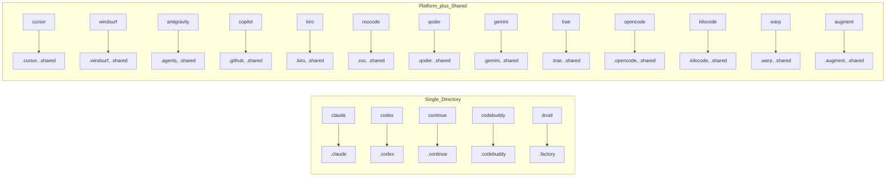

# 플랫폼 감지

<details>
<summary>관련 소스 파일</summary>

다음 파일들은 이 위키 페이지를 생성하기 위한 컨텍스트로 사용되었습니다.

- [CLAUDE.md](CLAUDE.md)
- [README.md](README.md)
- [cli/.npmignore](cli/.npmignore)
- [cli/README.md](cli/README.md)
- [cli/package.json](cli/package.json)
- [cli/src/index.ts](cli/src/index.ts)
- [cli/src/types/index.ts](cli/src/types/index.ts)
- [cli/src/utils/detect.ts](cli/src/utils/detect.ts)
- [cli/src/utils/extract.ts](cli/src/utils/extract.ts)
- [cli/src/utils/github.ts](cli/src/utils/github.ts)
- [cli/src/utils/template.ts](cli/src/utils/template.ts)

</details>


## 목적과 범위

Platform Detection 시스템은 플랫폼별 폴더를 스캔하여 사용자의 프로젝트 디렉터리에 어떤 AI 코딩 어시스턴트 플랫폼이 있는지 식별합니다. `detectAIType()` 함수는 감지된 플랫폼을 반환하고 UI/UX Pro Max skill의 설치 대상을 제안합니다.

이 시스템은 자동 환경 감지를 가능하게 하고, 사용자가 제공한 플랫폼 식별자를 검증하며, 플랫폼을 해당 디렉터리 구조에 매핑합니다.

감지된 플랫폼을 템플릿 생성이 어떻게 사용하는지에 대한 정보는 [2.4]()를 참조하세요. 전체 CLI 도구 아키텍처는 [1.2]()를 참조하세요.

---

## 감지 구성 요소

플랫폼 감지 시스템은 세 가지 구성 요소로 이루어져 있습니다.

| 구성 요소 | 목적 | 위치 |
|-----------|---------|----------|
| Type Definitions | `AIType` union, `AI_TYPES` 배열, `AI_FOLDERS` 매핑 | [cli/src/types/index.ts:1-68]() |
| Detection Function | `detectAIType()` - 파일시스템을 스캔하고 감지 결과 반환 | [cli/src/utils/detect.ts:10-77]() |
| CLI Validation | `--ai` 플래그를 검증하고 init/update 명령에서 감지 호출 | [cli/src/index.ts:20-81]() |

시스템은 18개의 서로 다른 플랫폼과 다중 플랫폼 설치를 위한 `'all'` 옵션을 지원합니다. 사용자가 `--ai` 플래그 없이 `uipro init` 또는 `uipro update`를 실행하면 감지가 자동으로 실행됩니다.

**Sources:** [cli/src/types/index.ts:1-68](), [cli/src/utils/detect.ts:10-77](), [cli/src/index.ts:20-81]()

---

## 플랫폼 타입 정의

### AIType Union

`AIType` union 타입은 지원되는 모든 플랫폼을 정의합니다.

```typescript
export type AIType = 'claude' | 'cursor' | 'windsurf' | 'antigravity' | 'copilot' | 
                     'kiro' | 'roocode' | 'codex' | 'qoder' | 'gemini' | 'trae' | 
                     'opencode' | 'continue' | 'codebuddy' | 'droid' | 'kilocode' | 
                     'warp' | 'augment' | 'all';
```

`AI_TYPES` 배열 [cli/src/types/index.ts:44]()은 런타임 검증을 제공합니다.

```typescript
export const AI_TYPES: AIType[] = ['claude', 'cursor', 'windsurf', 'antigravity', 
  'copilot', 'roocode', 'kiro', 'codex', 'qoder', 'gemini', 'trae', 
  'opencode', 'continue', 'codebuddy', 'droid', 'kilocode', 'warp', 'augment', 'all'];
```

**Sources:** [cli/src/types/index.ts:1](), [cli/src/types/index.ts:44]()

### AI_FOLDERS 매핑

`AI_FOLDERS` record는 각 플랫폼을 대상 설치 디렉터리에 매핑합니다. 이 매핑은 ZIP 기반 설치와의 하위 호환성 및 제거 중 삭제할 폴더 식별에 사용됩니다.

**다이어그램: 플랫폼에서 디렉터리로의 매핑(AI_FOLDERS)**



두 가지 설치 패턴이 지원됩니다.
- **단일 디렉터리**: 모든 파일이 하나의 폴더에 있습니다(예: `claude`는 `.claude` 사용).
- **이중 디렉터리**: 플랫폼별 파일과 `.shared/`의 공유 assets입니다. `kilocode`, `warp`, `augment` 같은 최신 플랫폼의 경우 `.shared`는 일관된 제거 동작을 위해 no-op으로 포함됩니다 [cli/src/types/index.ts:47-48]().

**Sources:** [cli/src/types/index.ts:49-68]()

### 플랫폼 설명

`getAITypeDescription()` 함수 [cli/src/utils/detect.ts:79-120]()는 각 플랫폼에 대한 사람이 읽을 수 있는 설명과 대상 경로를 반환합니다.

| 플랫폼 | 설명 | 디렉터리 마커 |
|----------|-------------|------------------|
| `claude` | Claude Code | `.claude/skills/` |
| `cursor` | Cursor | `.cursor/skills/` |
| `windsurf` | Windsurf | `.windsurf/skills/` |
| `antigravity`| Antigravity | `.agents/skills/` |
| `copilot` | GitHub Copilot | `.github/prompts/` |
| `kiro` | Kiro | `.kiro/steering/` |
| `codex` | Codex | `.codex/skills/` |
| `roocode` | RooCode | `.roo/skills/` |
| `qoder` | Qoder | `.qoder/skills/` |
| `gemini` | Gemini CLI | `.gemini/skills/` |
| `trae` | Trae | `.trae/skills/` |
| `opencode` | OpenCode | `.opencode/skills/` |
| `continue` | Continue | `.continue/skills/` |
| `codebuddy` | CodeBuddy | `.codebuddy/skills/` |
| `droid` | Droid (Factory) | `.factory/skills/` |
| `kilocode` | KiloCode | `.kilocode/skills/` |
| `warp` | Warp | `.warp/skills/` |
| `augment` | Augment | `.augment/skills/` |

**Sources:** [cli/src/utils/detect.ts:79-120]()

---

## detectAIType() 함수

### 감지 알고리즘

`detectAIType()` 함수 [cli/src/utils/detect.ts:10-77]()는 `node:fs`의 `existsSync()`를 사용하여 파일시스템 기반 플랫폼 감지를 구현합니다.

**다이어그램: detectAIType() 실행 흐름**

```mermaid
flowchart TD
    "Start"["detectAIType(cwd)"] --> "Init"["const detected: AIType[] = []"]
    "Init" --> "CheckClaude"{"existsSync('.claude')"}
    "CheckClaude" -- "Yes" --> "AddClaude"["detected.push('claude')"]
    "CheckClaude" -- "No" --> "CheckCursor"{"existsSync('.cursor')"}
    "AddClaude" --> "CheckCursor"
    
    "CheckCursor" -- "Yes" --> "AddCursor"["detected.push('cursor')"]
    "CheckCursor" -- "No" --> "CheckWindsurf"{"existsSync('.windsurf')"}
    "AddCursor" --> "CheckWindsurf"
    
    "CheckWindsurf" -- "Yes" --> "AddWindsurf"["detected.push('windsurf')"]
    "CheckWindsurf" -- "No" --> "CheckAgents"{"existsSync('.agents')"}
    "AddWindsurf" --> "CheckAgents"
    
    "CheckAgents" -- "Yes" --> "AddAgents"["detected.push('antigravity')"]
    "CheckAgents" -- "No" --> "CheckOther"["... checks for .github, .kiro, .codex, .roo, .qoder, .gemini, .trae, .opencode, .continue, .codebuddy, .factory, .kilocode, .warp, .augment ..."]
    "AddAgents" --> "CheckOther"
    
    "CheckOther" --> "Suggest"{"detected.length"}
    "Suggest" -- "1" --> "Single"["suggested = detected[0]"]
    "Suggest" -- "> 1" --> "Multi"["suggested = 'all'"]
    "Suggest" -- "0" --> "None"["suggested = null"]
    
    "Single" --> "Return"["return { detected, suggested }"]
    "Multi" --> "Return"
    "None" --> "Return"
```

**Sources:** [cli/src/utils/detect.ts:10-77]()

### DetectionResult 인터페이스

`DetectionResult` 인터페이스 [cli/src/utils/detect.ts:5-8]()는 출력을 구조화합니다.

```typescript
interface DetectionResult {
  detected: AIType[];       // All platforms found in directory
  suggested: AIType | null; // Recommended installation target
}
```

**제안 로직:**
- 플랫폼이 정확히 1개 감지됨 → `suggested = detected[0]` [cli/src/utils/detect.ts:70-71]()
- 여러 플랫폼이 감지됨 → `suggested = 'all'` [cli/src/utils/detect.ts:72-73]()
- 감지된 플랫폼 없음 → `suggested = null` [cli/src/utils/detect.ts:69]()

**Sources:** [cli/src/utils/detect.ts:5-8](), [cli/src/utils/detect.ts:69-74]()

### 디렉터리 마커 전략

이 함수는 `join(cwd, marker)`를 사용해 플랫폼별 디렉터리를 확인합니다.

**다이어그램: 디렉터리 마커에서 플랫폼 해석으로**

```mermaid
graph TB
    subgraph "Filesystem"
        "cwd"["process.cwd()"]
    end
    
    subgraph "Directory_Markers"
        "d1"[".claude/"]
        "d2"[".cursor/"]
        "d3"[".windsurf/"]
        "d4"[".agents/ or .agent/"]
        "d5"[".github/"]
        "d6"[".kiro/"]
        "d7"[".codex/"]
        "d8"[".roo/"]
        "d9"[".qoder/"]
        "d10"[".gemini/"]
        "d11"[".trae/"]
        "d12"[".opencode/"]
        "d13"[".continue/"]
        "d14"[".codebuddy/"]
        "d15"[".factory/"]
        "d16"[".kilocode/"]
        "d17"[".warp/"]
        "d18"[".augment/"]
    end
    
    subgraph "AIType_Values"
        "t1"["'claude'"]
        "t2"["'cursor'"]
        "t3"["'windsurf'"]
        "t4"["'antigravity'"]
        "t5"["'copilot'"]
        "t6"["'kiro'"]
        "t7"["'codex'"]
        "t8"["'roocode'"]
        "t9"["'qoder'"]
        "t10"["'gemini'"]
        "t11"["'trae'"]
        "t12"["'opencode'"]
        "t13"["'continue'"]
        "t14"["'codebuddy'"]
        "t15"["'droid'"]
        "t16"["'kilocode'"]
        "t17"["'warp'"]
        "t18"["'augment'"]
    end
    
    "cwd" --> "d1" & "d2" & "d3" & "d4" & "d5" & "d6" & "d7" & "d8" & "d9" & "d10" & "d11" & "d12" & "d13" & "d14" & "d15" & "d16" & "d17" & "d18"
    
    "d1" --> "t1"
    "d2" --> "t2"
    "d3" --> "t3"
    "d4" --> "t4"
    "d5" --> "t5"
    "d6" --> "t6"
    "d7" --> "t7"
    "d8" --> "t8"
    "d9" --> "t9"
    "d10" --> "t10"
    "d11" --> "t11"
    "d12" --> "t12"
    "d13" --> "t13"
    "d14" --> "t14"
    "d15" --> "t15"
    "d16" --> "t16"
    "d17" --> "t17"
    "d18" --> "t18"
```

**참고:** `antigravity`의 경우 시스템은 `.agents`와 `.agent` 디렉터리를 모두 확인합니다 [cli/src/utils/detect.ts:22](). `.github` [cli/src/utils/detect.ts:25]() 감지는 `copilot`에 매핑됩니다.

**Sources:** [cli/src/utils/detect.ts:13-66]()

---

## CLI 통합

### 명령줄 사용

플랫폼 감지는 `init`, `update`, `uninstall` 명령과 통합됩니다 [cli/src/index.ts:26-81]().

**init command**:
```bash
uipro init                    # Auto-detect platform
uipro init --ai claude        # Specify platform explicitly
uipro init --ai all           # Install for all platforms
```

**update command**:
```bash
uipro update                  # Auto-detect platform
uipro update --ai windsurf    # Update specific platform
```

**uninstall command**:
```bash
uipro uninstall               # Auto-detect platform to remove
```

**Sources:** [cli/src/index.ts:26-81]()

### 검증 흐름

CLI는 감지를 호출하기 전에 `--ai` 플래그 값을 검증합니다.

**다이어그램: CLI 검증 및 감지 흐름**

```mermaid
flowchart TD
    "UserInput"["uipro init --ai <type>"]
    "UserInput" --> "CheckProvided"{"options.ai\nprovided?"}
    
    "CheckProvided" -- "Yes" --> "Validate"{"AI_TYPES.includes\n(options.ai)"}
    "CheckProvided" -- "No" --> "AutoDetect"["detectAIType(process.cwd())"]
    
    "Validate" -- "Valid" --> "PassToCommand"["initCommand({ ai: options.ai })"]
    "Validate" -- "Invalid" --> "ShowError"["console.error('Invalid AI type')"]
    "ShowError" --> "Exit"["process.exit(1)"]
    
    "AutoDetect" --> "Result"["{ detected, suggested }"]
    "Result" --> "PassToInit"["initCommand({ ai: suggested })"]
    
    "PassToCommand" --> "Execute"["Execute installation"]
    "PassToInit" --> "Execute"
```

[cli/src/index.ts:33-37](), [cli/src/index.ts:56-60](), [cli/src/index.ts:72-76]()의 검증은 `AI_TYPES`의 값만 허용되도록 보장합니다.

**Sources:** [cli/src/index.ts:33-37](), [cli/src/index.ts:56-60](), [cli/src/index.ts:72-76]()

---

## 감지 결과 처리

### 제안 우선순위

함수는 `detected.length`를 기준으로 `suggested`를 결정합니다.

| 시나리오 | `detected` 배열 | `suggested` 값 | 근거 |
|----------|------------------|-------------------|-----------|
| 플랫폼 없음 | `[]` | `null` | 사용자가 수동으로 선택하거나 지정해야 함 |
| 단일 플랫폼 | `['claude']` | `'claude'` | 명확한 대상 |
| 여러 플랫폼 | `['claude', 'cursor']` | `'all'` | 범용 설치 제안 |

**Sources:** [cli/src/utils/detect.ts:69-74]()

### 설치 시스템과의 통합

감지된 플랫폼은 `InstallConfig` [cli/src/types/index.ts:19-23]()를 통해 전달됩니다.

```typescript
export interface InstallConfig {
  aiType: AIType;      // Target platform(s)
  version?: string;    // Optional version override
  force?: boolean;     // Overwrite existing files
}
```

설치 시스템은 `aiType`을 사용하여 다음을 수행합니다.
1. `loadPlatformConfig(aiType)` [cli/src/utils/template.ts:63-72]()를 통해 플랫폼별 구성을 로드합니다.
2. 디렉터리 구조와 스크립트 경로를 결정합니다 [cli/src/utils/template.ts:187-218]().
3. 올바른 대상 디렉터리로 data와 scripts를 복사합니다 [cli/src/utils/template.ts:162-180]().

**Sources:** [cli/src/types/index.ts:19-23](), [cli/src/utils/template.ts:63-72](), [cli/src/utils/template.ts:162-218]()

---

## 제한 사항과 엣지 케이스

### 알려진 제한 사항

| 제한 사항 | 영향 | 완화 방법 |
|------------|--------|------------|
| `.github/` false positives | GitHub Actions용 디렉터리가 있을 때 Copilot으로 감지 | `--ai` 플래그를 사용해 override [cli/src/index.ts:28]() |
| 이중 Agent 마커 | `.agents`와 `.agent`를 모두 확인 | 단일 `antigravity` 타입으로 매핑 [cli/src/utils/detect.ts:22-24]() |
| 여러 플랫폼 | 기본값은 `'all'` | 선호하는 경우 CLI 플래그로 단일 플랫폼 지정 가능 |

**Sources:** [cli/src/utils/detect.ts:22-26](), [cli/src/index.ts:28]()

### 오류 처리

오류 처리 동작:
- `existsSync()` 예외는 명시적으로 catch하지 않으며, CLI로 전파되도록 둡니다 [cli/src/utils/detect.ts:10-66]().
- 잘못된 `--ai` 값은 모든 유효 타입을 나열하는 유용한 오류 메시지와 함께 거부됩니다 [cli/src/index.ts:34-35]().
- 알 수 없는 타입으로 `loadPlatformConfig`가 호출되면 오류를 던집니다 [cli/src/utils/template.ts:65-67]().

**Sources:** [cli/src/index.ts:34-35](), [cli/src/utils/template.ts:65-67]()
