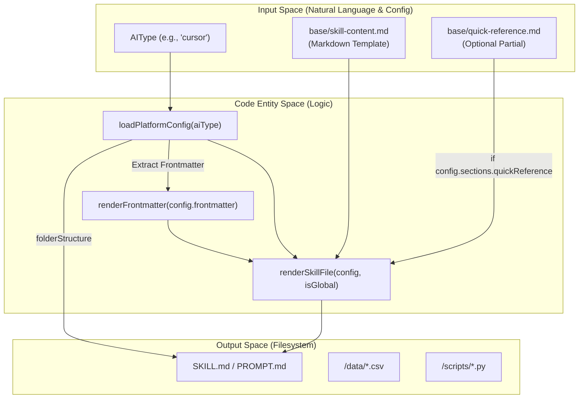
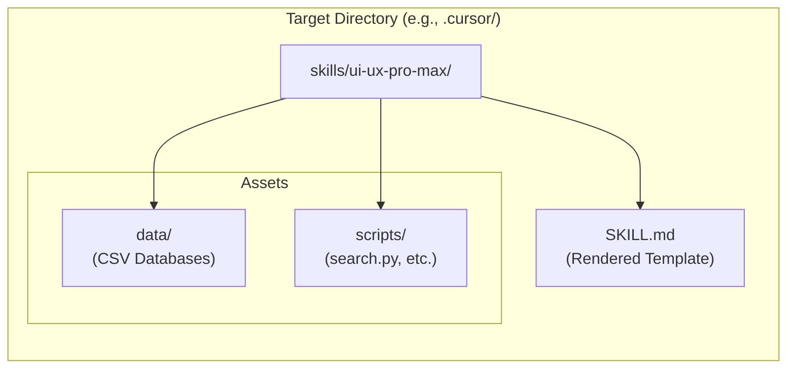

# 템플릿 생성

관련 소스 파일

다음 파일들은 이 위키 페이지를 생성하기 위한 컨텍스트로 사용되었습니다.

- [README.md](README.md)
- [cli/.npmignore](cli/.npmignore)
- [cli/README.md](cli/README.md)
- [cli/assets/templates/base/skill-content.md](cli/assets/templates/base/skill-content.md)
- [cli/assets/templates/platforms/agent.json](cli/assets/templates/platforms/agent.json)
- [cli/assets/templates/platforms/copilot.json](cli/assets/templates/platforms/copilot.json)
- [cli/assets/templates/platforms/cursor.json](cli/assets/templates/platforms/cursor.json)
- [cli/assets/templates/platforms/kiro.json](cli/assets/templates/platforms/kiro.json)
- [cli/assets/templates/platforms/roocode.json](cli/assets/templates/platforms/roocode.json)
- [cli/assets/templates/platforms/windsurf.json](cli/assets/templates/platforms/windsurf.json)
- [cli/package.json](cli/package.json)
- [cli/src/index.ts](cli/src/index.ts)
- [cli/src/types/index.ts](cli/src/types/index.ts)
- [cli/src/utils/detect.ts](cli/src/utils/detect.ts)
- [cli/src/utils/extract.ts](cli/src/utils/extract.ts)
- [cli/src/utils/github.ts](cli/src/utils/github.ts)
- [cli/src/utils/template.ts](cli/src/utils/template.ts)

Template Generation 시스템은 v2.0 아키텍처의 핵심으로, 선언형 JSON 구성을 사용하여 단일 Source of Truth에서 플랫폼별 설치 파일을 생성하는 역할을 합니다. 이 시스템은 기본 템플릿을 특정 폴더 구조, 파일 이름 규칙, 메타데이터 요구 사항에 매핑함으로써 UI/UX Pro Max skill이 Claude, Cursor, Windsurf, Trae 등 18개 이상의 AI 플랫폼을 지원할 수 있게 합니다.

---

## 플랫폼 구성 스키마

각 AI 플랫폼은 `cli/assets/templates/platforms/`에 위치한 JSON 구성 파일로 정의됩니다. 이 파일들은 최종 skill 파일을 생성하기 위해 `template.ts` 유틸리티가 사용하는 구조와 콘텐츠 매개변수를 정의합니다.

### 구성 구조

`PlatformConfig` 인터페이스는 다음 필드를 정의합니다.

| 필드 | 타입 | 목적 | 예시 값 |
|-------|------|---------|----------------|
| `platform` | `string` | 내부 플랫폼 식별자 | `"cursor"`, `"trae"`, `"warp"` |
| `displayName` | `string` | CLI 프롬프트에 표시되는 UI 이름 | `"Cursor"`, `"GitHub Copilot"` |
| `installType` | `string` | 전달 모드(`full` 또는 `reference`) | `"full"` |
| `folderStructure.root` | `string` | 최상위 숨김 디렉터리 | `".cursor"`, `".github"`, `".trae"` |
| `folderStructure.skillPath` | `string` | skill의 하위 디렉터리 경로 | `"skills/ui-ux-pro-max"` |
| `folderStructure.filename` | `string` | 대상 파일명 | `"SKILL.md"`, `"PROMPT.md"` |
| `scriptPath` | `string` | Python 검색 엔진 경로 | `"skills/ui-ux-pro-max/scripts/search.py"` |
| `frontmatter` | `Record \| null` | markdown 파일의 YAML 메타데이터 | `{"name": "ui-ux-pro-max"}` |
| `sections.quickReference` | `boolean` | quick-ref 템플릿 토글 | `true`, `false` |
| `skillOrWorkflow` | `string` | 지침 분류 | `"Skill"`, `"Workflow"` |

**Sources:** [cli/src/types/index.ts:25-42](), [cli/src/utils/template.ts:10-27](), [cli/assets/templates/platforms/cursor.json:1-21]()

---

## 템플릿 렌더링 파이프라인

렌더링 파이프라인은 추상적인 플랫폼 정의를 구체적인 파일시스템 엔티티로 변환합니다. 이 파이프라인은 기본 템플릿(`base/skill-content.md`)을 사용하고 플랫폼별 값을 주입합니다.

**다이어그램: 템플릿 생성 흐름**

**Sources:** [cli/src/utils/template.ts:63-72](), [cli/src/utils/template.ts:123-157](), [cli/src/utils/template.ts:187-218]()

### 주요 구현 함수

- **`loadPlatformConfig(aiType)`**: CLI `AIType`을 JSON 파일(예: `claude` -> `claude.json`)에 매핑하고 구성을 파싱합니다. [cli/src/utils/template.ts:63-72]()
- **`renderSkillFile(config, isGlobal)`**: `{{TITLE}}`, `{{DESCRIPTION}}`, `{{SCRIPT_PATH}}` 같은 placeholder에 대한 문자열 치환을 수행합니다. `isGlobal`이 true이면 상대 경로를 홈 디렉터리 접두사(`~/`)를 사용하는 경로로 다시 작성합니다. [cli/src/utils/template.ts:123-157]()
- **`generatePlatformFiles(targetDir, aiType, isGlobal)`**: 디렉터리 구조를 만들고, 렌더링된 markdown을 쓰며, `copyDataAndScripts`를 호출하는 주요 진입점입니다. [cli/src/utils/template.ts:187-218]()

---

## 데이터 및 스크립트 주입

레거시 ZIP 기반 시스템과 달리 v2.0 템플릿 시스템은 **자체 포함** 설치를 생성합니다. 각 플랫폼 디렉터리는 핵심 디자인 데이터베이스와 검색 로직의 자체 복사본을 받습니다.

**다이어그램: 자체 포함 Skill 구조**

**Sources:** [cli/src/utils/template.ts:162-180](), [cli/src/utils/template.ts:215-215]()

`copyDataAndScripts` 함수는 이 주입을 담당하며, `search.py`와 관련 `.csv` 파일들이 특정 플랫폼의 skill 경로 안에 존재하도록 보장합니다. [cli/src/utils/template.ts:162-180]()

---

## 전역 설치와 로컬 설치

템플릿 시스템은 두 가지 구별되는 설치 범위를 처리합니다.

1.  **Local(기본값)**: 파일이 현재 작업 디렉터리 안에 생성됩니다(예: `./.cursor/skills/...`).
2.  **Global(`--global`)**: 파일이 사용자의 홈 디렉터리(`~/`)에 생성됩니다. `renderSkillFile` 함수는 이를 감지하고 Python 실행 명령을 절대 경로를 사용하도록 다시 작성합니다.
    - *Local*: `python3 skills/ui-ux-pro-max/scripts/search.py`
    - *Global*: `python3 ~/.cursor/skills/ui-ux-pro-max/scripts/search.py`

**Sources:** [cli/src/utils/template.ts:148-154](), [cli/src/utils/template.ts:195-203]()

---

## 플랫폼 지원 표(v2.5.0)

시스템은 현재 18개 AI 어시스턴트 유형을 지원합니다. 다음 표는 템플릿 시스템이 이 유형들을 특정 디렉터리 구조에 매핑하는 방식을 보여줍니다.

| AIType | Root Folder | Skill/Prompt Filename | Interaction Mode |
| :--- | :--- | :--- | :--- |
| `claude` | `.claude` | `SKILL.md` | Skill |
| `cursor` | `.cursor` | `SKILL.md` | Skill |
| `copilot` | `.github` | `PROMPT.md` | Workflow |
| `windsurf` | `.windsurf` | `SKILL.md` | Skill |
| `kiro` | `.kiro` | `SKILL.md` | Workflow |
| `roocode` | `.roo` | `SKILL.md` | Workflow |
| `trae` | `.trae` | `SKILL.md` | Skill |
| `warp` | `.warp` | `SKILL.md` | Skill |

**Sources:** [cli/src/types/index.ts:49-68](), [cli/assets/templates/platforms/cursor.json:5-20](), [cli/assets/templates/platforms/copilot.json:5-20](), [cli/assets/templates/platforms/kiro.json:5-20]()

---

## 데이터 흐름 요약

CLI 설치 흐름은 `init` 명령의 최종 단계로 템플릿 생성을 통합합니다.

1.  **Detection**: `detectAIType()`이 플랫폼을 식별합니다. [cli/src/utils/detect.ts:10-77]()
2.  **Configuration**: `loadPlatformConfig()`가 JSON 정의를 가져옵니다. [cli/src/utils/template.ts:63-72]()
3.  **Rendering**: `renderSkillFile()`이 기본 템플릿과 config 값을 병합합니다. [cli/src/utils/template.ts:123-157]()
4.  **Materialization**: `generatePlatformFiles()`가 파일을 쓰고 의존성을 복사합니다. [cli/src/utils/template.ts:187-218]()

**Sources:** [cli/src/index.ts:26-44](), [cli/src/utils/template.ts:1-218]()
