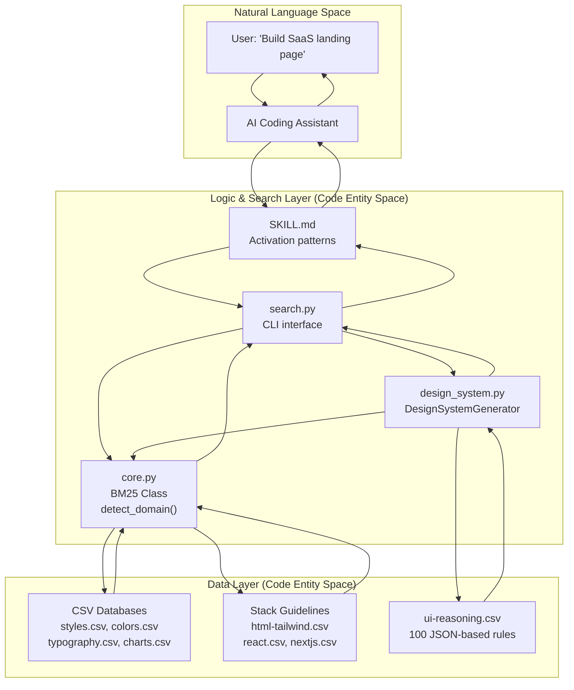
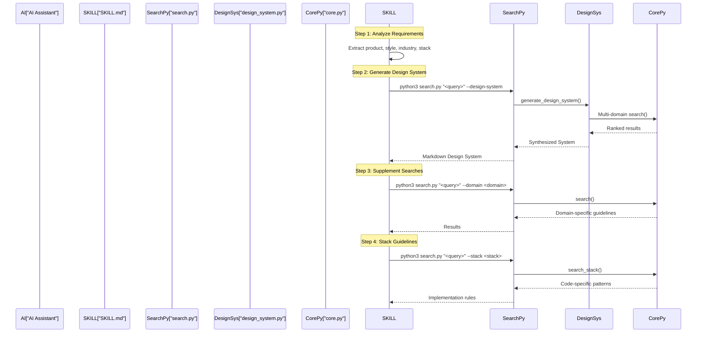

# UI/UX Pro Max Skill

<details>
<summary>관련 소스 파일</summary>

다음 파일들은 이 위키 페이지를 생성하기 위한 컨텍스트로 사용되었습니다.

- [.claude/skills/ui-ux-pro-max/SKILL.md](.claude/skills/ui-ux-pro-max/SKILL.md)
- [.claude/skills/ui-ux-pro-max/data/react-performance.csv](.claude/skills/ui-ux-pro-max/data/react-performance.csv)
- [CLAUDE.md](CLAUDE.md)
- [src/ui-ux-pro-max/data/google-fonts.csv](src/ui-ux-pro-max/data/google-fonts.csv)

</details>


## 목적과 개요

UI/UX Pro Max Skill은 UI 스타일, 색상 팔레트, 타이포그래피, UX 가이드라인, 기술별 best practice에 걸친 344개 이상의 디자인 리소스로 구성된 검색 가능한 데이터베이스를 통해 AI 코딩 어시스턴트에 디자인 인텔리전스를 제공합니다. 이 skill은 사용자가 UI/UX 작업을 요청하면 자동으로 또는 명령을 통해 활성화되며, 일관되고 전문적인 디자인을 생성하기 위한 체계적인 4단계 워크플로로 AI를 안내합니다.

**핵심 기능:**

| 리소스 유형 | 개수 | 예시 |
|---------------|-------|----------|
| UI Styles | 67 | Glassmorphism, Minimalism, Brutalism, AI-Native UI |
| Color Palettes | 161 | SaaS, E-commerce, Healthcare, Fintech를 위한 산업별 팔레트 |
| Font Pairings | 57 | 분위기/스타일 키워드가 포함된 Google Fonts 조합 |
| Chart Types | 25 | 라이브러리 추천이 포함된 trend, comparison, funnel, heatmap |
| Tech Stacks | 16 | React, Next.js, Vue, Svelte, SwiftUI, Flutter, Tailwind, shadcn/ui |
| UX Guidelines | 99 | 접근성, 성능, 반응형 디자인 best practices |
| Reasoning Rules | 100 | 산업별 디자인 시스템 생성 규칙 |

이 skill은 Claude Code, Cursor, Windsurf, Trae 등을 포함한 18개 이상의 AI 플랫폼에서 작동합니다. 자세한 워크플로 단계는 [Skill Workflow](#3.1)를 참조하세요. 검색 도메인과 기술 스택은 [Search Domains and Stacks](#3.2)를 참조하세요. 품질 검증은 [Pre-Delivery Checklist](#3.3)를 참조하세요.

**Sources:** [CLAUDE.md:5-28](), [.claude/skills/ui-ux-pro-max/SKILL.md:1-8](), [README.md:144-152](), [README.md:122-142]()

## Skill 아키텍처

skill 시스템은 검색 및 추론 엔진을 통해 자연어 요청을 구조화된 코드 엔티티에 연결합니다.

### 시스템 흐름 다이어그램



**구성 요소 책임:**

| 구성 요소 | 파일 | 주요 함수/클래스 | 목적 |
|-----------|------|----------------------|---------|
| **Skill Definition** | `SKILL.md` | Frontmatter metadata | 활성화를 정의하고 디자인 프로세스를 통해 AI를 안내합니다 [SKILL.md:1-4]() |
| **CLI Interface** | `scripts/search.py` | `main()` | 도메인/스택 검색과 디자인 시스템 생성의 진입점 [scripts/search.py:1-100]() |
| **Search Engine** | `scripts/core.py` | `BM25` class, `search()` | 확률적 랭킹(k1=1.5, b=0.75)을 구현합니다 [scripts/core.py:96-156]() |
| **Design Gen** | `scripts/design_system.py` | `generate_design_system()` | 다중 도메인 데이터를 일관된 spec으로 합성합니다 [scripts/design_system.py:1-200]() |
| **Data Repos** | `data/*.csv` | `CSV_CONFIG`, `STACK_CONFIG` | 10개 도메인과 16개 스택에 대한 매핑 데이터 [scripts/core.py:17-84]() |

**Sources:** [CLAUDE.md:30-58](), [.claude/skills/ui-ux-pro-max/SKILL.md:1-8](), [src/ui-ux-pro-max/scripts/core.py:17-156]()

## Skill 활성화 방식

skill은 18개 지원 AI 플랫폼 전반에서 두 가지 활성화 패러다임을 지원합니다.

**Skill Mode** - AI가 UI/UX 키워드를 감지하면 자동 활성화:
- 플랫폼: Claude Code, Cursor, Windsurf, Augment, Trae, OpenCode, Continue 등.
- 완전한 knowledge base를 포함한 전체 콘텐츠 설치.
- 감지: "Build landing page", "Design dashboard", "Create UI component".

**Workflow Mode** - 명시적인 slash command 또는 수동 호출 필요:
- 플랫폼: Kiro, GitHub Copilot, Roo Code.
- 더 가벼운 컨텍스트 창 사용을 위한 참조 콘텐츠 설치.

활성화 메커니즘은 `SKILL.md` frontmatter metadata에 정의되어 있습니다.

```markdown
---
name: ui-ux-pro-max
description: "UI/UX design intelligence... Actions: plan, build, create, design... Styles: glassmorphism, minimalism..."
---
```

**활성화 트리거:**

| 트리거 유형 | 예시 | 결과 |
|--------------|----------|--------|
| **Action Verbs** | plan, build, create, design, implement, review, fix, improve | Skill이 활성화되고 워크플로를 시작합니다 |
| **Project Types** | website, landing page, dashboard, admin panel, SaaS, mobile app | 제품 유형 감지에 정보를 제공합니다 |
| **UI Elements** | button, modal, navbar, sidebar, card, table, form, chart | 컴포넌트 수준 검색을 안내합니다 |

자세한 플랫폼별 통합 메커니즘은 page 7을 참조하세요.

**Sources:** [.claude/skills/ui-ux-pro-max/SKILL.md:1-4](), [README.md:312-333]()

## Skill 워크플로 개요

활성화되면 skill은 AI 어시스턴트를 체계적인 4단계 프로세스로 안내합니다.

### 워크플로 실행 흐름



| 단계 | 목적 | 검색 명령 |
|------|---------|----------------|
| **1. Analyze** | 제품 유형, 스타일, 산업, 스택 추출 | N/A |
| **2. Generate** | 포괄적인 디자인 시스템 spec 생성 | `--design-system -p "Project"` |
| **3. Supplement** | 추가 도메인별 세부 정보 획득(예: charts, ux) | `--domain <domain>` |
| **4. Stack** | 기술 스택에 대한 구현 best practices 획득 | `--stack <stack>` |

자세한 워크플로 지침은 [Skill Workflow](#3.1)를 참조하세요. 검색 도메인과 스택 옵션은 [Search Domains and Stacks](#3.2)를 참조하세요.

**Sources:** [.claude/skills/ui-ux-pro-max/SKILL.md:122-228](), [README.md:88-119]()

## 검색 엔진 및 BM25 구현

skill은 `core.py`에 구현된 BM25 확률적 랭킹 알고리즘을 사용하여 문서 관련성을 점수화합니다.

**BM25 매개변수:**

| 매개변수 | 값 | 목적 |
|-----------|-------|---------|
| `k1` | 1.5 | 용어 빈도 포화 매개변수 [scripts/core.py:102]() |
| `b` | 0.75 | 문서 길이 정규화 계수 [scripts/core.py:103]() |

**주요 검색 로직:**

1.  **Tokenization**: `BM25.tokenize()`는 길이가 2보다 큰 단어를 필터링하고 구두점을 제거합니다 [scripts/core.py:109-112]().
2.  **Domain Detection**: `detect_domain()`은 키워드 점수를 사용하여 쿼리를 올바른 CSV 파일로 라우팅합니다 [scripts/core.py:190-209]().
3.  **Scoring**: `BM25.score()`는 corpus 전반에서 TF-IDF 점수를 계산합니다 [scripts/core.py:133-155]().

**Sources:** [src/ui-ux-pro-max/scripts/core.py:96-254](), [CLAUDE.md:60]()

## 제공 전 체크리스트

구현 후 skill은 UI가 전문적인 기준을 충족하는지 확인하기 위해 품질 보증 체크리스트를 적용합니다. 여기에는 다음이 포함됩니다.

- **Accessibility**: 대비율(4.5:1), ARIA labels, 키보드 탐색 [SKILL.md:54]().
- **Performance**: WebP/AVIF 사용, lazy loading, CLS 최적화 [SKILL.md:56]().
- **Interaction**: 터치 대상 크기(44px), 로딩 피드백, hover states [SKILL.md:55]().
- **Visuals**: emoji icons 회피, 일관된 간격, light/dark mode 지원 [SKILL.md:57]().

전체 품질 검증 프로세스는 [Pre-Delivery Checklist](#3.3)를 참조하세요.

**Sources:** [.claude/skills/ui-ux-pro-max/SKILL.md:52-63](), [.claude/skills/ui-ux-pro-max/SKILL.md:243-279]()
