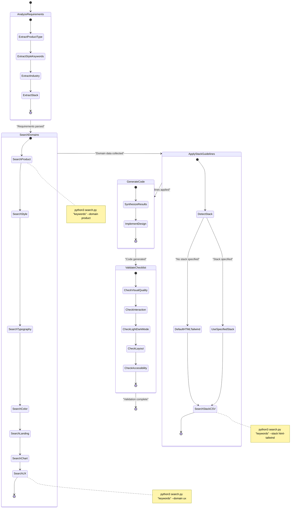
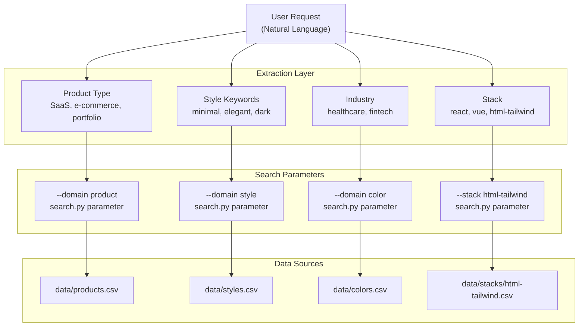
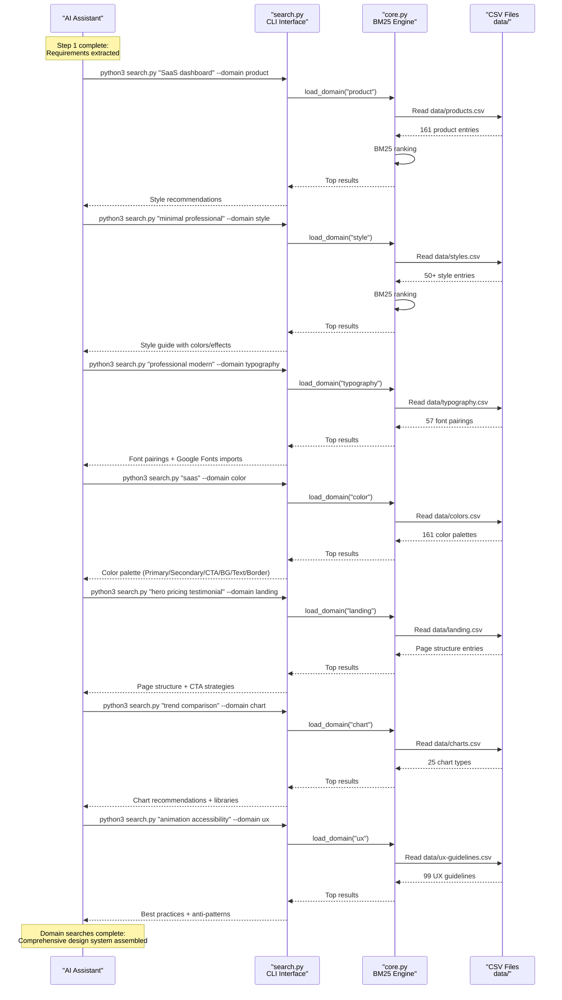
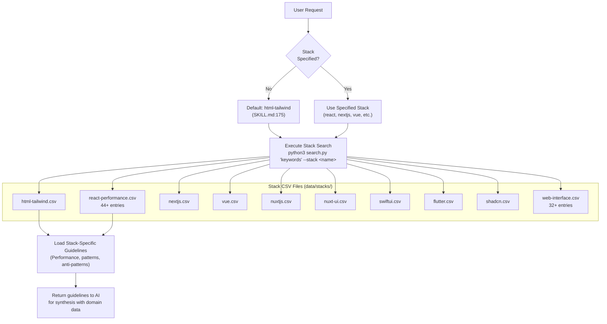
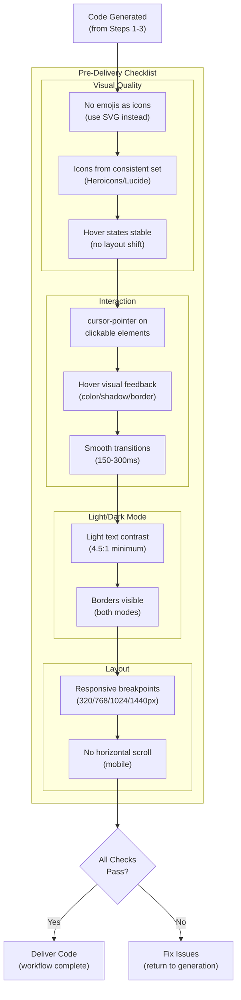

# Skill 워크플로

<details>
<summary>관련 소스 파일</summary>

다음 파일들은 이 위키 페이지를 생성하기 위한 컨텍스트로 사용되었습니다.

- [.claude/skills/ui-ux-pro-max/SKILL.md](.claude/skills/ui-ux-pro-max/SKILL.md)
- [.claude/skills/ui-ux-pro-max/data/react-performance.csv](.claude/skills/ui-ux-pro-max/data/react-performance.csv)
- [CLAUDE.md](CLAUDE.md)
- [src/ui-ux-pro-max/data/google-fonts.csv](src/ui-ux-pro-max/data/google-fonts.csv)

</details>


이 문서는 AI 코딩 어시스턴트가 UI/UX 요청을 처리할 때 따르는 `SKILL.md`에 정의된 4단계 워크플로를 설명합니다. 이 워크플로는 디자인 도메인 전반의 검색을 오케스트레이션하고, 스택별 가이드라인을 적용하며, 전달 전에 출력 품질을 검증합니다.

## 개요

skill 워크플로는 AI 어시스턴트가 UI/UX 코드를 생성하기 전에 포괄적인 디자인 인텔리전스를 수집하도록 보장하는 구조화된 프로세스입니다. 워크플로는 네 가지 필수 단계로 구성됩니다.

1.  **Analyze Requirements** - 제품 유형, 스타일 키워드, 산업, 기술 스택을 추출합니다.
2.  **Search Domains** - `search.py`를 사용해 여러 디자인 도메인을 쿼리합니다.
3.  **Apply Stack Guidelines** - 기술별 best practices를 가져옵니다.
4.  **Validate with Pre-Delivery Checklist** - 코드가 5개 카테고리의 품질 기준을 충족하는지 검증합니다.

워크플로는 [.claude/skills/ui-ux-pro-max/SKILL.md:144-242]()에 정의되어 있으며 모든 AI 플랫폼 통합에 동기화됩니다. 각 단계는 다음 단계의 입력을 생성하여, 코드 생성이 시작되기 전에 완전한 디자인 시스템을 구축하는 의존성 체인을 만듭니다.

Sources: [.claude/skills/ui-ux-pro-max/SKILL.md:144-242](), [CLAUDE.md:7-29]()

## 워크플로 실행 흐름

**워크플로 상태 머신**



이 상태 머신은 [.claude/skills/ui-ux-pro-max/SKILL.md:144-316]()에 정의된 실행 흐름을 나타냅니다. 각 상태 전이는 이전 단계의 완료를 요구합니다. 워크플로는 코드 생성 전에 포괄적인 디자인 인텔리전스를 수집하도록 순차 실행을 강제합니다.

Sources: [.claude/skills/ui-ux-pro-max/SKILL.md:144-242]()

## Step 1: Analyze Requirements

**요구 사항 추출 프로세스**

첫 번째 단계는 자연어 이해를 사용하여 사용자 요청에서 핵심 정보를 추출합니다. AI 어시스턴트는 요청을 파싱하여 [.claude/skills/ui-ux-pro-max/SKILL.md:146-152]()에 정의된 네 가지 중요한 속성을 식별합니다.

| 속성 | 목적 | 예시 | 사용 위치 |
|-----------|---------|----------|---------|
| **Product type** | 스타일 추천과 색상 팔레트를 결정 | SaaS, e-commerce, portfolio, dashboard, landing page | `--domain product`, `--domain color` |
| **Style keywords** | UI 스타일과 시각 효과 식별 | minimal, playful, professional, elegant, dark mode | `--domain style` |
| **Industry** | 색상 체계와 UX 패턴에 영향 | healthcare, fintech, gaming, education, beauty | `--domain color`, `--domain ux` |
| **Stack** | 기술별 가이드라인 선택 | React, Vue, Next.js, html-tailwind(기본값) | `--stack <name>` |

**요구 사항에서 검색 매개변수로의 매핑**



추출 로직은 워크플로 지침에 암묵적으로 포함되어 있습니다. 스택이 지정되지 않은 경우 기본값은 [.claude/skills/ui-ux-pro-max/SKILL.md:173-179]()에서 강제되는 `html-tailwind`입니다.

Sources: [.claude/skills/ui-ux-pro-max/SKILL.md:146-152](), [CLAUDE.md:16-28]()

## Step 2: Search Relevant Domains

**도메인 검색 오케스트레이션**

2단계는 `search.py`를 사용해 여러 검색을 수행하여 포괄적인 디자인 인텔리전스를 수집합니다. 워크플로는 [.claude/skills/ui-ux-pro-max/SKILL.md:162-171]()에 권장 검색 순서를 정의합니다.



**도메인에서 CSV 파일로의 매핑**

도메인 플래그는 `search.py` 로직을 통해 특정 CSV 파일에 매핑됩니다.

| Domain Flag | CSV File | 데이터 유형 | 항목 수 |
|-------------|----------|-----------|-------------|
| `product` | `data/products.csv` | 제품 유형 추천 | 161 |
| `style` | `data/styles.csv` | 색상/효과가 포함된 UI 스타일 | 50+ |
| `typography` | `data/typography.csv` | Google Fonts가 포함된 폰트 조합 | 57 |
| `color` | `data/colors.csv` | 제품/산업별 색상 팔레트 | 161 |
| `landing` | `data/landing.csv` | 페이지 구조와 CTA 전략 | ~30 |
| `chart` | `data/charts.csv` | 차트 유형과 라이브러리 추천 | 25 |
| `ux` | `data/ux-guidelines.csv` | Best practices와 anti-patterns | 99 |

워크플로는 [.claude/skills/ui-ux-pro-max/SKILL.md:156]()에 명시된 대로 서로 다른 키워드로 여러 번 검색할 것을 권장합니다. "Search until you have enough context."

Sources: [.claude/skills/ui-ux-pro-max/SKILL.md:154-171](), [CLAUDE.md:15-23]()

## Step 3: Apply Stack Guidelines

**스택 감지 및 선택**

3단계는 `--stack` 플래그를 사용해 기술별 best practices를 가져옵니다. 워크플로는 [.claude/skills/ui-ux-pro-max/SKILL.md:173-181]()에서 기본 스택을 강제합니다.



**사용 가능한 기술 스택**

스택 옵션은 [.claude/skills/ui-ux-pro-max/SKILL.md:204-215]()에 문서화되어 있습니다.

| Stack Name | CSV File | 중점 영역 |
|------------|----------|-------------|
| `html-tailwind` | `data/stacks/html-tailwind.csv` | Tailwind utilities, 반응형 디자인, 접근성(기본값) |
| `react` | `data/stacks/react-performance.csv` | State, hooks, performance patterns |
| `nextjs` | `data/stacks/nextjs.csv` | SSR, routing, images, API routes |
| `vue` | `data/stacks/vue.csv` | Composition API, Pinia, Vue Router |
| `swiftui` | `data/stacks/swiftui.csv` | Views, State, Navigation, Animation |
| `react-native` | `data/stacks/react-native.csv` | Components, Navigation, Lists |
| `flutter` | `data/stacks/flutter.csv` | Widgets, State, Layout, Theming |
| `shadcn` | `data/stacks/shadcn.csv` | shadcn/ui components, theming, forms |

**React Performance Guidelines 예시**

`react-performance.csv` 파일([.claude/skills/ui-ux-pro-max/data/react-performance.csv:1-46]())은 카테고리 전반의 44개 이상의 성능 이슈를 포함합니다.

- **Async Waterfall**: 순차 awaits, `Promise.all` 병렬화.
- **Bundle Size**: Barrel imports, dynamic imports, conditional loading.
- **Server**: `React.cache` dedup, LRU caching, RSC boundaries.
- **Rerender**: State dependencies, memo patterns, transitions.

**Web Interface Guidelines 예시**

`web-interface.csv` 파일([.claude/skills/ui-ux-pro-max/data/web-interface.csv:1-32]())은 32개 이상의 크로스 플랫폼 웹 가이드라인을 포함합니다.

- **Accessibility**: Icon button labels, form control labels, keyboard handlers.
- **Forms**: Autocomplete attributes, semantic input types, paste blocking.
- **Performance**: List virtualization, layout reads, DOM batching.

Sources: [.claude/skills/ui-ux-pro-max/SKILL.md:173-215](), [.claude/skills/ui-ux-pro-max/data/react-performance.csv:1-46](), [.claude/skills/ui-ux-pro-max/data/web-interface.csv:1-32]()

## Step 4: Validate with Pre-Delivery Checklist

**품질 검증 프로세스**

마지막 단계는 [.claude/skills/ui-ux-pro-max/SKILL.md:303-337]()에 정의된 포괄적인 체크리스트에 대해 생성된 코드를 검증합니다.



**전문적인 UI를 위한 공통 규칙**

워크플로는 [.claude/skills/ui-ux-pro-max/SKILL.md:264-301]()에 자주 놓치는 이슈에 대한 공통 규칙을 정의합니다.

| 카테고리 | 규칙 | Do | Don't |
|----------|------|----|----- |
| **Icons** | emoji icons 금지 | SVG icons(Heroicons, Lucide) 사용 | UI icons로 emojis 🎨 🚀 ⚙️ 사용 |
| **Icons** | 안정적인 hover states | color/opacity transitions 사용 | layout을 이동시키는 scale transforms 사용 |
| **Interaction** | Cursor pointer | 클릭 가능한 카드에 `cursor-pointer` 추가 | 기본 cursor 유지 |
| **Light/Dark** | Text contrast | light mode 텍스트에 slate-900 사용 | 본문 텍스트에 slate-400 사용 |
| **Layout** | Floating navbar | `top-4 left-4 right-4` 간격 추가 | navbar를 `top-0`에 붙임 |

Sources: [.claude/skills/ui-ux-pro-max/SKILL.md:264-337]()

## 실전 워크플로 예시

**전체 워크플로 실행**

`SKILL.md`는 [.claude/skills/ui-ux-pro-max/SKILL.md:218-249]()에 구체적인 예시를 포함합니다.

**User Request:** "Làm landing page cho dịch vụ chăm sóc da chuyên nghiệp"

**Step 1: Analyze Requirements**
- **Product type**: Service (beauty/spa/wellness)
- **Style keywords**: elegant, minimal, soft
- **Industry**: Beauty/skincare
- **Stack**: 지정되지 않음 → `html-tailwind`로 기본 설정

**Step 2: Search Relevant Domains**

```bash
# 1. Product type recommendations
python3 src/ui-ux-pro-max/scripts/search.py "beauty spa wellness service" --domain product

# 2. Style guide based on industry
python3 src/ui-ux-pro-max/scripts/search.py "elegant minimal soft" --domain style

# 3. Font pairings for luxury aesthetic
python3 src/ui-ux-pro-max/scripts/search.py "elegant luxury" --domain typography

# 4. Color palette for beauty industry
python3 src/ui-ux-pro-max/scripts/search.py "beauty spa wellness" --domain color
```

**Step 3: Stack Guidelines (Default)**

```bash
# 5. HTML/Tailwind best practices
python3 src/ui-ux-pro-max/scripts/search.py "layout responsive" --stack html-tailwind
```

**Step 4: Synthesize and Validate**
- 모든 검색 결과를 결합하여 일관된 디자인 시스템을 만듭니다.
- 선택한 스타일, 색상, 타이포그래피로 landing page를 구현합니다.
- pre-delivery checklist(21개 검사)에 대해 검증합니다.

Sources: [.claude/skills/ui-ux-pro-max/SKILL.md:218-249](), [CLAUDE.md:11-28]()

## 워크플로 규칙 우선순위

**우선순위 기반 규칙 적용**

워크플로는 [.claude/skills/ui-ux-pro-max/SKILL.md:52-63]()에 AI 어시스턴트가 디자인 결정을 분류하는 데 도움이 되는 우선순위 시스템을 포함합니다.

| 우선순위 | 카테고리 | 영향 수준 | 도메인 | 주요 검사 |
|----------|----------|--------------|--------|------------|
| 1 | Accessibility | CRITICAL | `ux` | 대비 4.5:1, Keyboard nav |
| 2 | Touch & Interaction | CRITICAL | `ux` | 최소 크기 44×44px, Loading feedback |
| 3 | Performance | HIGH | `ux` | WebP/AVIF, Lazy loading |
| 4 | Style Selection | HIGH | `style` | 제품 유형 일치, SVG icons |
| 5 | Layout & Responsive | HIGH | `ux` | Mobile-first, 가로 스크롤 없음 |
| 6 | Typography & Color | MEDIUM | `typography` | 기본 16px, Semantic tokens |

이 우선순위 시스템은 낮은 우선순위의 스타일링 관심사보다 중요한 접근성 및 상호작용 이슈가 먼저 처리되도록 보장합니다.

Sources: [.claude/skills/ui-ux-pro-max/SKILL.md:52-63]()
