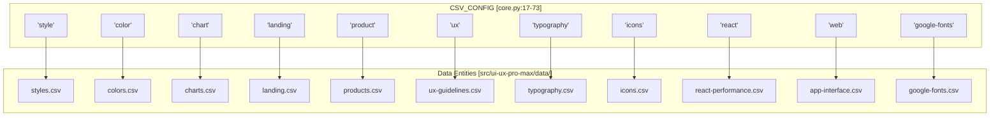
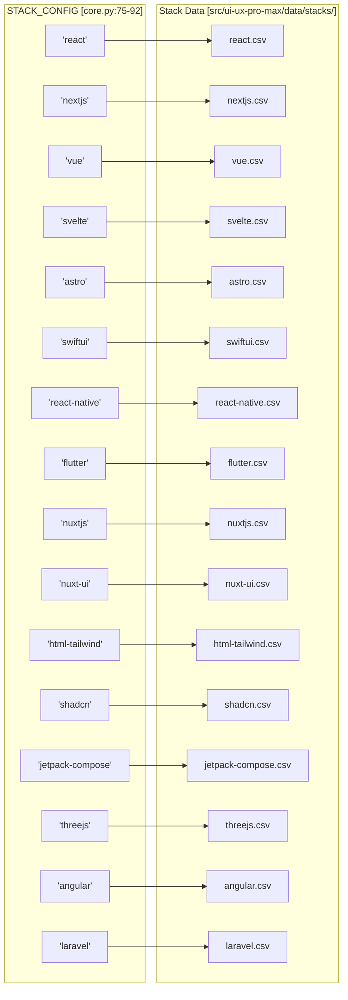

# 검색 도메인과 스택

관련 소스 파일

다음 파일들은 이 위키 페이지를 생성하기 위한 컨텍스트로 사용되었습니다.

- [.claude/skills/ui-ux-pro-max/scripts/core.py](.claude/skills/ui-ux-pro-max/scripts/core.py)
- [.claude/skills/ui-ux-pro-max/scripts/search.py](.claude/skills/ui-ux-pro-max/scripts/search.py)
- [cli/assets/data/stacks/threejs.csv](cli/assets/data/stacks/threejs.csv)
- [cli/assets/scripts/search.py](cli/assets/scripts/search.py)
- [src/ui-ux-pro-max/data/stacks/angular.csv](src/ui-ux-pro-max/data/stacks/angular.csv)
- [src/ui-ux-pro-max/data/stacks/astro.csv](src/ui-ux-pro-max/data/stacks/astro.csv)
- [src/ui-ux-pro-max/data/stacks/flutter.csv](src/ui-ux-pro-max/data/stacks/flutter.csv)
- [src/ui-ux-pro-max/data/stacks/html-tailwind.csv](src/ui-ux-pro-max/data/stacks/html-tailwind.csv)
- [src/ui-ux-pro-max/data/stacks/jetpack-compose.csv](src/ui-ux-pro-max/data/stacks/jetpack-compose.csv)
- [src/ui-ux-pro-max/data/stacks/laravel.csv](src/ui-ux-pro-max/data/stacks/laravel.csv)
- [src/ui-ux-pro-max/data/stacks/nextjs.csv](src/ui-ux-pro-max/data/stacks/nextjs.csv)
- [src/ui-ux-pro-max/data/stacks/nuxt-ui.csv](src/ui-ux-pro-max/data/stacks/nuxt-ui.csv)
- [src/ui-ux-pro-max/data/stacks/nuxtjs.csv](src/ui-ux-pro-max/data/stacks/nuxtjs.csv)
- [src/ui-ux-pro-max/data/stacks/react.csv](src/ui-ux-pro-max/data/stacks/react.csv)
- [src/ui-ux-pro-max/data/stacks/shadcn.csv](src/ui-ux-pro-max/data/stacks/shadcn.csv)
- [src/ui-ux-pro-max/data/stacks/svelte.csv](src/ui-ux-pro-max/data/stacks/svelte.csv)
- [src/ui-ux-pro-max/data/stacks/swiftui.csv](src/ui-ux-pro-max/data/stacks/swiftui.csv)
- [src/ui-ux-pro-max/data/stacks/threejs.csv](src/ui-ux-pro-max/data/stacks/threejs.csv)
- [src/ui-ux-pro-max/data/stacks/vue.csv](src/ui-ux-pro-max/data/stacks/vue.csv)
- [src/ui-ux-pro-max/scripts/core.py](src/ui-ux-pro-max/scripts/core.py)
- [src/ui-ux-pro-max/scripts/search.py](src/ui-ux-pro-max/scripts/search.py)

이 문서는 v2.5.0 기준 UI/UX Pro Max 검색 엔진이 지원하는 10개 검색 도메인과 16개 기술 스택을 정리합니다. 각 도메인은 CSV 데이터베이스에 저장된 전문 디자인 지식에 접근할 수 있게 하며, 스택은 다양한 프레임워크와 플랫폼을 위한 구현별 가이드라인을 제공합니다.

**Sources:** [src/ui-ux-pro-max/scripts/core.py:17-73](), [src/ui-ux-pro-max/scripts/core.py:75-92]()

---

## 검색 도메인

검색 도메인은 knowledge base를 전문 카테고리로 분할하며, 각 카테고리는 전용 CSV 파일을 기반으로 합니다. `core.py`의 `CSV_CONFIG` dictionary는 도메인 식별자를 파일 경로, 검색 열(BM25 인덱싱에 사용), 출력 열(결과로 반환)에 매핑합니다.

**Sources:** [src/ui-ux-pro-max/scripts/core.py:17-73]()

### 도메인 구성 아키텍처

다음 다이어그램은 `CSV_CONFIG` dictionary가 도메인 식별자와 그 기반 데이터 엔티티 간의 관계를 어떻게 구조화하는지 보여줍니다.

**검색 도메인 매핑**

**Sources:** [src/ui-ux-pro-max/scripts/core.py:17-73]()

---

## 도메인 카탈로그

| 도메인 | 파일 | 검색 열(`search_cols`) | 목적 |
| :--- | :--- | :--- | :--- |
| `style` | `styles.csv` | Style Category, Keywords, Best For, Type, AI Prompt Keywords | 시각적 UI 스타일(glassmorphism 등) |
| `color` | `colors.csv` | Product Type, Notes | 제품별 hex 색상 팔레트 |
| `chart` | `charts.csv` | Data Type, Keywords, Best Chart Type, When to Use | 데이터 시각화 선택 |
| `landing` | `landing.csv` | Pattern Name, Keywords, Conversion Optimization, Section Order | landing page 구조 패턴 |
| `product` | `products.csv` | Product Type, Keywords, Primary Style Recommendation | 산업별 디자인 매핑 |
| `ux` | `ux-guidelines.csv` | Category, Issue, Description, Platform | UX best practices와 anti-patterns |
| `typography` | `typography.csv` | Font Pairing Name, Category, Mood, Heading Font, Body Font | 폰트 조합 추천 |
| `icons` | `icons.csv` | Category, Icon Name, Keywords, Best For | Lucide icon library 매핑 |
| `react` | `react-performance.csv` | Category, Issue, Keywords, Description | React/Next.js별 최적화 |
| `web` | `app-interface.csv` | Category, Issue, Keywords, Description | 일반 웹 인터페이스 접근성 |
| `google-fonts` | `google-fonts.csv` | Family, Category, Stroke, Classifications, Keywords | 상세 폰트 메타데이터 |

**Sources:** [src/ui-ux-pro-max/scripts/core.py:17-73]()

---

## 기술 스택

기술 스택은 16개 프레임워크와 플랫폼에 대한 구현별 가이드라인을 제공합니다. 도메인과 달리 스택은 `core.py`의 `_STACK_COLS`로 정의된 균일한 열 구조를 사용합니다.

**Sources:** [src/ui-ux-pro-max/scripts/core.py:75-98]()

### 스택 구현 매핑

이 다이어그램은 `STACK_CONFIG`에서 사용되는 스택 식별자를 해당 CSV 데이터 소스에 매핑합니다.

**기술 스택 매핑**

**Sources:** [src/ui-ux-pro-max/scripts/core.py:75-92]()

---

## 스택 가이드라인 구조

모든 스택 CSV는 `_STACK_COLS` [src/ui-ux-pro-max/scripts/core.py:95-98]()에 정의된 엄격한 스키마를 따릅니다. 이를 통해 `search_stack` 함수 [src/ui-ux-pro-max/scripts/core.py:234-253]()는 모든 스택 쿼리를 균일하게 처리할 수 있습니다.

### 공통 검색 열
- `Category`: 기능 영역(예: "State", "Routing", "Performance").
- `Guideline`: 핵심 규칙 또는 best practice.
- `Description`: 상세 기술 설명.
- `Do`: 권장 구현.
- `Don't`: 피해야 할 anti-pattern.

### 공통 출력 열
검색 열 외에도 결과에는 다음이 포함됩니다.
- `Code Good`: 올바른 구현을 보여주는 snippet [src/ui-ux-pro-max/data/stacks/shadcn.csv:2]().
- `Code Bad`: 잘못된 구현을 보여주는 snippet [src/ui-ux-pro-max/data/stacks/flutter.csv:4]().
- `Severity`: 영향 수준(Low, Medium, High) [src/ui-ux-pro-max/data/stacks/angular.csv:3]().
- `Docs URL`: 공식 문서 참조 [src/ui-ux-pro-max/data/stacks/laravel.csv:2]().

**Sources:** [src/ui-ux-pro-max/scripts/core.py:95-98](), [src/ui-ux-pro-max/data/stacks/shadcn.csv:1-10](), [src/ui-ux-pro-max/data/stacks/flutter.csv:1-10]()

---

## 검색 구현

`search.py` 스크립트는 이러한 도메인과 스택을 쿼리하기 위한 주요 진입점 역할을 합니다.

### 도메인 검색 흐름
1. 사용자가 CLI를 통해 쿼리를 제공합니다 [src/ui-ux-pro-max/scripts/search.py:58]().
2. `core.py`의 `search()` 함수가 호출됩니다 [src/ui-ux-pro-max/scripts/search.py:109]().
3. 도메인이 지정되지 않으면 `detect_domain()`이 키워드 매칭을 사용해 가장 적합한 도메인을 선택합니다 [src/ui-ux-pro-max/scripts/core.py:214-216]().
4. `BM25` 알고리즘이 `search_cols`를 기준으로 CSV 행의 순위를 매깁니다 [src/ui-ux-pro-max/scripts/core.py:104-162]().

### 스택 검색 흐름
1. 사용자가 쿼리와 명시적인 `--stack` 플래그를 제공합니다 [src/ui-ux-pro-max/scripts/search.py:60]().
2. `search_stack()` 함수가 호출됩니다 [src/ui-ux-pro-max/scripts/search.py:101]().
3. 도메인 감지를 우회하고 `_STACK_COLS`를 사용해 특정 스택 CSV 파일을 쿼리합니다 [src/ui-ux-pro-max/scripts/core.py:234-253]().

**Sources:** [src/ui-ux-pro-max/scripts/search.py:56-115](), [src/ui-ux-pro-max/scripts/core.py:212-253]()
