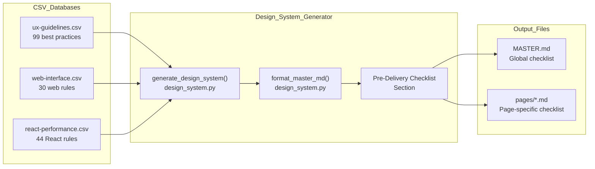
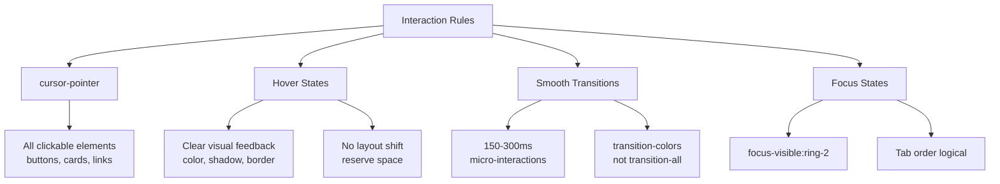
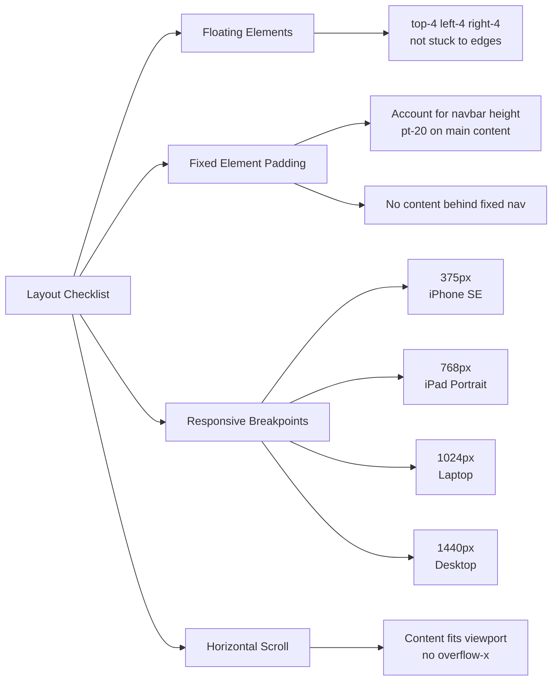
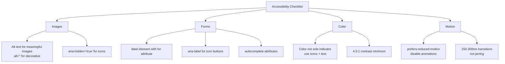
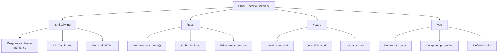
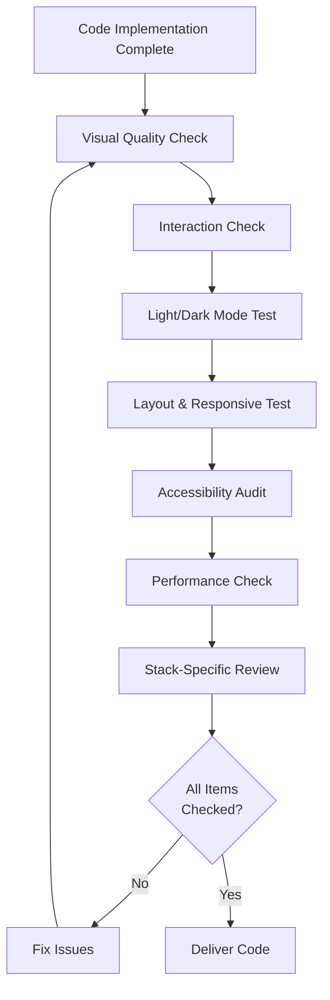

# 제공 전 체크리스트

관련 소스 파일

다음 파일들은 이 위키 페이지를 생성하기 위한 컨텍스트로 사용되었습니다.

- [.claude/skills/ui-ux-pro-max/SKILL.md](.claude/skills/ui-ux-pro-max/SKILL.md)
- [.claude/skills/ui-ux-pro-max/data/react-performance.csv](.claude/skills/ui-ux-pro-max/data/react-performance.csv)
- [src/ui-ux-pro-max/data/google-fonts.csv](src/ui-ux-pro-max/data/google-fonts.csv)

Pre-Delivery Checklist는 UI/UX 산출물이 배포 전에 전문적인 기준을 충족하도록 보장하는 품질 보증 검증 시스템입니다. 이 체크리스트는 디자인 시스템 출력의 일부로 자동 생성되며 접근성, 상호작용 디자인, 시각적 일관성, 반응형 동작을 포함한 핵심 영역을 다룹니다.

이 체크리스트를 생성하는 디자인 시스템 생성에 대한 정보는 [Design System Generator](#6)를 참조하세요. 스택별 구현 가이드라인은 [Stack-Specific Guidelines](#4.3)를 참조하세요.

## 목적과 범위

체크리스트는 세 가지 주요 기능을 수행합니다.

1.  **Automated Quality Gate** - 모든 `--design-system` 출력에 포함되어 개발자에게 흔한 이슈를 상기시킵니다.
2.  **Context-Aware Rules** - 제품 유형과 스타일 선택을 기준으로 체크리스트 항목을 필터링합니다.
3.  **Severity Prioritization** - 영향도(Critical → High → Medium → Low)에 따라 항목을 구성합니다.

체크리스트는 여러 CSV 데이터베이스에서 규칙을 가져와 실행 가능한 검증 단계로 통합합니다. 수동 테스트를 대체하지는 않지만 가장 흔한 UI/UX 결함을 잡기 위한 체계적인 프레임워크를 제공합니다.

Sources: [.claude/skills/ui-ux-pro-max/SKILL.md:10-25](), [.claude/skills/ui-ux-pro-max/SKILL.md:52-63]()

## 통합 아키텍처

체크리스트는 도메인별 규칙과 추론 로직을 결합하는 다단계 파이프라인을 통해 생성됩니다.

**체크리스트 데이터 흐름**

**체크리스트 생성 흐름:**

1.  `generate_design_system()`은 `ux` 도메인을 포함한 다중 도메인 검색을 수행합니다.
2.  `format_master_md()`는 결과를 통합하고 pre-delivery 섹션을 추가합니다.
3.  출력에는 7개 표준 카테고리와 20개 이상의 검증 항목이 포함됩니다.
4.  페이지별 overrides는 컨텍스트에 맞는 체크리스트 항목을 추가할 수 있습니다.

Sources: [.claude/skills/ui-ux-pro-max/SKILL.md:48-63](), [.claude/skills/ui-ux-pro-max/SKILL.md:67-101]()

## 체크리스트 카테고리

체크리스트는 규칙을 우선순위가 지정된 7개 카테고리로 구성합니다. 각 카테고리는 특정 품질 차원을 대상으로 합니다.

**카테고리 계층**

```mermaid
graph TB
    Checklist["Pre-Delivery Checklist"]
    
    Visual["Visual Quality<br/>No emojis, consistent icons"]
    Interaction["Interaction<br/>Cursor states, transitions"]
    LightDark["Light/Dark Mode<br/>Contrast, visibility"]
    Layout["Layout<br/>Spacing, responsive"]
    Accessibility["Accessibility<br/>WCAG AA compliance"]
    Performance["Performance<br/>Optimization checks"]
    Stack["Stack-Specific<br/>Framework rules"]
    
    Checklist --> Visual
    Checklist --> Interaction
    Checklist --> LightDark
    Checklist --> Layout
    Checklist --> Accessibility
    Checklist --> Performance
    Checklist --> Stack
    
    Visual --> Icons["SVG icons from Heroicons/Lucide"]
    Visual --> Logos["Verified brand logos"]
    Visual --> Hover["No layout-shift hover states"]
    
    Interaction --> Pointer["cursor-pointer on clickables"]
    Interaction --> Feedback["Visual hover feedback"]
    Interaction --> Transitions["150-300ms smooth transitions"]
    
    LightDark --> Contrast["4.5:1 minimum contrast"]
    LightDark --> Glass["Visible glass elements"]
    LightDark --> Borders["Visible borders both modes"]
    
    Layout --> Floating["Spacing from edges"]
    Layout --> Fixed["Content padding for fixed nav"]
    Layout --> Responsive["375px, 768px, 1024px, 1440px"]
    
    Accessibility --> Alt["Alt text for images"]
    Accessibility --> Labels["Form labels"]
    Accessibility --> Motion["prefers-reduced-motion"]
```

Sources: [.claude/skills/ui-ux-pro-max/SKILL.md:52-63](), [.claude/skills/ui-ux-pro-max/SKILL.md:67-101]()

## 1. Visual Quality

이 카테고리는 흔한 아마추어식 실수를 방지하여 전문적인 시각적 외관을 보장합니다.

| 규칙 | 심각도 | CSV 소스 | 설명 |
| :--- | :--- | :--- | :--- |
| No emoji icons | Critical | `ux` | Emojis는 플랫폼마다 일관되지 않게 렌더링되며 의미론적 의미가 부족합니다. |
| Consistent icon set | High | `style` | 모든 icons는 단일 라이브러리(Heroicons/Lucide)에서 가져와야 합니다. |
| Verified brand logos | Medium | `style` | Simple Icons library의 공식 SVG를 사용합니다. |
| No layout-shift hover | High | `ux` | Hover states는 콘텐츠 reflow를 유발해서는 안 됩니다. |
| Direct theme colors | Low | `color` | raw hex 대신 semantic tokens를 직접 사용합니다. |

Sources: [.claude/skills/ui-ux-pro-max/SKILL.md:57-59]()

## 2. Interaction

Interaction 규칙은 반응성이 좋고 직관적인 사용자 경험을 보장합니다.

**Interaction Logic Space**

**CSV 규칙에 매핑:**

| 체크리스트 항목 | CSV 파일 | 우선순위 | 심각도 |
| :--- | :--- | :--- | :--- |
| `cursor-pointer` | `ux` | 2 | Critical |
| Hover feedback | `ux` | 2 | Critical |
| Smooth transitions (150-300ms) | `ux` | 7 | Medium |
| Focus states visible | `ux` | 1 | Critical |

체크리스트는 개발자가 키보드 탐색을 위한 가시적인 focus rings를 구현하도록 보장하며, 이는 WCAG 2.4.7 요구 사항입니다.

Sources: [.claude/skills/ui-ux-pro-max/SKILL.md:55-60](), [.claude/skills/ui-ux-pro-max/SKILL.md:70-73]()

## 3. Light/Dark Mode Contrast

Light mode는 dark mode보다 덜 주목받는 경우가 많아 대비가 부족해지기 쉽습니다. 이 카테고리는 두 모드 모두에서 WCAG AA 준수를 강제합니다.

| 규칙 | WCAG 수준 | 최소 비율 | 컨텍스트 |
| :--- | :--- | :--- | :--- |
| Text contrast | AA | 4.5:1 | 일반 텍스트(< 18pt) |
| Large text contrast | AA | 3:1 | 큰 텍스트(≥ 18pt 또는 14pt bold) |
| Glass element visibility | AA | 4.5:1 | 투명 컨테이너 |
| Border visibility | N/A | 지각 가능 | light와 dark mode 모두 |

**흔한 Anti-Patterns:**

| 나쁜 관행 | 좋은 관행 | 근거 |
| :--- | :--- | :--- |
| light mode에서 `bg-white/10` | light mode에서 `bg-white/80` | 너무 투명하여 대비가 부족합니다. |
| 본문 텍스트에 `text-gray-400` | 본문 텍스트에 `text-slate-900` | 4.5:1 대비 요구 사항을 충족하지 못합니다. |
| light에서 `border-white/10` | light에서 `border-gray-200` | 흰색 배경에서 border가 보이지 않습니다. |

대비 요구 사항은 일반 텍스트에 대해 최소 4.5:1 비율을 요구하는 `color-contrast` 가이드라인에 매핑됩니다.

Sources: [.claude/skills/ui-ux-pro-max/SKILL.md:54-59](), [.claude/skills/ui-ux-pro-max/SKILL.md:69-72]()

## 4. Layout and Responsive Design

Layout 검증은 콘텐츠가 viewport 크기 전반에서 올바르게 표시되고 fixed positioning을 고려하도록 보장합니다.

**Layout Verification Flow**

**Breakpoint Standards:**

체크리스트는 표준 기기 너비와 정렬되는 특정 breakpoints를 강제합니다.

| Breakpoint | Width | Device |
| :--- | :--- | :--- |
| Mobile | 375px | iPhone SE |
| Tablet | 768px | iPad Portrait |
| Laptop | 1024px | MacBook |
| Desktop | 1440px | 1440p Display |

Sources: [.claude/skills/ui-ux-pro-max/SKILL.md:58-62](), [.claude/skills/ui-ux-pro-max/SKILL.md:92-99]()

## 5. Accessibility (WCAG AA)

접근성 규칙은 WCAG 2.1 Level AA 표준 준수를 보장합니다. 이는 공개 애플리케이션에서 타협할 수 없는 항목입니다.

**Accessibility Logic Mapping**

**Skill 규칙 매핑:**

| 체크리스트 항목 | Skill Key | 심각도 |
| :--- | :--- | :--- |
| Alt text | `alt-text` | Critical |
| Form labels | `form-labels` | Critical |
| Color not sole indicator | `color-not-only` | Critical |
| prefers-reduced-motion | `reduced-motion` | Critical |

Sources: [.claude/skills/ui-ux-pro-max/SKILL.md:67-82]()

## 6. Performance Considerations

성능은 체감 품질에 영향을 줍니다. 체크리스트에는 영향도가 큰 성능 항목이 포함됩니다.

| 카테고리 | 규칙 | 심각도 |
| :--- | :--- | :--- |
| Async Waterfall | 독립적인 fetch 병렬화 | Critical |
| Bundle Size | 직접 경로 import(barrels 회피) | Critical |
| Rerender | 비용이 큰 components memoize | Medium |
| Server | 중복 제거를 위해 `React.cache()` 사용 | Medium |

**React Performance Checklist (Sample):**

- [ ] 독립적인 async 작업은 `Promise.all()`을 사용합니다.
- [ ] 큰 components는 `next/dynamic`을 통해 lazy-loaded합니다.
- [ ] `useEffect` 배열에는 primitive dependencies를 사용합니다.
- [ ] 무거운 bundles는 hover/focus intent에서 preload합니다.

Sources: [.claude/skills/ui-ux-pro-max/data/react-performance.csv:2-15](), [.claude/skills/ui-ux-pro-max/SKILL.md:56]()

## 7. Stack-Specific Rules

마지막 체크리스트 섹션에는 감지되거나 지정된 스택을 기준으로 한 프레임워크별 검증이 포함됩니다.

**Stack Verification Mapping**

**React별 규칙 예시:**

- [ ] `const [user, posts] = await Promise.all([fetchUser(), fetchPosts()])` 순차 awaits를 피합니다.
- [ ] barrel loading을 피하기 위해 `lucide-react/dist/esm/icons/check`에서 직접 import합니다.
- [ ] 서버 측 요청 중복 제거를 위해 `cache()`를 사용합니다.

Sources: [.claude/skills/ui-ux-pro-max/data/react-performance.csv:3-12]()

## 검증 워크플로

체크리스트는 코드 제공 전 체계적인 검증을 위해 설계되었습니다.

**QA Verification Cycle**

**총 시간:** 복잡한 페이지의 포괄적인 검증에 약 85분.

Sources: [.claude/skills/ui-ux-pro-max/SKILL.md:12-24](), [.claude/skills/ui-ux-pro-max/SKILL.md:32-34]()
