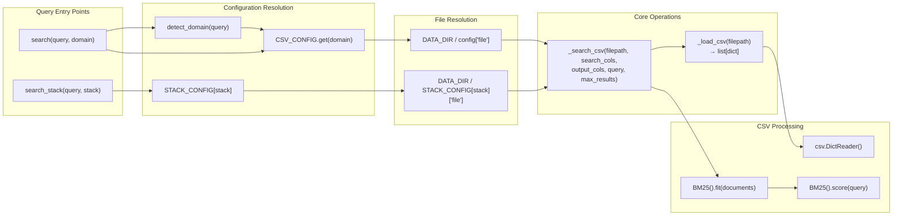

# 디자인 데이터베이스

<details>
<summary>관련 소스 파일</summary>

다음 파일들은 이 위키 페이지를 생성하기 위한 컨텍스트로 사용되었습니다.

- [.claude/skills/ui-ux-pro-max/data/charts.csv](.claude/skills/ui-ux-pro-max/data/charts.csv)
- [.claude/skills/ui-ux-pro-max/data/colors.csv](.claude/skills/ui-ux-pro-max/data/colors.csv)
- [.claude/skills/ui-ux-pro-max/data/landing.csv](.claude/skills/ui-ux-pro-max/data/landing.csv)
- [.claude/skills/ui-ux-pro-max/data/products.csv](.claude/skills/ui-ux-pro-max/data/products.csv)
- [.claude/skills/ui-ux-pro-max/data/stacks/react-native.csv](.claude/skills/ui-ux-pro-max/data/stacks/react-native.csv)
- [.claude/skills/ui-ux-pro-max/data/styles.csv](.claude/skills/ui-ux-pro-max/data/styles.csv)
- [.claude/skills/ui-ux-pro-max/data/typography.csv](.claude/skills/ui-ux-pro-max/data/typography.csv)
- [.claude/skills/ui-ux-pro-max/data/ux-guidelines.csv](.claude/skills/ui-ux-pro-max/data/ux-guidelines.csv)
- [cli/assets/scripts/search.py](cli/assets/scripts/search.py)
- [src/ui-ux-pro-max/data/stacks/flutter.csv](src/ui-ux-pro-max/data/stacks/flutter.csv)
- [src/ui-ux-pro-max/data/stacks/jetpack-compose.csv](src/ui-ux-pro-max/data/stacks/jetpack-compose.csv)
- [src/ui-ux-pro-max/data/stacks/shadcn.csv](src/ui-ux-pro-max/data/stacks/shadcn.csv)
- [src/ui-ux-pro-max/scripts/core.py](src/ui-ux-pro-max/scripts/core.py)
- [src/ui-ux-pro-max/scripts/search.py](src/ui-ux-pro-max/scripts/search.py)

</details>


Design Database는 UI/UX Pro Max 검색 엔진을 구동하는 지식 저장소입니다. 10개 도메인 데이터베이스와 16개 기술 스택 데이터베이스로 구성된 344개 이상의 선별된 디자인 리소스를 담은 CSV 파일 모음으로 이루어져 있습니다. 각 데이터베이스는 BM25 검색 쿼리와 형식화된 출력을 위한 특정 열을 가진 구조화된 데이터를 포함합니다.

이 데이터베이스들이 어떻게 쿼리되는지에 대한 정보는 [Search Engine](#5)을 참조하세요. 도메인을 파일과 열에 매핑하는 구성 dictionary에 대한 자세한 내용은 [CSV Data Structure](#4.1)를 참조하세요. 검색 동작에 영향을 주는 추론 규칙은 [Reasoning Rules](#4.2)를 참조하세요.

## 데이터베이스 아키텍처

데이터베이스 계층은 디자인 지식을 위한 도메인별 데이터베이스와 구현 가이드라인을 위한 스택별 데이터베이스라는 두 개의 병렬 계층으로 구성됩니다. 모든 데이터베이스는 `data/` 디렉터리에 CSV 파일로 저장되며 `core.py`에 정의된 구성 dictionary를 통해 접근됩니다.

**데이터베이스 아키텍처 다이어그램**

```mermaid
graph TB
    subgraph "Configuration Layer"
        CSV_CONFIG["CSV_CONFIG dict<br/>(11 domain mappings)"]
        STACK_CONFIG["STACK_CONFIG dict<br/>(16 stack mappings)"]
        _STACK_COLS["_STACK_COLS dict<br/>(common stack columns)"]
    end
    
    subgraph "Domain Databases (data/)"
        styles["styles.csv<br/>UI styles"]
        colors["colors.csv<br/>Color palettes"]
        products["products.csv<br/>Product types"]
        typography["typography.csv<br/>Font pairings"]
        landing["landing.csv<br/>Landing patterns"]
        charts["charts.csv<br/>Chart types"]
        ux["ux-guidelines.csv<br/>UX guidelines"]
        icons["icons.csv<br/>Lucide icons"]
        react_perf["react-performance.csv<br/>React rules"]
        app_int["app-interface.csv<br/>Web interface rules"]
        gfonts["google-fonts.csv<br/>Google Fonts catalog"]
    end
    
    subgraph "Stack Databases (data/stacks/)"
        html_tw["html-tailwind.csv"]
        react_csv["react.csv"]
        nextjs["nextjs.csv"]
        astro["astro.csv"]
        vue["vue.csv"]
        nuxtjs["nuxtjs.csv"]
        nuxt_ui["nuxt-ui.csv"]
        svelte["svelte.csv"]
        swiftui["swiftui.csv"]
        react_native["react-native.csv"]
        flutter["flutter.csv"]
        shadcn["shadcn.csv"]
        jetpack["jetpack-compose.csv"]
        threejs["threejs.csv"]
        angular["angular.csv"]
        laravel["laravel.csv"]
    end
    
    subgraph "Access Layer"
        search_func["search() function"]
        search_stack_func["search_stack() function"]
        _search_csv["_search_csv() helper"]
        _load_csv["_load_csv() helper"]
    end
    
    CSV_CONFIG --> styles
    CSV_CONFIG --> colors
    CSV_CONFIG --> products
    CSV_CONFIG --> typography
    CSV_CONFIG --> landing
    CSV_CONFIG --> charts
    CSV_CONFIG --> ux
    CSV_CONFIG --> icons
    CSV_CONFIG --> react_perf
    CSV_CONFIG --> app_int
    CSV_CONFIG --> gfonts
    
    STACK_CONFIG --> html_tw
    STACK_CONFIG --> react_csv
    STACK_CONFIG --> nextjs
    STACK_CONFIG --> astro
    STACK_CONFIG --> vue
    STACK_CONFIG --> nuxtjs
    STACK_CONFIG --> nuxt_ui
    STACK_CONFIG --> svelte
    STACK_CONFIG --> swiftui
    STACK_CONFIG --> react_native
    STACK_CONFIG --> flutter
    STACK_CONFIG --> shadcn
    STACK_CONFIG --> jetpack
    STACK_CONFIG --> threejs
    STACK_CONFIG --> angular
    STACK_CONFIG --> laravel
    
    _STACK_COLS --> STACK_CONFIG
    
    search_func --> CSV_CONFIG
    search_stack_func --> STACK_CONFIG
    search_func --> _search_csv
    search_stack_func --> _search_csv
    _search_csv --> _load_csv
```



Sources: [src/ui-ux-pro-max/scripts/core.py:17-92]()

## 도메인 데이터베이스

도메인 데이터베이스는 주제별로 구성된 디자인 지식을 포함합니다. 각 도메인은 검색 작업과 출력 형식화를 위한 특정 열이 있는 전용 CSV 파일을 가집니다. `CSV_CONFIG` dictionary는 도메인 이름을 파일 경로와 열 구성에 매핑합니다.

**도메인 데이터베이스 구성**

| 도메인 | 파일 | 검색 열 | 목적 |
|--------|------|----------------|---------|
| `style` | `styles.csv` | Style Category, Keywords, Best For, Type, AI Prompt Keywords | 색상, 효과, 구현 세부 사항이 포함된 UI 스타일 |
| `color` | `colors.csv` | Product Type, Notes | 제품 카테고리에 매핑된 색상 팔레트 |
| `chart` | `charts.csv` | Data Type, Keywords, Best Chart Type, When to Use, When NOT to Use, Accessibility Notes | 데이터 유형별 차트 유형 추천 |
| `landing` | `landing.csv` | Pattern Name, Keywords, Conversion Optimization, Section Order | CTA 전략이 포함된 landing page 패턴 |
| `product` | `products.csv` | Product Type, Keywords, Primary Style Recommendation, Key Considerations | 스타일 매핑이 포함된 제품 유형 추천 |
| `ux` | `ux-guidelines.csv` | Category, Issue, Description, Platform | UX best practices와 anti-patterns |
| `typography` | `typography.csv` | Font Pairing Name, Category, Mood/Style Keywords, Best For, Heading Font, Body Font | import code가 포함된 Google Fonts 조합 |
| `icons` | `icons.csv` | Category, Icon Name, Keywords, Best For | import code가 포함된 Lucide icon catalog |
| `react` | `react-performance.csv` | Category, Issue, Keywords, Description | React/Next.js 성능 최적화 규칙 |
| `web` | `app-interface.csv` | Category, Issue, Keywords, Description | 웹 인터페이스 접근성 및 표준 |
| `google-fonts` | `google-fonts.csv` | Family, Category, Stroke, Classifications, Keywords, Subsets, Designers | 포괄적인 Google Fonts catalog |

Sources: [src/ui-ux-pro-max/scripts/core.py:17-73]()

### 도메인 데이터베이스 열 구조

각 도메인 데이터베이스는 두 세트의 열을 정의합니다.

1. **search_cols**: BM25 전문 검색을 위해 연결되는 열.
2. **output_cols**: 검색 결과로 반환되는 열.

`styles.csv`의 예:

```python
"style": {
    "file": "styles.csv",
    "search_cols": ["Style Category", "Keywords", "Best For", "Type", "AI Prompt Keywords"],
    "output_cols": ["Style Category", "Type", "Keywords", "Primary Colors", "Effects & Animation", "Best For", "Light Mode ✓", "Dark Mode ✓", "Performance", "Accessibility", "Framework Compatibility", "Complexity", "AI Prompt Keywords", "CSS/Technical Keywords", "Implementation Checklist", "Design System Variables"]
}
```

이 분리는 일부 열로 검색하면서 결과에는 포괄적인 정보를 반환할 수 있게 합니다. BM25 알고리즘은 검색 열만으로 인덱스를 구축하여 쿼리 성능을 최적화합니다. 데이터 매핑에 대한 자세한 내용은 [CSV Data Structure](#4.1)를 참조하세요.

Sources: [src/ui-ux-pro-max/scripts/core.py:18-22]()

## 스택 데이터베이스

스택 데이터베이스는 기술별 구현 가이드라인을 포함합니다. 16개 스택 데이터베이스는 모두 `_STACK_COLS`에 정의된 공통 열 구조를 공유하여 서로 다른 기술 스택 전반에서 일관된 쿼리 패턴을 보장합니다.

**스택 데이터베이스 구성**

| 스택 | 파일 | 기술 |
|-------|------|------------|
| `html-tailwind` | `stacks/html-tailwind.csv` | HTML + Tailwind CSS |
| `react` | `stacks/react.csv` | React |
| `nextjs` | `stacks/nextjs.csv` | Next.js |
| `astro` | `stacks/astro.csv` | Astro |
| `vue` | `stacks/vue.csv` | Vue.js |
| `nuxtjs` | `stacks/nuxtjs.csv` | Nuxt.js |
| `nuxt-ui` | `stacks/nuxt-ui.csv` | Nuxt UI |
| `svelte` | `stacks/svelte.csv` | Svelte/SvelteKit |
| `swiftui` | `stacks/swiftui.csv` | SwiftUI (iOS) |
| `react-native` | `stacks/react-native.csv` | React Native |
| `flutter` | `stacks/flutter.csv` | Flutter (Dart) |
| `shadcn` | `stacks/shadcn.csv` | shadcn/ui |
| `jetpack-compose` | `stacks/jetpack-compose.csv` | Jetpack Compose (Android) |
| `threejs` | `stacks/threejs.csv` | Three.js (3D Web) |
| `angular` | `stacks/angular.csv` | Angular |
| `laravel` | `stacks/laravel.csv` | Laravel (PHP) |

Sources: [src/ui-ux-pro-max/scripts/core.py:75-92]()

### 통합 스택 열 구조

도메인 데이터베이스와 달리 모든 스택 데이터베이스는 `_STACK_COLS`에 저장된 동일한 열 정의를 사용합니다.

```python
_STACK_COLS = {
    "search_cols": ["Category", "Guideline", "Description", "Do", "Don't"],
    "output_cols": ["Category", "Guideline", "Description", "Do", "Don't", "Code Good", "Code Bad", "Severity", "Docs URL"]
}
```

이 표준화는 `search_stack()` 함수가 스택별 구성 없이 모든 기술 스택에서 균일하게 작동할 수 있게 합니다. 자세한 가이드라인 정의는 [Stack-Specific Guidelines](#4.3)를 참조하세요.

Sources: [src/ui-ux-pro-max/scripts/core.py:95-98]()

## 파일 구성 및 데이터 디렉터리

모든 데이터베이스 파일은 `DATA_DIR` 상수를 기준으로 위치하며, 이 상수는 `scripts/` 디렉터리와 인접한 `data/` 디렉터리로 해석됩니다.

```python
DATA_DIR = Path(__file__).parent.parent / "data"
```

**디렉터리 구조**

```
src/ui-ux-pro-max/data/
├── styles.csv
├── colors.csv
├── products.csv
├── typography.csv
├── landing.csv
├── charts.csv
├── ux-guidelines.csv
├── icons.csv
├── react-performance.csv
├── app-interface.csv
├── google-fonts.csv
├── ui-reasoning.csv (see section 4.2)
└── stacks/
    ├── react.csv
    ├── nextjs.csv
    ├── ... (14 other stack files)
```

Sources: [src/ui-ux-pro-max/scripts/core.py:14]()

## 데이터 로딩 및 접근 패턴

**데이터 접근 흐름**



Sources: [src/ui-ux-pro-max/scripts/core.py:104-188]()

### CSV 로딩 및 검색 구현

`_load_csv()` helper 함수는 CSV 파일을 로드하고 dictionary 목록으로 반환합니다. 핵심 검색 로직은 `_search_csv()`가 처리하며, 이 함수는 `search_cols`에서 BM25 인덱스를 구축하고 `output_cols`로 필터링된 상위 매칭을 반환합니다.

```python
def _search_csv(filepath, search_cols, output_cols, query, max_results):
    """Core search function using BM25"""
    if not filepath.exists():
        return []
    
    data = _load_csv(filepath)
    # Build documents from search columns
    documents = [" ".join(str(row.get(col, "")) for col in search_cols) for row in data]
    
    bm25 = BM25()
    bm25.fit(documents)
    ranked = bm25.score(query)
    
    results = []
    for idx, score in ranked[:max_results]:
        if score > 0:
            row = data[idx]
            results.append({col: row.get(col, "") for col in output_cols if col in row})
    return results
```

Sources: [src/ui-ux-pro-max/scripts/core.py:159-188]()

## 데이터베이스 레코드 예시

### 스택 데이터베이스 샘플(shadcn.csv)

스택 데이터베이스는 AI 구현을 안내하기 위해 심각도 등급과 코드 예시를 포함합니다.

| No | Category | Guideline | Description | Do | Don't | Severity |
|----|----------|-----------|-------------|----|-------|----------|
| 4 | Theming | Use CSS variables for colors | globals.css에서 CSS variables로 색상 정의 | :root와 .dark의 CSS variables | 하드코딩된 색상 값 | High |
| 16 | Form | Use Form with react-hook-form | Form component를 react-hook-form과 통합 | useForm + Form + FormField pattern | Form 없는 custom form handling | High |

Sources: [src/ui-ux-pro-max/data/stacks/shadcn.csv:5-17]()

### UX Guidelines 샘플(ux-guidelines.csv)

`ux-guidelines.csv` 파일은 플랫폼별 best practices를 제공합니다.

| No | Category | Issue | Platform | Description | Do | Don't | Severity |
|----|----------|-------|----------|-------------|----|-------|----------|
| 1 | Navigation | Smooth Scroll | Web | Anchor links should scroll smoothly | Use scroll-behavior: smooth | transition 없이 바로 jump | High |
| 22 | Touch | Touch Target Size | Mobile | Small buttons are hard to tap | 최소 44x44px touch targets | 작은 clickable areas | High |

Sources: [src/ui-ux-pro-max/data/ux-guidelines.csv:2-23]()

## 성능 특성

- **Query Latency**: 일반적으로 50-150ms입니다. BM25 인덱스는 각 쿼리마다 새로 구축됩니다(stateless).
- **Memory Footprint**: 쿼리당 < 2MB입니다. 데이터는 검색 작업마다 로드되고 해제됩니다.
- **Search Logic**: 쿼리와 corpus를 tokenize하고, IDF를 계산하며, BM25 점수로 순위를 매깁니다.

Sources: [src/ui-ux-pro-max/scripts/core.py:104-156]()
