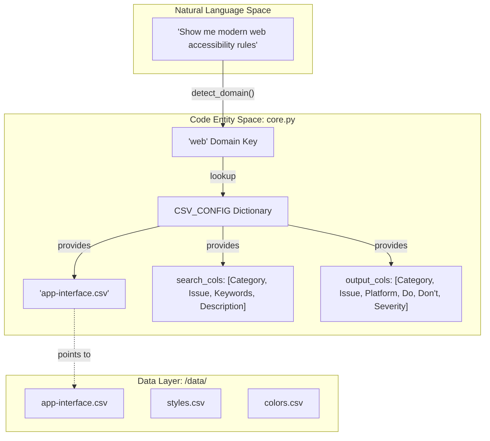
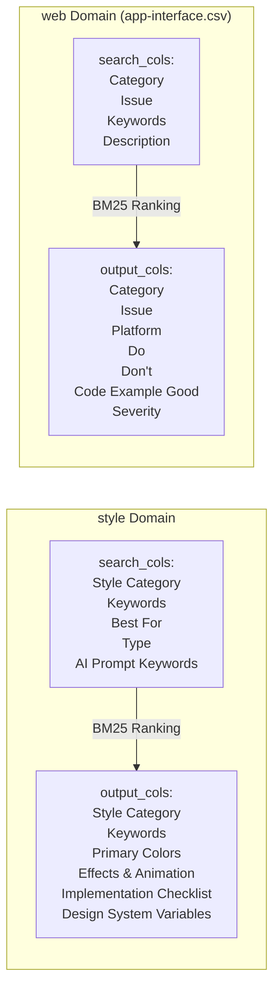
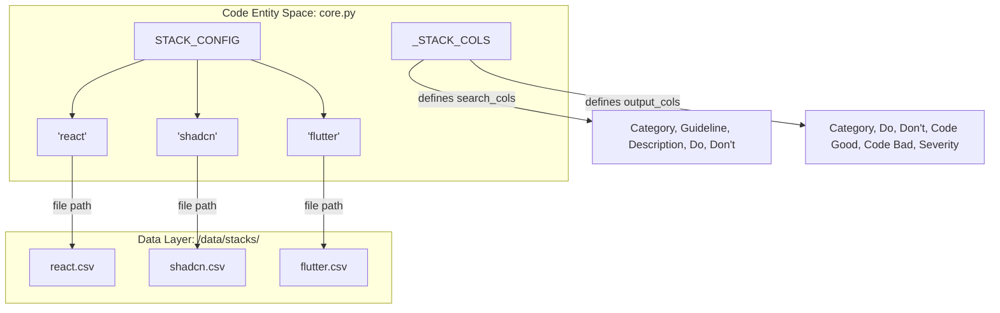

# CSV 데이터 구조

<details>
<summary>관련 소스 파일</summary>

다음 파일들은 이 위키 페이지를 생성하기 위한 컨텍스트로 사용되었습니다.

- [.claude/skills/ui-ux-pro-max/data/charts.csv](.claude/skills/ui-ux-pro-max/data/charts.csv)
- [.claude/skills/ui-ux-pro-max/data/colors.csv](.claude/skills/ui-ux-pro-max/data/colors.csv)
- [.claude/skills/ui-ux-pro-max/data/landing.csv](.claude/skills/ui-ux-pro-max/data/landing.csv)
- [.claude/skills/ui-ux-pro-max/data/products.csv](.claude/skills/ui-ux-pro-max/data/products.csv)
- [.claude/skills/ui-ux-pro-max/data/stacks/react-native.csv](.claude/skills/ui-ux-pro-max/data/stacks/react-native.csv)
- [.claude/skills/ui-ux-pro-max/data/styles.csv](.claude/skills/ui-ux-pro-max/data/styles.csv)
- [.claude/skills/ui-ux-pro-max/data/typography.csv](.claude/skills/ui-ux-pro-max/data/typography.csv)
- [.claude/skills/ui-ux-pro-max/data/ux-guidelines.csv](.claude/skills/ui-ux-pro-max/data/ux-guidelines.csv)
- [cli/assets/scripts/search.py](cli/assets/scripts/search.py)
- [src/ui-ux-pro-max/data/colors.csv](src/ui-ux-pro-max/data/colors.csv)
- [src/ui-ux-pro-max/data/icons.csv](src/ui-ux-pro-max/data/icons.csv)
- [src/ui-ux-pro-max/data/products.csv](src/ui-ux-pro-max/data/products.csv)
- [src/ui-ux-pro-max/data/stacks/flutter.csv](src/ui-ux-pro-max/data/stacks/flutter.csv)
- [src/ui-ux-pro-max/data/stacks/jetpack-compose.csv](src/ui-ux-pro-max/data/stacks/jetpack-compose.csv)
- [src/ui-ux-pro-max/data/stacks/shadcn.csv](src/ui-ux-pro-max/data/stacks/shadcn.csv)
- [src/ui-ux-pro-max/scripts/core.py](src/ui-ux-pro-max/scripts/core.py)
- [src/ui-ux-pro-max/scripts/search.py](src/ui-ux-pro-max/scripts/search.py)

</details>


## 목적과 범위

이 문서는 CSV 기반 디자인 knowledge base의 검색 인터페이스를 정의하는 구성 dictionary(`CSV_CONFIG`와 `STACK_CONFIG`)를 설명합니다. 이 dictionary들은 검색 도메인과 기술 스택을 해당 CSV 파일에 매핑하고, 어떤 열을 검색하고 반환할지 지정합니다. 

시스템은 11개 주요 디자인 도메인과 16개 기술 스택을 지원하며, BM25 기반 검색 엔진을 활용해 가장 관련성 높은 디자인 패턴, 접근성 규칙, 코드 snippet을 검색합니다.

**Sources:** [src/ui-ux-pro-max/scripts/core.py:1-92]()

---

## 구성 시스템 개요

검색 엔진은 `core.py`에 위치한 두 가지 주요 구성 dictionary를 사용합니다.

1. **`CSV_CONFIG`**: 디자인 도메인(예: `style`, `color`, `web`)을 맞춤형 검색 및 출력 열 세트가 있는 CSV 파일에 매핑합니다.
2. **`STACK_CONFIG`**: 16개 기술 스택(예: `react`, `shadcn`, `flutter`)을 `stacks/` 디렉터리에 있는 CSV 파일에 매핑합니다.
3. **`_STACK_COLS`**: 일관된 출력 형식을 보장하기 위해 모든 기술 스택 파일에서 사용되는 공통 열 구조를 정의합니다.

이 구성들은 사용자 쿼리와 CSV 데이터 계층 사이의 인터페이스 역할을 하며, 어떤 파일을 로드하고 어떤 필드를 BM25 알고리즘용으로 인덱싱할지 결정합니다.

**Sources:** [src/ui-ux-pro-max/scripts/core.py:17-98]()

---

## 도메인 구성 아키텍처

### CSV_CONFIG 구조

다음 다이어그램은 `CSV_CONFIG`가 자연어 도메인을 특정 코드 엔티티와 데이터 파일에 어떻게 매핑하는지 보여줍니다.

"Natural Language Domain to Code Entity Mapping"


**Sources:** [src/ui-ux-pro-max/scripts/core.py:17-73](), [src/ui-ux-pro-max/scripts/search.py:108-114]()

---

## 도메인에서 파일로의 매핑

`CSV_CONFIG` dictionary는 각 도메인 키를 `file`, `search_cols`, `output_cols`가 포함된 구성 객체에 매핑합니다.

### 전체 도메인 레지스트리

| 도메인 키 | CSV 파일 | 주요 사용 사례 |
|------------|----------|------------------|
| `style` | `styles.csv` | UI 스타일, 효과, AI prompt keywords. |
| `color` | `colors.csv` | 제품 유형별 색상 팔레트(Primary, Secondary, Accent). |
| `chart` | `charts.csv` | 데이터 시각화 유형, 접근성 참고, 라이브러리. |
| `landing` | `landing.csv` | Landing page 패턴과 conversion optimization. |
| `product` | `products.csv` | 특정 제품 카테고리를 위한 스타일 추천. |
| `ux` | `ux-guidelines.csv` | 일반 UX best practices(Do/Don't). |
| `typography` | `typography.csv` | Google Fonts와 Tailwind config가 포함된 폰트 조합. |
| `icons` | `icons.csv` | Icon library 참조와 import code. |
| `react` | `react-performance.csv` | React별 성능 및 이슈 해결. |
| `web` | `app-interface.csv` | 웹 인터페이스 접근성과 UI 패턴. |
| `google-fonts`| `google-fonts.csv` | 상세 폰트 메타데이터, subsets, designers. |

**Sources:** [src/ui-ux-pro-max/scripts/core.py:17-73]()

---

## 열 명세 스키마

각 도메인 구성은 BM25 검색 동작을 제어하는 두 가지 열 목록을 지정합니다.

### search_cols(입력 열)
BM25 랭킹을 위해 하나의 검색 가능한 문서로 연결되는 열입니다. 어떤 콘텐츠가 인덱싱되고 사용자 쿼리와 매칭되는지 결정합니다.

### output_cols(출력 열)
검색 결과로 반환되는 열입니다. 매칭 후 사용자에게 포괄적인 정보를 제공합니다.

### 도메인별 열 구성

"Search vs Output Column Flow"


**Sources:** [src/ui-ux-pro-max/scripts/core.py:18-22](), [src/ui-ux-pro-max/scripts/core.py:63-67]()

---

## 스택 구성 아키텍처

### STACK_CONFIG 구조

`STACK_CONFIG` dictionary는 16개 기술 스택을 `stacks/` 하위 디렉터리의 CSV 파일에 매핑합니다. 도메인 구성과 달리 모든 스택은 `_STACK_COLS`에 정의된 공통 열 스키마를 공유합니다.

"Stack Configuration to Data File Mapping"


**Sources:** [src/ui-ux-pro-max/scripts/core.py:75-98]()

---

## 전체 스택 레지스트리

`STACK_CONFIG`에서는 다음 16개 스택을 지원합니다.

| 스택 키 | CSV 파일 경로 |
|-----------|---------------|
| `react` | `stacks/react.csv` |
| `nextjs` | `stacks/nextjs.csv` |
| `vue` | `stacks/vue.csv` |
| `svelte` | `stacks/svelte.csv` |
| `astro` | `stacks/astro.csv` |
| `swiftui` | `stacks/swiftui.csv` |
| `react-native` | `stacks/react-native.csv` |
| `flutter` | `stacks/flutter.csv` |
| `nuxtjs` | `stacks/nuxtjs.csv` |
| `nuxt-ui` | `stacks/nuxt-ui.csv` |
| `html-tailwind` | `stacks/html-tailwind.csv` |
| `shadcn` | `stacks/shadcn.csv` |
| `jetpack-compose` | `stacks/jetpack-compose.csv` |
| `threejs` | `stacks/threejs.csv` |
| `angular` | `stacks/angular.csv` |
| `laravel` | `stacks/laravel.csv` |

**Sources:** [src/ui-ux-pro-max/scripts/core.py:75-92]()

---

## 표준화된 스택 열 스키마

모든 스택 구성은 일관성을 위해 `_STACK_COLS` 스키마를 사용합니다.

```python
_STACK_COLS = {
    "search_cols": ["Category", "Guideline", "Description", "Do", "Don't"],
    "output_cols": ["Category", "Guideline", "Description", "Do", "Don't", "Code Good", "Code Bad", "Severity", "Docs URL"]
}
```

### 열 정의

| 열 | 역할 | 목적 |
|--------|------|---------|
| `Category` | Search/Output | 상위 수준 그룹화(예: "Theming", "Components", "Layout"). |
| `Guideline` | Search/Output | 특정 규칙 또는 best practice 제목. |
| `Do` / `Don't` | Search/Output | 개발자를 위한 실행 가능한 지침. |
| `Code Good` | Output | 참조 구현 snippet. |
| `Code Bad` | Output | anti-pattern 예시. |
| `Severity` | Output | 영향도 등급: Low, Medium, High 또는 Critical. |

**Sources:** [src/ui-ux-pro-max/scripts/core.py:95-98](), [src/ui-ux-pro-max/data/stacks/shadcn.csv:1-5]()

---

## 구현 세부 사항

### 데이터 로딩 및 경로 해석

`DATA_DIR` 상수는 모든 CSV 파일의 기본 경로를 정의합니다. `search_stack`과 `search` 함수는 `DATA_DIR`을 구성에서 찾은 `file` 문자열과 결합하여 절대 경로를 해석합니다.

```python
DATA_DIR = Path(__file__).parent.parent / "data"
# ...
filepath = DATA_DIR / STACK_CONFIG[stack]["file"]
```

**Sources:** [src/ui-ux-pro-max/scripts/core.py:14](), [src/ui-ux-pro-max/scripts/core.py:239]()

### 출력 형식화

`search.py`의 `format_output` 함수는 CSV에서 나온 raw dictionary 결과를 처리합니다. AI 어시스턴트 컨텍스트 창에 맞게 출력이 token-optimized 상태로 유지되도록 300자를 초과하는 값을 잘라냅니다.

```python
def format_output(result):
    # ...
    for key, value in row.items():
        value_str = str(value)
        if len(value_str) > 300:
            value_str = value_str[:300] + "..."
        output.append(f"- **{key}:** {value_str}")
```

**Sources:** [src/ui-ux-pro-max/scripts/search.py:30-53]()
