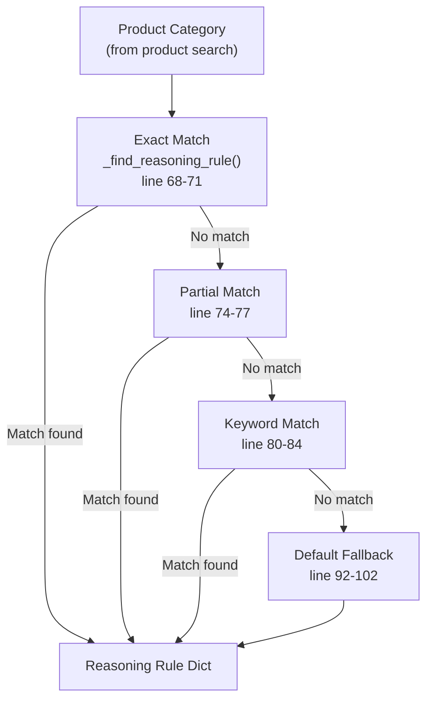
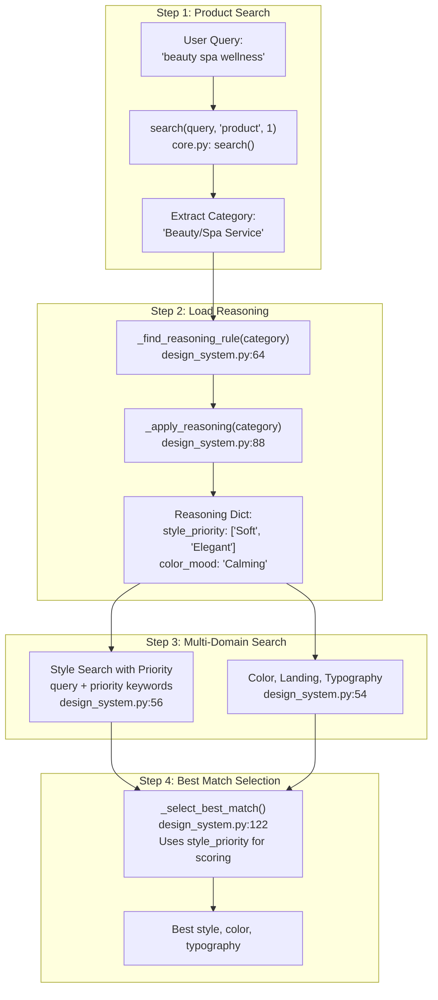
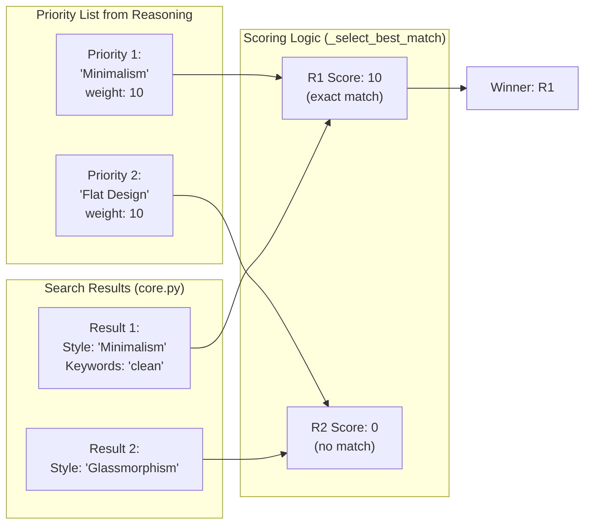

# 추론 규칙

<details>
<summary>관련 소스 파일</summary>

다음 파일들은 이 위키 페이지를 생성하기 위한 컨텍스트로 사용되었습니다.

- [.claude/skills/ui-ux-pro-max/data/ui-reasoning.csv](.claude/skills/ui-ux-pro-max/data/ui-reasoning.csv)
- [cli/assets/scripts/search.py](cli/assets/scripts/search.py)
- [src/ui-ux-pro-max/data/stacks/flutter.csv](src/ui-ux-pro-max/data/stacks/flutter.csv)
- [src/ui-ux-pro-max/data/stacks/jetpack-compose.csv](src/ui-ux-pro-max/data/stacks/jetpack-compose.csv)
- [src/ui-ux-pro-max/data/stacks/shadcn.csv](src/ui-ux-pro-max/data/stacks/shadcn.csv)
- [src/ui-ux-pro-max/scripts/core.py](src/ui-ux-pro-max/scripts/core.py)
- [src/ui-ux-pro-max/scripts/search.py](src/ui-ux-pro-max/scripts/search.py)

</details>


## 목적과 범위

Reasoning rules는 제품 카테고리와 디자인 추천 사이의 지능형 매핑을 제공합니다. 규칙 시스템은 `ui-reasoning.csv`에 저장된 100개의 JSON 기반 의사 결정 규칙으로 구성되며, 제품 유형을 추천 스타일, 색상 분위기, 타이포그래피 분위기, 레이아웃 패턴, 시각 효과, anti-patterns에 매핑합니다. 이를 통해 디자인 시스템 생성기는 일반적인 제안이 아니라 컨텍스트를 인식한 추천을 할 수 있습니다.

더 넓은 디자인 시스템 생성 파이프라인에 대한 정보는 [Design System Generator](#6)를 참조하세요. 추론이 적용되기 전에 쿼리를 실행하는 검색 엔진에 대한 자세한 내용은 [Search Engine](#5)를 참조하세요.

**Sources:** [src/ui-ux-pro-max/scripts/design_system.py:1-26]()

---

## CSV 파일 구조

추론 규칙은 `data/ui-reasoning.csv`에 다음 열을 가진 CSV 파일로 저장됩니다.

| 열 | 타입 | 설명 | 예시 |
|--------|------|-------------|---------|
| `UI_Category` | String | 제품 카테고리 이름 | "SaaS (General)", "Fintech/Crypto" |
| `Recommended_Pattern` | String | Landing page 패턴 이름 | "Hero + Features + CTA", "Data-Dense Dashboard" |
| `Style_Priority` | String (delimiter: `+`) | 순서가 있는 스타일 선호 목록 | "Glassmorphism + Flat Design" |
| `Color_Mood` | String | 색상 팔레트 분위기 설명자 | "Trust blue + Accent contrast" |
| `Typography_Mood` | String | 타이포그래피 분위기 설명자 | "Professional + Hierarchy" |
| `Key_Effects` | String | 추천 시각 효과 | "Subtle hover (200-250ms)" |
| `Decision_Rules` | JSON String | 구조화된 의사 결정 로직 | `{"if_ux_focused": "prioritize-minimalism"}` |
| `Anti_Patterns` | String (delimiter: `+`) | 피해야 할 디자인 패턴 | "Excessive animation + Dark mode by default" |
| `Severity` | Enum | 규칙 강제 수준 | "LOW", "MEDIUM", "HIGH" |

**Sources:** [.claude/skills/ui-ux-pro-max/data/ui-reasoning.csv:1-21](), [src/ui-ux-pro-max/scripts/design_system.py:43-49]()

---

## 규칙 매칭 알고리즘

추론 시스템은 `DesignSystemGenerator` 클래스 안에서 주어진 제품 카테고리에 가장 관련성 높은 규칙을 찾기 위해 3단계 매칭 전략을 사용합니다.

### 다이어그램: 규칙 매칭 전략



**Sources:** [src/ui-ux-pro-max/scripts/design_system.py:64-86]()

### 매칭 단계

**Tier 1: Exact Match** ([src/ui-ux-pro-max/scripts/design_system.py:68-71]())
```python
# Case-insensitive exact match
if rule.get("UI_Category", "").lower() == category_lower:
    return rule
```

**Tier 2: Partial Match** ([src/ui-ux-pro-max/scripts/design_system.py:74-77]())
```python
# Bidirectional substring match
if ui_cat in category_lower or category_lower in ui_cat:
    return rule
```

**Tier 3: Keyword Match** ([src/ui-ux-pro-max/scripts/design_system.py:80-84]())
```python
# Tokenize category and check for any keyword overlap
keywords = ui_cat.replace("/", " ").replace("-", " ").split()
if any(kw in category_lower for kw in keywords):
    return rule
```

**Tier 4: Default Fallback** ([src/ui-ux-pro-max/scripts/design_system.py:92-102]())
구체적인 매칭을 찾지 못하면 "Hero + Features + CTA"와 "Minimalism"을 포함한 일반 규칙을 반환합니다.

**Sources:** [src/ui-ux-pro-max/scripts/design_system.py:64-102]()

---

## 규칙 적용 파이프라인

추론 규칙은 `generate_design_system` 실행 중 적용되어 다중 도메인 검색과 결과 선택에 영향을 줍니다.

### 다이어그램: 디자인 시스템 생성에서의 추론 통합



**Sources:** [src/ui-ux-pro-max/scripts/design_system.py:163-190](), [src/ui-ux-pro-max/scripts/core.py:180-205]()

### 파이프라인 단계

**Stage 1: Category Identification** ([src/ui-ux-pro-max/scripts/design_system.py:165-170]())
- `max_results=1`로 `core.search`를 통해 product 도메인 검색을 실행합니다.
- `Product Type` 필드를 디자인 카테고리로 추출합니다.

**Stage 2: Reasoning Rule Application** ([src/ui-ux-pro-max/scripts/design_system.py:172-174]())
- `_apply_reasoning(category, {})`를 호출합니다.
- `Decision_Rules` JSON 필드와 `Style_Priority` 목록을 파싱합니다.

**Stage 3: Priority-Guided Style Search** ([src/ui-ux-pro-max/scripts/design_system.py:56-59]())
- 사용자 쿼리와 추론 키워드를 결합하여 BM25에 bias를 부여합니다.
- 예: `"fintech" + "Trust Authority"` → `"fintech Trust Authority"`.

**Stage 4: Best Match Selection** ([src/ui-ux-pro-max/scripts/design_system.py:122-157]())
- `style_priority`에 대해 결과를 점수화합니다.
- 정확한 스타일 이름 매칭: +10점.
- 키워드 필드 매칭: +3점.

**Sources:** [src/ui-ux-pro-max/scripts/design_system.py:51-62](), [src/ui-ux-pro-max/scripts/design_system.py:163-190]()

---

## Decision Rules JSON 형식

`ui-reasoning.csv`의 `Decision_Rules` 열은 JSON으로 인코딩된 조건부 로직을 포함합니다.

### 파싱 로직

[src/ui-ux-pro-max/scripts/design_system.py:104-109]()

```python
decision_rules = {}
try:
    decision_rules = json.loads(rule.get("Decision_Rules", "{}"))
except json.JSONDecodeError:
    pass  # Empty dict if parsing fails
```

### 실제 예시

`ui-reasoning.csv`의 2행:
```json
{"if_ux_focused": "prioritize-minimalism", "if_data_heavy": "add-glassmorphism"}
```

주로 AI 소비와 문서 생성을 위한 것이지만, 이 구조화된 데이터는 시스템이 출력 severity와 특정 디자인 제약 조건을 동적으로 조정할 수 있게 합니다.

**Sources:** [.claude/skills/ui-ux-pro-max/data/ui-reasoning.csv:2](), [src/ui-ux-pro-max/scripts/design_system.py:104-109]()

---

## 스타일 우선순위 시스템

`style_priority` 목록은 delimiter로 구분된 목록(`+`)을 사용해 선호도를 순위화합니다.

### 다이어그램: 스타일 우선순위 점수화



**Sources:** [src/ui-ux-pro-max/scripts/design_system.py:122-157]()

### 점수화 알고리즘

[src/ui-ux-pro-max/scripts/design_system.py:130-157]()

1.  **Exact Match**: 우선순위 키워드가 `Style Category` 필드와 정확히 일치하면 해당 결과가 즉시 반환됩니다([lines 131-136]()).
2.  **Weighted Scoring**: 정확한 매칭이 없으면 결과를 순회하며 점수를 계산합니다.
    -   `Style Category` 매칭: +10점.
    -   `Keywords` 필드 매칭: +3점.
    -   일반 문자열 매칭: +1점.

**Sources:** [src/ui-ux-pro-max/scripts/design_system.py:122-157]()

---

## Anti-Patterns와 Severity

Anti-patterns는 특정 카테고리에서 명시적으로 금지된 디자인 관행입니다. 이는 디자인 시스템 생성 중 `MASTER.md` 파일에 렌더링됩니다.

### Anti-Pattern 렌더링

[src/ui-ux-pro-max/scripts/design_system.py:767-772]()

```python
if anti_patterns:
    anti_list = [a.strip() for a in anti_patterns.split("+")]
    for anti in anti_list:
        if anti:
            lines.append(f"- ❌ {anti}")
```

### Severity Levels

추론 규칙은 디자인 시스템의 tone과 생성된 체크리스트의 엄격함에 영향을 주는 `Severity` 수준(`LOW`, `MEDIUM`, `HIGH`)을 정의합니다.

**CSV 예시:**
- **Healthcare App**: 접근성과 윤리 요구 사항 때문에 Severity `HIGH` ([line 9]()).
- **Educational App**: Severity `MEDIUM` ([line 10]()).

**Sources:** [.claude/skills/ui-ux-pro-max/data/ui-reasoning.csv:1-27](), [src/ui-ux-pro-max/scripts/design_system.py:767-781]()
