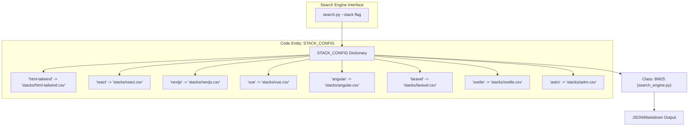
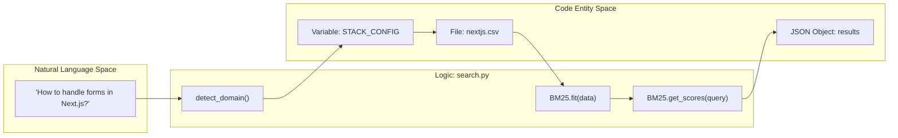

# 스택별 가이드라인

관련 소스 파일

다음 파일들은 이 위키 페이지를 생성하기 위한 컨텍스트로 사용되었습니다.

- [.claude/skills/ui-ux-pro-max/data/stacks/flutter.csv](.claude/skills/ui-ux-pro-max/data/stacks/flutter.csv)
- [.claude/skills/ui-ux-pro-max/data/stacks/html-tailwind.csv](.claude/skills/ui-ux-pro-max/data/stacks/html-tailwind.csv)
- [.claude/skills/ui-ux-pro-max/data/stacks/nextjs.csv](.claude/skills/ui-ux-pro-max/data/stacks/nextjs.csv)
- [.claude/skills/ui-ux-pro-max/data/stacks/react.csv](.claude/skills/ui-ux-pro-max/data/stacks/react.csv)
- [cli/assets/data/stacks/angular.csv](cli/assets/data/stacks/angular.csv)
- [cli/assets/data/stacks/laravel.csv](cli/assets/data/stacks/laravel.csv)
- [cli/assets/data/stacks/threejs.csv](cli/assets/data/stacks/threejs.csv)
- [src/ui-ux-pro-max/data/stacks/angular.csv](src/ui-ux-pro-max/data/stacks/angular.csv)
- [src/ui-ux-pro-max/data/stacks/astro.csv](src/ui-ux-pro-max/data/stacks/astro.csv)
- [src/ui-ux-pro-max/data/stacks/html-tailwind.csv](src/ui-ux-pro-max/data/stacks/html-tailwind.csv)
- [src/ui-ux-pro-max/data/stacks/laravel.csv](src/ui-ux-pro-max/data/stacks/laravel.csv)
- [src/ui-ux-pro-max/data/stacks/nextjs.csv](src/ui-ux-pro-max/data/stacks/nextjs.csv)
- [src/ui-ux-pro-max/data/stacks/nuxt-ui.csv](src/ui-ux-pro-max/data/stacks/nuxt-ui.csv)
- [src/ui-ux-pro-max/data/stacks/nuxtjs.csv](src/ui-ux-pro-max/data/stacks/nuxtjs.csv)
- [src/ui-ux-pro-max/data/stacks/react.csv](src/ui-ux-pro-max/data/stacks/react.csv)
- [src/ui-ux-pro-max/data/stacks/svelte.csv](src/ui-ux-pro-max/data/stacks/svelte.csv)
- [src/ui-ux-pro-max/data/stacks/swiftui.csv](src/ui-ux-pro-max/data/stacks/swiftui.csv)
- [src/ui-ux-pro-max/data/stacks/threejs.csv](src/ui-ux-pro-max/data/stacks/threejs.csv)
- [src/ui-ux-pro-max/data/stacks/vue.csv](src/ui-ux-pro-max/data/stacks/vue.csv)

이 문서는 UI/UX Pro Max 디자인 데이터베이스의 일부를 이루는 기술 스택별 디자인 및 구현 가이드라인을 자세히 설명합니다. 스택 가이드라인은 지원되는 각 기술 스택에 맞춘 프레임워크별 best practices, anti-patterns, 코드 예시를 제공합니다. 시스템은 현재 16개 기술 스택에 대한 가이드라인을 유지하며, 컴포넌트 구조, 상태 관리, 스타일링 패턴, 성능 최적화 같은 측면을 다루는 상세 규칙 세트를 포함합니다.

모든 스택에 적용되는 일반 UX best practices는 **3.3 Pre-Delivery Checklist**를 참조하세요. 이러한 가이드라인이 검색 엔진을 통해 어떻게 검색되는지에 대한 정보는 **5.2 search.py CLI Interface**를 참조하세요.

## 개요와 목적

스택별 가이드라인은 세 가지 주요 기능을 수행합니다.

1.  **Framework-Specific Validation**: 특정 프레임워크에서 UI 디자인을 구현할 때 개발자가 흔히 저지르는 실수를 잡는 기술별 규칙을 제공합니다.
2.  **Best Practice Enforcement**: 각 스택에 대한 최적 패턴(예: Tailwind utility 사용, React hooks 패턴, Vue Composition API, Laravel Blade components)에 관한 전문가 지식을 인코딩합니다.
3.  **Code Quality Standards**: 수정 우선순위를 정하기 위해 severity levels와 함께 "good" 코드와 "bad" 코드 예시를 정의합니다.

가이드라인은 `data/stacks/` 디렉터리에 CSV 파일로 저장되며, 검색 엔진에서 `--stack` 플래그를 사용해 쿼리됩니다. 스택이 지정되지 않으면 시스템은 기본값으로 `html-tailwind`를 사용합니다.

**Sources**: [.claude/skills/ui-ux-pro-max/SKILL.md:68-76](), [.claude/skills/ui-ux-pro-max/SKILL.md:96-107]()

## 지원 기술 스택

시스템은 버전 2.5.0 기준 16개 기술 스택을 지원합니다.

| Stack ID | Framework / Tech | 주요 중점 영역 |
| :--- | :--- | :--- |
| `html-tailwind` | HTML + Tailwind CSS | Utility classes, responsive design, accessibility |
| `react` | React | State management, hooks, component patterns |
| `nextjs` | Next.js | SSR, App Router, Image optimization, Metadata |
| `vue` | Vue.js | Composition API, Pinia, Reactivity, Composables |
| `nuxtjs` | Nuxt.js | Auto-imports, Server engine, Data fetching |
| `svelte` | Svelte | Runes (v5), Stores, Actions, Transitions |
| `astro` | Astro | Islands architecture, Content collections, Zero-JS |
| `angular` | Angular | Signals, Standalone components, Typed forms |
| `laravel` | Laravel | Blade components, Livewire, Inertia.js |
| `swiftui` | SwiftUI | State/Binding, View composition, Modifiers |
| `flutter` | Flutter | Widgets, BLoC/Provider, Layout, Theming |
| `react-native` | React Native | Native components, Navigation, Performance |
| `threejs` | Three.js | Scene graph, Geometry, Materials, Shaders |
| `nuxt-ui` | Nuxt UI | Component library patterns, Tailwind integration |
| `shadcn-ui` | shadcn/ui | Component composition, Radix primitives |
| `material-ui` | MUI | Theme customization, SX prop, System |

**Sources**: [.claude/skills/ui-ux-pro-max/SKILL.md:96-107](), [src/ui-ux-pro-max/data/stacks/angular.csv:1-25](), [src/ui-ux-pro-max/data/stacks/laravel.csv:1-25]()

## 스택 구성 및 검색 통합

### STACK_CONFIG 매핑

검색 엔진은 `STACK_CONFIG` dictionary를 사용해 스택 식별자를 해당 CSV 파일에 매핑합니다.

**Sources**: [src/ui-ux-pro-max/scripts/core.py]() (STACK_CONFIG dictionary definition), [.claude/skills/ui-ux-pro-max/SKILL.md:73-76]()

### 구현 세부 사항: 데이터 흐름

스택이 요청되면 시스템은 다음 데이터 흐름을 수행합니다.

1.  **Detection**: 명시적으로 제공되지 않은 경우 `search.py`의 `detect_domain` 함수가 쿼리가 특정 스택과 관련되는지 판단합니다.
2.  **Loading**: `core.py`의 `CSV_CONFIG` 또는 `STACK_CONFIG`가 파일 경로를 제공합니다.
3.  **Ranking**: `BM25` class(`search_engine.py`에 정의됨)가 `Guideline`, `Description`, `Do`, `Don't` 열을 tokenize하여 관련성 점수를 계산합니다.

**Sources**: [src/ui-ux-pro-max/scripts/search.py:45-80](), [src/ui-ux-pro-max/scripts/core.py:10-40]()

## CSV 파일 구조

각 스택 가이드라인 CSV는 표준화된 10열 형식을 따릅니다.

| 열 | 목적 | 예시(Laravel) |
| :--- | :--- | :--- |
| `No` | 순차 ID | `1` |
| `Category` | 논리적 그룹화 | `Blade Templates` |
| `Guideline` | 짧은 규칙 제목 | `Use Blade components for reusable UI` |
| `Description` | 컨텍스트/근거 | `Extract repeated markup into named components` |
| `Do` | 권장 접근 방식 | `Use x-* components with @props` |
| `Don't` | Anti-pattern | `Duplicate HTML blocks across views` |
| `Code Good` | 구현 예시 | `<x-card :title="$title">...</x-card>` |
| `Code Bad` | 피해야 할 구현 | `@include('card', ['title' => $title])` |
| `Severity` | 우선순위 등급 | `High` |
| `Docs URL` | 공식 참조 | `https://laravel.com/docs/blade#components` |

**Sources**: [src/ui-ux-pro-max/data/stacks/laravel.csv:1-2](), [src/ui-ux-pro-max/data/stacks/angular.csv:1-2]()

## 주요 스택 가이드라인

### Angular (Modern v17+)
Angular 가이드라인은 fine-grained reactivity와 standalone components로의 전환에 크게 초점을 맞춥니다.

| Category | Guideline | Code Good | Severity |
| :--- | :--- | :--- | :--- |
| Components | Use standalone components | `@Component({ standalone: true ... })` | High |
| Components | Use signals for state | `count = signal(0);` | High |
| Components | Use @if/@for control flow | `@if (isLoggedIn) { ... }` | High |
| State | Use computed() for derived state | `total = computed(() => this.items()...)` | High |

**Sources**: [src/ui-ux-pro-max/data/stacks/angular.csv:2-5](), [src/ui-ux-pro-max/data/stacks/angular.csv:17]()

### Laravel (TALL/Inertia Stacks)
Laravel 가이드라인은 Blade, Livewire, Inertia.js 패턴을 다룹니다.

| Category | Guideline | Code Good | Severity |
| :--- | :--- | :--- | :--- |
| Blade | Escape output with {{ }} | `{{ $user->name }}` | High |
| Livewire | Bind inputs with wire:model | `<input wire:model="email">` | High |
| Livewire | Use wire:loading for feedback | `wire:loading.attr="disabled"` | High |
| Inertia.js | Use <Link> for navigation | `<Link href="/dashboard">` | High |

**Sources**: [src/ui-ux-pro-max/data/stacks/laravel.csv:8](), [src/ui-ux-pro-max/data/stacks/laravel.csv:10](), [src/ui-ux-pro-max/data/stacks/laravel.csv:16](), [src/ui-ux-pro-max/data/stacks/laravel.csv:20]()

### Next.js (App Router v14/15)
Next.js 가이드라인은 Server Components와 최적화된 data fetching을 강조합니다.

| Category | Guideline | Code Good | Severity |
| :--- | :--- | :--- | :--- |
| Rendering | Use Server Components by default | `export default function Page()` | High |
| Rendering | Push Client Components down | `<InteractiveButton/> in Server Page` | High |
| DataFetching | Configure caching (v15+) | `fetch(url, { cache: 'force-cache' })` | High |
| Images | Use next/image for optimization | `<Image src={...} width={...} />` | High |

**Sources**: [src/ui-ux-pro-max/data/stacks/nextjs.csv:8](), [src/ui-ux-pro-max/data/stacks/nextjs.csv:10](), [src/ui-ux-pro-max/data/stacks/nextjs.csv:14](), [src/ui-ux-pro-max/data/stacks/nextjs.csv:18]()

## 구현: 검색과 합성

`search.py` 스크립트는 Natural Language 쿼리와 CSV 가이드라인 사이의 bridge 역할을 합니다.

**Sources**: [src/ui-ux-pro-max/scripts/search.py:20-50](), [src/ui-ux-pro-max/scripts/core.py:35-50]()

### Severity 기반 필터링
시스템은 `Severity == 'High'`인 결과를 우선합니다. **Design System Generator**의 합성 단계에서는 `Don't`와 `Code Bad` 열의 high-severity anti-patterns를 사용해 최종 `MASTER.md` 또는 `pages/*.md` 파일에 구체적인 "Implementation Warnings"를 생성합니다.

**Sources**: [.claude/skills/ui-ux-pro-max/SKILL.md:120-130](), [src/ui-ux-pro-max/data/stacks/html-tailwind.csv:27]()
