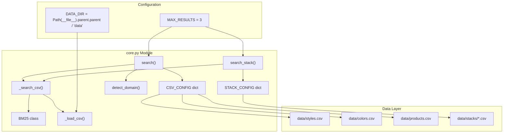
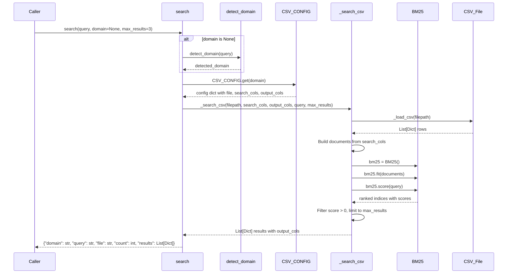
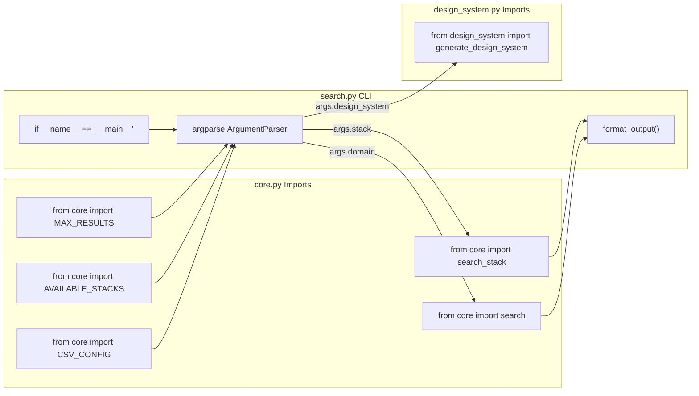

# 검색 엔진

<details>
<summary>관련 소스 파일</summary>

다음 파일들은 이 위키 페이지를 생성하기 위한 컨텍스트로 사용되었습니다.

- [.claude/skills/ui-ux-pro-max/scripts/core.py](.claude/skills/ui-ux-pro-max/scripts/core.py)
- [.claude/skills/ui-ux-pro-max/scripts/search.py](.claude/skills/ui-ux-pro-max/scripts/search.py)
- [cli/assets/scripts/search.py](cli/assets/scripts/search.py)
- [src/ui-ux-pro-max/data/stacks/flutter.csv](src/ui-ux-pro-max/data/stacks/flutter.csv)
- [src/ui-ux-pro-max/data/stacks/jetpack-compose.csv](src/ui-ux-pro-max/data/stacks/jetpack-compose.csv)
- [src/ui-ux-pro-max/data/stacks/shadcn.csv](src/ui-ux-pro-max/data/stacks/shadcn.csv)
- [src/ui-ux-pro-max/scripts/core.py](src/ui-ux-pro-max/scripts/core.py)
- [src/ui-ux-pro-max/scripts/search.py](src/ui-ux-pro-max/scripts/search.py)

</details>


Search Engine은 UI/UX Pro Max의 모든 도메인 및 스택 쿼리를 구동하는 핵심 BM25 기반 검색 시스템입니다. CSV 데이터베이스의 디자인 리소스에 대한 확률적 랭킹, 자동 도메인 감지, 11개 디자인 도메인과 16개 기술 스택 전반을 검색하기 위한 통합 인터페이스를 제공합니다.

BM25 알고리즘 매개변수와 점수화 구현에 대한 자세한 내용은 [BM25 Algorithm Implementation](#5.1)을 참조하세요. 명령줄 사용법과 플래그는 [search.py CLI Interface](#5.2)를 참조하세요. 도메인 라우팅 로직은 [Domain Detection and Configuration](#5.3)을 참조하세요.

## 아키텍처 개요

검색 엔진은 확률적 랭킹을 위한 `BM25` class, 도메인을 CSV 파일에 매핑하는 구성 dictionary, 검색 파이프라인을 오케스트레이션하는 검색 함수라는 세 가지 주요 구성 요소로 이루어져 있습니다.

**핵심 구성 요소와 관계**



Sources: [src/ui-ux-pro-max/scripts/core.py:1-254]()

## 구성 Dictionary

검색 엔진은 논리적 도메인을 실제 CSV 파일에 매핑하고 어떤 열을 검색하고 반환할지 정의하기 위해 두 개의 dictionary를 사용합니다.

### CSV_CONFIG 구조

`CSV_CONFIG` dictionary는 `search_cols`(인덱싱할 필드)와 `output_cols`(반환할 필드)를 포함한 11개 도메인 매핑(v2.5.0에서 업데이트)을 정의합니다.

| 도메인 | 파일 | 검색 열 | 출력 열 | 사용 사례 |
|--------|------|----------------|----------------|----------|
| `style` | `styles.csv` | Style Category, Keywords, Best For, Type, AI Prompt Keywords | Primary Colors, Effects, Framework Compatibility, Implementation Checklist를 포함한 16개 열 | UI 스타일 추천 |
| `color` | `colors.csv` | Product Type, Notes | Primary/Secondary/Accent/Background/Card/Muted/Border hex codes | 색상 팔레트 선택 |
| `chart` | `charts.csv` | Data Type, Keywords, Best Chart Type, Accessibility Notes | Chart type, library recommendation, interactivity, A11y fallback | 데이터 시각화 가이드 |
| `landing` | `landing.csv` | Pattern Name, Keywords, Conversion Optimization, Section Order | Section order, CTA placement, color strategy | Landing page 구조 |
| `product` | `products.csv` | Product Type, Keywords, Primary Style Recommendation, Key Considerations | Style recommendations, color palette focus | 제품 기반 스타일 라우팅 |
| `ux` | `ux-guidelines.csv` | Category, Issue, Description, Platform | Do/Don't, Code Examples, Severity | UX best practices |
| `typography` | `typography.csv` | Font Pairing Name, Category, Mood/Style Keywords, Best For, Heading/Body Font | Google Fonts URL, CSS Import, Tailwind Config | 폰트 조합 선택 |
| `icons` | `icons.csv` | Category, Icon Name, Keywords, Best For | Library, Import Code, Usage, Style | Icon 추천 |
| `react` | `react-performance.csv` | Category, Issue, Keywords, Description | Do/Don't, Code Examples, Severity | React별 성능 |
| `web` | `app-interface.csv` | Category, Issue, Keywords, Description | Do/Don't, Code Examples, Severity | 웹 인터페이스 가이드라인 |
| `google-fonts` | `google-fonts.csv` | Family, Category, Stroke, Classifications, Keywords | Styles, Variable Axes, Popularity Rank | 직접 폰트 메타데이터 검색 |

Sources: [src/ui-ux-pro-max/scripts/core.py:17-73]()

### STACK_CONFIG 구조

`STACK_CONFIG` dictionary는 16개 기술 스택을 해당 CSV 파일에 매핑합니다. 모든 스택은 `_STACK_COLS`에 저장된 공통 열 정의를 공유합니다.

```python
STACK_CONFIG = {
    "react": {"file": "stacks/react.csv"},
    "nextjs": {"file": "stacks/nextjs.csv"},
    "vue": {"file": "stacks/vue.csv"},
    # ... 13 more stacks including shadcn, jetpack-compose, flutter, laravel
}

_STACK_COLS = {
    "search_cols": ["Category", "Guideline", "Description", "Do", "Don't"],
    "output_cols": ["Category", "Guideline", "Description", "Do", "Don't", 
                    "Code Good", "Code Bad", "Severity", "Docs URL"]
}
```

**사용 가능한 스택**: `react`, `nextjs`, `vue`, `svelte`, `astro`, `swiftui`, `react-native`, `flutter`, `nuxtjs`, `nuxt-ui`, `html-tailwind`, `shadcn`, `jetpack-compose`, `threejs`, `angular`, `laravel`.

Sources: [src/ui-ux-pro-max/scripts/core.py:75-98]()

## BM25 구현

`BM25` class는 조정 가능한 매개변수 `k1=1.5`(용어 빈도 포화)와 `b=0.75`(문서 길이 정규화)를 사용하여 BM25(Best Match 25) 확률적 랭킹 알고리즘을 구현합니다.

### 클래스 구조

| 메서드 | 목적 | 매개변수 | 반환 |
|--------|---------|------------|---------|
| `__init__(k1, b)` | 튜닝 매개변수로 초기화 | `k1=1.5`, `b=0.75` | None |
| `tokenize(text)` | 소문자화, 분리, stopwords 필터링 | `text: str` | `List[str]` |
| `fit(documents)` | corpus에서 IDF 인덱스 구축 | `documents: List[str]` | None |
| `score(query)` | 쿼리에 대해 모든 문서 순위화 | `query: str` | `List[Tuple[int, float]]` |

**토큰화 로직** ([src/ui-ux-pro-max/scripts/core.py:117-120]()):
- 영숫자가 아닌 문자 제거: `re.sub(r'[^\w\s]', ' ', str(text).lower())`
- 3자보다 짧은 토큰 필터링
- 소문자 토큰 반환

**IDF 계산** ([src/ui-ux-pro-max/scripts/core.py:138-139]()):
```python
self.idf[word] = log((self.N - freq + 0.5) / (freq + 0.5) + 1)
```
여기서 `N`은 corpus 크기이고 `freq`는 용어의 문서 빈도입니다.

**BM25 점수화 공식** ([src/ui-ux-pro-max/scripts/core.py:157-159]()):
```python
numerator = tf * (self.k1 + 1)
denominator = tf + self.k1 * (1 - self.b + self.b * doc_len / self.avgdl)
score += idf * numerator / denominator
```

Sources: [src/ui-ux-pro-max/scripts/core.py:104-164]()

## 검색 함수

모듈은 검색 파이프라인을 오케스트레이션하는 주요 검색 함수를 노출합니다.

### search() 함수 흐름



Sources: [src/ui-ux-pro-max/scripts/core.py:221-240]()

### search_stack() 함수

`search_stack()` 함수는 기술 스택 가이드라인을 위한 특화 검색을 제공합니다.

```python
def search_stack(query, stack, max_results=MAX_RESULTS):
    """Search stack-specific guidelines"""
    if stack not in STACK_CONFIG:
        return {"error": f"Unknown stack: {stack}. Available: {', '.join(AVAILABLE_STACKS)}"}
    
    filepath = DATA_DIR / STACK_CONFIG[stack]["file"]
    results = _search_csv(filepath, _STACK_COLS["search_cols"], _STACK_COLS["output_cols"], query, max_results)
    
    return {
        "domain": "stack",
        "stack": stack,
        "query": query,
        "file": STACK_CONFIG[stack]["file"],
        "count": len(results),
        "results": results
    }
```

Sources: [src/ui-ux-pro-max/scripts/core.py:243-262]()

## 도메인 감지 시스템

`detect_domain()` 함수는 키워드 점수화를 사용해 쿼리를 가장 적절한 도메인으로 자동 라우팅합니다.

**키워드 매핑 예시** ([src/ui-ux-pro-max/scripts/core.py:203-214]()):

| 도메인 | 트리거 키워드 |
|--------|------------------|
| `color` | color, palette, hex, #, rgb |
| `chart` | chart, graph, visualization, trend, bar, pie, heatmap |
| `landing` | landing, page, cta, conversion, hero, testimonial |
| `product` | saas, ecommerce, fintech, healthcare, gaming, crypto |
| `style` | style, design, ui, minimalism, glassmorphism, neumorphism |
| `ux` | ux, usability, accessibility, wcag, touch, scroll |
| `typography` | font, typography, heading, serif, sans |
| `icons` | icon, icons, lucide, heroicons, symbol |
| `react` | react, next.js, suspense, memo, usecallback, rsc |
| `web` | aria, focus, outline, semantic, virtualize, form |

**점수화 알고리즘** ([src/ui-ux-pro-max/scripts/core.py:216-218]()):
```python
scores = {domain: sum(1 for kw in keywords if kw in query_lower) 
          for domain, keywords in domain_keywords.items()}
best = max(scores, key=scores.get)
return best if scores[best] > 0 else "style"  # Default to style
```

Sources: [src/ui-ux-pro-max/scripts/core.py:199-219]()

## CLI와의 통합

`search.py` CLI 스크립트는 핵심 검색 함수를 가져와 오케스트레이션합니다.

**모듈 Imports와 함수 위임**



**명령줄 인수** ([src/ui-ux-pro-max/scripts/search.py:57-72]()):

| 인수 | 타입 | 목적 | 예시 |
|----------|------|---------|---------|
| `query` | str | 검색 쿼리(positional) | `"glassmorphism dark mode"` |
| `--domain`, `-d` | choice | 특정 도메인 강제 | `--domain style` |
| `--stack`, `-s` | choice | 스택 가이드라인 검색 | `--stack react` |
| `--max-results`, `-n` | int | 결과 제한(기본값: 3) | `-n 5` |
| `--json` | flag | JSON 형식으로 출력 | `--json` |
| `--design-system`, `-ds` | flag | 전체 디자인 시스템 생성 | `--design-system` |
| `--persist` | flag | 파일시스템에 저장(Master/Overrides) | `--persist` |
| `--page` | str | page override 생성 | `--page "dashboard"` |

Sources: [src/ui-ux-pro-max/scripts/search.py:1-115]()

## 사용 예시

### 도메인 검색
```bash
# Auto-detect domain
python3 search.py "glassmorphism dark mode"

# Force specific domain
python3 search.py "elegant serif" --domain typography

# JSON output
python3 search.py "saas dashboard" --domain product --json
```

### 스택 검색
```bash
# Search React guidelines
python3 search.py "memo usecallback" --stack react

# Search Shadcn patterns
python3 search.py "dialog accessibility" --stack shadcn

# Search Flutter widgets
python3 search.py "stateless vs stateful" --stack flutter
```

Sources: [src/ui-ux-pro-max/scripts/search.py:5-15]()
