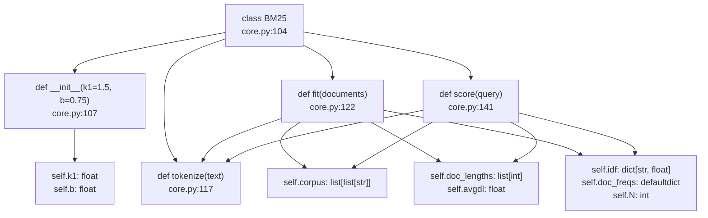
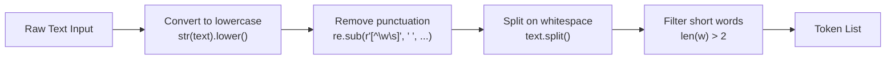
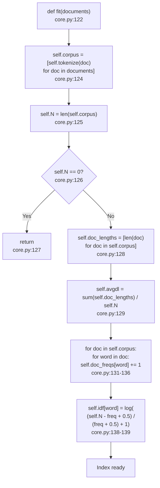
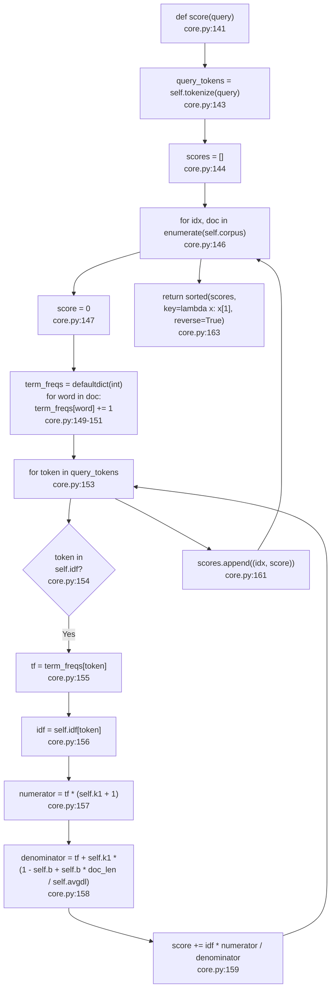
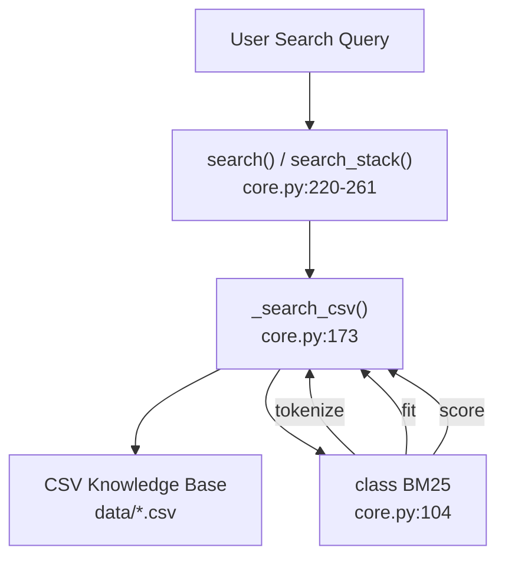

# BM25 알고리즘 구현

<details>
<summary>관련 소스 파일</summary>

다음 파일들은 이 위키 페이지를 생성하기 위한 컨텍스트로 사용되었습니다.

- [.claude/skills/ui-ux-pro-max/scripts/core.py](.claude/skills/ui-ux-pro-max/scripts/core.py)
- [.claude/skills/ui-ux-pro-max/scripts/search.py](.claude/skills/ui-ux-pro-max/scripts/search.py)
- [cli/assets/scripts/core.py](cli/assets/scripts/core.py)
- [cli/assets/scripts/design_system.py](cli/assets/scripts/design_system.py)
- [cli/assets/scripts/search.py](cli/assets/scripts/search.py)
- [src/ui-ux-pro-max/data/stacks/flutter.csv](src/ui-ux-pro-max/data/stacks/flutter.csv)
- [src/ui-ux-pro-max/data/stacks/jetpack-compose.csv](src/ui-ux-pro-max/data/stacks/jetpack-compose.csv)
- [src/ui-ux-pro-max/data/stacks/shadcn.csv](src/ui-ux-pro-max/data/stacks/shadcn.csv)
- [src/ui-ux-pro-max/scripts/core.py](src/ui-ux-pro-max/scripts/core.py)
- [src/ui-ux-pro-max/scripts/design_system.py](src/ui-ux-pro-max/scripts/design_system.py)
- [src/ui-ux-pro-max/scripts/search.py](src/ui-ux-pro-max/scripts/search.py)

</details>


## 목적과 범위

이 문서는 UI/UX Pro Max 검색 엔진에 구현된 BM25(Best Match 25) 랭킹 알고리즘에 대한 기술적 설명을 제공합니다. BM25는 용어 빈도, 문서 빈도, 문서 길이 정규화를 고려하여 쿼리 용어 관련성을 기준으로 문서 순위를 매기는 확률적 정보 검색 알고리즘입니다.

이 페이지에서 다루는 내용:
- `BM25` class 구조와 상태 관리.
- 토큰화 및 텍스트 전처리 로직.
- 인덱스 구축과 IDF(Inverse Document Frequency) 계산.
- 문서 점수화 알고리즘과 랭킹 메커니즘.
- 구성 매개변수 `k1`과 `b`, 그리고 이들이 랭킹에 미치는 영향.

이 알고리즘을 호출하는 CLI 인터페이스에 대한 정보는 [5.2]()를 참조하세요. CSV 데이터 로딩과 도메인 구성에 대한 자세한 내용은 [5.3]()을 참조하세요.

---

## BM25 Class 구조

BM25 알고리즘은 [src/ui-ux-pro-max/scripts/core.py:104-156]()에 위치한 `BM25` class에 stateful class로 구현되어 있습니다. 이 class는 tokenized documents의 인덱스와 효율적인 점수화에 필요한 사전 계산 통계를 유지합니다.

### Class 상태 변수

| 변수 | 타입 | 목적 |
|----------|------|---------|
| `k1` | float | 용어 빈도 포화 매개변수(기본값: 1.5) |
| `b` | float | 문서 길이 정규화 매개변수(기본값: 0.75) |
| `corpus` | list[list[str]] | 토큰 목록으로 저장된 tokenized documents |
| `doc_lengths` | list[int] | 각 문서의 토큰 단위 길이 |
| `avgdl` | float | 전체 corpus의 평균 문서 길이 |
| `idf` | dict[str, float] | corpus의 각 고유 용어에 대한 IDF 점수 |
| `doc_freqs` | defaultdict[int] | 각 용어를 포함하는 문서 수 |
| `N` | int | corpus의 전체 문서 수 |

**BM25 Class 아키텍처**



Sources: [src/ui-ux-pro-max/scripts/core.py:104-156]()

---

## 토큰화 프로세스

`tokenize` 메서드 [src/ui-ux-pro-max/scripts/core.py:117-120]()는 raw text를 BM25 점수화에 적합한 정규화된 토큰 목록으로 변환하기 위해 텍스트 전처리를 수행합니다.

### 토큰화 단계



### 구현 세부 사항

[src/ui-ux-pro-max/scripts/core.py:117-120]()의 토큰화 로직은 다음을 구현합니다.

1. **Case normalization**: `str(text).lower()`를 사용해 모든 텍스트를 소문자로 변환합니다.
2. **Punctuation removal**: regex `r'[^\w\s]'`를 사용해 영숫자가 아닌 문자를 공백으로 대체합니다.
3. **Tokenization**: `.split()`을 사용해 공백 기준으로 텍스트를 분리합니다.
4. **Short word filtering**: list comprehension `[w for w in text.split() if len(w) > 2]`를 사용해 2자 이하의 토큰을 제거합니다.

이 필터링 단계는 흔한 stop words를 제거하고 실질적인 용어에 집중하여 검색 관련성을 높입니다.

Sources: [src/ui-ux-pro-max/scripts/core.py:117-120]()

---

## 인덱스 구축 및 IDF 계산

`fit` 메서드 [src/ui-ux-pro-max/scripts/core.py:122-139]()는 모든 문서를 토큰화하고 각 고유 용어에 대한 IDF 점수를 계산하여 BM25 인덱스를 구축합니다.

**`fit()` 메서드의 인덱스 구축 흐름**



### IDF 공식

[src/ui-ux-pro-max/scripts/core.py:139]()의 IDF 계산은 표준 BM25 IDF 공식을 사용합니다.

```
IDF(term) = log((N - df + 0.5) / (df + 0.5) + 1)
```

여기서:
- `N` = corpus의 전체 문서 수(`self.N`).
- `df` = 해당 용어를 포함하는 문서 수(`self.doc_freqs`에 저장).
- `+0.5` smoothing은 0으로 나누는 것을 방지합니다.
- `+1`은 음수가 아닌 IDF 값을 보장합니다.

### 문서 빈도 계산

[src/ui-ux-pro-max/scripts/core.py:131-136]()의 구현은 각 용어가 문서당 한 번만 계산되도록 `seen` set을 사용합니다.

```python
for doc in self.corpus:
    seen = set()
    for word in doc:
        if word not in seen:
            self.doc_freqs[word] += 1
            seen.add(word)
```

Sources: [src/ui-ux-pro-max/scripts/core.py:122-139]()

---

## 문서 점수화 알고리즘

`score` 메서드 [src/ui-ux-pro-max/scripts/core.py:141-163]()는 쿼리에 대해 corpus의 모든 문서에 대한 BM25 관련성 점수를 계산합니다.

**`score()` 메서드의 점수 계산 흐름**



### BM25 점수화 공식

[src/ui-ux-pro-max/scripts/core.py:157-159]()의 핵심 점수화 공식은 다음을 구현합니다.

```
score(q, d) = Σ IDF(qi) * (tf(qi, d) * (k1 + 1)) / (tf(qi, d) + k1 * (1 - b + b * |d| / avgdl))
```

여기서:
- `qi` = 각 쿼리 용어.
- `d` = 점수화되는 문서.
- `tf(qi, d)` = 문서 d에서 용어 qi의 빈도(`term_freqs[token]`).
- `|d|` = 문서 d의 토큰 단위 길이(`doc_len`).
- `avgdl` = corpus의 평균 문서 길이(`self.avgdl`).
- `k1`, `b` = 튜닝 매개변수(`self.k1`, `self.b`).

Sources: [src/ui-ux-pro-max/scripts/core.py:141-163]()

---

## 매개변수 구성

BM25 알고리즘은 랭킹 동작을 제어하는 두 가지 튜닝 매개변수를 사용하며, [src/ui-ux-pro-max/scripts/core.py:107-109]()에서 설정됩니다.

### 매개변수 k1: Term Frequency Saturation

**값**: 1.5(기본값) [src/ui-ux-pro-max/scripts/core.py:107]()

**효과**: 용어 빈도가 얼마나 빠르게 포화되는지 제어합니다. 값이 높을수록 반복되는 용어에 더 큰 가중치를 부여합니다.

[src/ui-ux-pro-max/scripts/core.py:157-158]()의 공식 기여:
```python
numerator = tf * (self.k1 + 1)
denominator = tf + self.k1 * (1 - self.b + self.b * doc_len / self.avgdl)
```

### 매개변수 b: Length Normalization

**값**: 0.75(기본값) [src/ui-ux-pro-max/scripts/core.py:107]()

**효과**: 문서 길이 정규화를 제어합니다. 값이 높을수록 긴 문서에 더 큰 페널티를 줍니다.

- `b = 0`일 때: 길이 정규화 없음.
- `b = 1`일 때: 완전한 길이 정규화.
- `b = 0.75`일 때: 균형 잡힌 정규화(기본값).

Sources: [src/ui-ux-pro-max/scripts/core.py:107-109]()

---

## 검색 시스템과의 통합

`BM25` class는 [src/ui-ux-pro-max/scripts/core.py:173-195]()의 `_search_csv` 함수에서 디자인 데이터베이스 항목의 순위를 매기기 위해 인스턴스화되고 사용됩니다.

**자연어에서 코드 엔티티로의 매핑**



### 문서 구성

[src/ui-ux-pro-max/scripts/core.py:181]()에서 문서는 지정된 검색 열의 값을 연결하여 구성됩니다.

```python
documents = [" ".join(str(row.get(col, "")) for col in search_cols) for row in data]
```

예를 들어 `CSV_CONFIG["style"]` [src/ui-ux-pro-max/scripts/core.py:18-22]()의 style entry는 `"Style Category"`, `"Keywords"`, `"Best For"`를 결합할 수 있습니다.

### 결과 필터링

[src/ui-ux-pro-max/scripts/core.py:189-193]()의 구현은 양수 점수를 가진 문서만 포함하도록 결과를 필터링합니다.

```python
for idx, score in ranked[:max_results]:
    if score > 0:
        row = data[idx]
        results.append({col: row.get(col, "") for col in output_cols if col in row})
```

Sources: [src/ui-ux-pro-max/scripts/core.py:173-195]()

---

## 전체 BM25 워크플로

**End-to-End BM25 검색 실행**

```mermaid
flowchart TD
    Start["Search Request<br/>(query, domain)"]
    LoadCSV["Load CSV data<br/>_load_csv(filepath)"]
    BuildDocs["Build documents<br/>from search_cols"]
    
    CreateBM25["Create BM25()<br/>k1=1.5, b=0.75"]
    FitIndex["fit(documents)"]
    
    SubFit1["Tokenize all docs"]
    SubFit2["Calculate avgdl"]
    SubFit3["Count doc_freqs"]
    SubFit4["Compute IDF scores"]
    
    ScoreQuery["score(query)"]
    
    SubScore1["Tokenize query"]
    SubScore2["For each document"]
    SubScore3["Calculate TF"]
    SubScore4["Apply BM25 formula"]
    SubScore5["Sort by score"]
    
    FilterResults["Filter score > 0<br/>Take top N"]
    FormatOutput["Extract output_cols<br/>Build result dicts"]
    Return["Return results"]
    
    Start --> LoadCSV
    LoadCSV --> BuildDocs
    BuildDocs --> CreateBM25
    CreateBM25 --> FitIndex
    
    FitIndex --> SubFit1
    SubFit1 --> SubFit2
    SubFit2 --> SubFit3
    SubFit3 --> SubFit4
    
    SubFit4 --> ScoreQuery
    
    ScoreQuery --> SubScore1
    SubScore1 --> SubScore2
    SubScore2 --> SubScore3
    SubScore3 --> SubScore4
    SubScore4 --> SubScore5
    
    SubScore5 --> FilterResults
    FilterResults --> FormatOutput
    FormatOutput --> Return
```



Sources: [src/ui-ux-pro-max/scripts/core.py:104-195]()
