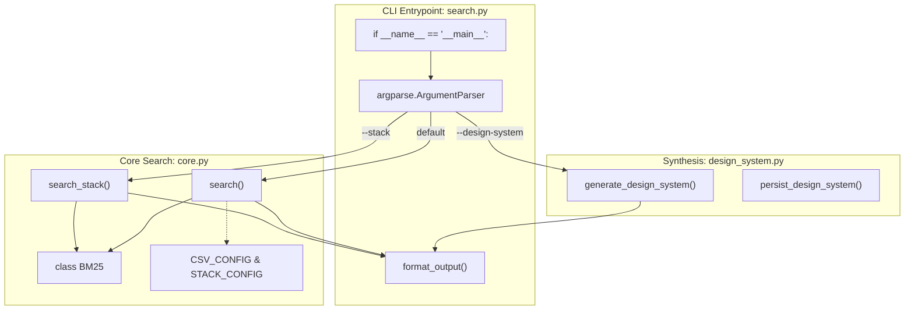
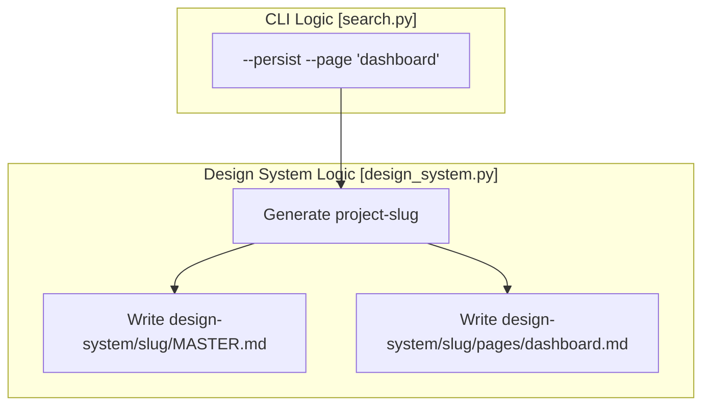

# search.py CLI 인터페이스

<details>
<summary>관련 소스 파일</summary>

다음 파일들은 이 위키 페이지를 생성하기 위한 컨텍스트로 사용되었습니다.

- [.claude/skills/ui-ux-pro-max/scripts/core.py](.claude/skills/ui-ux-pro-max/scripts/core.py)
- [.claude/skills/ui-ux-pro-max/scripts/search.py](.claude/skills/ui-ux-pro-max/scripts/search.py)
- [cli/assets/scripts/search.py](cli/assets/scripts/search.py)
- [src/ui-ux-pro-max/data/stacks/flutter.csv](src/ui-ux-pro-max/data/stacks/flutter.csv)
- [src/ui-ux-pro-max/data/stacks/jetpack-compose.csv](src/ui-ux-pro-max/data/stacks/jetpack-compose.csv)
- [src/ui-ux-pro-max/data/stacks/shadcn.csv](src/ui-ux-pro-max/data/stacks/shadcn.csv)
- [src/ui-ux-pro-max/scripts/core.py](src/ui-ux-pro-max/scripts/core.py)
- [src/ui-ux-pro-max/scripts/search.py](src/ui-ux-pro-max/scripts/search.py)

</details>


## 목적과 범위

`search.py` 스크립트는 UI/UX Pro Max 검색 엔진의 주요 명령줄 인터페이스입니다. 사용자 쿼리, BM25 랭킹 알고리즘, 디자인 데이터베이스 사이의 흐름을 오케스트레이션합니다. 두 가지 주요 작동 모드인 **Standard Search**(도메인 또는 스택별)와 **Design System Generation**(추론 엔진 사용)을 제공합니다.

이 인터페이스는 AI agents(Claude, Cursor 등)가 직접 호출하거나 개발자가 터미널에서 호출하도록 설계되었습니다. LLM에 전달되는 디자인 인텔리전스의 관련성을 극대화하면서 token 소비를 최소화하기 위한 정교한 출력 형식화를 포함합니다.

---

## 아키텍처와 데이터 흐름

`search.py` 스크립트는 검색 작업을 위해 `core.py`의 로직을, 복잡한 합성을 위해 `design_system.py`의 로직을 가져오는 controller 역할을 합니다.

**다이어그램: CLI 로직과 코드 엔티티 매핑**



**Sources:** [src/ui-ux-pro-max/scripts/search.py:20-21](), [src/ui-ux-pro-max/scripts/search.py:75-114]()

---

## 명령줄 인수

CLI는 검색 범위, 출력 형식, persistence를 제어하기 위한 다양한 플래그를 지원합니다.

### 핵심 인수

| 플래그 | Alias | 타입 | 설명 |
| :--- | :--- | :--- | :--- |
| `query` | N/A | Positional | 자연어 검색 문자열(예: "minimalist fintech dashboard"). |
| `--domain` | `-d` | Choice | 검색을 특정 CSV로 필터링합니다(예: `style`, `color`, `ux`). |
| `--stack` | `-s` | Choice | 검색을 특정 기술 스택으로 필터링합니다(예: `react`, `shadcn`, `flutter`). |
| `--max-results`| `-n` | Int | 반환되는 행 수를 제한합니다(기본값: 3). |
| `--json` | N/A | Flag | 형식화된 Markdown 대신 raw JSON을 반환합니다. |

**Sources:** [src/ui-ux-pro-max/scripts/search.py:57-62]()

### 디자인 시스템 및 Persistence 플래그

| 플래그 | Alias | 타입 | 설명 |
| :--- | :--- | :--- | :--- |
| `--design-system`| `-ds`| Flag | `generate_design_system` 파이프라인을 트리거합니다. |
| `--project-name` | `-p` | String | 파일 이름 지정을 위한 project slug를 설정합니다. |
| `--persist` | N/A | Flag | 출력을 프로젝트 디렉터리의 `MASTER.md`에 저장합니다. |
| `--page` | N/A | String | `design-system/pages/`에 페이지별 override 파일을 생성합니다. |

**Sources:** [src/ui-ux-pro-max/scripts/search.py:64-70]()

---

## 구현 세부 사항

### 도메인 및 스택 검증
CLI는 `core.py`의 구성 dictionary를 검사하여 `--domain`과 `--stack`에 허용되는 선택지를 동적으로 채웁니다.
- **Domains:** `CSV_CONFIG.keys()`에서 파생 [src/ui-ux-pro-max/scripts/search.py:59]()
- **Stacks:** `AVAILABLE_STACKS`에서 파생 [src/ui-ux-pro-max/scripts/search.py:60]()

### 출력 형식화
`format_output` 함수 [src/ui-ux-pro-max/scripts/search.py:30-53]()는 AI 성능에 중요합니다. 이 함수는 다음을 수행합니다.
1. **Header Generation:** 사용된 도메인 또는 스택과 소스 파일을 식별합니다 [src/ui-ux-pro-max/scripts/search.py:36-42]().
2. **Result Iteration:** BM25 hits를 순회합니다 [src/ui-ux-pro-max/scripts/search.py:44]().
3. **Aggressive Truncation:** 컨텍스트 창 공간을 절약하기 위해 300자를 초과하는 필드 값은 ellipsis(`...`)로 잘라냅니다 [src/ui-ux-pro-max/scripts/search.py:48-49]().
4. **Encoding Safety:** 디자인 데이터의 emojis를 처리할 때 Windows 환경에서 crash가 발생하지 않도록 stdout에 UTF-8을 강제합니다 [src/ui-ux-pro-max/scripts/search.py:24-27]().

**Sources:** [src/ui-ux-pro-max/scripts/search.py:24-53]()

---

## Persistence: Master + Overrides 패턴

`--persist` 플래그를 사용하면 CLI는 계층적 문서화 전략을 구현합니다. 이는 main block에서 호출되는 `persist_design_system` 함수가 처리합니다.

**다이어그램: 파일 Persistence 흐름**



사용자가 `--project-name "My App"`을 제공하면 CLI는 이를 `my-app`으로 변환합니다 [src/ui-ux-pro-max/scripts/search.py:88](). 그런 다음 `MASTER.md`에는 전역 규칙이 포함되고 특정 page files에는 localized overrides가 포함되는 구조를 생성합니다 [src/ui-ux-pro-max/scripts/search.py:90-97]().

**Sources:** [src/ui-ux-pro-max/scripts/search.py:87-98]()

---

## 사용 예시

### 1. 단순 도메인 검색
```bash
python search.py "dark mode dashboard" --domain style --max-results 2
```

### 2. 스택별 기술 검색
```bash
python search.py "form validation" --stack react --json
```

### 3. Persistence를 포함한 전체 디자인 시스템 생성
```bash
python search.py "fintech mobile app" --design-system --persist --project-name "WealthWise" --page "onboarding"
```

**Sources:** [src/ui-ux-pro-max/scripts/search.py:5-15]()
