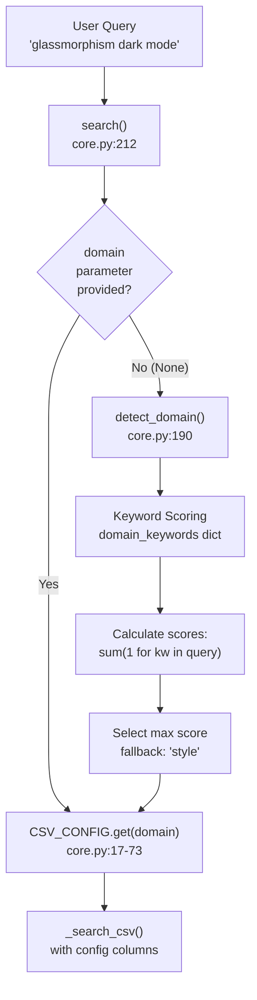
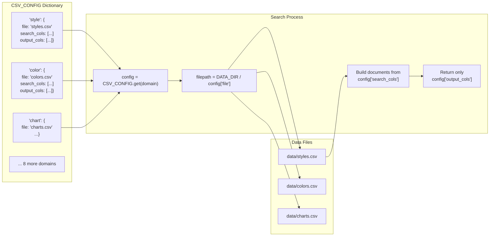
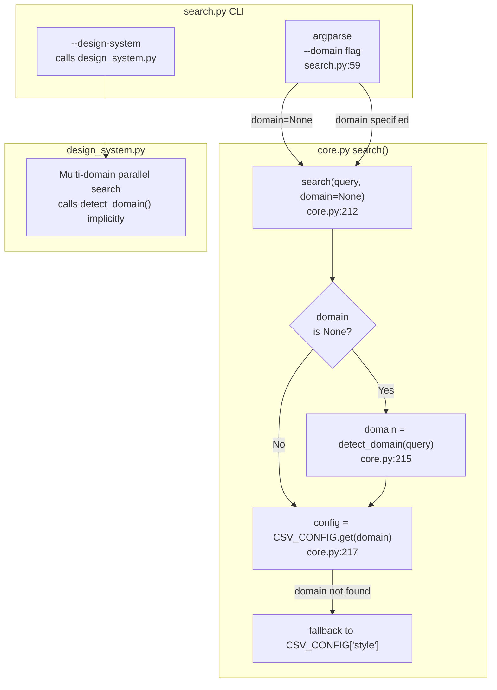

# 도메인 감지 및 구성

<details>
<summary>관련 소스 파일</summary>

다음 파일들은 이 위키 페이지를 생성하기 위한 컨텍스트로 사용되었습니다.

- [.claude/skills/ui-ux-pro-max/scripts/core.py](.claude/skills/ui-ux-pro-max/scripts/core.py)
- [.claude/skills/ui-ux-pro-max/scripts/search.py](.claude/skills/ui-ux-pro-max/scripts/search.py)
- [CLAUDE.md](CLAUDE.md)
- [cli/assets/scripts/search.py](cli/assets/scripts/search.py)
- [src/ui-ux-pro-max/data/stacks/flutter.csv](src/ui-ux-pro-max/data/stacks/flutter.csv)
- [src/ui-ux-pro-max/data/stacks/jetpack-compose.csv](src/ui-ux-pro-max/data/stacks/jetpack-compose.csv)
- [src/ui-ux-pro-max/data/stacks/shadcn.csv](src/ui-ux-pro-max/data/stacks/shadcn.csv)
- [src/ui-ux-pro-max/scripts/core.py](src/ui-ux-pro-max/scripts/core.py)
- [src/ui-ux-pro-max/scripts/search.py](src/ui-ux-pro-max/scripts/search.py)

</details>


이 문서는 사용자 쿼리를 적절한 CSV 데이터베이스로 라우팅하는 자동 도메인 감지 시스템과, 도메인이 파일 및 열에 매핑되는 방식을 정의하는 구성 dictionary를 설명합니다. BM25 검색 알고리즘 자체에 대한 정보는 [5.1 BM25 Algorithm Implementation]()을 참조하세요. 도메인 감지를 사용하는 명령줄 인터페이스는 [5.2 search.py CLI Interface]()를 참조하세요.

## 목적과 범위

도메인 감지 시스템은 사용자 쿼리가 `--domain` 플래그 [src/ui-ux-pro-max/scripts/search.py:59]()를 통해 명시적으로 도메인을 지정하지 않았을 때 어떤 CSV 데이터베이스를 검색할지 결정하는 문제를 해결합니다. 이 시스템은 키워드 점수화를 사용해 자연어 쿼리를 분석하고 가장 관련성 높은 데이터베이스(style, color, typography, chart 등)로 자동 라우팅합니다 [src/ui-ux-pro-max/scripts/core.py:190-209](). 구성 시스템(`CSV_CONFIG`와 `STACK_CONFIG`)은 도메인 이름, CSV 파일, 검색하거나 반환할 열 사이의 매핑을 정의합니다 [src/ui-ux-pro-max/scripts/core.py:17-92]().

---

## 도메인 감지 흐름

**다이어그램: 도메인 감지를 통한 쿼리 라우팅**



**Sources:** [src/ui-ux-pro-max/scripts/core.py:190-231](), [src/ui-ux-pro-max/scripts/search.py:108-114]()

---

## detect_domain 함수

`detect_domain()` 함수는 각 도메인에 대해 미리 정의된 키워드 목록과 쿼리 텍스트를 비교 분석하고 가장 높은 점수를 가진 도메인을 반환합니다 [src/ui-ux-pro-max/scripts/core.py:190]().

**알고리즘:**

1. 쿼리를 소문자로 변환합니다: `query_lower = query.lower()` [src/ui-ux-pro-max/scripts/core.py:192]().
2. 도메인별 키워드 목록이 있는 `domain_keywords` dictionary를 정의합니다 [src/ui-ux-pro-max/scripts/core.py:194-205]().
3. 각 도메인을 점수화합니다: `sum(1 for kw in keywords if kw in query_lower)` [src/ui-ux-pro-max/scripts/core.py:207]().
4. 최대 점수의 도메인을 반환하거나, 모든 점수가 0이면 `"style"`을 반환합니다 [src/ui-ux-pro-max/scripts/core.py:208-209]().

**구현:**

```python
def detect_domain(query):
    """Auto-detect the most relevant domain from query"""
    query_lower = query.lower()
    
    domain_keywords = {
        "color": ["color", "palette", "hex", "#", "rgb"],
        "chart": ["chart", "graph", "visualization", ...],
        # ... 10 domains total
    }
    
    scores = {domain: sum(1 for kw in keywords if kw in query_lower) 
              for domain, keywords in domain_keywords.items()}
    best = max(scores, key=scores.get)
    return best if scores[best] > 0 else "style"
```

**키워드 매칭:** 단순 substring matching(`in` operator)을 사용하므로 부분 매칭도 계산됩니다(예: "dashboards"는 "dashboard"와 매칭) [src/ui-ux-pro-max/scripts/core.py:207]().

**Sources:** [src/ui-ux-pro-max/scripts/core.py:190-209]()

---

## 도메인 키워드 매핑

**표: 모든 도메인과 감지 키워드**

| 도메인 | 키워드 | 주요 사용 사례 |
|--------|----------|------------------|
| `color` | color, palette, hex, #, rgb | 색상 체계 선택 |
| `chart` | chart, graph, visualization, trend, bar, pie, scatter, heatmap, funnel | 데이터 시각화 유형 선택 |
| `landing` | landing, page, cta, conversion, hero, testimonial, pricing, section | Landing page 구조 |
| `product` | saas, ecommerce, e-commerce, fintech, healthcare, gaming, portfolio, crypto, dashboard | 제품 카테고리 식별 |
| `style` | style, design, ui, minimalism, glassmorphism, neumorphism, brutalism, dark mode, flat, aurora, prompt, css, implementation, variable, checklist, tailwind | UI 스타일 선택(fallback domain) |
| `ux` | ux, usability, accessibility, wcag, touch, scroll, animation, keyboard, navigation, mobile | UX best practices |
| `typography` | font, typography, heading, serif, sans | 폰트 조합 선택 |
| `icons` | icon, icons, lucide, heroicons, symbol, glyph, pictogram, svg icon | Icon library 검색 |
| `react` | react, next.js, nextjs, suspense, memo, usecallback, useeffect, rerender, bundle, waterfall, barrel, dynamic import, rsc, server component | React 성능 패턴 |
| `web` | aria, focus, outline, semantic, virtualize, autocomplete, form, input type, preconnect | 웹 인터페이스 가이드라인 |

**Sources:** [src/ui-ux-pro-max/scripts/core.py:194-205]()

---

## CSV 구성 Dictionary

`CSV_CONFIG` dictionary는 각 도메인을 CSV 파일과 열 명세에 매핑합니다 [src/ui-ux-pro-max/scripts/core.py:17-73](). 이 dictionary는 다음을 정의합니다.
- `file`: `data/` 디렉터리의 CSV 파일명.
- `search_cols`: BM25 검색을 위해 연결할 열 [src/ui-ux-pro-max/scripts/core.py:104-162]().
- `output_cols`: 결과로 반환할 열.

**다이어그램: CSV_CONFIG 구조와 사용**



**Sources:** [src/ui-ux-pro-max/scripts/core.py:17-73](), [src/ui-ux-pro-max/scripts/core.py:217-231]()

---

## 도메인별 열 구성

각 도메인에는 검색 및 출력에 최적화된 열 구성이 있습니다 [src/ui-ux-pro-max/scripts/core.py:17-73]().

**Style Domain:**
- **검색 열:** `Style Category`, `Keywords`, `Best For`, `Type`, `AI Prompt Keywords` [src/ui-ux-pro-max/scripts/core.py:20]().
- **출력 열:** CSS keywords, implementation checklist, design system variables를 포함한 16개 열 [src/ui-ux-pro-max/scripts/core.py:21]().
- **파일:** `styles.csv` [src/ui-ux-pro-max/scripts/core.py:19]().

**Color Domain:**
- **검색 열:** `Product Type`, `Notes` [src/ui-ux-pro-max/scripts/core.py:25]().
- **출력 열:** Primary, Secondary, Accent, Background, Muted variants를 포함한 18개 열 [src/ui-ux-pro-max/scripts/core.py:26]().
- **파일:** `colors.csv` [src/ui-ux-pro-max/scripts/core.py:24]().

**Product Domain:**
- **검색 열:** `Product Type`, `Keywords`, `Primary Style Recommendation`, `Key Considerations` [src/ui-ux-pro-max/scripts/core.py:40]().
- **출력 열:** style recommendations, landing patterns, dashboard styles 포함 [src/ui-ux-pro-max/scripts/core.py:41]().
- **파일:** `products.csv` [src/ui-ux-pro-max/scripts/core.py:39]().

**UX Domain:**
- **검색 열:** `Category`, `Issue`, `Description`, `Platform` [src/ui-ux-pro-max/scripts/core.py:45]().
- **출력 열:** `Do`, `Don't`, `Code Example Good`, `Code Example Bad`, `Severity` 포함 [src/ui-ux-pro-max/scripts/core.py:46]().
- **파일:** `ux-guidelines.csv` [src/ui-ux-pro-max/scripts/core.py:44]().

**Typography Domain:**
- **검색 열:** `Font Pairing Name`, `Category`, `Mood/Style Keywords`, `Best For`, `Heading Font`, `Body Font` [src/ui-ux-pro-max/scripts/core.py:50]().
- **출력 열:** Google Fonts URL, CSS Import, Tailwind Config 포함 [src/ui-ux-pro-max/scripts/core.py:51]().
- **파일:** `typography.csv` [src/ui-ux-pro-max/scripts/core.py:49]().

**Sources:** [src/ui-ux-pro-max/scripts/core.py:17-73]()

---

## 스택 구성 Dictionary

`STACK_CONFIG` dictionary는 16개 기술 스택을 해당 CSV 파일에 매핑합니다 [src/ui-ux-pro-max/scripts/core.py:75-92](). 모든 스택은 `_STACK_COLS` [src/ui-ux-pro-max/scripts/core.py:95-98]()에 정의된 공통 열 구성을 공유합니다.

**구조:**

```python
STACK_CONFIG = {
    "react":            {"file": "stacks/react.csv"},
    "nextjs":           {"file": "stacks/nextjs.csv"},
    "vue":              {"file": "stacks/vue.csv"},
    # ... 13 more stacks
}

_STACK_COLS = {
    "search_cols": ["Category", "Guideline", "Description", "Do", "Don't"],
    "output_cols": ["Category", "Guideline", "Description", "Do", "Don't", "Code Good", "Code Bad", "Severity", "Docs URL"]
}
```

**사용 가능한 스택:**
- `react`, `nextjs`, `vue`, `svelte`, `astro`, `swiftui`, `react-native`, `flutter`, `nuxtjs`, `nuxt-ui`, `html-tailwind`, `shadcn`, `jetpack-compose`, `threejs`, `angular`, `laravel` [src/ui-ux-pro-max/scripts/core.py:75-92]().

**주요 차이점:** 스택 검색은 명시적인 스택 이름이 필요한 `search_stack()` 함수 [src/ui-ux-pro-max/scripts/core.py:234]()를 사용하며, `detect_domain()`을 사용하지 않습니다.

**Sources:** [src/ui-ux-pro-max/scripts/core.py:75-100](), [src/ui-ux-pro-max/scripts/search.py:100-106]()

---

## 검색 함수와의 통합

**다이어그램: 도메인 감지 통합 지점**



**Sources:** [src/ui-ux-pro-max/scripts/core.py:212-231](), [src/ui-ux-pro-max/scripts/search.py:56-114]()

---

## Fallback 동작

**기본 도메인:** 어떤 키워드도 매칭되지 않으면(모든 점수 = 0), `detect_domain` 함수는 기본적으로 `"style"`을 반환합니다 [src/ui-ux-pro-max/scripts/core.py:209]().

**잘못된 도메인:** 수동으로 지정한 도메인이 `CSV_CONFIG`에 없으면 `search()` 함수는 `"style"`로 fallback합니다 [src/ui-ux-pro-max/scripts/core.py:217]().

```python
config = CSV_CONFIG.get(domain, CSV_CONFIG["style"])
```

**근거:** `style` 도메인은 가장 넓은 키워드 범위를 가지며 UI/UX Pro Max 시스템의 주요 범용 디자인 데이터베이스 역할을 합니다 [src/ui-ux-pro-max/scripts/core.py:18-22]().

**Sources:** [src/ui-ux-pro-max/scripts/core.py:18-22](), [src/ui-ux-pro-max/scripts/core.py:209](), [src/ui-ux-pro-max/scripts/core.py:217]()

---

## 감지 시나리오 예시

**표: Query → Domain Detection 예시**

| Query | 매칭된 키워드 | 도메인 | 점수 |
|-------|------------------|--------|-------|
| "glassmorphism dark mode" | "glassmorphism", "dark", "mode" | `style` | 3 |
| "SaaS dashboard color palette" | "saas", "dashboard", "color", "palette" | `product` OR `color` | 각각 2(먼저 나온 것 우선) |
| "chart for sales trends" | "chart", "trend" | `chart` | 2 |
| "aria label accessibility" | "aria", "accessibility" | `ux` OR `web` | 각각 2 |
| "beautiful landing page" | "landing", "page" | `landing` | 2 |
| "font pairing elegant" | "font" | `typography` | 1 |
| "react useEffect waterfall" | "react", "useeffect", "waterfall" | `react` | 3 |

**참고:** 여러 도메인이 같은 점수를 가질 때 Python의 `max()`는 `domain_keywords`의 dictionary 순서를 기준으로 먼저 등장한 항목을 반환합니다 [src/ui-ux-pro-max/scripts/core.py:208]().

**Sources:** [src/ui-ux-pro-max/scripts/core.py:194-209]()
