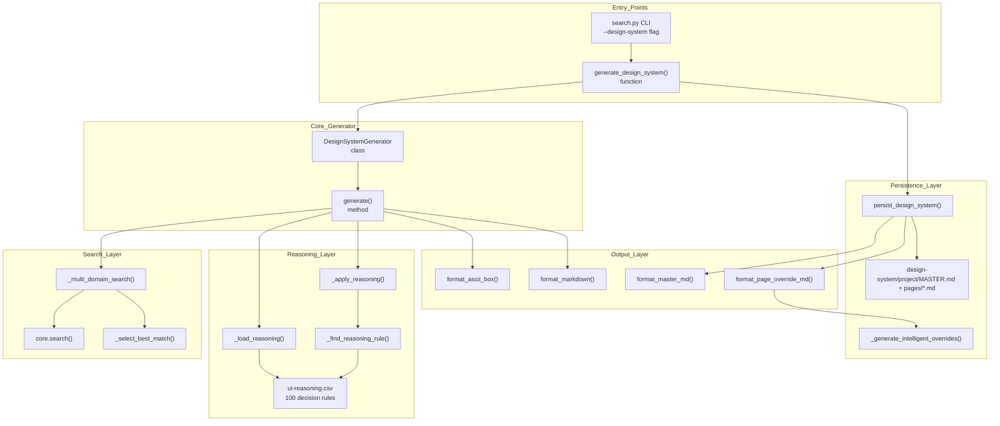
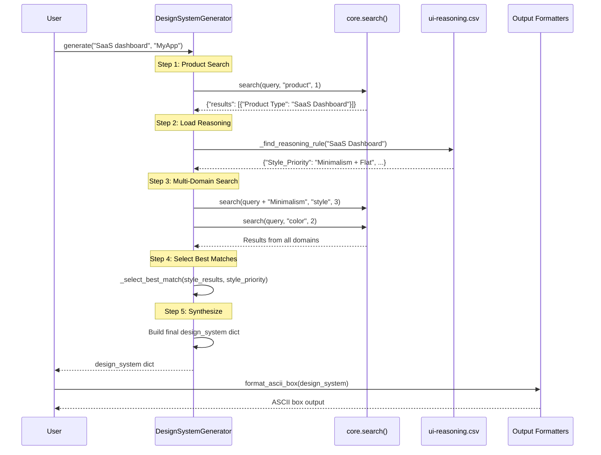

# 디자인 시스템 생성기

<details>
<summary>관련 소스 파일</summary>

다음 파일들은 이 위키 페이지를 생성하기 위한 컨텍스트로 사용되었습니다.

- [.claude/skills/ui-ux-pro-max/scripts/design_system.py](.claude/skills/ui-ux-pro-max/scripts/design_system.py)
- [cli/assets/scripts/core.py](cli/assets/scripts/core.py)
- [cli/assets/scripts/design_system.py](cli/assets/scripts/design_system.py)
- [src/ui-ux-pro-max/scripts/design_system.py](src/ui-ux-pro-max/scripts/design_system.py)

</details>


Design System Generator는 다중 도메인 검색 결과를 집계하고 추론 규칙을 적용하여 포괄적인 디자인 시스템 추천을 생성하는 모듈입니다. 이 모듈은 5개 지식 도메인(제품 카테고리, 스타일, 색상, 타이포그래피, 랜딩 패턴)의 데이터를 합성하고 컨텍스트 인식 의사 결정 로직을 적용하여, 선택적 파일 persistence를 포함한 프로젝트별 디자인 명세를 생성합니다.

기반 검색 엔진에 대한 정보는 [Search Engine](#5)을 참조하세요. CLI 인터페이스에 대한 정보는 [search.py CLI Interface](#5.2)를 참조하세요. Master + Overrides 패턴 구현에 대한 정보는 [Master + Overrides Pattern](#6.2)을 참조하세요.

**Sources:** [src/ui-ux-pro-max/scripts/design_system.py:1-14]()

## 아키텍처 개요

Design System Generator는 BM25 검색 엔진([cli/assets/scripts/core.py:89-150]()), 추론 규칙([ui-reasoning.csv]()), 출력 formatter 사이에서 조정된 파이프라인으로 작동합니다. 시스템은 자연어 쿼리를 받아 구조화된 디자인 명세를 생성합니다.

### 구성 요소 다이어그램



**Sources:** [src/ui-ux-pro-max/scripts/design_system.py:37-237](), [cli/assets/scripts/design_system.py:37-237]()

## DesignSystemGenerator Class

`DesignSystemGenerator` class([src/ui-ux-pro-max/scripts/design_system.py:37-236]())는 전체 생성 프로세스를 오케스트레이션합니다. 이 class는 `ui-reasoning.csv`의 추론 규칙으로 초기화되며 다중 도메인 검색, 규칙 매칭, 결과 합성을 위한 메서드를 제공합니다.

### Class 구조

| 메서드 | 목적 | 반환 |
|--------|---------|---------|
| `__init__()` | CSV에서 추론 규칙 로드 | None |
| `_load_reasoning()` | `ui-reasoning.csv`를 dict 목록으로 파싱 | `list[dict]` |
| `_multi_domain_search(query, style_priority)` | 5개 도메인 전반에서 병렬 검색 실행 | `dict` |
| `_find_reasoning_rule(category)` | 제품 카테고리를 추론 규칙에 매칭 | `dict` |
| `_apply_reasoning(category, search_results)` | 스타일 우선순위, anti-patterns, effects 추출 | `dict` |
| `_select_best_match(results, priority_keywords)` | 키워드 매칭으로 결과 점수화 | `dict` |
| `_extract_results(search_result)` | 검색 dict에서 results 배열 unwrap | `list` |
| `generate(query, project_name)` | 주요 오케스트레이터 메서드 | `dict` |

**Sources:** [src/ui-ux-pro-max/scripts/design_system.py:37-163]()

### 구성 상수

```python
# Search configuration defines domains and result limits
SEARCH_CONFIG = {
    "product": {"max_results": 1},
    "style": {"max_results": 3},
    "color": {"max_results": 2},
    "landing": {"max_results": 2},
    "typography": {"max_results": 2}
}

# Reasoning file location
REASONING_FILE = "ui-reasoning.csv"
```

`SEARCH_CONFIG` dictionary([src/ui-ux-pro-max/scripts/design_system.py:27-33]())는 어떤 도메인을 쿼리하고 각 도메인에서 몇 개의 결과를 가져올지 제어합니다. Product 검색은 기본 카테고리를 식별하기 위해 결과를 1개만 반환하고, style 검색은 우선순위 기반 선택을 허용하기 위해 3개 결과를 반환합니다.

**Sources:** [src/ui-ux-pro-max/scripts/design_system.py:24-33]()

## 생성 파이프라인

생성 프로세스는 자연어 쿼리를 완전한 디자인 시스템 명세로 변환하는 5단계 파이프라인을 따릅니다. 내부 로직과 키워드 점수화에 대한 자세한 분석은 [Generation Pipeline](#6.1)을 참조하세요.

### 파이프라인 흐름 다이어그램



**Sources:** [src/ui-ux-pro-max/scripts/design_system.py:163-236]()

## Master + Overrides 패턴

시스템은 디자인 가이드라인을 관리하기 위해 계층적 파일 구조를 사용합니다. 이를 통해 전역 "Source of Truth"를 유지하면서도 필요한 경우 특정 페이지가 벗어날 수 있습니다.

*   **MASTER.md**: 색상, 타이포그래피, 간격, 표준 컴포넌트에 대한 전역 규칙을 포함합니다([src/ui-ux-pro-max/scripts/design_system.py:542-802]()).
*   **pages/*.md**: 지능형 컨텍스트 감지를 통해 생성된 특정 페이지 유형(예: "Dashboard", "Settings")의 overrides를 포함합니다([src/ui-ux-pro-max/scripts/design_system.py:805-911]()).

Markdown 구조와 override 로직에 대한 자세한 내용은 [Master + Overrides Pattern](#6.2)을 참조하세요.

**Sources:** [src/ui-ux-pro-max/scripts/design_system.py:491-539]()

## Persistence 및 파일 구조

`persist_design_system` 함수([src/ui-ux-pro-max/scripts/design_system.py:491-539]())는 디자인 시스템 디렉터리의 실제 생성을 처리합니다. 프로젝트 slug를 생성하고, 필요한 폴더 계층을 만들고, Markdown 파일을 작성합니다.

### 지능형 Override 생성
정적 템플릿을 사용하는 대신, 시스템은 `_generate_intelligent_overrides`([src/ui-ux-pro-max/scripts/design_system.py:914-1017]())를 사용하여 생성 중인 특정 페이지에 대한 targeted searches를 수행합니다. 페이지 유형(예: "Authentication", "Dashboard")을 감지하고 검색 키워드를 기반으로 레이아웃 규칙을 추론합니다.

디렉터리 경로와 slug 생성 프로세스에 대한 자세한 내용은 [Persistence and File Structure](#6.3)를 참조하세요.

**Sources:** [src/ui-ux-pro-max/scripts/design_system.py:914-1052]()
