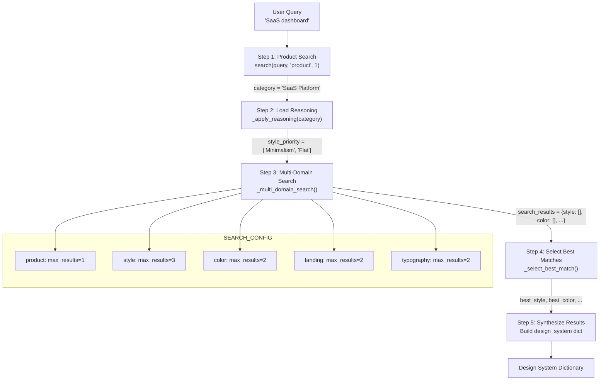
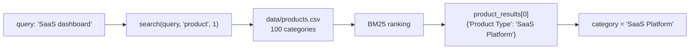
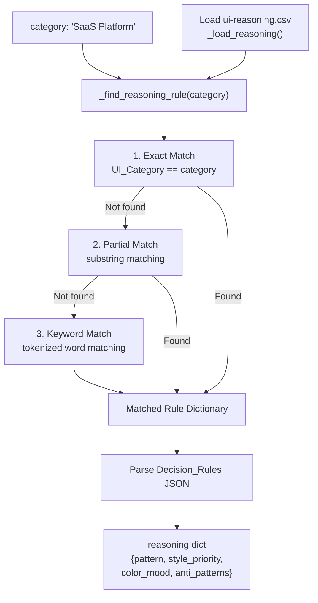
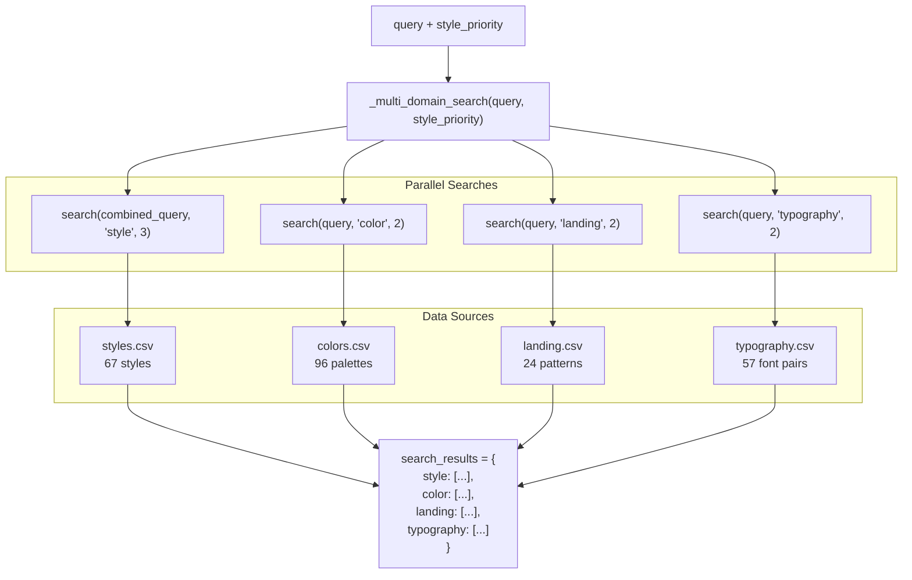
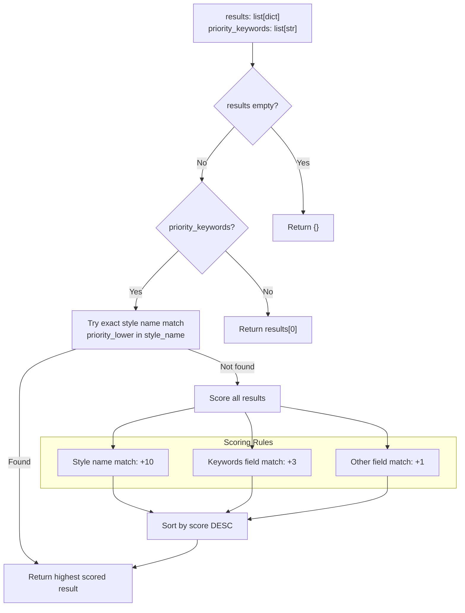
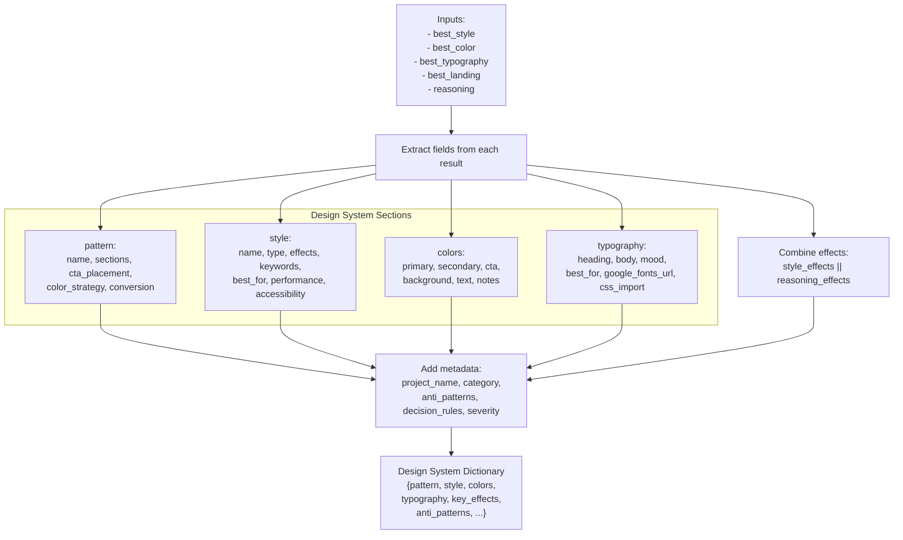
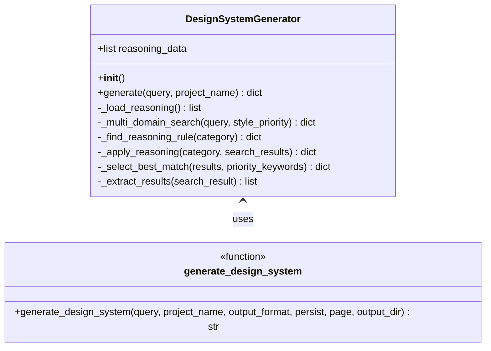
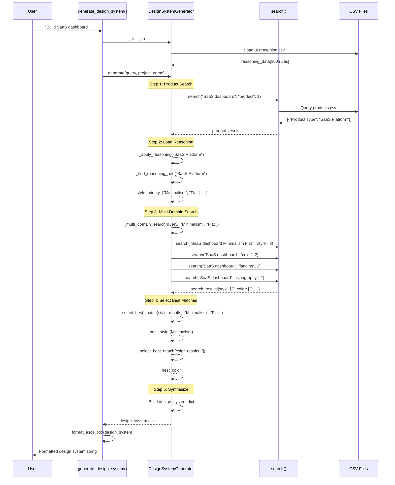

# 생성 파이프라인

<details>
<summary>관련 소스 파일</summary>

다음 파일들은 이 위키 페이지를 생성하기 위한 컨텍스트로 사용되었습니다.

- [.claude/skills/ui-ux-pro-max/scripts/design_system.py](.claude/skills/ui-ux-pro-max/scripts/design_system.py)
- [cli/assets/scripts/core.py](cli/assets/scripts/core.py)
- [cli/assets/scripts/design_system.py](cli/assets/scripts/design_system.py)
- [src/ui-ux-pro-max/scripts/design_system.py](src/ui-ux-pro-max/scripts/design_system.py)

</details>


이 문서는 포괄적인 디자인 시스템 추천을 생성하기 위해 `DesignSystemGenerator` class가 실행하는 5단계 프로세스를 자세히 설명합니다. 파이프라인은 제품 분류, 추론 규칙 로드, 다중 도메인 검색 실행, 최적 매칭 선택, 결과를 구조화된 디자인 시스템으로 합성하는 과정을 수행합니다.

persistence 메커니즘(Master + Overrides 패턴)에 대한 정보는 [6.2]()를 참조하세요. 검색 엔진 구현에 대한 자세한 내용은 [5]()를 참조하세요.

---

## 개요

생성 파이프라인은 `DesignSystemGenerator` class에 구현되어 있으며 `generate()` 메서드가 오케스트레이션합니다. 이 프로세스는 자연어 쿼리(예: "SaaS dashboard")를 색상, 타이포그래피, 레이아웃 패턴, 컴포넌트 명세, anti-patterns를 포함하는 포괄적인 디자인 시스템 명세로 변환합니다.

**Sources:** [src/ui-ux-pro-max/scripts/design_system.py:37-236](), [cli/assets/scripts/design_system.py:37-236]()

---

## 파이프라인 아키텍처

### 고수준 흐름



**Sources:** [src/ui-ux-pro-max/scripts/design_system.py:163-236](), [cli/assets/scripts/design_system.py:163-236]()

---

## Step 1: Product Search

파이프라인은 `product` 도메인에서 단일 검색을 통해 제품 카테고리를 식별하는 것으로 시작합니다. 이 분류는 어떤 추론 규칙을 적용할지 결정합니다.

### 구현



제품 검색은 [src/ui-ux-pro-max/scripts/design_system.py:166]()에서 다음과 같이 실행됩니다.
```python
product_result = search(query, "product", 1)
product_results = product_result.get("results", [])
category = "General"
if product_results:
    category = product_results[0].get("Product Type", "General")
```

제품 매칭을 찾지 못하면 카테고리는 기본값 `"General"`을 사용합니다.

**Sources:** [src/ui-ux-pro-max/scripts/design_system.py:165-170](), [cli/assets/scripts/design_system.py:165-170]()

---

## Step 2: Load Reasoning

제품 카테고리를 얻은 뒤 파이프라인은 `ui-reasoning.csv`의 추론 규칙을 적용하여 디자인 우선순위와 제약 조건을 결정합니다.

### 추론 규칙 매칭

`_apply_reasoning()` 메서드는 3단계 매칭 전략을 구현합니다.



### 추론 데이터 구조

추론 규칙은 다음 구조의 dictionary를 반환합니다.

| 필드 | 타입 | 목적 |
|-------|------|---------|
| `pattern` | string | 추천 페이지 패턴(예: "Hero + Features + CTA") |
| `style_priority` | list[string] | 순서가 있는 스타일 선호 목록(예: ["Minimalism", "Flat Design"]) |
| `color_mood` | string | 색상 팔레트 분위기(예: "Professional") |
| `typography_mood` | string | 타이포그래피 분위기(예: "Clean") |
| `key_effects` | string | 추천 효과와 애니메이션 |
| `anti_patterns` | string | 피해야 할 디자인 패턴(예: "Cluttered dashboards + Excessive animations") |
| `decision_rules` | dict | 조건부 로직을 위한 JSON 파싱된 의사 결정 규칙 |
| `severity` | string | 우선순위 수준: "LOW", "MEDIUM", 또는 "HIGH" |

**Sources:** [src/ui-ux-pro-max/scripts/design_system.py:64-120](), [cli/assets/scripts/design_system.py:64-120]()

---

## Step 3: Multi-Domain Search

스타일 우선순위가 설정되면 파이프라인은 `SEARCH_CONFIG`에 정의된 5개 디자인 도메인 전반에서 병렬 검색을 실행합니다.

### 검색 구성

```python
SEARCH_CONFIG = {
    "product": {"max_results": 1},
    "style": {"max_results": 3},
    "color": {"max_results": 2},
    "landing": {"max_results": 2},
    "typography": {"max_results": 2}
}
```

### 다중 도메인 실행



### 스타일 검색 보강

`style` 도메인의 경우 파이프라인은 관련성을 높이기 위해 style priority 키워드로 쿼리를 보강합니다.

```python
if domain == "style" and style_priority:
    priority_query = " ".join(style_priority[:2]) if style_priority else query
    combined_query = f"{query} {priority_query}"
    results[domain] = search(combined_query, domain, config["max_results"])
```

이를 통해 추론 규칙이 SaaS 플랫폼에 대해 "Minimalism + Flat Design"을 제안하면 style 검색이 해당 스타일을 우선하도록 보장합니다.

**Sources:** [src/ui-ux-pro-max/scripts/design_system.py:27-33](), [src/ui-ux-pro-max/scripts/design_system.py:51-62]()

---

## Step 4: Select Best Matches

파이프라인은 우선순위 기반 점수화를 사용하여 각 도메인에서 최적 결과를 선택합니다.

### 선택 알고리즘

`_select_best_match()` 메서드는 가중치 기반 점수화 시스템을 구현합니다.



### 점수화 예시

`style_priority = ["Minimalism", "Flat Design"]`이고 style 결과가 3개인 쿼리의 경우:

| 결과 | Style Category | Keywords | 점수 계산 | 총점 |
|--------|----------------|----------|-------------------|-------------|
| Result 1 | "Minimalism" | "clean, simple, white space" | 이름에 "Minimalism" 포함(+10) | **10** |
| Result 2 | "Flat Design" | "minimal, flat, no gradients" | 이름에 "Flat Design" 포함(+10) | **10** |
| Result 3 | "Material Design" | "depth, shadows, responsive" | 매칭 없음 | **0** |

Result 1 또는 2가 선택됩니다(동점에서는 첫 매칭 우선).

**Sources:** [src/ui-ux-pro-max/scripts/design_system.py:122-157](), [cli/assets/scripts/design_system.py:122-157]()

---

## Step 5: Synthesize Results

마지막 단계는 선택된 결과를 구조화된 디자인 시스템 dictionary로 집계합니다.

### 합성 프로세스



### 필드 매핑

합성 프로세스는 CSV 열을 디자인 시스템 필드에 매핑합니다.

**Pattern Section:**
```python
"pattern": {
    "name": best_landing.get("Pattern Name", reasoning.get("pattern")),
    "sections": best_landing.get("Section Order", "Hero > Features > CTA"),
    "cta_placement": best_landing.get("Primary CTA Placement", "Above fold"),
    "color_strategy": best_landing.get("Color Strategy", ""),
    "conversion": best_landing.get("Conversion Optimization", "")
}
```

**Colors Section:**
```python
"colors": {
    "primary": best_color.get("Primary (Hex)", "#2563EB"),
    "secondary": best_color.get("Secondary (Hex)", "#3B82F6"),
    "cta": best_color.get("CTA (Hex)", "#F97316"),
    "background": best_color.get("Background (Hex)", "#F8FAFC"),
    "text": best_color.get("Text (Hex)", "#1E293B"),
    "notes": best_color.get("Notes", "")
}
```

**Typography Section:**
```python
"typography": {
    "heading": best_typography.get("Heading Font", "Inter"),
    "body": best_typography.get("Body Font", "Inter"),
    "mood": best_typography.get("Mood/Style Keywords", reasoning.get("typography_mood")),
    "best_for": best_typography.get("Best For", ""),
    "google_fonts_url": best_typography.get("Google Fonts URL", ""),
    "css_import": best_typography.get("CSS Import", "")
}
```

**Sources:** [src/ui-ux-pro-max/scripts/design_system.py:191-236](), [cli/assets/scripts/design_system.py:191-236]()

---

## Class 구조와 진입점

### DesignSystemGenerator Class



### Public API

모듈은 단일 진입점 함수를 노출합니다.

```python
def generate_design_system(
    query: str,
    project_name: str = None,
    output_format: str = "ascii",
    persist: bool = False,
    page: str = None,
    output_dir: str = None
) -> str
```

**매개변수:**
- `query`: 검색 쿼리(예: "SaaS dashboard", "e-commerce luxury")
- `project_name`: 출력 헤더를 위한 선택적 프로젝트 이름
- `output_format`: `"ascii"`(기본값) 또는 `"markdown"`
- `persist`: `True`이면 디자인 시스템을 `design-system/` 폴더에 저장([6.3]() 참조)
- `page`: 페이지별 override 파일을 위한 선택적 페이지 이름
- `output_dir`: 선택적 출력 디렉터리(기본값은 현재 작업 디렉터리)

**Returns:** 형식화된 디자인 시스템 문자열

**Sources:** [src/ui-ux-pro-max/scripts/design_system.py:462-487](), [cli/assets/scripts/design_system.py:462-487]()

---

## 데이터 흐름 예시

### 전체 파이프라인 실행



**Sources:** [src/ui-ux-pro-max/scripts/design_system.py:163-236](), [cli/assets/scripts/design_system.py:163-236]()

---

## 구성 상수

### SEARCH_CONFIG

각 도메인에서 가져올 결과 수를 정의합니다.

| 도메인 | 최대 결과 수 | 목적 |
|--------|-------------|---------|
| `product` | 1 | 단일 제품 분류 |
| `style` | 3 | best match selection을 위한 여러 스타일 옵션 |
| `color` | 2 | 기본 및 대안 색상 팔레트 |
| `landing` | 2 | 기본 및 fallback landing patterns |
| `typography` | 2 | 기본 및 대안 폰트 조합 |

**Sources:** [src/ui-ux-pro-max/scripts/design_system.py:27-33](), [cli/assets/scripts/design_system.py:27-33]()

### REASONING_FILE

추론 규칙 CSV를 가리킵니다.
```python
REASONING_FILE = "ui-reasoning.csv"
```

이 파일은 `core` 모듈의 `DATA_DIR` 기준으로 로드됩니다.

**Sources:** [src/ui-ux-pro-max/scripts/design_system.py:25](), [cli/assets/scripts/design_system.py:25]()

---

## 오류 처리와 Fallbacks

파이프라인은 각 단계마다 방어적인 fallbacks를 구현합니다.

### Step 1 Fallback
제품 매칭을 찾지 못한 경우:
```python
category = "General"
```

### Step 2 Fallback
추론 규칙을 찾지 못한 경우:
```python
return {
    "pattern": "Hero + Features + CTA",
    "style_priority": ["Minimalism", "Flat Design"],
    "color_mood": "Professional",
    "typography_mood": "Clean",
    "key_effects": "Subtle hover transitions",
    "anti_patterns": "",
    "decision_rules": {},
    "severity": "MEDIUM"
}
```

### Step 4 Fallback
결과 목록이 비어 있는 경우:
```python
return {}
```

우선순위 키워드가 없는 경우:
```python
return results[0]  # Return first result
```

### Step 5 Fallback
기본 hex 색상 값:
```python
"primary": best_color.get("Primary (Hex)", "#2563EB"),
"secondary": best_color.get("Secondary (Hex)", "#3B82F6"),
# ... etc
```

**Sources:** [src/ui-ux-pro-max/scripts/design_system.py:92-102](), [src/ui-ux-pro-max/scripts/design_system.py:124-128](), [src/ui-ux-pro-max/scripts/design_system.py:217-221]()

---

## 검색 엔진과의 통합

파이프라인은 `core` 모듈의 `search()` 함수에 의존합니다.

```python
from core import search, DATA_DIR
```

각 도메인 검색은 다음을 호출합니다.
```python
search(query: str, domain: str, max_results: int) -> dict
```

검색 함수는 다음 구조의 dictionary를 반환합니다.
```python
{
    "query": str,
    "domain": str,
    "results": list[dict],
    "count": int
}
```

BM25 검색 구현에 대한 자세한 정보는 [5.1]()을 참조하세요.

**Sources:** [src/ui-ux-pro-max/scripts/design_system.py:21](), [cli/assets/scripts/core.py:158-185]()
