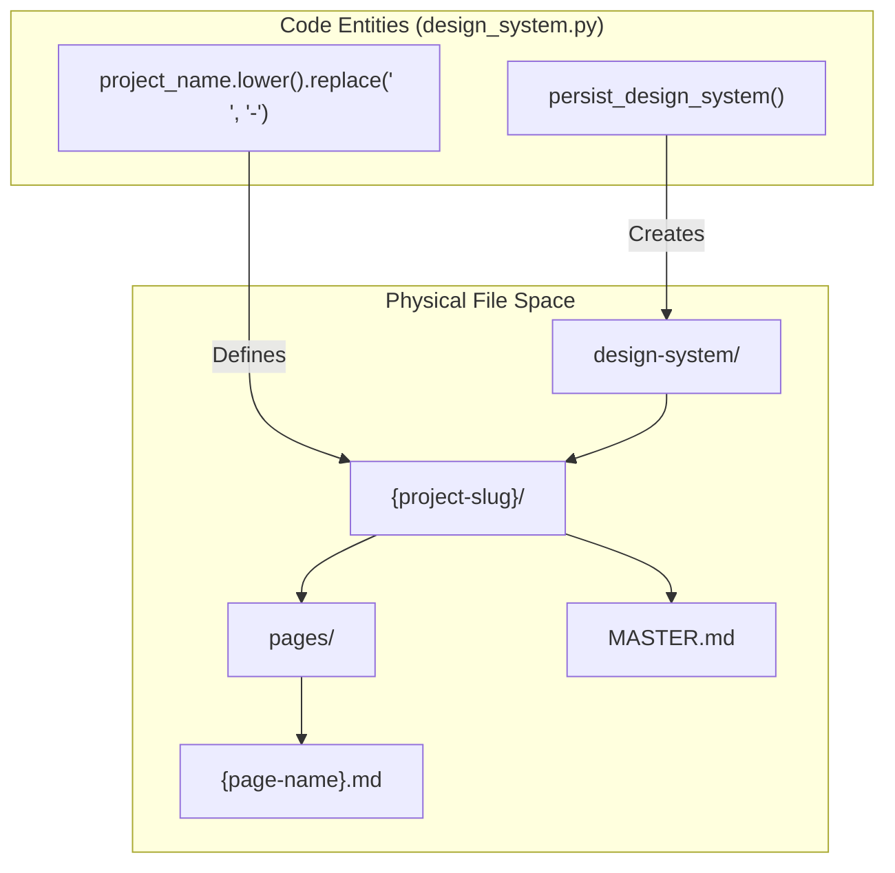
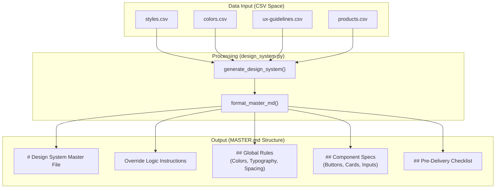
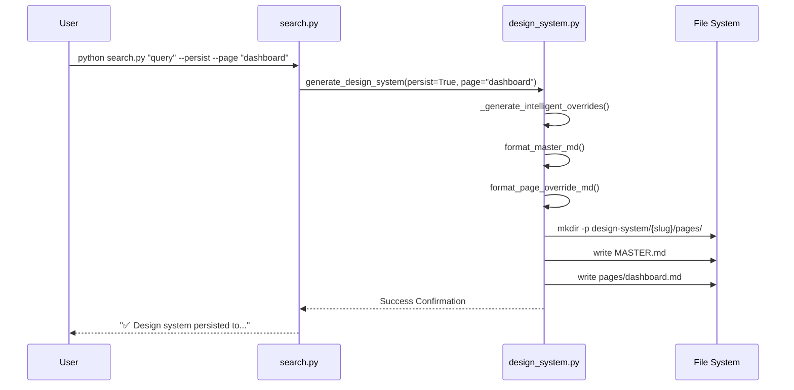

# Master + Overrides 패턴

관련 소스 파일

다음 파일들은 이 위키 페이지를 생성하기 위한 컨텍스트로 사용되었습니다.

- [.claude/skills/ui-ux-pro-max/SKILL.md](.claude/skills/ui-ux-pro-max/SKILL.md)
- [.claude/skills/ui-ux-pro-max/data/react-performance.csv](.claude/skills/ui-ux-pro-max/data/react-performance.csv)
- [.claude/skills/ui-ux-pro-max/scripts/core.py](.claude/skills/ui-ux-pro-max/scripts/core.py)
- [.claude/skills/ui-ux-pro-max/scripts/search.py](.claude/skills/ui-ux-pro-max/scripts/search.py)
- [src/ui-ux-pro-max/data/google-fonts.csv](src/ui-ux-pro-max/data/google-fonts.csv)

## 목적과 범위

이 문서는 디자인 시스템을 디스크에 영속화하기 위한 계층적 파일 구조 시스템인 **Master + Overrides 패턴**을 설명합니다. 이 패턴은 `MASTER.md`가 전역 디자인 규칙을 포함하고 `pages/*.md` 파일이 페이지별 override를 포함하는 2계층 아키텍처를 구현합니다. 이를 통해 프로젝트 전반에 일관된 기본 디자인을 유지하면서도 특정 페이지(예: 대시보드, checkout 흐름, landing page)에 맞는 맥락별 변형을 허용할 수 있습니다.

이 패턴은 주로 `design_system.py` 모듈 안에서 구현되며 `search.py` CLI를 통해 노출됩니다.

---

## 아키텍처 개요

### 디렉터리 구조

`persist_design_system()` 함수가 호출되면, 시스템은 `design-system/` 루트 아래에 프로젝트별 디렉터리 계층을 생성합니다. 프로젝트 이름은 URL에 적합한 slug로 변환되어 프로젝트 폴더를 정의합니다.

**코드 엔티티 공간에서 파일 시스템으로의 매핑**

**출처:** [.claude/skills/ui-ux-pro-max/scripts/design_system.py:491-539](), [.claude/skills/ui-ux-pro-max/scripts/search.py:87-98]()

---

## 파일 구조와 내용

### MASTER.md: 전역 디자인 규칙

`MASTER.md` 파일은 프로젝트의 UI/UX 표준에 대한 전역 "Source of Truth" 역할을 합니다. 이 파일에는 여러 도메인 검색에서 합성된 완전한 디자인 시스템이 포함됩니다.

**다이어그램: MASTER.md 내용 생성**

**출처:** [.claude/skills/ui-ux-pro-max/scripts/design_system.py:542-802](), [.claude/skills/ui-ux-pro-max/scripts/core.py:17-47]()

#### 로직과 우선순위
`MASTER.md`의 헤더는 AI assistant가 계층 구조를 처리하는 방법을 명시적으로 지시합니다.
> **로직:** 특정 페이지를 만들 때는 먼저 `design-system/pages/[page-name].md`를 확인합니다. 해당 파일이 존재하면 그 규칙이 이 Master 파일을 **override**합니다.

**출처:** [.claude/skills/ui-ux-pro-max/scripts/design_system.py:559-561]()

---

### pages/*.md: 페이지별 Overrides

페이지별 override 파일은 master system과 다른 편차만 포함합니다. 이 파일들은 `_generate_intelligent_overrides()`를 사용해 생성되며, 해당 함수는 특정 page type(예: "Dashboard")을 감지하고 그에 따라 layout, density, component 규칙을 조정합니다.

**페이지 유형 감지 로직**
시스템은 사용자의 page query를 keyword cluster와 대조합니다.

| 페이지 범주 | 키워드(일부 목록) |
| :--- | :--- |
| **Dashboard** | `dashboard, admin, analytics, data, metrics` |
| **Checkout** | `checkout, payment, cart, purchase` |
| **Landing** | `landing, marketing, homepage, hero` |
| **Auth** | `login, signin, signup, register` |

**출처:** [.claude/skills/ui-ux-pro-max/scripts/design_system.py:1020-1052]()

---

## 구현과 데이터 흐름

### 영속화 파이프라인

CLI 명령에서 영속화된 파일까지의 흐름은 `search.py`와 `design_system.py` 사이의 상호작용을 포함합니다.

**다이어그램: CLI에서 영속화까지의 흐름**

**출처:** [.claude/skills/ui-ux-pro-max/scripts/search.py:68-98](), [.claude/skills/ui-ux-pro-max/scripts/design_system.py:491-539]()

### 핵심 구현 세부 사항

1.  **Project Slugification**: `--project-name`(또는 `-p`)으로 제공된 프로젝트 이름은 안전한 파일 경로를 보장하기 위해 `lower().replace(' ', '-')`를 사용해 정리됩니다 [[.claude/skills/ui-ux-pro-max/scripts/design_system.py:508]]().
2.  **Path Resolution**: 시스템은 `pathlib.Path`를 사용해 현재 working directory 또는 지정된 `--output-dir`을 기준으로 `design-system` 디렉터리를 해석합니다 [[.claude/skills/ui-ux-pro-max/scripts/design_system.py:504-514]]().
3.  **Intelligent Overrides**: `_generate_intelligent_overrides` 함수는 맥락별 layout 규칙(예: dashboards에는 더 넓은 `max-width`, blog posts에는 더 좁은 `max-width` 설정)을 추출하기 위해 `ux` 및 `landing` 도메인에서 보조 검색을 수행합니다 [[.claude/skills/ui-ux-pro-max/scripts/design_system.py:914-1017]]().

---

## AI Assistants를 위한 사용법

AI assistant(예: Claude 또는 Cursor)가 이 패턴을 사용하는 프로젝트와 상호작용할 때는 다음 검색 전략을 따라야 합니다.

1.  사용자가 만들고자 하는 **대상 페이지를 식별**합니다.
2.  **override 파일을 찾습니다**: `design-system/{project}/pages/{page}.md`를 찾습니다.
3.  **Master를 로드합니다**: `design-system/{project}/MASTER.md`를 읽습니다.
4.  **병합합니다**: `MASTER.md`의 모든 규칙을 적용하되, 페이지별 파일과 충돌이 있으면 페이지별 규칙을 우선합니다.

**출처:** [.claude/skills/ui-ux-pro-max/scripts/search.py:96-98](), [.claude/skills/ui-ux-pro-max/scripts/design_system.py:559-561]()
