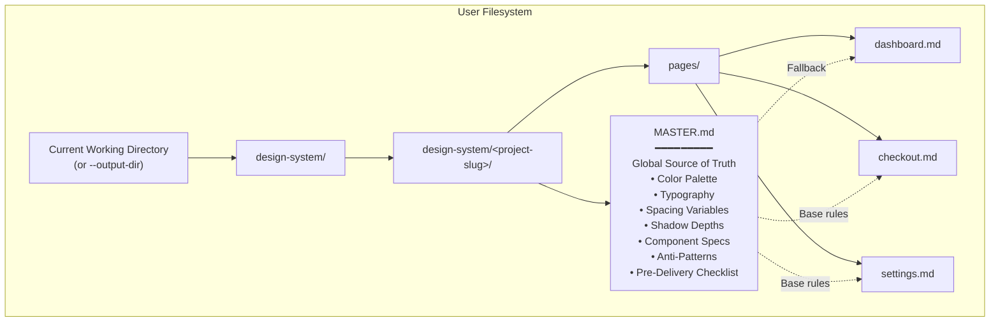
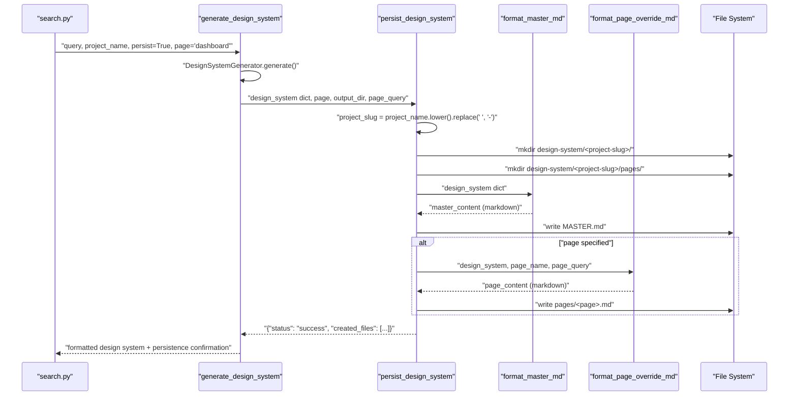
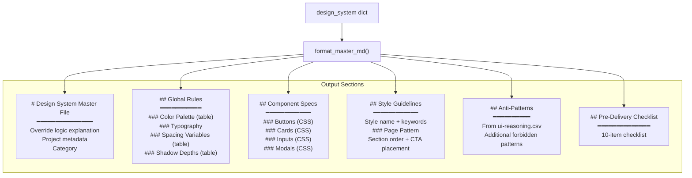
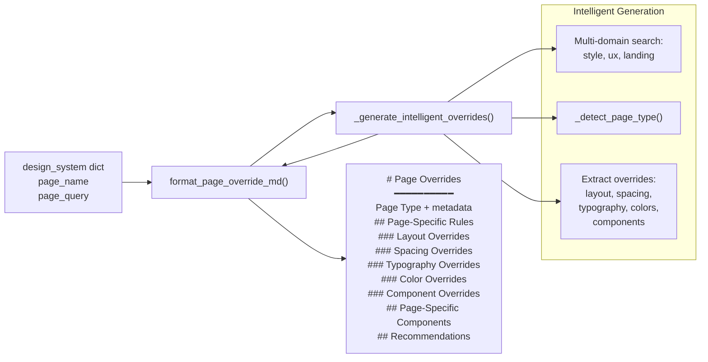
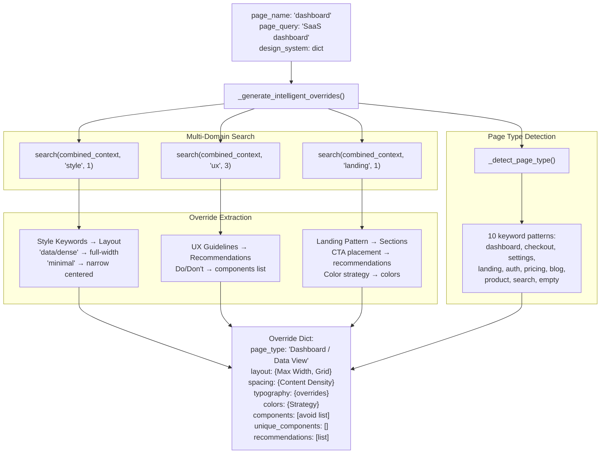
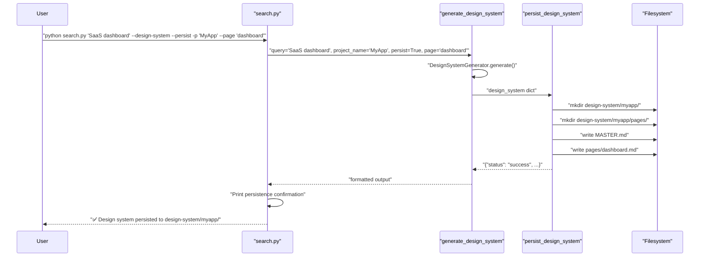
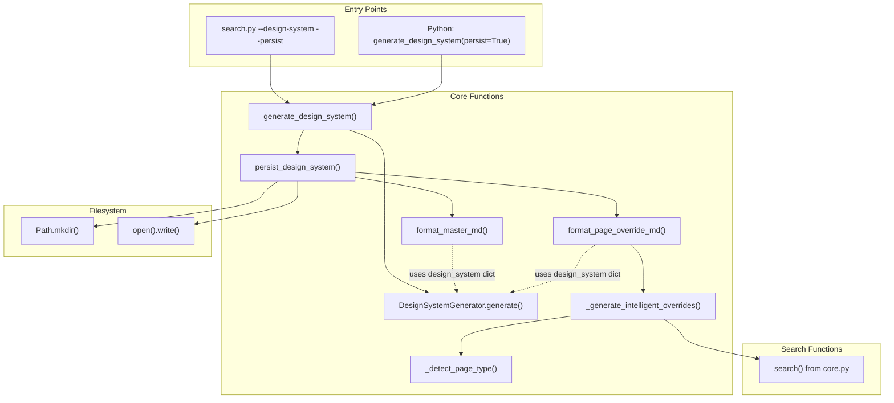

# Persistence와 파일 구조

<details>
<summary>관련 소스 파일</summary>

다음 파일들은 이 위키 페이지를 생성하기 위한 컨텍스트로 사용되었습니다.

- [.claude/skills/ui-ux-pro-max/scripts/design_system.py](.claude/skills/ui-ux-pro-max/scripts/design_system.py)
- [cli/assets/scripts/core.py](cli/assets/scripts/core.py)
- [cli/assets/scripts/design_system.py](cli/assets/scripts/design_system.py)
- [src/ui-ux-pro-max/scripts/design_system.py](src/ui-ux-pro-max/scripts/design_system.py)

</details>


이 페이지는 Master + Overrides 패턴을 사용해 생성된 디자인 시스템을 디스크에 저장하는 Design System Generator의 persistence 메커니즘을 문서화합니다. 여기에는 `persist_design_system` 함수, 디렉터리 구조 생성, 파일 formatter, 지능형 page override 생성이 포함됩니다.

Master + Overrides 패턴의 개념적 기반은 **6.2 Master + Overrides Pattern**을 참조하세요. persistence flag의 CLI 사용법은 **5.2 search.py CLI Interface**를 참조하세요.

---

## 개요

persistence 시스템은 메모리상의 design system dictionary를 디스크의 계층적 파일 구조로 변환합니다. `design-system/<project-slug>/` 아래에 프로젝트별 폴더를 만들고 두 가지 유형의 markdown 파일을 생성합니다.

| 파일 유형 | 경로 | 목적 |
|-----------|------|---------|
| **MASTER.md** | `design-system/<project>/MASTER.md` | 전역 디자인 규칙(colors, typography, spacing, components) |
| **Page Overrides** | `design-system/<project>/pages/<page>.md` | MASTER.md와 다른 페이지별 편차 |

persistence 시스템은 `search.py`의 `--persist` flag를 통해 호출되며, page override에는 search 기반의 지능형 content generation을 사용합니다.

**출처:** [src/ui-ux-pro-max/scripts/design_system.py:490-539](), [.claude/skills/ui-ux-pro-max/scripts/design_system.py:490-539]()

---

## Persistence 아키텍처

### 파일 구조 출력

제목: Persistence 디렉터리 계층


**디렉터리 구조 예시:**

```
design-system/
└── my-saas-app/
    ├── MASTER.md              # Global design rules
    └── pages/
        ├── dashboard.md       # Dashboard-specific overrides
        ├── checkout.md        # Checkout-specific overrides
        └── settings.md        # Settings-specific overrides
```

**출처:** [src/ui-ux-pro-max/scripts/design_system.py:491-539](), [.claude/skills/ui-ux-pro-max/scripts/design_system.py:491-539]()

---

## persist_design_system 함수

### 함수 Signature와 흐름

제목: Persistence 로직 순서


**출처:** [src/ui-ux-pro-max/scripts/design_system.py:491-539](), [.claude/skills/ui-ux-pro-max/scripts/design_system.py:491-539]()

### 함수 구현

`persist_design_system` 함수는 다음 parameter를 받습니다.

| Parameter | Type | 설명 |
|-----------|------|-------------|
| `design_system` | `dict` | `DesignSystemGenerator.generate()`에서 생성된 design system dictionary |
| `page` | `str` (optional) | 페이지별 override 파일을 만들기 위한 page name |
| `output_dir` | `str` (optional) | 출력 디렉터리(기본값은 `Path.cwd()`) |
| `page_query` | `str` (optional) | 지능형 page override 생성을 위한 query string |

**반환값:** status와 생성된 파일 경로를 포함한 dictionary:
```python
{
    "status": "success",
    "design_system_dir": "design-system/my-project",
    "created_files": [
        "design-system/my-project/MASTER.md",
        "design-system/my-project/pages/dashboard.md"
    ]
}
```

**출처:** [src/ui-ux-pro-max/scripts/design_system.py:491-539](), [.claude/skills/ui-ux-pro-max/scripts/design_system.py:491-539]()

---

## Project Slug 생성

project slug는 design system dictionary의 `project_name` field에서 생성됩니다.

```python
project_name = design_system.get("project_name", "default")
project_slug = project_name.lower().replace(' ', '-')
```

**예시:**

| Project Name | Project Slug | 경로 |
|--------------|--------------|------|
| `"SaaS Dashboard"` | `"saas-dashboard"` | `design-system/saas-dashboard/` |
| `"E-commerce Luxury"` | `"e-commerce-luxury"` | `design-system/e-commerce-luxury/` |
| `"My Project"` | `"my-project"` | `design-system/my-project/` |
| `None` (default) | `"default"` | `design-system/default/` |

project name은 다음 중 하나에서 옵니다.
1. `search.py`의 `--project-name` CLI flag [cli/assets/scripts/search.py:65]()
2. 대문자로 변환된 query string(fallback) [src/ui-ux-pro-max/scripts/design_system.py:198]()

**출처:** [src/ui-ux-pro-max/scripts/design_system.py:504-510](), [.claude/skills/ui-ux-pro-max/scripts/design_system.py:504-510]()

---

## 디렉터리 생성

persistence 시스템은 `Path.mkdir(parents=True, exist_ok=True)`를 사용해 디렉터리를 생성합니다.

```python
design_system_dir = base_dir / "design-system" / project_slug
pages_dir = design_system_dir / "pages"

design_system_dir.mkdir(parents=True, exist_ok=True)  # Create parent dirs if needed
pages_dir.mkdir(parents=True, exist_ok=True)
```

**동작:**
- `parents=True`: 모든 중간 디렉터리(예: `design-system/`)를 생성합니다.
- `exist_ok=True`: 디렉터리가 이미 있어도 오류를 발생시키지 않습니다(idempotent).

따라서 반복 호출로도 디렉터리 충돌 없이 파일을 업데이트할 수 있습니다.

**출처:** [src/ui-ux-pro-max/scripts/design_system.py:515-517](), [.claude/skills/ui-ux-pro-max/scripts/design_system.py:515-517]()

---

## MASTER.md 생성

### format_master_md 함수

`format_master_md` 함수는 design system dictionary를 다음 section이 있는 구조화된 markdown 문서로 변환합니다.

제목: Master 파일 내용 생성


### Override Logic 헤더

MASTER.md 파일은 AI assistant를 위한 명시적 지침으로 시작합니다.

```markdown
> **LOGIC:** When building a specific page, first check `design-system/pages/[page-name].md`.
> If that file exists, its rules **override** this Master file.
> If not, strictly follow the rules below.
```

이는 AI assistant가 계층적 retrieval pattern을 따르도록 하기 위해 포함됩니다.

**출처:** [src/ui-ux-pro-max/scripts/design_system.py:559-561](), [.claude/skills/ui-ux-pro-max/scripts/design_system.py:559-561]()

### Component Specifications

component spec은 design system의 실제 color value가 포함된 CSS code block으로 렌더링됩니다.

```css
/* Primary Button */
.btn-primary {
  background: #F97316;  /* From colors.cta */
  color: white;
  padding: 12px 24px;
  border-radius: 8px;
  font-weight: 600;
  transition: all 200ms ease;
  cursor: pointer;
}
```

이 함수는 f-string을 사용해 color를 동적으로 주입합니다.

**출처:** [src/ui-ux-pro-max/scripts/design_system.py:633-731](), [.claude/skills/ui-ux-pro-max/scripts/design_system.py:633-731]()

---

## Page Override 생성

### format_page_override_md 함수

`format_page_override_md` 함수는 지능형 content가 포함된 페이지별 override 파일을 생성합니다. hardcoded template과 달리 search 기반 content generation을 사용합니다.

제목: Page Override 내용 생성


**출처:** [src/ui-ux-pro-max/scripts/design_system.py:805-911](), [.claude/skills/ui-ux-pro-max/scripts/design_system.py:805-911]()

### Override 구조

Page override 파일은 MASTER.md와 다른 **편차만** 문서화합니다.

```markdown
# Dashboard Page Overrides

> **PROJECT:** My SaaS App
> **Generated:** 2024-01-15 14:30:00
> **Page Type:** Dashboard / Data View

> ⚠️ **IMPORTANT:** Rules in this file **override** the Master file (`design-system/MASTER.md`).
> Only deviations from the Master are documented here. For all other rules, refer to the Master.

## Page-Specific Rules

### Layout Overrides
- **Max Width:** 1400px or full-width
- **Grid:** 12-column grid for data flexibility

### Spacing Overrides
- **Content Density:** High — optimize for information display
```

"IMPORTANT" callout은 override semantics를 AI assistant에게 명시적으로 지시합니다.

**출처:** [src/ui-ux-pro-max/scripts/design_system.py:814-826](), [.claude/skills/ui-ux-pro-max/scripts/design_system.py:814-826]()

---

## Intelligent Override 생성

### _generate_intelligent_overrides 함수

`_generate_intelligent_overrides` 함수는 hardcoded rule 대신 기존 BM25 search infrastructure를 사용해 contextual override를 생성합니다.

제목: Intelligent Override 추론


**출처:** [src/ui-ux-pro-max/scripts/design_system.py:914-1017](), [.claude/skills/ui-ux-pro-max/scripts/design_system.py:914-1017]()

### Search 기반 Override 로직

이 함수는 세 개의 parallel search를 수행하고 override를 추출합니다.

**1. Style Search → Layout 추론**

```python
style_search = search(combined_context, "style", max_results=1)
style_results = style_search.get("results", [])

if style_results:
    keywords = style_results[0].get("Keywords", "")
    
    # Infer layout from keywords
    if any(kw in keywords.lower() for kw in ["data", "dense", "dashboard", "grid"]):
        layout["Max Width"] = "1400px or full-width"
        layout["Grid"] = "12-column grid for data flexibility"
        spacing["Content Density"] = "High — optimize for information display"
```

이 로직은 [src/ui-ux-pro-max/scripts/design_system.py:950-970]()에 나타납니다.

**2. UX Search → Recommendations**

```python
ux_search = search(combined_context, "ux", max_results=3)
ux_results = ux_search.get("results", [])

for ux in ux_results:
    category = ux.get("Category", "")
    do_text = ux.get("Do", "")
    dont_text = ux.get("Don't", "")
    if do_text:
        recommendations.append(f"{category}: {do_text}")
    if dont_text:
        components.append(f"Avoid: {dont_text}")
```

이는 `ux-guidelines.csv`에서 실행 가능한 guidance를 추출합니다.

**3. Landing Search → Section Structure**

```python
landing_search = search(combined_context, "landing", max_results=1)
landing_results = landing_search.get("results", [])

if landing_results:
    sections = landing_results[0].get("Section Order", "")
    cta_placement = landing_results[0].get("Primary CTA Placement", "")
    color_strategy = landing_results[0].get("Color Strategy", "")
    
    if sections:
        layout["Sections"] = sections
    if cta_placement:
        recommendations.append(f"CTA Placement: {cta_placement}")
```

**출처:** [src/ui-ux-pro-max/scripts/design_system.py:926-995](), [.claude/skills/ui-ux-pro-max/scripts/design_system.py:926-995]()

---

## Page Type Detection

### _detect_page_type 함수

`_detect_page_type` 함수는 keyword pattern matching을 사용해 page를 분류합니다. 이 함수는 keyword-to-type mapping 목록을 사용합니다.

```python
page_patterns = [
    (["dashboard", "admin", "analytics", "data", "metrics", "stats", "monitor", "overview"], 
     "Dashboard / Data View"),
    (["checkout", "payment", "cart", "purchase", "order", "billing"], 
     "Checkout / Payment"),
    (["settings", "profile", "account", "preferences", "config"], 
     "Settings / Profile"),
    # ... 7 more patterns
]

for keywords, page_type in page_patterns:
    if any(kw in context_lower for kw in keywords):
        return page_type
```

pattern과 일치하지 않으면 style search results의 "Best For" field를 확인하고, 마지막으로 기본값 `"General"`을 반환합니다.

**출처:** [src/ui-ux-pro-max/scripts/design_system.py:1020-1052](), [.claude/skills/ui-ux-pro-max/scripts/design_system.py:1020-1052]()

---

## CLI 통합

### search.py Persistence Flags

`search.py` CLI는 persistence를 위해 세 가지 flag를 노출합니다.

| Flag | Type | 설명 |
|------|------|-------------|
| `--persist` | `action="store_true"` | design system을 `design-system/<project>/MASTER.md`에 저장합니다 |
| `--page <name>` | `str` | `pages/<name>.md`에 페이지별 override를 생성합니다 |
| `--output-dir <path>` | `str` | 출력 디렉터리(기본값: 현재 디렉터리) |

### 호출 흐름

제목: CLI에서 Persistence까지의 흐름


**출처:** [cli/assets/scripts/search.py:68-98](), [src/ui-ux-pro-max/scripts/search.py:68-98]()

---

## Function Call Graph

제목: Persistence 모듈 의존성


**주요 함수와 위치:**

| Function | File | Lines | 목적 |
|----------|------|-------|---------|
| `persist_design_system` | `design_system.py` | 491-539 | 주요 persistence orchestrator |
| `format_master_md` | `design_system.py` | 542-802 | MASTER.md content 생성 |
| `format_page_override_md` | `design_system.py` | 805-911 | page override content 생성 |
| `_generate_intelligent_overrides` | `design_system.py` | 914-1017 | search 기반 override 생성 |
| `_detect_page_type` | `design_system.py` | 1020-1052 | keyword 기반 page 분류 |
| `generate_design_system` | `design_system.py` | 462-487 | persist flag가 있는 entry point |

**출처:** [src/ui-ux-pro-max/scripts/design_system.py:462-1052](), [.claude/skills/ui-ux-pro-max/scripts/design_system.py:462-1052]()
