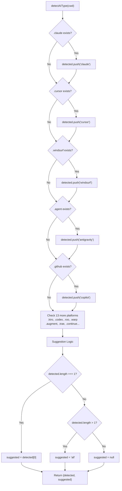
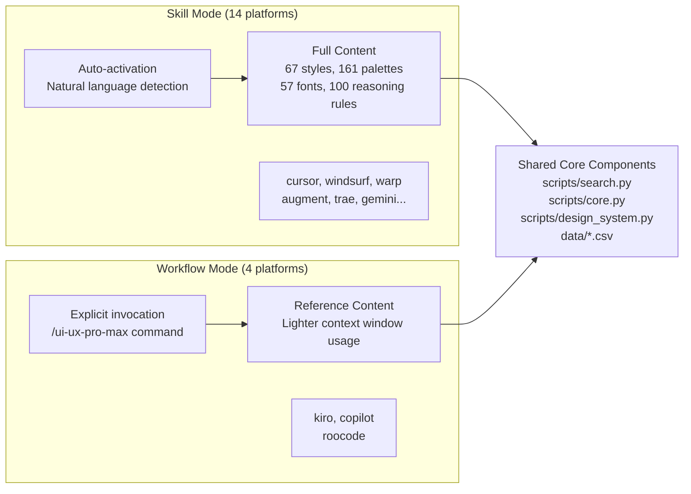

# 플랫폼 통합

<details>
<summary>관련 소스 파일</summary>

다음 파일들은 이 위키 페이지를 생성하기 위한 컨텍스트로 사용되었습니다.

- [cli/assets/templates/platforms/agent.json](cli/assets/templates/platforms/agent.json)
- [cli/assets/templates/platforms/augment.json](cli/assets/templates/platforms/augment.json)
- [cli/assets/templates/platforms/copilot.json](cli/assets/templates/platforms/copilot.json)
- [cli/assets/templates/platforms/cursor.json](cli/assets/templates/platforms/cursor.json)
- [cli/assets/templates/platforms/kilocode.json](cli/assets/templates/platforms/kilocode.json)
- [cli/assets/templates/platforms/kiro.json](cli/assets/templates/platforms/kiro.json)
- [cli/assets/templates/platforms/roocode.json](cli/assets/templates/platforms/roocode.json)
- [cli/assets/templates/platforms/warp.json](cli/assets/templates/platforms/warp.json)
- [cli/assets/templates/platforms/windsurf.json](cli/assets/templates/platforms/windsurf.json)
- [cli/src/commands/init.ts](cli/src/commands/init.ts)
- [cli/src/commands/uninstall.ts](cli/src/commands/uninstall.ts)
- [skill.json](skill.json)
- [src/ui-ux-pro-max/templates/platforms/agent.json](src/ui-ux-pro-max/templates/platforms/agent.json)
- [src/ui-ux-pro-max/templates/platforms/augment.json](src/ui-ux-pro-max/templates/platforms/augment.json)
- [src/ui-ux-pro-max/templates/platforms/copilot.json](src/ui-ux-pro-max/templates/platforms/copilot.json)
- [src/ui-ux-pro-max/templates/platforms/cursor.json](src/ui-ux-pro-max/templates/platforms/cursor.json)
- [src/ui-ux-pro-max/templates/platforms/kilocode.json](src/ui-ux-pro-max/templates/platforms/kilocode.json)
- [src/ui-ux-pro-max/templates/platforms/kiro.json](src/ui-ux-pro-max/templates/platforms/kiro.json)
- [src/ui-ux-pro-max/templates/platforms/roocode.json](src/ui-ux-pro-max/templates/platforms/roocode.json)
- [src/ui-ux-pro-max/templates/platforms/warp.json](src/ui-ux-pro-max/templates/platforms/warp.json)
- [src/ui-ux-pro-max/templates/platforms/windsurf.json](src/ui-ux-pro-max/templates/platforms/windsurf.json)

</details>


Platform Integration 시스템은 template 기반 configuration 메커니즘을 통해 UI/UX Pro Max가 18개 AI coding assistant에서 동작할 수 있게 합니다. 이 시스템은 단일 source of truth에서 플랫폼별 설치를 만들기 위해 platform detection, configuration management, file generation을 처리합니다. 이 통합을 구동하는 CLI command의 자세한 내용은 [CLI Commands](#2.1)를 참조하세요. template generation 메커니즘 자체는 [Template Generation](#2.4)을 참조하세요.

## 지원 플랫폼

이 시스템은 18개 AI coding assistant 플랫폼을 지원하며, 각 플랫폼은 `AIType` discriminator로 식별되고 JSON configuration file을 통해 특정 디렉터리 구조에 매핑됩니다.

| 플랫폼 | AIType | 루트 디렉터리 | 파일 구조 | 모드 |
|----------|--------|----------------|----------------|------|
| Claude Code | `claude` | `.claude/` | `skills/ui-ux-pro-max/SKILL.md` | Skill |
| Cursor | `cursor` | `.cursor/` | `skills/ui-ux-pro-max/SKILL.md` | Skill |
| Windsurf | `windsurf` | `.windsurf/` | `skills/ui-ux-pro-max/SKILL.md` | Skill |
| Antigravity | `antigravity` | `.agent/` | `skills/ui-ux-pro-max/SKILL.md` | Skill |
| GitHub Copilot | `copilot` | `.github/` | `prompts/ui-ux-pro-max/PROMPT.md` | Workflow |
| Kiro | `kiro` | `.kiro/` | `steering/ui-ux-pro-max/SKILL.md` | Workflow |
| Codex CLI | `codex` | `.codex/` | `skills/ui-ux-pro-max/SKILL.md` | Skill |
| Roo Code | `roocode` | `.roo/` | `skills/ui-ux-pro-max/SKILL.md` | Workflow |
| Qoder | `qoder` | `.qoder/` | `skills/ui-ux-pro-max/SKILL.md` | Skill |
| Gemini CLI | `gemini` | `.gemini/` | `skills/ui-ux-pro-max/SKILL.md` | Skill |
| Trae | `trae` | `.trae/` | `skills/ui-ux-pro-max/SKILL.md` | Skill |
| OpenCode | `opencode` | `.opencode/` | `skills/ui-ux-pro-max/SKILL.md` | Skill |
| Continue | `continue` | `.continue/` | `skills/ui-ux-pro-max/SKILL.md` | Skill |
| CodeBuddy | `codebuddy` | `.codebuddy/` | `skills/ui-ux-pro-max/SKILL.md` | Skill |
| Warp | `warp` | `.warp/` | `skills/ui-ux-pro-max/SKILL.md` | Skill |
| Augment | `augment` | `.augment/` | `skills/ui-ux-pro-max/SKILL.md` | Skill |
| Kilocode | `kilocode` | `.kilocode/` | `skills/ui-ux-pro-max/SKILL.md` | Skill |

**출처:** [cli/src/types/index.ts:1-62](), [cli/src/utils/detect.ts:10-65](), [src/ui-ux-pro-max/templates/platforms/warp.json:1-21](), [src/ui-ux-pro-max/templates/platforms/augment.json:1-21]()

## Platform Detection 시스템

### detectAIType 함수

`cli/src/utils/detect.ts`의 `detectAIType` 함수는 플랫폼별 디렉터리를 scan하여 filesystem 기반 platform detection을 수행합니다.



**감지 알고리즘:**

감지는 순차적 filesystem check pattern을 따릅니다.

1. **Parallel Directory Checks**: `AI_FOLDERS`에 정의된 각 플랫폼에 대해 `existsSync(join(cwd, platformDir))`를 사용합니다.
2. **Detection Accumulation**: 현재 working directory에서 감지된 모든 플랫폼의 배열을 구성합니다.
3. **Suggestion Logic**:
   - 정확히 1개 플랫폼이 감지되면 → 해당 특정 플랫폼을 제안합니다.
   - 여러 플랫폼이 감지되면 → `'all'`을 제안합니다.
   - 감지된 플랫폼이 없으면 → `null`을 제안합니다.

**출처:** [cli/src/utils/detect.ts:10-65](), [cli/src/commands/init.ts:123-147]()

## Platform Configuration Schema

### PlatformConfig Interface

각 플랫폼은 `PlatformConfig` interface를 따르는 JSON configuration file(예: `cursor.json`, `warp.json`)로 정의됩니다.

```typescript
interface PlatformConfig {
  platform: string;              // AIType identifier
  displayName: string;           // Human-readable name
  installType: InstallType;      // 'full' | 'reference'
  folderStructure: {
    root: string;                // Root directory (e.g., '.cursor')
    skillPath: string;           // Relative path to skill folder
    filename: string;            // Main file (SKILL.md or PROMPT.md)
  };
  scriptPath: string;            // Path to search.py for AI to execute
  frontmatter: Record<string, string> | null;  // YAML frontmatter (optional)
  sections: {
    quickReference: boolean;     // Include quick reference section
  };
  title: string;                 // Skill/Prompt title
  description: string;           // Detailed description
  skillOrWorkflow: string;       // 'Skill' | 'Workflow'
}
```

### Configuration 예시

**Skill Mode(전체 콘텐츠):**
[src/ui-ux-pro-max/templates/platforms/cursor.json:1-21]()
```json
{
  "platform": "cursor",
  "displayName": "Cursor",
  "installType": "full",
  "folderStructure": {
    "root": ".cursor",
    "skillPath": "skills/ui-ux-pro-max",
    "filename": "SKILL.md"
  },
  "scriptPath": "skills/ui-ux-pro-max/scripts/search.py",
  "skillOrWorkflow": "Skill"
}
```

**Workflow Mode(참조 콘텐츠):**
[src/ui-ux-pro-max/templates/platforms/roocode.json:1-21]()
```json
{
  "platform": "roocode",
  "displayName": "Roo Code",
  "installType": "full",
  "folderStructure": {
    "root": ".roo",
    "skillPath": "skills/ui-ux-pro-max",
    "filename": "SKILL.md"
  },
  "scriptPath": "skills/ui-ux-pro-max/scripts/search.py",
  "skillOrWorkflow": "Workflow"
}
```

**출처:** [src/ui-ux-pro-max/templates/platforms/cursor.json:1-21](), [src/ui-ux-pro-max/templates/platforms/roocode.json:1-21](), [src/ui-ux-pro-max/templates/platforms/kiro.json:1-21]()

## Skill Mode vs Workflow Mode

### 모드 비교 다이어그램



### 모드 특성

| 측면 | Skill Mode | Workflow Mode |
|--------|------------|---------------|
| **Trigger** | UI/UX keyword에서 자동 활성화 | 명시적 slash command 필요 |
| **Platforms** | 14개 플랫폼(Cursor, Windsurf, Warp 등) | 4개 플랫폼(Kiro, Copilot, Roo Code) |
| **Content Size** | 전체 knowledge base | 더 가벼운 reference content |
| **installType** | `'full'` | `'full'` |
| **Usage Pattern** | `"Build landing page..."` | `/ui-ux-pro-max Build landing page...` |

자세한 내용은 [Skill vs Workflow Modes](#7.2)를 참조하세요.

**출처:** [src/ui-ux-pro-max/templates/platforms/cursor.json:20](), [src/ui-ux-pro-max/templates/platforms/kiro.json:20](), [src/ui-ux-pro-max/templates/platforms/roocode.json:20]()

## 플랫폼별 변형

### 디렉터리 구조 변형

platform config의 `folderStructure` object가 최종 설치 경로를 결정합니다.

| 플랫폼 | 루트 디렉터리 | 하위 디렉터리 | 파일명 |
|----------|----------------|--------------|----------|
| Cursor | `.cursor/` | `skills/` | `SKILL.md` |
| GitHub Copilot | `.github/` | `prompts/` | `PROMPT.md` |
| Kiro | `.kiro/` | `steering/` | `SKILL.md` |
| Roo Code | `.roo/` | `skills/` | `SKILL.md` |
| Warp | `.warp/` | `skills/` | `SKILL.md` |

**출처:** [src/ui-ux-pro-max/templates/platforms/copilot.json:5-9](), [src/ui-ux-pro-max/templates/platforms/kiro.json:5-9](), [src/ui-ux-pro-max/templates/platforms/warp.json:5-9]()

### Frontmatter 변형

특정 플랫폼은 metadata와 activation trigger를 위해 YAML frontmatter를 사용합니다. 예를 들어 `kiro.json`과 `cursor.json`은 AI가 자신의 기능을 이해하는 데 도움이 되도록 `frontmatter` block에 description과 name을 포함합니다.

[src/ui-ux-pro-max/templates/platforms/kiro.json:11-14]()
```json
"frontmatter": {
  "name": "ui-ux-pro-max",
  "description": "Comprehensive design guide for web and mobile applications..."
}
```

## Template Generation 흐름

`cli/src/commands/init.ts`의 `initCommand`는 legacy ZIP을 다운로드하거나 modern template 기반 generation을 사용해 설치를 처리합니다.

1. **Platform Selection**: 사용자가 `AIType`을 선택하거나 CLI가 감지합니다.
2. **Template Loading**: CLI가 base template과 platform-specific JSON을 로드합니다.
3. **Variable Injection**: `title`, `description`, `scriptPath`를 template에 주입합니다.
4. **Filesystem Writing**: 디렉터리를 만들고 생성된 Markdown 파일을 작성합니다.
5. **Asset Copying**: `data/`와 `scripts/` 폴더를 target location에 복사합니다.

자세한 내용은 [Platform Configuration System](#7.1)을 참조하세요.

**출처:** [cli/src/commands/init.ts:97-115](), [cli/src/commands/init.ts:153-183]()

## Claude Marketplace 통합

이 skill은 Claude Marketplace를 통해서도 배포되므로 Claude Code에 직접 설치할 수 있습니다.

- **plugin.json**: Claude를 위한 plugin 구조를 정의합니다.
- **marketplace.json**: discovery를 위한 `ui`, `ux`, `design` 같은 keyword를 포함한 marketplace metadata를 담고 있습니다.

자세한 내용은 [Claude Marketplace Integration](#7.3)을 참조하세요.

**출처:** [skill.json:1-15](), [README.md:248-255]()
