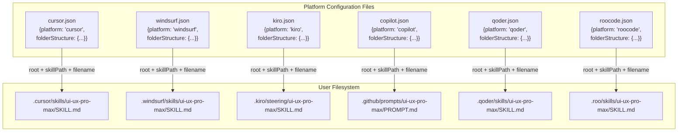
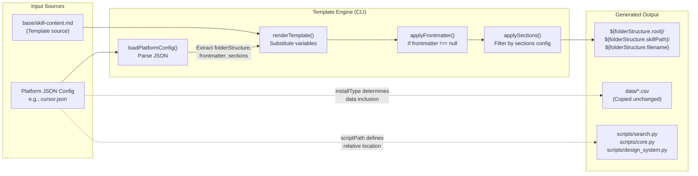

# Platform Configuration System

<details>
<summary>관련 소스 파일</summary>

다음 파일들은 이 위키 페이지를 생성하기 위한 컨텍스트로 사용되었습니다.

- [cli/assets/templates/platforms/agent.json](cli/assets/templates/platforms/agent.json)
- [cli/assets/templates/platforms/claude.json](cli/assets/templates/platforms/claude.json)
- [cli/assets/templates/platforms/codebuddy.json](cli/assets/templates/platforms/codebuddy.json)
- [cli/assets/templates/platforms/codex.json](cli/assets/templates/platforms/codex.json)
- [cli/assets/templates/platforms/continue.json](cli/assets/templates/platforms/continue.json)
- [cli/assets/templates/platforms/copilot.json](cli/assets/templates/platforms/copilot.json)
- [cli/assets/templates/platforms/cursor.json](cli/assets/templates/platforms/cursor.json)
- [cli/assets/templates/platforms/gemini.json](cli/assets/templates/platforms/gemini.json)
- [cli/assets/templates/platforms/kiro.json](cli/assets/templates/platforms/kiro.json)
- [cli/assets/templates/platforms/opencode.json](cli/assets/templates/platforms/opencode.json)
- [cli/assets/templates/platforms/roocode.json](cli/assets/templates/platforms/roocode.json)
- [cli/assets/templates/platforms/windsurf.json](cli/assets/templates/platforms/windsurf.json)
- [src/ui-ux-pro-max/templates/platforms/agent.json](src/ui-ux-pro-max/templates/platforms/agent.json)
- [src/ui-ux-pro-max/templates/platforms/claude.json](src/ui-ux-pro-max/templates/platforms/claude.json)
- [src/ui-ux-pro-max/templates/platforms/codebuddy.json](src/ui-ux-pro-max/templates/platforms/codebuddy.json)
- [src/ui-ux-pro-max/templates/platforms/codex.json](src/ui-ux-pro-max/templates/platforms/codex.json)
- [src/ui-ux-pro-max/templates/platforms/continue.json](src/ui-ux-pro-max/templates/platforms/continue.json)
- [src/ui-ux-pro-max/templates/platforms/copilot.json](src/ui-ux-pro-max/templates/platforms/copilot.json)
- [src/ui-ux-pro-max/templates/platforms/cursor.json](src/ui-ux-pro-max/templates/platforms/cursor.json)
- [src/ui-ux-pro-max/templates/platforms/gemini.json](src/ui-ux-pro-max/templates/platforms/gemini.json)
- [src/ui-ux-pro-max/templates/platforms/kiro.json](src/ui-ux-pro-max/templates/platforms/kiro.json)
- [src/ui-ux-pro-max/templates/platforms/opencode.json](src/ui-ux-pro-max/templates/platforms/opencode.json)
- [src/ui-ux-pro-max/templates/platforms/qoder.json](src/ui-ux-pro-max/templates/platforms/qoder.json)
- [src/ui-ux-pro-max/templates/platforms/roocode.json](src/ui-ux-pro-max/templates/platforms/roocode.json)
- [src/ui-ux-pro-max/templates/platforms/trae.json](src/ui-ux-pro-max/templates/platforms/trae.json)
- [src/ui-ux-pro-max/templates/platforms/windsurf.json](src/ui-ux-pro-max/templates/platforms/windsurf.json)

</details>


## 목적과 범위

Platform Configuration System은 JSON 기반 configuration file을 통해 UI/UX Pro Max가 다양한 AI coding assistant에 적응하는 방식을 정의합니다. 각 플랫폼(Cursor, Claude, Windsurf, GitHub Copilot 등)은 디렉터리 구조, 파일 이름, metadata 형식에 대해 고유한 요구사항을 갖습니다. 이 시스템은 template generator가 읽어 플랫폼별 설치를 생성하는 선언적 schema를 제공합니다.

이 시스템은 최근 추가된 **warp**, **augment**, **trae**, **opencode**, **continue**, **codebuddy**, **qoder**, **codex**, **gemini**를 포함해 18개의 서로 다른 플랫폼을 지원합니다.

이 configuration들이 Skill Mode와 Workflow Mode 동작을 어떻게 구분하는지에 대한 정보는 [7.2 Skill vs Workflow Modes]()를 참조하세요. template이 처리되고 렌더링되는 방식에 대한 자세한 내용은 [2.4 Template Generation]()을 참조하세요.

---

## Configuration File Schema

각 플랫폼은 `src/ui-ux-pro-max/templates/platforms/`(source of truth)와 `cli/assets/templates/platforms/`(CLI에 번들됨)에 있는 JSON file로 정의됩니다. schema는 다음 top-level field로 구성됩니다.

| Field | Type | Required | 설명 |
|-------|------|----------|-------------|
| `platform` | `string` | Yes | 내부 identifier(예: `"cursor"`, `"trae"`) |
| `displayName` | `string` | Yes | 사람이 읽을 수 있는 이름(예: `"Cursor"`, `"Trae"`) |
| `installType` | `string` | Yes | content mode: `"full"` 또는 `"reference"` |
| `folderStructure` | `object` | Yes | 디렉터리 계층 정의(아래 참조) |
| `scriptPath` | `string` | Yes | project root에서 `search.py`까지의 상대 경로 |
| `frontmatter` | `object \| null` | Yes | 파일 header용 YAML frontmatter, 필요 없으면 `null` |
| `sections` | `object` | Yes | 포함할 content section(아래 참조) |
| `title` | `string` | Yes | 사용자에게 표시되는 skill/workflow 제목 |
| `description` | `string` | Yes | 기능에 대한 간단한 설명 |
| `skillOrWorkflow` | `string` | Yes | interaction mode: `"Skill"` 또는 `"Workflow"` |

### folderStructure Object

```json
{
  "root": ".cursor",              // Top-level directory
  "skillPath": "skills/ui-ux-pro-max",  // Subdirectory path
  "filename": "SKILL.md"          // Primary file name
}
```

### sections Object

```json
{
  "quickReference": false  // Whether to include condensed reference content
}
```

### frontmatter Object (Optional)

```json
{
  "name": "ui-ux-pro-max",
  "description": "UI/UX design intelligence with searchable database"
}
```

**출처:** [src/ui-ux-pro-max/templates/platforms/cursor.json:1-21](), [src/ui-ux-pro-max/templates/platforms/windsurf.json:1-21](), [src/ui-ux-pro-max/templates/platforms/qoder.json:1-21]()

---

## Platform Configuration Mapping

다음 다이어그램은 platform configuration file이 다양한 AI assistant 전반에서 각각의 filesystem 구조에 매핑되는 방식을 보여줍니다.

**Configuration에서 Filesystem으로의 매핑**



**출처:** [src/ui-ux-pro-max/templates/platforms/cursor.json:5-9](), [src/ui-ux-pro-max/templates/platforms/kiro.json:5-9](), [src/ui-ux-pro-max/templates/platforms/copilot.json:5-9](), [src/ui-ux-pro-max/templates/platforms/roocode.json:5-9]()

---

## Platform 비교 표

다음 표는 지원되는 18개 플랫폼 중 일부의 주요 configuration 차이를 비교합니다.

| Platform | `root` | `skillPath` | `filename` | `frontmatter` | `skillOrWorkflow` |
|----------|--------|-------------|------------|---------------|-------------------|
| Cursor | `.cursor` | `skills/ui-ux-pro-max` | `SKILL.md` | `null` | `Skill` |
| Windsurf | `.windsurf` | `skills/ui-ux-pro-max` | `SKILL.md` | `null` | `Skill` |
| Kiro | `.kiro` | `steering/ui-ux-pro-max` | `SKILL.md` | `null` | `Workflow` |
| GitHub Copilot | `.github` | `prompts/ui-ux-pro-max` | `PROMPT.md` | `null` | `Workflow` |
| Qoder | `.qoder` | `skills/ui-ux-pro-max` | `SKILL.md` | `{"name": "...", ...}` | `Skill` |
| Roo Code | `.roo` | `skills/ui-ux-pro-max` | `SKILL.md` | `null` | `Workflow` |
| Antigravity | `.agents` | `skills/ui-ux-pro-max` | `SKILL.md` | `null` | `Skill` |

**핵심 관찰:**

1. **Root Directory Variance:** 각 플랫폼은 고유한 top-level directory(`.cursor`, `.windsurf`, `.kiro`, `.agents` 등)를 사용합니다 [src/ui-ux-pro-max/templates/platforms/agent.json:6]().
2. **Subdirectory Patterns:** 대부분은 `skills/`를 사용하고, Kiro는 `steering/` [src/ui-ux-pro-max/templates/platforms/kiro.json:7](), Copilot은 `prompts/` [src/ui-ux-pro-max/templates/platforms/copilot.json:7]()를 사용합니다.
3. **Filename Convention:** 대부분은 `SKILL.md`를 사용하고, GitHub Copilot은 `PROMPT.md`를 사용합니다 [src/ui-ux-pro-max/templates/platforms/copilot.json:8]().
4. **Frontmatter:** Qoder 같은 플랫폼은 식별을 위해 YAML frontmatter를 요구합니다 [src/ui-ux-pro-max/templates/platforms/qoder.json:11-14]().
5. **Mode Distribution:** Cursor와 Windsurf 같은 modern agent는 Skill Mode이고, Kiro, Copilot, Roo Code는 Workflow Mode입니다 [src/ui-ux-pro-max/templates/platforms/cursor.json:20](), [src/ui-ux-pro-max/templates/platforms/roocode.json:20]().

**출처:** [src/ui-ux-pro-max/templates/platforms/cursor.json:1-20](), [src/ui-ux-pro-max/templates/platforms/kiro.json:1-20](), [src/ui-ux-pro-max/templates/platforms/copilot.json:1-20](), [src/ui-ux-pro-max/templates/platforms/agent.json:1-20]()

---

## Template Processing Flow

다음 다이어그램은 CLI tool이 platform configuration file을 읽고 최종 설치를 생성하는 방식을 보여줍니다.

**Code Entity를 포함한 Template Processing**



**출처:** [cli/assets/templates/platforms/cursor.json:1-21](), [src/ui-ux-pro-max/templates/platforms/windsurf.json:1-21]()

---

## Field Reference

### platform
**Type:** `string` | **Example:** `"cursor"`, `"windsurf"`, `"copilot"`
programmatic platform detection에 사용되는 내부 identifier입니다. `detectAIType` 함수의 expected value와 일치해야 합니다.
**출처:** [src/ui-ux-pro-max/templates/platforms/cursor.json:2](), [src/ui-ux-pro-max/templates/platforms/windsurf.json:2]()

### displayName
**Type:** `string` | **Example:** `"Cursor"`, `"GitHub Copilot"`, `"Roo Code"`
CLI output에 표시되는 사람이 읽을 수 있는 이름입니다. "Successfully installed for Cursor" 같은 success message에 사용됩니다.
**출처:** [src/ui-ux-pro-max/templates/platforms/cursor.json:3](), [cli/assets/templates/platforms/copilot.json:3]()

### installType
**Type:** `string` | **Values:** `"full"` | `"reference"`
content depth를 결정합니다. `"full"`은 complete knowledge base(67 styles, 161 color palettes 등)를 포함합니다 [src/ui-ux-pro-max/templates/platforms/cursor.json:4]().

### folderStructure
**Type:** `object`
skill file이 설치되는 complete filesystem path를 정의합니다.
- **`root`**: Top-level directory(예: `.cursor`, `.github`).
- **`skillPath`**: `root` 내부의 subdirectory path(예: `skills/ui-ux-pro-max`).
- **`filename`**: primary markdown file name(예: `SKILL.md`).
**출처:** [src/ui-ux-pro-max/templates/platforms/cursor.json:5-9](), [cli/assets/templates/platforms/copilot.json:5-9]()

### scriptPath
**Type:** `string` | **Example:** `"skills/ui-ux-pro-max/scripts/search.py"`
project root에서 실행 가능한 `search.py`까지의 상대 경로입니다. 이 경로는 생성된 skill file에 문서화되어 AI assistant가 search command를 호출하는 방법을 알 수 있게 합니다.
**출처:** [src/ui-ux-pro-max/templates/platforms/cursor.json:10](), [cli/assets/templates/platforms/copilot.json:10]()

### frontmatter
**Type:** `object | null`
생성된 markdown file 앞에 추가할 YAML frontmatter block입니다. file header에서 metadata를 parse하는 Qoder 같은 플랫폼에 필요합니다 [src/ui-ux-pro-max/templates/platforms/qoder.json:11-14]().

### sections
**Type:** `object`
포함할 content section을 제어합니다. `quickReference: false`는 detailed explanation이 포함된 full content를 포함합니다 [src/ui-ux-pro-max/templates/platforms/cursor.json:15-17]().

### title & description
**Type:** `string`
표준화된 skill identifier와 기능 요약입니다. description은 16개 technology stack에 걸친 67 styles, 161 color palettes, 57 font pairings, 99 UX guidelines의 포함을 강조합니다 [src/ui-ux-pro-max/templates/platforms/cursor.json:18-19]().

### skillOrWorkflow
**Type:** `string` | **Values:** `"Skill"` | `"Workflow"`
platform interaction model을 분류합니다. `"Skill"`(예: Cursor, Windsurf)은 자동 활성화되고, `"Workflow"`(예: Kiro, Copilot)는 명시적 호출이 필요합니다 [src/ui-ux-pro-max/templates/platforms/cursor.json:20](), [src/ui-ux-pro-max/templates/platforms/kiro.json:20]().

---

## Configuration File Locations

Platform configuration file은 두 위치에 존재합니다.

| Location | 목적 | Sync Status |
|----------|---------|-------------|
| `src/ui-ux-pro-max/templates/platforms/*.json` | development를 위한 source of truth | Primary |
| `cli/assets/templates/platforms/*.json` | CLI distribution에 번들됨 | `src/`에서 수동 sync |

platform configuration을 추가하거나 수정할 때는 항상 `src/ui-ux-pro-max/templates/platforms/`의 파일을 먼저 편집한 다음, `cli/assets/templates/platforms/`로 수동 복사하세요.

**출처:** [src/ui-ux-pro-max/templates/platforms/cursor.json](), [cli/assets/templates/platforms/cursor.json]()
