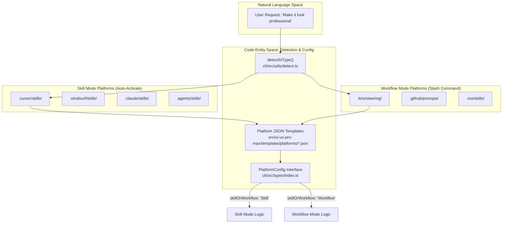
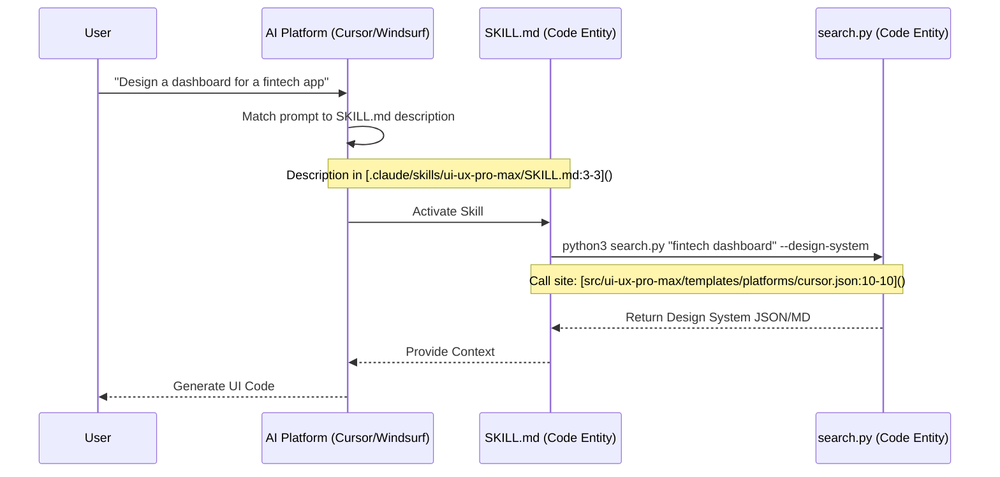
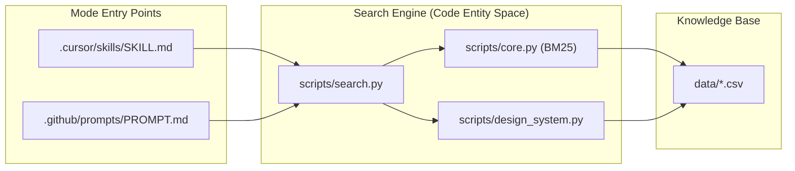

# Skill vs Workflow 모드

<details>
<summary>관련 소스 파일</summary>

다음 파일들은 이 위키 페이지를 생성하기 위한 컨텍스트로 사용되었습니다.

- [.claude/skills/ui-ux-pro-max/SKILL.md](.claude/skills/ui-ux-pro-max/SKILL.md)
- [.claude/skills/ui-ux-pro-max/data/react-performance.csv](.claude/skills/ui-ux-pro-max/data/react-performance.csv)
- [CLAUDE.md](CLAUDE.md)
- [src/ui-ux-pro-max/data/google-fonts.csv](src/ui-ux-pro-max/data/google-fonts.csv)
- [src/ui-ux-pro-max/templates/platforms/agent.json](src/ui-ux-pro-max/templates/platforms/agent.json)
- [src/ui-ux-pro-max/templates/platforms/copilot.json](src/ui-ux-pro-max/templates/platforms/copilot.json)
- [src/ui-ux-pro-max/templates/platforms/cursor.json](src/ui-ux-pro-max/templates/platforms/cursor.json)
- [src/ui-ux-pro-max/templates/platforms/kiro.json](src/ui-ux-pro-max/templates/platforms/kiro.json)
- [src/ui-ux-pro-max/templates/platforms/roocode.json](src/ui-ux-pro-max/templates/platforms/roocode.json)
- [src/ui-ux-pro-max/templates/platforms/windsurf.json](src/ui-ux-pro-max/templates/platforms/windsurf.json)

</details>


## 목적과 범위

이 문서는 UI/UX Pro Max가 지원하는 두 가지 operational mode인 **Skill Mode**와 **Workflow Mode**를 설명합니다. 이 모드들은 design intelligence system이 서로 다른 AI coding assistant와 통합되는 방식, 특히 activation mechanism, invocation pattern, filesystem convention을 정의합니다.

플랫폼별 configuration 세부 사항은 [7.1 Platform Configuration System]()을 참조하세요. CLI가 이 모드들을 설치하는 방식은 [2.4 Template Generation]()을 참조하세요.

---

## 모드 개요

UI/UX Pro Max는 `src/ui-ux-pro-max/templates/platforms/`에 있는 platform configuration file에 정의된 AI platform의 기능과 convention에 따라 두 가지 distinct mode로 동작합니다.

| 측면 | Skill Mode | Workflow Mode |
|--------|------------|---------------|
| **Activation** | NLP를 통해 UI/UX 요청을 자동 감지 | 명시적 slash command 필요 |
| **Trigger Pattern** | 자연어(예: "Build a landing page") | Slash command(예: `/ui-ux-pro-max ...`) |
| **Install Type** | `full` | `full` |
| **Content Scope** | 전체 knowledge base | 전체 knowledge base |
| **User Friction** | 낮음(자동) | 중간(수동 호출) |

**출처:** [src/ui-ux-pro-max/templates/platforms/cursor.json:20-20](), [src/ui-ux-pro-max/templates/platforms/kiro.json:20-20](), [CLAUDE.md:7-8]()

---

## 모드별 플랫폼 분포

### Platform Distribution과 Configuration Flow

다음 다이어그램은 자연어 intent를 platform detection과 configuration을 관리하는 code entity에 연결합니다.



**출처:** [src/ui-ux-pro-max/templates/platforms/cursor.json:1-21](), [src/ui-ux-pro-max/templates/platforms/kiro.json:1-21](), [src/ui-ux-pro-max/templates/platforms/copilot.json:1-21](), [src/ui-ux-pro-max/templates/platforms/windsurf.json:1-21]()

---

## Skill Mode

### 특성

Skill Mode 플랫폼은 AI assistant가 UI/UX 관련 intent를 감지할 때 **자동 활성화**를 지원합니다. AI platform의 내부 NLP engine은 `SKILL.md` frontmatter에 제공된 description을 사용자의 prompt와 매칭합니다.

**핵심 구현 세부 사항:**
*   **Metadata:** `SKILL.md`의 frontmatter(`platforms/*.json`에 정의됨)에 있는 `description` field가 trigger surface 역할을 합니다 [src/ui-ux-pro-max/templates/platforms/cursor.json:11-14]().
*   **File Naming:** 일반적으로 `SKILL.md`를 사용합니다 [src/ui-ux-pro-max/templates/platforms/cursor.json:8-8]().

### Configuration Schema (Skill Mode)

`cursor.json`의 예:
```json
{
  "platform": "cursor",
  "installType": "full",
  "folderStructure": {
    "root": ".cursor",
    "skillPath": "skills/ui-ux-pro-max",
    "filename": "SKILL.md"
  },
  "skillOrWorkflow": "Skill"
}
```
**출처:** [src/ui-ux-pro-max/templates/platforms/cursor.json:1-21]()

### Skill Mode 호출 로직



**출처:** [.claude/skills/ui-ux-pro-max/SKILL.md:1-4](), [src/ui-ux-pro-max/templates/platforms/cursor.json:10-10]()

---

## Workflow Mode

### 특성

Workflow Mode 플랫폼은 slash command(예: `/ui-ux-pro-max`)를 통한 **명시적 호출**이 필요합니다. 이는 AI가 모든 project file에서 "skills"를 자동 scan하지 않고 등록된 "prompts"나 "workflows"에 의존하는 플랫폼에서 사용됩니다.

**핵심 구현 세부 사항:**
*   **Slash Command:** skill의 이름(예: `ui-ux-pro-max`)이 slash command가 됩니다 [src/ui-ux-pro-max/templates/platforms/kiro.json:12-12]().
*   **Directory Naming:** `steering/`(Kiro) 또는 `prompts/`(Copilot) 같은 platform-specific folder를 자주 사용합니다 [src/ui-ux-pro-max/templates/platforms/kiro.json:7-7](), [src/ui-ux-pro-max/templates/platforms/copilot.json:7-7]().

### Configuration Schema (Workflow Mode)

`copilot.json`의 예:
```json
{
  "platform": "copilot",
  "folderStructure": {
    "root": ".github",
    "skillPath": "prompts/ui-ux-pro-max",
    "filename": "PROMPT.md"
  },
  "skillOrWorkflow": "Workflow"
}
```
**출처:** [src/ui-ux-pro-max/templates/platforms/copilot.json:1-21]()

---

## 설치와 Filesystem Mapping

CLI tool은 `init` command 중 이 모드들을 특정 filesystem 구조에 매핑합니다.

### 모드 비교 표

| Platform | Mode | Root | Skill/Prompt Path | Filename |
| :--- | :--- | :--- | :--- | :--- |
| **Claude** | Skill | `.claude` | `skills/ui-ux-pro-max` | `SKILL.md` |
| **Cursor** | Skill | `.cursor` | `skills/ui-ux-pro-max` | `SKILL.md` |
| **Windsurf** | Skill | `.windsurf` | `skills/ui-ux-pro-max` | `SKILL.md` |
| **Kiro** | Workflow | `.kiro` | `steering/ui-ux-pro-max` | `SKILL.md` |
| **Copilot** | Workflow | `.github` | `prompts/ui-ux-pro-max` | `PROMPT.md` |
| **Roo Code** | Workflow | `.roo` | `skills/ui-ux-pro-max` | `SKILL.md` |

**출처:** [src/ui-ux-pro-max/templates/platforms/cursor.json:5-9](), [src/ui-ux-pro-max/templates/platforms/kiro.json:5-9](), [src/ui-ux-pro-max/templates/platforms/copilot.json:5-9](), [src/ui-ux-pro-max/templates/platforms/roocode.json:5-9]()

---

## 기술적 데이터 흐름

모드와 관계없이 AI가 toolkit을 사용하기로 결정하면 data flow는 Python search engine으로 수렴합니다.

### 공통 실행 파이프라인



**출처:** [CLAUDE.md:38-40](), [src/ui-ux-pro-max/templates/platforms/cursor.json:10-10](), [src/ui-ux-pro-max/templates/platforms/kiro.json:10-10]()

### 구현 참고 사항
1.  **InstallType:** 현재 모든 platform template은 `"installType": "full"`을 지정하므로, 전체 `data/`와 `scripts/` 디렉터리를 받습니다 [src/ui-ux-pro-max/templates/platforms/agent.json:4-4]().
2.  **Frontmatter:** Skill Mode는 AI를 trigger하는 `description`을 정의하기 위해 JSON template의 `frontmatter` section에 크게 의존합니다 [src/ui-ux-pro-max/templates/platforms/cursor.json:11-14]().
3.  **Sections:** 일부 플랫폼(Claude 등)은 `quickReference` section을 toggle할 수 있으며, 이는 생성된 markdown에 압축된 rule table을 추가합니다 [src/ui-ux-pro-max/templates/platforms/cursor.json:15-17]().

**출처:** [src/ui-ux-pro-max/templates/platforms/cursor.json:1-21](), [src/ui-ux-pro-max/templates/platforms/agent.json:1-21](), [CLAUDE.md:73-76]()
