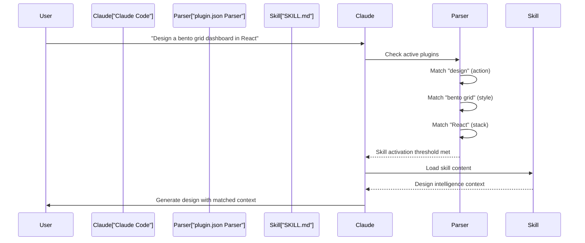

# Claude Marketplace 통합

<details>
<summary>관련 소스 파일</summary>

다음 파일들은 이 위키 페이지를 생성하기 위한 컨텍스트로 사용되었습니다.

- [.claude-plugin/marketplace.json](.claude-plugin/marketplace.json)
- [.claude-plugin/plugin.json](.claude-plugin/plugin.json)
- [cli/assets/templates/platforms/droid.json](cli/assets/templates/platforms/droid.json)
- [src/ui-ux-pro-max/templates/platforms/droid.json](src/ui-ux-pro-max/templates/platforms/droid.json)

</details>


이 문서는 Claude의 plugin directory를 통한 직접 설치를 가능하게 하는 `plugin.json` 및 `marketplace.json` configuration file을 다루며, UI/UX Pro Max의 Claude Marketplace plugin 배포 시스템을 설명합니다. 18개 AI platform 전반의 일반적인 platform integration pattern은 [Platform Configuration System]()을 참조하세요.

## 목적과 범위

Claude Marketplace 통합은 UI/UX Pro Max를 위한 대체 배포 채널을 제공하여, 사용자가 CLI tool을 사용하지 않고 Claude의 plugin ecosystem에서 직접 skill을 설치할 수 있게 합니다. 이 통합은 Claude Code platform에 특화되어 있으며 두 파일로 구성된 configuration system을 사용합니다.

1.  **plugin.json** - plugin metadata와 skill activation rule을 정의합니다.
2.  **marketplace.json** - marketplace별 packaging과 versioning을 제공합니다.

두 파일은 모두 repository root의 `.claude-plugin/` 디렉터리에 있습니다.

---

## Plugin Configuration Architecture

marketplace 통합은 `plugin.json`이 runtime behavior를 정의하고 `marketplace.json`이 distribution metadata를 처리하는 dual-file 구조를 사용합니다.

### System Relationship Diagram

```mermaid
graph TB
    subgraph "Distribution_Channels"
        [NPM_uipro-cli] -- "uipro init" --> [Claude_JSON_Template]
        [Claude_Marketplace] -- "Direct Install" --> [Plugin_Files]
    end
    
    subgraph "Plugin_Files"
        [plugin.json]
        [marketplace.json]
    end
    
    subgraph "Claude_Skill_Directory"
        [SKILL_md]
        [data_CSV_Files]
        [search_py_Script]
    end

    [plugin.json] -- "points to" --> [SKILL_md]
    [Claude_JSON_Template] -- "defines" --> [SKILL_md]
    [SKILL_md] -- "uses" --> [data_CSV_Files]
    [SKILL_md] -- "executes" --> [search_py_Script]
```

**출처:** [.claude-plugin/plugin.json:1-11](), [.claude-plugin/marketplace.json:1-35](), [src/ui-ux-pro-max/templates/platforms/droid.json:1-21]()

---

## plugin.json 구조

`plugin.json` 파일은 Claude Code에서 사용하는 핵심 plugin metadata와 activation rule을 정의합니다.

### Field Specification

| Field | Type | 목적 | Example Value |
| :--- | :--- | :--- | :--- |
| `name` | string | plugin identifier(kebab-case) | `"ui-ux-pro-max"` |
| `description` | string | keyword가 풍부한 activation description | 아래 keyword section 참조 |
| `version` | string | Semantic version | `"2.5.0"` |
| `author.name` | string | plugin author | `"nextlevelbuilder"` |
| `license` | string | SPDX license identifier | `"MIT"` |
| `keywords` | array | 검색 가능한 tag | `["ui", "ux", "design", ...]` |
| `skills` | array | 상대 skill path | `["./.claude/skills/ui-ux-pro-max"]` |

**출처:** [.claude-plugin/plugin.json:1-11]()

### Description Keyword System

`description` field는 Claude가 skill을 호출해야 하는 시점을 자동 감지할 수 있게 하는 keyword가 풍부한 activation system을 구현합니다. version 2.5.0 기준으로, description은 15개 이상의 stack과 mobile framework에 대한 확장 지원을 포함합니다.

#### Keyword Categories Table

| Category | 목적 | 예시 |
| :--- | :--- | :--- |
| **Actions** | trigger verb | plan, build, create, design, implement, review, fix, improve, optimize, enhance, refactor, check |
| **Project Types** | context detection | website, landing page, dashboard, admin panel, e-commerce, SaaS, portfolio, blog, mobile app |
| **UI Elements** | component trigger | button, modal, navbar, sidebar, card, table, form, chart |
| **Style Keywords** | design pattern detection | glassmorphism, claymorphism, minimalism, brutalism, neumorphism, bento grid, dark mode |
| **Technical Topics** | 전문 영역 | color palette, accessibility, animation, layout, typography, font pairing, spacing, hover, shadow, gradient |
| **Integrations** | framework mention | shadcn/ui, Tailwind, Jetpack Compose, SwiftUI, Flutter |

**출처:** [.claude-plugin/plugin.json:3-3](), [src/ui-ux-pro-max/templates/platforms/droid.json:13-13]()

### Activation Pattern Diagram



**출처:** [.claude-plugin/plugin.json:3-3](), [.claude-plugin/plugin.json:10-10]()

---

## marketplace.json 구조

`marketplace.json` 파일은 plugin directory listing과 version management를 위한 marketplace별 metadata를 제공합니다.

### Root Schema

| Field | Type | 목적 | Value |
| :--- | :--- | :--- | :--- |
| `name` | string | Marketplace listing name | `"ui-ux-pro-max-skill"` |
| `id` | string | 고유 marketplace identifier | `"ui-ux-pro-max-skill"` |
| `owner.name` | string | publisher account | `"nextlevelbuilder"` |
| `metadata.description` | string | 짧은 description | resource count(67 styles, 96 palettes 등) |
| `metadata.version` | string | Marketplace version | `"2.2.1"` |

**출처:** [.claude-plugin/marketplace.json:1-10]()

### Plugin Array Schema

`plugins` array는 구체적인 distribution configuration을 포함합니다.

| Field | Type | 목적 | Value |
| :--- | :--- | :--- | :--- |
| `name` | string | plugin.json과 일치해야 함 | `"ui-ux-pro-max"` |
| `source` | string | 디렉터리 path | `"./"` |
| `description` | string | 긴 형식의 description | 13개 stack guideline을 포함한 전체 feature list |
| `category` | string | Marketplace category | `"design"` |
| `strict` | boolean | validation mode | `false` |

**출처:** [.claude-plugin/marketplace.json:11-33]()

---

## CLI Platform Configuration과의 비교

marketplace 통합은 Droid(Factory) 같은 플랫폼에 사용되는 CLI 기반 설치와 다릅니다.

### Configuration 비교 표

| Aspect | CLI Installation (e.g., Droid) | Marketplace Installation |
| :--- | :--- | :--- |
| **Configuration Source** | `src/ui-ux-pro-max/templates/platforms/droid.json` | `.claude-plugin/plugin.json` |
| **Folder Structure** | `.factory/skills/ui-ux-pro-max` | `.claude/skills/ui-ux-pro-max` |
| **Install Type** | `"full"` | Marketplace symlink/copy |
| **Script Path** | `skills/ui-ux-pro-max/scripts/search.py` | skill content에 정의됨 |
| **Skill/Workflow** | `"Skill"` | Marketplace가 정의 |

**출처:** [src/ui-ux-pro-max/templates/platforms/droid.json:1-21](), [cli/assets/templates/platforms/droid.json:1-21](), [.claude-plugin/plugin.json:10-10]()

---

## Keyword Optimization Strategy

`description`과 `keywords` field는 15개 이상의 stack 전반에서 skill activation accuracy를 극대화하기 위해 dense keyword packing strategy를 사용합니다.

### Resource Count Claims

marketplace description에는 내부 database를 반영하는 구체적인 resource count가 포함됩니다.

| Claim | Actual Count / Scope |
| :--- | :--- |
| 67 styles | Glassmorphism, Claymorphism 등 |
| 161 palettes | 확장된 color database |
| 57 font pairings | Typography pairings |
| 25 charts | Chart type과 guideline |
| 15-16 stacks | React, Next.js, Vue, Svelte, Astro, SwiftUI 등 |

**출처:** [.claude-plugin/plugin.json:3-3](), [src/ui-ux-pro-max/templates/platforms/droid.json:13-13](), [.claude-plugin/marketplace.json:8-8]()

### Category와 Strict Mode

marketplace configuration에는 visibility와 matching behavior를 제어하기 위한 classification field가 포함됩니다.

*   **Category**: plugin을 design tools section에 배치하기 위해 `"design"`으로 설정됩니다.
*   **Strict**: `false`로 설정되어, 정확한 keyword match를 요구하는 대신 Claude가 semantic similarity와 natural language query를 기반으로 skill을 활성화할 수 있게 합니다.

**출처:** [.claude-plugin/marketplace.json:31-32]()
