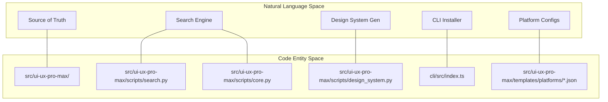
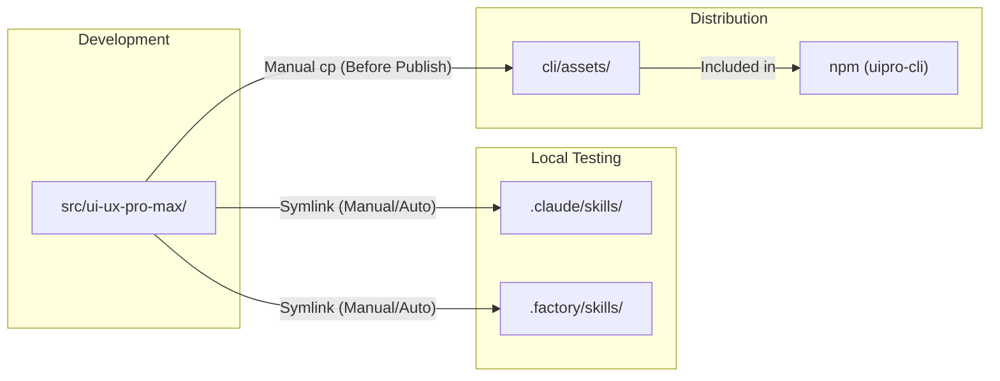

# Development Guide

관련 소스 파일

다음 파일들은 이 위키 페이지를 생성하기 위한 컨텍스트로 사용되었습니다.

- [CLAUDE.md](CLAUDE.md)
- [README.md](README.md)
- [cli/.npmignore](cli/.npmignore)
- [cli/README.md](cli/README.md)
- [cli/package.json](cli/package.json)
- [cli/src/index.ts](cli/src/index.ts)
- [cli/src/types/index.ts](cli/src/types/index.ts)
- [cli/src/utils/detect.ts](cli/src/utils/detect.ts)
- [cli/src/utils/extract.ts](cli/src/utils/extract.ts)
- [cli/src/utils/github.ts](cli/src/utils/github.ts)
- [cli/src/utils/template.ts](cli/src/utils/template.ts)

이 문서는 UI/UX Pro Max 시스템을 수정, 테스트, 확장하려는 contributor를 위한 지침을 제공합니다. development environment setup, codebase structure, file synchronization requirement, 핵심 development workflow를 다룹니다.

특정 작업은 다음을 참조하세요.
- [Source of Truth and Sync Rules](#8.1) — `src/ui-ux-pro-max/` source of truth와 symlink architecture를 설명합니다.
- [Adding New Platforms](#8.2) — template JSON file을 통해 새 AI platform 지원을 추가하는 단계별 지침을 제공합니다.
- [Testing and Contributing](#8.3) — Git workflow, `bun link`를 사용한 local testing, build/publish procedure를 문서화합니다.

## Prerequisites and Tools

UI/UX Pro Max 시스템에는 다음 development tool이 필요합니다.

| Tool | Version | 목적 |
|------|---------|---------|
| Python | 3.x | Search engine과 data processing |
| Node.js | 18+ | CLI tool runtime |
| Bun | Latest | TypeScript compilation과 build |
| TypeScript | 5.7+ | CLI source language |
| Git | Any | Version control |

CLI는 Bun을 build tool로 사용하며, [cli/package.json:14]()에 `bun build src/index.ts --outdir dist --target node`를 실행하는 build script `npm run build`로 지정되어 있습니다.

출처: [cli/package.json:1-48](), [CLAUDE.md:87-89]()

## Repository Structure

이 repository는 **Source of Truth** 패턴을 사용합니다. 모든 canonical data와 logic은 `src/ui-ux-pro-max/`에 있습니다. local development environment는 이 폴더에 대한 symlink를 사용하고, CLI tool은 offline fallback을 위해 bundled copy를 사용합니다.

### Codebase Entity Mapping

다음 다이어그램은 자연어 concept를 특정 code entity와 file path에 연결합니다.

출처: [CLAUDE.md:32-58](), [cli/src/index.ts:1-23]()

### Directory Layout

| Directory | 목적 | Type |
|-----------|---------|------|
| `src/ui-ux-pro-max/` | 모든 skill content의 single source of truth | Source |
| `src/ui-ux-pro-max/data/` | CSV database(Styles, Palettes, Fonts 등) | Data |
| `src/ui-ux-pro-max/scripts/` | Python logic(`search.py`, `core.py`, `design_system.py`) | Logic |
| `src/ui-ux-pro-max/templates/` | platform-specific skill file 생성을 위한 template | Templates |
| `cli/src/` | `uipro-cli`를 위한 TypeScript source code | Tooling |
| `cli/assets/` | offline fallback을 위한 data/scripts bundled copy | Distribution |

출처: [CLAUDE.md:32-58]()

## File Synchronization Rules

이 시스템은 엄격한 synchronization hierarchy에 의존합니다. 자세한 내용은 [Source of Truth and Sync Rules](#8.1)를 참조하세요.

### Sync Architecture Diagram

### 핵심 Sync Rules
1. **Data & Scripts**: `src/ui-ux-pro-max/`에서만 편집합니다. 변경 사항은 `.claude/` 또는 `.shared/`의 symlink를 통해 사용할 수 있습니다 [CLAUDE.md:68-71]().
2. **Templates**: `src/ui-ux-pro-max/templates/`에서 편집합니다. 이는 CLI가 `SKILL.md` 같은 파일을 생성하는 데 사용됩니다 [CLAUDE.md:73-76]().
3. **CLI Assets**: npm에 publish하기 전에 `cp -r` command를 사용해 `src/`를 `cli/assets/`에 수동으로 sync해야 합니다 [CLAUDE.md:78-83]().

출처: [CLAUDE.md:61-86]()

## Development Workflows

### Adding New Platforms
이 시스템은 확장 가능하도록 설계되었습니다. 새 AI assistant(예: "NewAI")를 추가하려면 `src/ui-ux-pro-max/templates/platforms/`에 JSON configuration을 만들고 CLI의 `AIType` definition을 업데이트해야 합니다.

단계별 walkthrough는 [Adding New Platforms](#8.2)를 참조하세요.

### CLI Tool Development
CLI tool `uipro`는 `commander` [cli/package.json:37]()로 빌드되며 development 중 고성능 실행을 위해 `bun`을 사용합니다.

- **Main Entry**: [cli/src/index.ts:1-83]()
- **Platform Detection**: [cli/src/utils/detect.ts:10-77]()
- **Template Rendering**: [cli/src/utils/template.ts:123-157]()

### Testing and Contributing
표준 Git feature-branch workflow를 따릅니다. 모든 변경 사항은 `bun link`를 사용해 local에서 테스트하여 다양한 `AIType` target에 대한 CLI installation logic을 검증해야 합니다.

PR requirement와 testing procedure에 대한 자세한 내용은 [Testing and Contributing](#8.3)을 참조하세요.

출처: [CLAUDE.md:91-99](), [cli/package.json:13-17](), [cli/README.md:45-59]()
