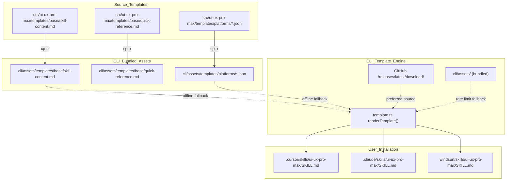
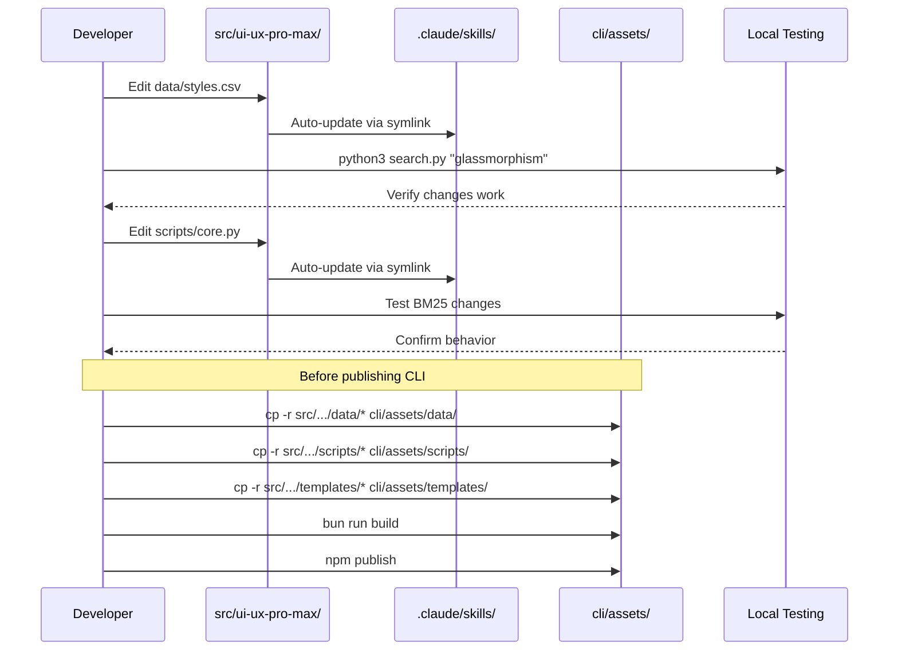

# Source of Truth와 Sync Rules

<details>
<summary>관련 소스 파일</summary>

다음 파일들은 이 위키 페이지를 생성하기 위한 컨텍스트로 사용되었습니다.

- [.claude/skills/ui-ux-pro-max/data/_sync_all.py](.claude/skills/ui-ux-pro-max/data/_sync_all.py)
- [CLAUDE.md](CLAUDE.md)
- [cli/assets/data/_sync_all.py](cli/assets/data/_sync_all.py)
- [src/ui-ux-pro-max/data/_sync_all.py](src/ui-ux-pro-max/data/_sync_all.py)

</details>


## 목적과 범위

이 문서는 모든 UI/UX Pro Max asset의 canonical source of truth와 distribution channel 전반의 일관성을 유지하는 데 필요한 synchronization rule을 정의합니다. `src/ui-ux-pro-max/` 디렉터리 구조, 즉시 업데이트를 위한 symlink architecture, CLI bundled asset을 위한 manual sync procedure를 다룹니다.

template generation 메커니즘은 [Template Generation]()을 참조하세요. build 및 publish workflow는 [Testing and Contributing]()을 참조하세요.

---

## Source of Truth: src/ui-ux-pro-max/

모든 canonical asset은 `src/ui-ux-pro-max/`에 있습니다. 이 디렉터리는 다음 항목의 single source of truth 역할을 합니다.

- **CSV databases** - 10개 domain에 걸친 344개 이상의 design resource.
- **Python scripts** - BM25 search engine, design system generator.
- **Templates** - base content와 platform-specific configuration.

skill functionality, data, platform support에 대한 모든 수정은 **반드시** 이 디렉터리에서 먼저 이루어져야 합니다.

### Directory Structure

```
src/ui-ux-pro-max/
├── data/
│   ├── products.csv           # 161 product categories
│   ├── styles.csv             # 67 UI styles with AI prompts
│   ├── colors.csv             # 161 color palettes (synced to products)
│   ├── typography.csv         # 57 font pairings
│   ├── landing.csv            # 24 landing page patterns
│   ├── charts.csv             # 25 chart types
│   ├── ux-guidelines.csv      # 99 best practices
│   ├── icons.csv              # 100 Lucide icon mappings
│   ├── ui-reasoning.csv       # 161 JSON decision rules (synced to products)
│   ├── _sync_all.py           # Data maintenance script
│   └── stacks/                # 16 technology stack CSVs
│       ├── react.csv
│       ├── html-tailwind.csv
│       └── ...
├── scripts/
│   ├── search.py              # CLI entry point
│   ├── core.py                # BM25 search engine + CSV_CONFIG
│   └── design_system.py       # Multi-domain synthesis
└── templates/
    ├── base/
    │   ├── skill-content.md   # Common SKILL.md content
    │   └── quick-reference.md # Quick reference (Claude only)
    └── platforms/
        ├── claude.json        # Claude Code config
        ├── cursor.json        # Cursor config
        ├── windsurf.json      # Windsurf config
        └── ...                # 18+ platform configs
```

**출처:** [src/ui-ux-pro-max/data/_sync_all.py:3-9](), [CLAUDE.md:32-56]()

---

## Symlink Architecture

### 개요

repository는 development 중 manual copying 없이 즉시 업데이트를 제공하기 위해 symlink를 사용합니다. `src/ui-ux-pro-max/`의 파일이 수정되면 symlink된 위치가 변경 사항을 즉시 반영합니다.

**그림 1: 즉시 전파를 위한 Symlink Architecture**

```mermaid
graph TB
    subgraph "Source_of_Truth"
        ["src/ui-ux-pro-max/"]
        ["src/ui-ux-pro-max/data/"]
        ["src/ui-ux-pro-max/scripts/"]
        ["src/ui-ux-pro-max/templates/"]
    end
    
    subgraph "Symlinked_Locations_(Auto-Sync)"
        [".shared/ui-ux-pro-max/"]
        [".claude/skills/ui-ux-pro-max/"]
        ClaudeData[".claude/skills/ui-ux-pro-max/data/"]
        ClaudeScripts[".claude/skills/ui-ux-pro-max/scripts/"]
    end
    
    subgraph "Manual_Sync_Required"
        ["cli/assets/"]
        CLIData["cli/assets/data/"]
        CLIScripts["cli/assets/scripts/"]
        CLITemplates["cli/assets/templates/"]
    end
    
    ["src/ui-ux-pro-max/"] -.->|"symlink"| [".shared/ui-ux-pro-max/"]
    ["src/ui-ux-pro-max/"] -.->|"symlink"| [".claude/skills/ui-ux-pro-max/"]
    ["src/ui-ux-pro-max/data/"] -.->|"symlink"| ClaudeData
    ["src/ui-ux-pro-max/scripts/"] -.->|"symlink"| ClaudeScripts
    
    ["src/ui-ux-pro-max/data/"] -->|"cp -r (manual)"| CLIData
    ["src/ui-ux-pro-max/scripts/"] -->|"cp -r (manual)"| CLIScripts
    ["src/ui-ux-pro-max/templates/"] -->|"cp -r (manual)"| CLITemplates
```

**출처:** [CLAUDE.md:54-56](), [CLAUDE.md:63-64]()

### Symlink된 위치

| Location | Target | 목적 |
|----------|--------|---------|
| `.shared/ui-ux-pro-max/` | `src/ui-ux-pro-max/` | 공유 reference directory |
| `.claude/skills/ui-ux-pro-max/` | `src/ui-ux-pro-max/` | Claude Code skill installation |
| `.claude/skills/ui-ux-pro-max/data/` | `src/ui-ux-pro-max/data/` | search용 CSV database |
| `.claude/skills/ui-ux-pro-max/scripts/` | `src/ui-ux-pro-max/scripts/` | Python scripts |

이 symlink들은 다음을 가능하게 합니다.
- **Real-time development** - CSV 또는 Python file을 편집하면 변경 사항을 즉시 확인할 수 있습니다.
- **No duplication** - disk에 data/scripts의 단일 copy만 둡니다.
- **Atomic updates** - 재설치 없이 Claude Code에 변경 사항이 표시됩니다.

**출처:** [CLAUDE.md:54-55](), [CLAUDE.md:69-71]()

---

## CLI Bundled Assets

### Manual Sync가 필요한 이유

`uipro-cli` package는 offline installation과 rate-limit fallback을 위해 `cli/assets/`에 asset을 bundle합니다. 이 bundled asset은 다음 이유로 symlink되지 **않습니다**.

1. **npm packaging** - symlink는 npm distribution에 올바르게 package되지 않습니다.
2. **Cross-platform** - Windows, macOS, Linux는 symlink support가 일관되지 않습니다.
3. **Offline mode** - CLI는 local file을 사용해 internet access 없이 동작해야 합니다.

### Assets Directory Structure

```
cli/assets/                     # ~564KB bundled fallback
├── data/                       # Copy of src/ui-ux-pro-max/data/
│   ├── products.csv
│   ├── styles.csv
│   └── ...
├── scripts/                    # Copy of src/ui-ux-pro-max/scripts/
│   ├── search.py
│   ├── core.py
│   └── design_system.py
└── templates/                  # Copy of src/ui-ux-pro-max/templates/
    ├── base/
    └── platforms/
```

**출처:** [CLAUDE.md:49-52]()

### CLI Assets를 Sync해야 하는 시점

다음 경우 npm에 publish하기 **전에** sync가 필요합니다.

- ✅ CSV database가 수정됨(`data/*.csv`, `data/stacks/*.csv`).
- ✅ Python script가 업데이트됨(`scripts/*.py`).
- ✅ Template content가 변경됨(`templates/base/*.md`).
- ✅ Platform config가 추가/수정됨(`templates/platforms/*.json`).

다음 경우 sync가 필요하지 **않습니다**.
- ❌ CLI TypeScript code 변경(`cli/src/`).
- ❌ Documentation 업데이트.
- ❌ Test file 수정.

**출처:** [CLAUDE.md:77-83]()

---

## Sync Procedures

### Manual Sync Commands

`uipro-cli`를 publish하기 전에 repository root에서 다음 command를 실행하세요.

```bash
# Sync all CLI assets
cp -r src/ui-ux-pro-max/data/* cli/assets/data/
cp -r src/ui-ux-pro-max/scripts/* cli/assets/scripts/
cp -r src/ui-ux-pro-max/templates/* cli/assets/templates/
```

### Data Maintenance Sync

codebase에는 `colors.csv`와 `ui-reasoning.csv`를 `products.csv`와 1:1로 정렬된 상태로 유지하는 데 사용되는 maintenance script `_sync_all.py`가 포함되어 있습니다. 이 script는 product rename, removal, renumbering을 처리합니다.

**출처:** [src/ui-ux-pro-max/data/_sync_all.py:3-9]()

---

## Template System Sync

**그림 2: Template Generation vs Bundled Assets**



**출처:** [CLAUDE.md:42-52](), [CLAUDE.md:78-82]()

### Template Modifications

`src/ui-ux-pro-max/templates/`의 template을 편집할 때:

1. **Base templates** (`base/skill-content.md`, `base/quick-reference.md`)
   - 모든 플랫폼의 `SKILL.md`로 렌더링되는 공통 content를 정의합니다.
   - dynamic content에는 `{{VARIABLE}}` placeholder를 사용합니다.
2. **Platform configs** (`platforms/*.json`)
   - `folderStructure`, `scriptPath`, `installType`, `sections`를 정의합니다.
   - 각 JSON은 특정 플랫폼에서 template이 어떻게 렌더링되는지 제어합니다.
3. **reference folder로 manual sync하지 않음**
   - `.cursor/`, `.windsurf/`, `.claude/`(symlink되지 않은 경우)는 CLI가 생성합니다.
   - 이 파일들을 직접 편집하지 마세요. `uipro init`에 의해 overwrite됩니다.

**출처:** [CLAUDE.md:73-76](), [CLAUDE.md:85]()

---

## Development Workflow

**그림 3: Edit-Sync-Test Cycle**



**출처:** [CLAUDE.md:61-84](), [CLAUDE.md:91-98]()

### Step-by-Step Workflow

| Step | Action | Auto-Sync? | Notes |
|------|--------|-----------|-------|
| 1 | `src/ui-ux-pro-max/data/`에서 CSV 편집 | ✅ Yes | Symlink가 `.claude/`, `.shared/`를 업데이트 |
| 2 | `python3 search.py`로 테스트 | N/A | symlink된 위치 사용 |
| 3 | `src/ui-ux-pro-max/scripts/`에서 Python 편집 | ✅ Yes | 즉시 반영 |
| 4 | `src/ui-ux-pro-max/templates/`에서 template 수정 | ✅ Yes | template이 자동으로 사용 가능 |
| 5 | CLI로 sync: `cp -r src/.../* cli/assets/` | ❌ No | **manual required** |
| 6 | CLI build: `bun run build` | N/A | asset을 dist/로 bundle |
| 7 | Publish: `npm publish` | N/A | npm registry에 upload |

**출처:** [CLAUDE.md:67-85]()

---

## 피해야 할 Anti-Patterns

### ❌ CLI Assets 직접 편집

**Wrong:**
```bash
# Never edit bundled assets
vim cli/assets/data/styles.csv
vim cli/assets/scripts/core.py
```

**Correct:**
```bash
# Always edit source of truth
vim src/ui-ux-pro-max/data/styles.csv
vim src/ui-ux-pro-max/scripts/core.py

# Then sync to CLI before publishing
cp -r src/ui-ux-pro-max/data/* cli/assets/data/
cp -r src/ui-ux-pro-max/scripts/* cli/assets/scripts/
```

### ❌ 생성된 Skill File 수동 편집

**Wrong:**
```bash
# Never edit CLI-generated files
vim .cursor/skills/ui-ux-pro-max/SKILL.md
vim .windsurf/skills/ui-ux-pro-max/SKILL.md
```

**Correct:**
```bash
# Edit base templates instead
vim src/ui-ux-pro-max/templates/base/skill-content.md

# Or platform config
vim src/ui-ux-pro-max/templates/platforms/cursor.json

# Regenerate via CLI
uipro init --ai cursor --force
```

**출처:** [CLAUDE.md:61-85]()

---

## File Change Impact Matrix

| File Modified | Symlink Update | CLI Sync Required | Regeneration Needed |
|---------------|----------------|-------------------|---------------------|
| `src/ui-ux-pro-max/data/*.csv` | ✅ Auto | ✅ Yes | ❌ No |
| `src/ui-ux-pro-max/scripts/*.py` | ✅ Auto | ✅ Yes | ❌ No |
| `src/ui-ux-pro-max/templates/base/*.md` | ✅ Auto | ✅ Yes | ✅ Yes (`uipro init --force`) |
| `src/ui-ux-pro-max/templates/platforms/*.json` | ✅ Auto | ✅ Yes | ✅ Yes (`uipro init --force`) |
| `cli/src/*.ts` | N/A | ❌ No | ❌ No |
| `.claude/skills/ui-ux-pro-max/SKILL.md` | N/A | ❌ No | ⚠️ 편집하지 마세요(CLI-generated) |

**범례:**
- **Symlink Update** - 변경 사항이 symlink를 통해 즉시 표시됩니다.
- **CLI Sync Required** - `npm publish` 전에 `cp -r`을 실행해야 합니다.
- **Regeneration Needed** - local에서 변경 사항을 확인하려면 `uipro init --force`를 실행해야 합니다.

**출처:** [CLAUDE.md:63-85]()

---

## 요약

**핵심 원칙:**

1. **Single Source of Truth** - 모든 수정은 `src/ui-ux-pro-max/`에서 이루어집니다.
2. **Symlinks for Development** - `.claude/`와 `.shared/`는 빠른 iteration을 위해 자동 업데이트됩니다.
3. **Manual Sync for Distribution** - CLI bundled asset은 `npm publish` 전에 `cp -r`이 필요합니다.
4. **Template-Based Generation** - 생성된 skill file을 직접 편집하지 말고 template을 수정하세요.

**중요 규칙:** `uipro-cli`를 npm에 publish하기 전에는 항상 `src/ui-ux-pro-max/`를 `cli/assets/`에 sync하세요.

**출처:** [CLAUDE.md:61-84]()
