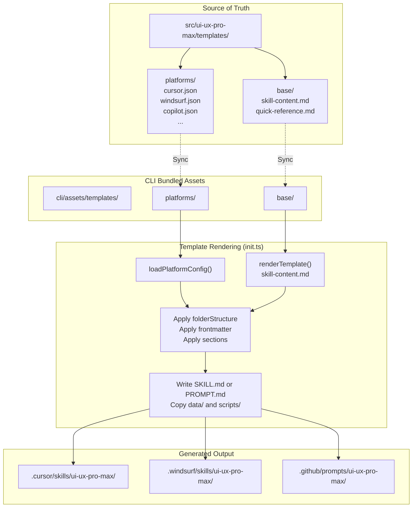
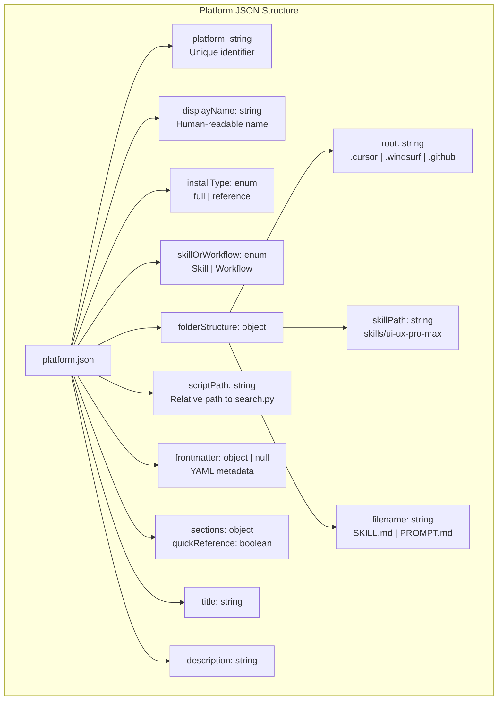
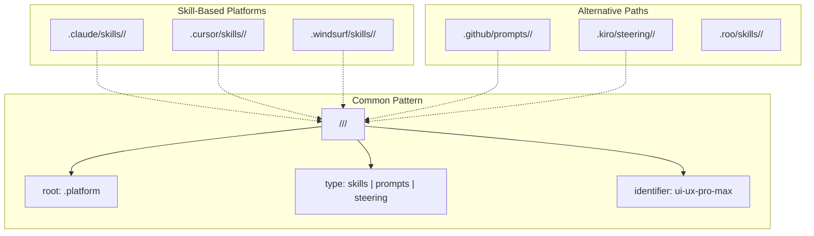
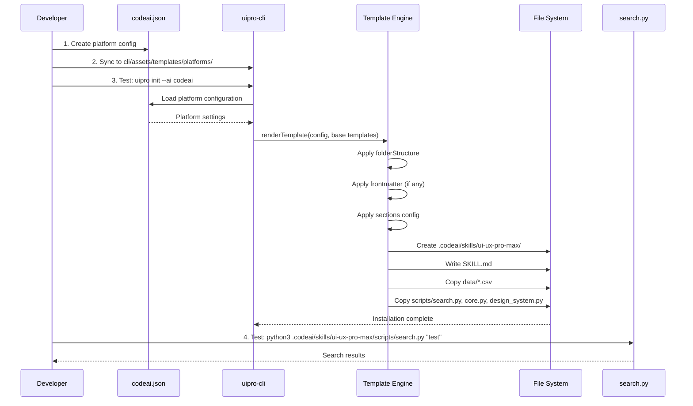

# 새 플랫폼 추가

<details>
<summary>관련 소스 파일</summary>

다음 파일들은 이 위키 페이지를 생성하기 위한 컨텍스트로 사용되었습니다.

- [CLAUDE.md](CLAUDE.md)
- [cli/assets/templates/platforms/agent.json](cli/assets/templates/platforms/agent.json)
- [cli/assets/templates/platforms/copilot.json](cli/assets/templates/platforms/copilot.json)
- [cli/assets/templates/platforms/cursor.json](cli/assets/templates/platforms/cursor.json)
- [cli/assets/templates/platforms/kiro.json](cli/assets/templates/platforms/kiro.json)
- [cli/assets/templates/platforms/roocode.json](cli/assets/templates/platforms/roocode.json)
- [cli/assets/templates/platforms/windsurf.json](cli/assets/templates/platforms/windsurf.json)
- [src/ui-ux-pro-max/templates/platforms/agent.json](src/ui-ux-pro-max/templates/platforms/agent.json)
- [src/ui-ux-pro-max/templates/platforms/copilot.json](src/ui-ux-pro-max/templates/platforms/copilot.json)
- [src/ui-ux-pro-max/templates/platforms/cursor.json](src/ui-ux-pro-max/templates/platforms/cursor.json)
- [src/ui-ux-pro-max/templates/platforms/kiro.json](src/ui-ux-pro-max/templates/platforms/kiro.json)
- [src/ui-ux-pro-max/templates/platforms/roocode.json](src/ui-ux-pro-max/templates/platforms/roocode.json)
- [src/ui-ux-pro-max/templates/platforms/windsurf.json](src/ui-ux-pro-max/templates/platforms/windsurf.json)

</details>


이 문서는 UI/UX Pro Max 시스템에 새 AI coding assistant platform 지원을 추가하기 위한 단계별 지침을 제공합니다. template 기반 configuration system을 사용하면 platform의 folder structure, file naming convention, integration mode를 정의하는 단일 JSON configuration file을 만들어 platform을 추가할 수 있습니다.

platform integration architecture와 Skill vs Workflow mode에 대한 정보는 [Platform Configuration System](#7.1)을 참조하세요. CLI template generation system에 대한 자세한 내용은 [Template Generation](#2.4)을 참조하세요.

---

## Platform Configuration System

이 시스템은 각 AI platform이 JSON configuration file로 정의되는 template 기반 접근 방식을 사용합니다. CLI tool은 설치 중 이 configuration을 읽어 platform-specific folder structure와 content file을 생성합니다.

### Configuration Architecture

**Template System Architecture**



**출처:** [CLAUDE.md:32-56](), [src/ui-ux-pro-max/templates/platforms/cursor.json:1-18]()

### Platform Configuration Locations

| Location | 목적 | Sync Required |
|----------|---------|---------------|
| `src/ui-ux-pro-max/templates/platforms/` | platform config의 source of truth | CLI로 manual sync |
| `cli/assets/templates/platforms/` | offline installation을 위한 bundled config | Yes(`src/`에서) |
| Platform folders (`.cursor/`, `.windsurf/`, etc.) | `uipro init` 중 생성되는 output | Auto-generated |

**출처:** [CLAUDE.md:32-56](), [CLAUDE.md:64-85]()

---

## Platform JSON Schema

각 platform configuration file은 CLI가 platform-specific integration을 생성하는 방식을 정의합니다. JSON schema에는 folder path, file naming, metadata requirement, content section이 포함됩니다.

### Complete Schema Reference

**Platform Configuration JSON Schema**



**출처:** [src/ui-ux-pro-max/templates/platforms/cursor.json:1-21](), [src/ui-ux-pro-max/templates/platforms/kiro.json:1-21]()

### Field Specifications

| Field | Type | Required | 목적 | 예시 |
|-------|------|----------|---------|----------|
| `platform` | string | Yes | CLI detection을 위한 고유 identifier | `"cursor"`, `"windsurf"`, `"copilot"` |
| `displayName` | string | Yes | 사람이 읽을 수 있는 platform name | `"Cursor"`, `"GitHub Copilot"` |
| `installType` | enum | Yes | content mode: `"full"` 또는 `"reference"` | complete knowledge base에는 `"full"` |
| `folderStructure.root` | string | Yes | top-level directory | `".cursor"`, `".github"`, `".windsurf"` |
| `folderStructure.skillPath` | string | Yes | skill subdirectory path | `"skills/ui-ux-pro-max"`, `"prompts/ui-ux-pro-max"` |
| `folderStructure.filename` | string | Yes | primary content file name | `"SKILL.md"`, `"PROMPT.md"` |
| `scriptPath` | string | Yes | `search.py`로 가는 상대 경로 | `"skills/ui-ux-pro-max/scripts/search.py"` |
| `frontmatter` | object \| null | No | file header용 YAML metadata | `{"name": "ui-ux-pro-max"}` 또는 `null` |
| `sections.quickReference` | boolean | Yes | Claude-specific quick reference 포함 여부 | `false`(Claude에서만 `true`) |
| `title` | string | Yes | skill/workflow title | `"ui-ux-pro-max"` |
| `description` | string | Yes | AI platform을 위한 간단한 description | 1-2문장 요약 |
| `skillOrWorkflow` | enum | Yes | integration mode: `"Skill"` 또는 `"Workflow"` | auto-activate에는 `"Skill"` |

**출처:** [src/ui-ux-pro-max/templates/platforms/cursor.json:1-21](), [src/ui-ux-pro-max/templates/platforms/copilot.json:1-21]()

### Skill Mode vs Workflow Mode

| Aspect | Skill Mode | Workflow Mode |
|--------|------------|---------------|
| **Activation** | UI/UX keyword에서 auto-activate | 명시적 slash command invocation |
| **Content** | 전체 knowledge base(`installType: "full"`) | Quick reference(`installType: "reference"`) |
| **Example Platforms** | Cursor, Windsurf, Agent | Kiro, GitHub Copilot, Roo Code |
| **skillOrWorkflow** | `"Skill"` | `"Workflow"` |

**출처:** [src/ui-ux-pro-max/templates/platforms/cursor.json:20](), [src/ui-ux-pro-max/templates/platforms/kiro.json:20](), [src/ui-ux-pro-max/templates/platforms/roocode.json:20]()

---

## 단계별: 새 Platform 추가

이 section에서는 "CodeAI"라는 가상의 AI coding assistant에 대한 새 platform configuration을 만드는 과정을 설명합니다.

### Step 1: Platform JSON Configuration 생성

templates directory에 platform identifier를 filename으로 사용하는 새 file을 만듭니다.

**File:** `src/ui-ux-pro-max/templates/platforms/codeai.json`

```json
{
  "platform": "codeai",
  "displayName": "CodeAI",
  "installType": "full",
  "folderStructure": {
    "root": ".codeai",
    "skillPath": "skills/ui-ux-pro-max",
    "filename": "SKILL.md"
  },
  "scriptPath": "skills/ui-ux-pro-max/scripts/search.py",
  "frontmatter": null,
  "sections": {
    "quickReference": false
  },
  "title": "ui-ux-pro-max",
  "description": "Comprehensive design guide for web and mobile applications. Contains 67 styles, 161 color palettes, 57 font pairings, 99 UX guidelines, and 25 chart types across 16 technology stacks.",
  "skillOrWorkflow": "Skill"
}
```

**주요 결정 사항:**

| Decision | Value | 근거 |
|----------|-------|-----------|
| `platform` | `"codeai"` | directory detection pattern과 일치해야 함 |
| `folderStructure.root` | `".codeai"` | platform의 configuration directory |
| `folderStructure.skillPath` | `"skills/ui-ux-pro-max"` | platform의 skill subdirectory convention |
| `folderStructure.filename` | `"SKILL.md"` | Copilot-like platform에는 `"PROMPT.md"` 사용 |
| `installType` | `"full"` | complete knowledge base 포함 |
| `skillOrWorkflow` | `"Skill"` | 명시적 invocation이 필요하면 `"Workflow"` 사용 |
| `frontmatter` | `null` | platform이 metadata를 요구하면 YAML object 추가 |

**출처:** [src/ui-ux-pro-max/templates/platforms/cursor.json:1-21](), [src/ui-ux-pro-max/templates/platforms/copilot.json:1-21]()

### Step 2: Folder Structure 결정

target platform의 skill/workflow file convention을 조사합니다.

**Platform Folder Conventions**



**출처:** [src/ui-ux-pro-max/templates/platforms/cursor.json:5-9](), [src/ui-ux-pro-max/templates/platforms/copilot.json:5-9](), [src/ui-ux-pro-max/templates/platforms/kiro.json:5-9]()

### Step 3: Filename과 Frontmatter 구성

플랫폼마다 기대하는 file naming convention과 metadata format이 다릅니다.

**Filename Conventions**

| Platform Type | Filename | Frontmatter Required |
|---------------|----------|---------------------|
| Skills (Claude, Cursor, Windsurf) | `SKILL.md` | No |
| GitHub Copilot Prompts | `PROMPT.md` | No(`name`과 `description` field는 사용됨) |
| Kiro Steering | `SKILL.md` | Yes(`name`, `description`) |

**frontmatter가 있는 예:**

```json
{
  "frontmatter": {
    "name": "ui-ux-pro-max",
    "description": "Comprehensive design guide for web and mobile applications."
  }
}
```

이는 output file에 YAML frontmatter를 생성합니다.

```markdown
---
name: ui-ux-pro-max
description: Comprehensive design guide for web and mobile applications.
---

# Rest of content...
```

**출처:** [src/ui-ux-pro-max/templates/platforms/cursor.json:11-14](), [src/ui-ux-pro-max/templates/platforms/kiro.json:11-14]()

### Step 4: scriptPath 올바르게 설정

`scriptPath` field는 project root에서 `search.py`까지의 상대 경로를 정의합니다. 이 path는 `folderStructure` configuration과 일치해야 합니다.

**Path Construction Pattern:**

```
scriptPath = folderStructure.skillPath + "/scripts/search.py"
```

**예시:**

| Root | Skill Path | Script Path |
|------|------------|-------------|
| `.cursor` | `skills/ui-ux-pro-max` | `skills/ui-ux-pro-max/scripts/search.py` |
| `.github` | `prompts/ui-ux-pro-max` | `prompts/ui-ux-pro-max/scripts/search.py` |
| `.kiro` | `steering/ui-ux-pro-max` | `steering/ui-ux-pro-max/scripts/search.py` |

**출처:** [src/ui-ux-pro-max/templates/platforms/cursor.json:5-10](), [src/ui-ux-pro-max/templates/platforms/kiro.json:5-10]()

---

## 새 Platform 테스트

platform configuration을 만든 후 CLI generation process를 테스트하고 output structure를 검증합니다.

### Local Testing Workflow

**CLI Testing Flow**



**출처:** [CLAUDE.md:32-56](), [CLAUDE.md:78-85]()

### Step 1: Configuration을 CLI Assets로 Sync

테스트 전에 새 platform configuration을 CLI bundled asset으로 synchronize합니다.

```bash
# Copy new platform config
cp src/ui-ux-pro-max/templates/platforms/codeai.json \
   cli/assets/templates/platforms/codeai.json
```

**출처:** [CLAUDE.md:78-83]()

### Step 2: CLI Installation 테스트

새 platform identifier로 CLI tool을 실행합니다.

```bash
# Test with explicit platform flag
uipro init --ai codeai
```

**출처:** [CLAUDE.md:78-85]()

### Step 3: Folder Structure 검증

생성된 folder structure가 configuration과 일치하는지 확인합니다.

```bash
tree .codeai/skills/ui-ux-pro-max/
```

**Expected structure:**

```
.codeai/skills/ui-ux-pro-max/
├── SKILL.md                    # Main content file
├── data/                       # CSV databases
│   ├── products.csv
│   ├── styles.csv
│   └── ...
└── scripts/
    ├── search.py               # CLI entry point
    ├── core.py                 # BM25 search engine
    └── design_system.py        # Design system generator
```

**출처:** [CLAUDE.md:32-58]()

---

## Synchronization Requirements

새 platform configuration을 추가할 때 JSON file을 source of truth에서 CLI bundled asset으로 synchronize해야 합니다.

### Sync Commands

platform configuration을 추가하거나 수정할 때:

```bash
# Sync new platform configuration
cp src/ui-ux-pro-max/templates/platforms/codeai.json \
   cli/assets/templates/platforms/codeai.json

# Sync all assets if necessary
cp -r src/ui-ux-pro-max/data/* cli/assets/data/
cp -r src/ui-ux-pro-max/scripts/* cli/assets/scripts/
cp -r src/ui-ux-pro-max/templates/* cli/assets/templates/
```

**출처:** [CLAUDE.md:78-83]()

### Sync Checklist

| File Type | Source Location | Destination | Frequency |
|-----------|----------------|-------------|-----------|
| Platform JSON | `src/ui-ux-pro-max/templates/platforms/*.json` | `cli/assets/templates/platforms/` | 추가/수정 시 |
| Base templates | `src/ui-ux-pro-max/templates/base/*.md` | `cli/assets/templates/base/` | 수정 시 |
| Data CSVs | `src/ui-ux-pro-max/data/` | `cli/assets/data/` | data 업데이트 시 |
| Python scripts | `src/ui-ux-pro-max/scripts/` | `cli/assets/scripts/` | logic 업데이트 시 |

**출처:** [CLAUDE.md:64-85]()
