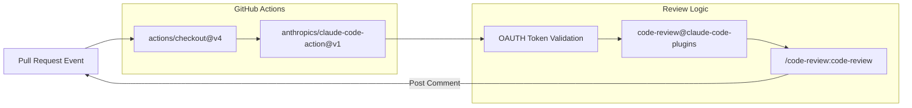
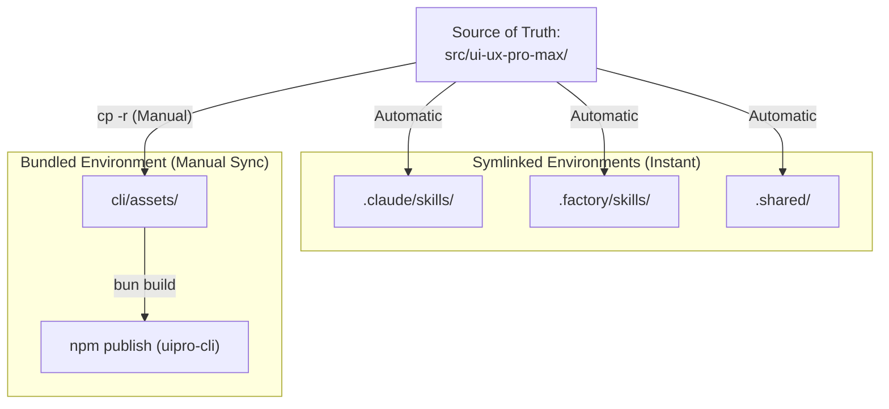

# Testing and Contributing

관련 소스 파일

다음 파일들은 이 위키 페이지를 생성하기 위한 컨텍스트로 사용되었습니다.

- [.github/workflows/claude-code-review.yml](.github/workflows/claude-code-review.yml)
- [.github/workflows/claude.yml](.github/workflows/claude.yml)
- [CLAUDE.md](CLAUDE.md)
- [LICENSE](LICENSE)
- [cli/.gitignore](cli/.gitignore)
- [cli/bun.lock](cli/bun.lock)
- [cli/src/commands/update.ts](cli/src/commands/update.ts)
- [cli/src/commands/versions.ts](cli/src/commands/versions.ts)

## 개요

UI/UX Pro Max 시스템은 **Source of Truth**가 `src/ui-ux-pro-max/`에 있는 분산형 development workflow를 사용합니다. 이 페이지는 Git branching strategy, `bun`을 사용하는 local development setup, CLI tool, AI platform directory, npm distribution 전반의 일관성을 유지하는 데 필요한 manual synchronization process를 문서화합니다.

**관련 페이지:** [2.1 CLI Commands](), [8.1 Source of Truth and Sync Rules](), [8.2 Adding New Platforms]()

---

## Git Workflow와 Branching

안정성을 보장하기 위해 `main` branch에 직접 push하는 것은 금지됩니다. contributor는 GitHub CLI(`gh`) 또는 표준 Git command를 통해 진행되는 표준 Feature Branch workflow를 따라야 합니다.

### Branch Naming Conventions

| Prefix | 목적 | 예시 |
| :--- | :--- | :--- |
| `feat/` | 새 feature 또는 platform | `feat/add-gemini-support` |
| `fix/` | script 또는 CLI의 bug fix | `fix/bm25-tokenization` |
| `data/` | CSV database 업데이트 | `data/update-react-stack` |
| `docs/` | documentation 또는 wiki 업데이트 | `docs/testing-guide` |

### Contribution Process

1.  **Create Branch**: `git checkout -b feat/<feature-name>` [CLAUDE.md:95-95]()
2.  **Commit Changes**: conventional commit을 따릅니다(예: `feat: add support for Augment AI`) [CLAUDE.md:96-96]()
3.  **Push Branch**: `git push -u origin <branch>` [CLAUDE.md:97-97]()
4.  **Create Pull Request**: `gh pr create` [CLAUDE.md:98-98]()

**출처:** [CLAUDE.md:91-99]()

---

## Automated Code Review

repository는 GitHub Actions를 통해 **Claude Code Review**를 통합합니다. 이 workflow는 pull request에서 자동으로 trigger되어 AI-powered feedback을 제공합니다.

### Review Pipeline

review process는 `CLAUDE_CODE_OAUTH_TOKEN` secret을 사용하며, `/code-review:code-review ${github.repository}/pull/${github.event.pull_request.number}` prompt로 특정 PR number를 대상으로 합니다 [.github/workflows/claude-code-review.yml:38-41]().

**출처:** [.github/workflows/claude-code-review.yml:1-45](), [.github/workflows/claude.yml:1-51]()

---

## Local Development와 CLI Testing

`uipro-cli`는 TypeScript와 Bun runtime을 사용해 빌드됩니다. 테스트에는 global installation을 시뮬레이션하기 위해 local package를 link해야 합니다.

### Environment Setup

1.  **Navigate to CLI**: `cd cli`
2.  **Install Dependencies**: `bun install` [cli/bun.lock:1-19]()
3.  **Link Package**: `bun link`(이 command는 `package.json`의 `bin` configuration을 통해 `uipro` command를 globally 사용할 수 있게 합니다).

### Build and Test Loop

| Action | Command | File Impact |
| :--- | :--- | :--- |
| **Development** | `bun run src/index.ts <args>` | TS source 직접 실행 |
| **Build** | `bun build src/index.ts --outdir dist --target node` | `dist/index.js` 생성 |
| **Production Test** | `uipro init --ai claude` | linked `dist` output 테스트 |

**출처:** [cli/bun.lock:1-77](), [cli/src/commands/update.ts:1-36]()

---

## Synchronization Requirement

CLI tool은 offline use를 위해 asset을 bundle하고, AI platform은 source에 대한 symlink를 사용하므로, release 또는 중요한 test 전에는 manual synchronization step이 필요합니다.

### Sync Workflow

`cli/assets/` directory는 core logic 또는 data의 변경 사항을 반영하도록 수동으로 업데이트해야 합니다.

### Sync Commands

CLI를 publish하기 전에 root에서 다음 command를 실행하세요.
1.  `cp -r src/ui-ux-pro-max/data/* cli/assets/data/` [CLAUDE.md:80-80]()
2.  `cp -r src/ui-ux-pro-max/scripts/* cli/assets/scripts/` [CLAUDE.md:81-81]()
3.  `cp -r src/ui-ux-pro-max/templates/* cli/assets/templates/` [CLAUDE.md:82-82]()

**출처:** [CLAUDE.md:62-86]()

---

## Build and Publish Procedures

### Version Management

CLI는 GitHub integration을 통해 version 확인과 목록 조회를 지원합니다.

-   **Check Versions**: `uipro versions`는 `fetchReleases()`를 호출해 tagged GitHub release를 모두 나열합니다 [cli/src/commands/versions.ts:6-10]().
-   **Update Logic**: `uipro update`는 최신 release tag를 가져오고, 최신 asset으로 local file을 overwrite하기 위해 forced `initCommand`를 trigger합니다 [cli/src/commands/update.ts:12-28]().

### Release Checklist

1.  **Validate Data**: `src/ui-ux-pro-max/data/`의 모든 CSV가 standard schema를 따르는지 확인합니다.
2.  **Run Sync**: `cp` command를 실행해 `cli/assets/`를 업데이트합니다.
3.  **Verify Build**: `cli/` directory에서 `bun run build`를 실행합니다.
4.  **Tag Release**: 새 Git tag를 생성합니다(예: `v2.5.0`).
5.  **Publish NPM**: `cli/` folder에서 `npm publish`를 실행합니다.

**출처:** [cli/src/commands/versions.ts:1-43](), [cli/src/commands/update.ts:1-37](), [LICENSE:1-21]()
