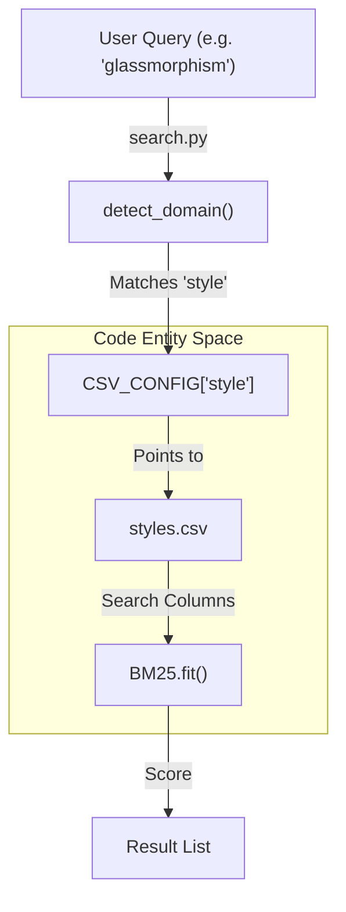
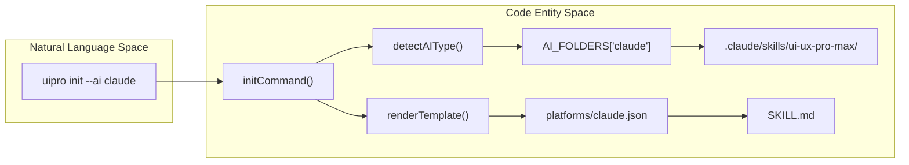

# 용어집

관련 소스 파일

다음 파일들은 이 위키 페이지를 생성하기 위한 컨텍스트로 사용되었습니다.

- [.claude-plugin/plugin.json](.claude-plugin/plugin.json)
- [.claude/skills/ui-ux-pro-max/scripts/core.py](.claude/skills/ui-ux-pro-max/scripts/core.py)
- [.claude/skills/ui-ux-pro-max/scripts/search.py](.claude/skills/ui-ux-pro-max/scripts/search.py)
- [CLAUDE.md](CLAUDE.md)
- [README.md](README.md)
- [cli/.npmignore](cli/.npmignore)
- [cli/README.md](cli/README.md)
- [cli/assets/scripts/search.py](cli/assets/scripts/search.py)
- [cli/assets/templates/platforms/augment.json](cli/assets/templates/platforms/augment.json)
- [cli/assets/templates/platforms/droid.json](cli/assets/templates/platforms/droid.json)
- [cli/assets/templates/platforms/kilocode.json](cli/assets/templates/platforms/kilocode.json)
- [cli/assets/templates/platforms/warp.json](cli/assets/templates/platforms/warp.json)
- [cli/package.json](cli/package.json)
- [cli/src/commands/init.ts](cli/src/commands/init.ts)
- [cli/src/commands/uninstall.ts](cli/src/commands/uninstall.ts)
- [cli/src/index.ts](cli/src/index.ts)
- [cli/src/types/index.ts](cli/src/types/index.ts)
- [cli/src/utils/detect.ts](cli/src/utils/detect.ts)
- [cli/src/utils/extract.ts](cli/src/utils/extract.ts)
- [cli/src/utils/github.ts](cli/src/utils/github.ts)
- [cli/src/utils/template.ts](cli/src/utils/template.ts)
- [skill.json](skill.json)
- [src/ui-ux-pro-max/data/stacks/flutter.csv](src/ui-ux-pro-max/data/stacks/flutter.csv)
- [src/ui-ux-pro-max/data/stacks/jetpack-compose.csv](src/ui-ux-pro-max/data/stacks/jetpack-compose.csv)
- [src/ui-ux-pro-max/data/stacks/shadcn.csv](src/ui-ux-pro-max/data/stacks/shadcn.csv)
- [src/ui-ux-pro-max/scripts/core.py](src/ui-ux-pro-max/scripts/core.py)
- [src/ui-ux-pro-max/scripts/search.py](src/ui-ux-pro-max/scripts/search.py)
- [src/ui-ux-pro-max/templates/platforms/augment.json](src/ui-ux-pro-max/templates/platforms/augment.json)
- [src/ui-ux-pro-max/templates/platforms/droid.json](src/ui-ux-pro-max/templates/platforms/droid.json)
- [src/ui-ux-pro-max/templates/platforms/kilocode.json](src/ui-ux-pro-max/templates/platforms/kilocode.json)
- [src/ui-ux-pro-max/templates/platforms/warp.json](src/ui-ux-pro-max/templates/platforms/warp.json)

이 페이지는 UI/UX Pro Max 시스템 안에서 사용되는 codebase-specific term, jargon, technical concept를 정의합니다. onboarding engineer가 domain language와 underlying implementation 사이의 mapping을 이해하기 위한 reference 역할을 합니다.

## Core System Concepts

### BM25
search engine이 사용자의 query에 대한 design guideline의 relevance를 결정하는 데 사용하는 primary ranking algorithm입니다. term frequency와 document length normalization을 고려하여 단순 keyword matching을 개선합니다.
*   **Implementation**: `src/ui-ux-pro-max/scripts/core.py`의 `BM25` class 안에 정의되어 있습니다.
*   **Parameters**: `k1=1.5`와 `b=0.75` constant를 사용합니다 [src/ui-ux-pro-max/scripts/core.py:107-109]().
*   **Logic**: text normalization을 위한 `tokenize` method와 term weighting을 위한 `idf` calculation을 포함합니다 [src/ui-ux-pro-max/scripts/core.py:117-140]().

### Skill vs. Workflow
시스템은 AI assistant의 기능에 따라 두 가지 distinct mode로 동작합니다.
*   **Skill Mode**: AI가 `search.py` script에 full access를 갖고 context에 따라 auto-activate할 수 있는 persistent capability입니다. 일반적으로 Claude Code와 Cursor에서 사용됩니다.
*   **Workflow Mode**: AI가 search tool을 수동으로 호출하는 방법을 이해하기 위해 `SKILL.md` file을 참조하는 "slash command" 또는 reference 기반 interaction입니다.
*   **Configuration**: platform JSON file의 `skillOrWorkflow` property로 제어됩니다 [cli/src/types/index.ts:41]().

### Master + Overrides
design system을 위한 hierarchical persistence pattern입니다.
*   **MASTER.md**: project design system의 global source of truth로, core colors, typography, styles를 포함합니다 [src/ui-ux-pro-max/scripts/search.py:68]().
*   **Overrides**: `design-system/pages/`에 위치한 page-specific Markdown file입니다. 특정 view(예: `dashboard.md`)에 대해 Master file보다 우선하는 rule을 포함합니다 [src/ui-ux-pro-max/scripts/search.py:93-97]().

### Symlink Architecture
development 중 project는 symbolic link를 사용해 "Source of Truth"(`src/ui-ux-pro-max/`)의 변경 사항이 local AI assistant directory(예: `.claude/skills/`)에 즉시 반영되도록 합니다.
*   **Source of Truth**: `src/ui-ux-pro-max/` [CLAUDE.md:64]().
*   **Links**: `.claude/skills/ui-ux-pro-max/`와 `.shared/ui-ux-pro-max/`는 `src/` directory로 향하는 symlink입니다 [CLAUDE.md:54-56]().

---

## Technical Entities

### AIType
지원되는 모든 AI assistant를 나타내는 TypeScript union type입니다.
*   **Definition**: `claude | cursor | windsurf | antigravity | copilot | kiro | roocode | codex | qoder | gemini | trae | opencode | continue | codebuddy | droid | kilocode | warp | augment | all` [cli/src/types/index.ts:1]().
*   **Usage**: platform detection과 targeted installation에 사용됩니다 [cli/src/utils/detect.ts:10]().

### Platform Config
특정 AI platform에 skill을 설치하고 format하는 방법을 정의하는 JSON file입니다.
*   **Location**: `src/ui-ux-pro-max/templates/platforms/` [CLAUDE.md:43]().
*   **Schema**: `folderStructure`, `installType`, `frontmatter`, `scriptPath`를 포함합니다 [cli/src/types/index.ts:25-42]().

### CSV_CONFIG & STACK_CONFIG
search domain과 technology stack을 각각의 data file 및 metadata에 mapping하는 Python core의 global dictionary입니다.
*   **CSV_CONFIG**: `style`, `color`, `ux` 같은 domain을 CSV file에 mapping하고, 어떤 column을 search 가능하게 할지와 어떤 column을 output용으로 쓸지 지정합니다 [src/ui-ux-pro-max/scripts/core.py:17-73]().
*   **STACK_CONFIG**: technology stack(예: `react`, `tailwind`)을 특정 guideline file에 mapping합니다 [src/ui-ux-pro-max/scripts/core.py:75-92]().

### Project Slug
project name에서 생성되는 URL-friendly string으로, persisted design system의 directory name으로 사용됩니다.
*   **Logic**: name을 lowercase로 변환하고 space를 hyphen으로 바꿉니다 [src/ui-ux-pro-max/scripts/search.py:88]().

### InstallType
installation의 depth를 결정합니다.
*   **full**: complete search engine과 dataset을 설치합니다.
*   **reference**: AI가 시스템을 사용하기 위한 documentation과 instruction만 설치합니다 [cli/src/types/index.ts:3]().

---

## Logic & Engines

### Design System Generator
여러 domain search를 종합해 cohesive design recommendation을 만드는 reasoning engine입니다.
*   **Entry Point**: `src/ui-ux-pro-max/scripts/design_system.py`의 `generate_design_system` function [src/ui-ux-pro-max/scripts/search.py:76]().
*   **Workflow**: product requirement를 분석하고, reasoning rule을 load하며, multi-domain search(Style + Color + Typography)를 수행합니다 [README.md:96-103]().

### Reasoning Engine
`ui-reasoning.csv`를 사용해 product category를 특정 design attribute에 mapping하는 logic layer입니다. design decision을 내리기 위한 약 161개의 rule을 포함합니다 [README.md:5]().

### detect_domain
특정 domain이 제공되지 않은 경우 사용자의 query를 가장 관련성 높은 database로 자동 route하는 search engine 내부 function입니다.
*   **Implementation**: `src/ui-ux-pro-max/scripts/core.py`에 있습니다.
*   **Mechanism**: keyword scoring을 사용해 "color" query와 "typography" query를 구분합니다 [CLAUDE.md:60]().

### Severity Levels
`ux`와 `stack` guideline에서 특정 rule의 중요도를 나타내는 데 사용됩니다.
*   **Values**: `Low`, `Medium`, `High`.
*   **Usage**: CSV file의 `Severity` column에 정의됩니다 [src/ui-ux-pro-max/scripts/core.py:46, 97]().

---

## System Mapping Diagrams

### From Query to Data (Search Engine Flow)
이 다이어그램은 Natural Language query를 Python internal configuration에 연결합니다.

**출처**: [src/ui-ux-pro-max/scripts/search.py:109](), [src/ui-ux-pro-max/scripts/core.py:17-22](), [src/ui-ux-pro-max/scripts/core.py:104-141]()

### From CLI to Filesystem (Installation Flow)
이 다이어그램은 CLI command를 platform-specific directory structure에 mapping합니다.

**출처**: [cli/src/index.ts:26-44](), [cli/src/types/index.ts:49-68](), [cli/src/utils/detect.ts:10-15](), [cli/src/commands/init.ts]()

---

## Domain & Stack Glossary Table

| Term | Category | 설명 | File Pointer |
| :--- | :--- | :--- | :--- |
| `product` | Domain | SaaS, e-commerce, portfolio를 위한 recommendation | `products.csv` |
| `style` | Domain | visual style(Glassmorphism, Minimalism) | `styles.csv` |
| `ux` | Domain | best practice와 anti-pattern | `ux-guidelines.csv` |
| `html-tailwind` | Stack | Tailwind CSS를 사용하는 standard web stack | `stacks/html-tailwind.csv` |
| `shadcn` | Stack | Radix UI 기반 React component | `stacks/shadcn.csv` |
| `frontmatter` | Config | platform-specific file용 metadata header | `PlatformConfig.frontmatter` |
| `anti-patterns` | Concept | 피해야 할 design choice(예: icon으로 emoji 사용) | `README.md:78-82` |

**출처**: [src/ui-ux-pro-max/scripts/core.py:17-92](), [cli/src/types/index.ts:35](), [README.md:78-82]()
