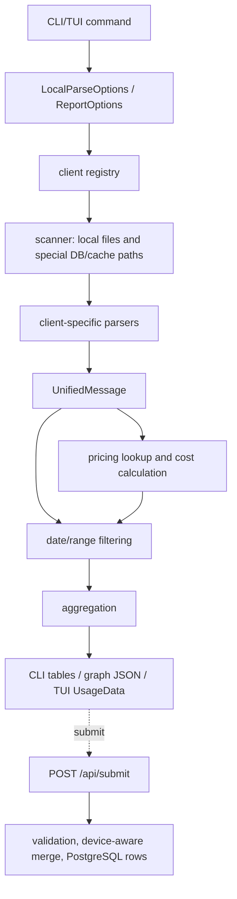

# Tokscale Data Flow Pipeline

이 페이지는 DeepWiki의 `2.2 Data Flow Pipeline`을 baseline으로 삼고, 현재 local checkout `repos/tokscale/`의 구현으로 검증한 Tokscale 데이터 처리 과정이다. DeepWiki 문서 자체는 [[deepwiki-first-baseline]]에 해당하는 외부 second opinion이며, 아래의 핵심 claim은 source path 기준으로 확인했다. 프로젝트 전체 구조는 [[tokscale]]에 정리되어 있고, Rust core 내부 계층과 NAPI/binary packaging drift는 [[tokscale-rust-core-processing-layer]]에 별도로 정리했다. 여러 agent/client별 source parsing과 cache/incremental mechanics는 [[tokscale-session-parsing-and-source-cache]]에 더 자세히 정리했다. 검증 방식은 [[evidence-backed-analysis]]를 따른다.

## Verification snapshot

- Repository: `https://github.com/junhoyeo/tokscale`
- Local checkout: `repos/tokscale/`
- Verified commit: `aebe4ea8b9a80d84cb2ff0e3b3472db9ac34051d`
- DeepWiki baseline: `artifacts/tokscale/deepwiki/pages-md/2.2-data-flow-pipeline.md`

## End-to-end process

Tokscale의 데이터 처리는 “여러 AI coding tool의 서로 다른 저장 형식을 `UnifiedMessage`로 정규화한 뒤, token/cost/time 단위로 집계하고, CLI/TUI 또는 social API로 내보내는 흐름”이다.

## 1. 실행 옵션이 local parse request로 바뀐다

CLI/TUI는 먼저 어떤 client와 기간을 읽을지 옵션으로 만든다.

- TUI의 `DataLoader::load()`는 enabled client 목록, date range, year, scanner settings를 `LocalParseOptions`로 구성한 뒤 `tokscale_core::parse_local_unified_messages()`를 호출한다 (`repos/tokscale/crates/tokscale-cli/src/tui/data/mod.rs:305-348`).
- Core의 `parse_local_unified_messages()`는 request를 resolve하고 local pricing data를 로드한 뒤 `parse_local_unified_messages_resolved()`로 넘긴다 (`repos/tokscale/crates/tokscale-core/src/lib.rs:2610-2624`).
- 모델/월간/그래프 보고서 계열은 `ReportOptions`를 받아 내부에서 client 목록과 기간 filter를 동일하게 적용한다. 예를 들어 `get_model_report()`는 parse → filter → `aggregate_model_usage_entries()` 순서로 진행한다 (`repos/tokscale/crates/tokscale-core/src/lib.rs:1599-1642`).

## 2. client registry가 “어디를 어떤 패턴으로 읽을지”를 정의한다

Tokscale은 client별 저장 위치를 하드코딩된 if문이 아니라 `ClientId` registry로 모델링한다.

- `ClientDef`는 `id`, root strategy, relative path, filename pattern, headless 지원 여부, local parse 여부, submit default 여부를 가진다 (`repos/tokscale/crates/tokscale-core/src/clients.rs:77-99`).
- `define_clients!` macro가 `ClientId` enum과 `CLIENTS` 배열을 함께 만든다 (`repos/tokscale/crates/tokscale-core/src/clients.rs:102-170`).
- 실제 정의 예시는 OpenCode `XdgData/opencode/storage/message/*.json`, Claude `Home/.claude/projects/*.jsonl`, Codex `CODEX_HOME 또는 ~/.codex/sessions/*.jsonl`, Cursor `~/.config/tokscale/cursor-cache/usage*.csv`, Gemini `GEMINI_CLI_HOME 또는 ~/.gemini/tmp/*.json|*.jsonl`이다 (`repos/tokscale/crates/tokscale-core/src/clients.rs:171-222`).

중요한 drift note: DeepWiki baseline은 대표 client 몇 개만 예시로 든다. 현재 source에는 그보다 많은 client 정의가 있으므로 “지원 client 전체 목록”을 말할 때는 `clients.rs`가 authority다.

## 3. scanner가 local source 후보를 병렬 수집한다

`scanner`는 registry와 user settings를 결합해 실제 파일/DB 후보를 만든다.

- `scan_directory()`는 `WalkDir`를 `rayon::par_bridge()`와 함께 사용해 directory tree를 병렬 순회하고, `*.json`, `*.jsonl`, `usage*.csv`, `usage*.json` 같은 pattern별 filter를 적용한다 (`repos/tokscale/crates/tokscale-core/src/scanner.rs:236-312`).
- `scan_all_clients_with_scanner_settings()`는 client filter, env root 사용 여부, `ScannerSettings`를 받아 내부 scanner로 위임한다 (`repos/tokscale/crates/tokscale-core/src/scanner.rs:659-680`).
- scanner inner flow는 client별 scan task를 만들고, user-configured extra paths 및 built-in extra paths를 합친 뒤, task들을 `into_par_iter()`로 병렬 실행한다 (`repos/tokscale/crates/tokscale-core/src/scanner.rs:682-751`, `repos/tokscale/crates/tokscale-core/src/scanner.rs:1182-1199`).
- 중복 scan root나 overlapping directory에서 같은 file이 잡힐 수 있으므로 final result는 `HashSet<PathBuf>`로 dedup한다 (`repos/tokscale/crates/tokscale-core/src/scanner.rs:1191-1199`).

Cursor는 예외적으로 local file만 읽는 모델이 아니다. wrapped command path는 Cursor가 포함되고 login 상태면 `cursor::sync_cursor_cache()`를 먼저 실행해 cloud usage를 local cache로 동기화한 뒤, core scanner가 `cursor-cache/usage*.csv`를 읽게 한다 (`repos/tokscale/crates/tokscale-cli/src/commands/wrapped.rs:164-185`).

## 4. client-specific parser가 heterogeneous log를 `UnifiedMessage`로 정규화한다

각 AI tool은 저장 형식이 다르기 때문에 Tokscale은 parser를 client별 모듈로 나눈다.

- 공통 output인 `UnifiedMessage`는 `client`, `model_id`, `provider_id`, `session_id`, `workspace_key`, `timestamp`, `date`, token buckets, cost, duration, message count, agent, dedup key, turn-start flag를 담는다 (`repos/tokscale/crates/tokscale-core/src/sessions/mod.rs:38-60`).
- `parse_local_clients()`는 scanner result를 받아 OpenCode, Claude, Codex, Copilot, Gemini 등 client별 parser를 병렬 적용하고, dedup key가 있는 메시지는 중복 제거한다 (`repos/tokscale/crates/tokscale-core/src/lib.rs:2081-2240`).
- Codex parser는 `CodexParseState`를 유지한다. 이 state는 current model, session metadata, fork/child session 정보, provider/agent/workspace, pending turn-start 등을 포함한다 (`repos/tokscale/crates/tokscale-core/src/sessions/codex.rs:166-189`).
- Codex JSONL parsing은 line 단위로 진행되며 `simd_json::from_slice()`로 entry를 decode하고, 읽은 byte 수를 `consumed_offset`에 누적한다 (`repos/tokscale/crates/tokscale-core/src/sessions/codex.rs:242-279`).
- agent 이름은 zero-width character 제거, prefix 제거, canonical name mapping을 거쳐 정규화된다. 예를 들어 `omo` 또는 `sisyphus`는 `Sisyphus`로 정규화된다 (`repos/tokscale/crates/tokscale-core/src/sessions/mod.rs:66-103`).

이 단계의 결과는 “원본 client별 event/session/log”가 아니라 downstream이 동일하게 처리할 수 있는 `Vec<UnifiedMessage>`다.

## 5. cache와 dedup이 반복 parsing 비용과 중복 count를 줄인다

Tokscale은 많은 session file을 반복해서 읽는 상황을 고려해 source-level cache와 message-level dedup을 둔다.

- cache 파일명은 `source-message-cache.bin`이고 schema version과 lock filename이 함께 정의되어 있다 (`repos/tokscale/crates/tokscale-core/src/message_cache.rs:13-20`).
- `SourceFingerprint`는 file size, modified timestamp, sample hashes, full content hash, related file fingerprints를 포함한다 (`repos/tokscale/crates/tokscale-core/src/message_cache.rs:105-177`).
- Codex incremental cache는 parser state, `consumed_offset`, trailing newline 여부, prefix hash를 보관한다 (`repos/tokscale/crates/tokscale-core/src/message_cache.rs:193-199`).
- 구형 `parse_local_clients()` path에서도 OpenCode SQLite/JSON overlap, Claude/Codex dedup key 등을 별도로 제거한다 (`repos/tokscale/crates/tokscale-core/src/lib.rs:2108-2157`, `repos/tokscale/crates/tokscale-core/src/lib.rs:2179-2208`).

## 6. pricing lookup이 model id를 비용으로 변환한다

Parser가 token bucket을 만들면 pricing layer가 model별 단가를 찾아 cost를 계산한다. 가격 source, lookup 우선순위, tiered cost 산식, pricing cache/stale fallback/in-memory memoization은 [[tokscale-pricing-cost-and-cache]]에 더 자세히 정리했다.

- `PricingLookup`은 LiteLLM, OpenRouter, Cursor, models.dev map과 lower-case index, model-part index, lookup cache를 가진다 (`repos/tokscale/crates/tokscale-core/src/pricing/lookup.rs:88-105`).
- lookup은 alias resolve 후 parenthesized reasoning tier를 제거하고, direct lookup → unknown suffix stripping → unknown prefix stripping 순서로 시도한다 (`repos/tokscale/crates/tokscale-core/src/pricing/lookup.rs:266-350`).
- provider prefix 처리에서는 original provider와 reseller provider prefix를 별도로 정의한다. 예를 들어 `openai/`, `anthropic/`, `google/` 등 original provider prefix와 `azure/`, `bedrock/`, `vertex_ai/`, `openrouter/` 등 reseller prefix가 구분되어 있다 (`repos/tokscale/crates/tokscale-core/src/pricing/lookup.rs:6-47`).
- `get_model_report()`와 `generate_graph_with_loaded_pricing()` 모두 local parse 전에 pricing service를 준비하고, parse된 message를 report용으로 filter/aggregate한다 (`repos/tokscale/crates/tokscale-core/src/lib.rs:1599-1642`, `repos/tokscale/crates/tokscale-core/src/lib.rs:1840-1885`).

## 7. aggregation이 report/TUI용 shape로 다시 묶는다

Aggregation은 `UnifiedMessage` stream을 날짜, 모델, workspace, session 등 사용자-facing 관점으로 재구성한다.

- Graph/report core의 `aggregate_by_date()`는 `UnifiedMessage`를 날짜별 `DayAccumulator`로 병렬 fold/reduce하고, 날짜순 `DailyContribution`으로 바꾼 뒤 intensity를 계산한다 (`repos/tokscale/crates/tokscale-core/src/aggregator.rs:13-58`).
- `aggregate_by_session()`은 session id별 token/cost/client/model breakdown을 합산하고 최근 활동 순으로 정렬한다 (`repos/tokscale/crates/tokscale-core/src/aggregator.rs:60-100`).
- `generate_graph_with_loaded_pricing()`는 parse → date filter → sessionize/time metrics → daily aggregation → `GraphResult` 생성 순서로 처리한다 (`repos/tokscale/crates/tokscale-core/src/lib.rs:1840-1885`).
- TUI `DataLoader::aggregate_messages()`는 message를 순회하며 `GroupBy::Model`, `ClientModel`, `ClientProviderModel`, `WorkspaceModel`, `Session`, `ClientSession`에 맞는 key를 만들고 `ModelUsage`, `AgentUsage`, `DailyUsage`, `HourlyUsage`, `MinutelyUsage`를 채운다 (`repos/tokscale/crates/tokscale-cli/src/tui/data/mod.rs:406-484`).

즉 core aggregation은 CLI JSON/report와 social submission에 가까운 구조를 만들고, TUI aggregation은 dashboard rendering에 필요한 local view model을 만든다. 모델/월간/시간별 report entrypoint, core `GraphResult`, TUI `UsageData`, wrapped PNG summary의 차이는 [[tokscale-report-generation-and-aggregation]]에 더 자세히 정리했다.

## 8. submit path는 local aggregate를 device-aware server state로 merge한다

`tokscale submit`을 실행하면 local processing 결과가 웹 API의 DB merge pipeline으로 이어진다.

- CLI `Commands::Submit`은 client/date/dry-run 옵션을 갖는 subcommand로 정의되어 있다 (`repos/tokscale/crates/tokscale-cli/src/main.rs:217-228`).
- 서버 route `packages/frontend/src/app/api/submit/route.ts`는 bearer token 추출, API token 인증, JSON parse/validation, legacy `sources` → `clients` normalization, submitted device key 산출을 수행한다 (`repos/tokscale/packages/frontend/src/app/api/submit/route.ts:1-180`).
- DB transaction 안에서 user submission을 lock하고, submitted device row를 upsert한 뒤, 기존 daily breakdown을 조회한다 (`repos/tokscale/packages/frontend/src/app/api/submit/route.ts:186-292`).
- incoming day별로 client/model breakdown을 만든 뒤 기존 day가 있으면 `mergeClientBreakdownsWithRegressionGuard()`로 병합하고, 없으면 insert 대상에 넣는다 (`repos/tokscale/packages/frontend/src/app/api/submit/route.ts:393-476`).
- insert/update 이후에는 모든 daily breakdown을 다시 합산해 submission total, source/model list, cache/reasoning totals, active time/session metrics를 갱신한다 (`repos/tokscale/packages/frontend/src/app/api/submit/route.ts:479-590`).

이 때문에 social platform의 데이터 모델은 “마지막 제출이 전체 row를 덮어쓰기”가 아니라 “device/day/client/model breakdown을 병합하고 submission total을 재계산”하는 방식이다.

## Durable interpretation

Tokscale의 데이터 처리 핵심은 local-first ETL이다.

1. **Extract**: client registry와 scanner가 여러 tool의 local files/cache/DB 위치를 찾는다.
2. **Transform**: client-specific parser가 format 차이를 `UnifiedMessage`와 `TokenBreakdown`으로 정규화한다.
3. **Enrich**: pricing lookup, agent/workspace normalization, cache/dedup, sessionize/time metrics가 붙는다.
4. **Load/Report**: aggregation 결과를 CLI/TUI/report JSON 또는 `POST /api/submit` server merge pipeline으로 보낸다.

따라서 Tokscale을 이해할 때는 web leaderboard보다 `crates/tokscale-core`의 scanner/parser/pricing/aggregator boundary가 primary data pipeline이고, `crates/tokscale-cli`와 `packages/frontend`는 각각 local UX와 social persistence/merge layer로 보는 것이 정확하다.
