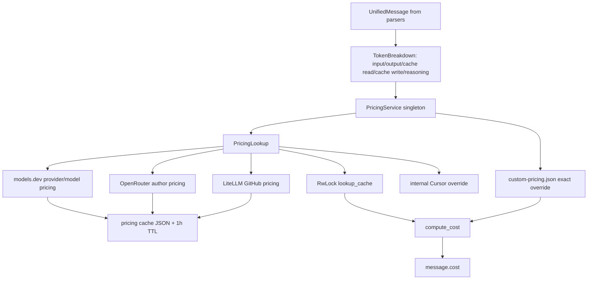

# Tokscale Pricing Cost and Cache

이 페이지는 DeepWiki `3.4.3 Pricing System`을 baseline으로 삼고, 현재 checkout `repos/tokscale/`에서 source-verified한 Tokscale의 가격정보 수집, 모델별 가격 lookup, 실제 cost 계산, cache 구조를 정리한다. 전체 local ETL은 [[tokscale-data-flow-pipeline]], session/source parsing cache는 [[tokscale-session-parsing-and-source-cache]], 가격 적용 이후 report/TUI/graph aggregation은 [[tokscale-report-generation-and-aggregation]], Rust core 계층은 [[tokscale-rust-core-processing-layer]]와 연결된다. DeepWiki는 [[deepwiki-first-baseline]]에 해당하는 외부 baseline이고, 아래 결론은 [[evidence-backed-analysis]] 원칙에 따라 실제 source path로 검증했다.

## Verification snapshot

- Repository: `https://github.com/junhoyeo/tokscale`
- Local checkout: `repos/tokscale/`
- Verified commit: `aebe4ea8b9a80d84cb2ff0e3b3472db9ac34051d`
- DeepWiki baseline: `artifacts/tokscale/deepwiki/pages-md/3.4.3-pricing-system.md`

## Current-source correction

DeepWiki 문서는 가격 source를 LiteLLM, OpenRouter, internal Cursor overrides 중심으로 설명한다. 현재 source 기준으로는 **외부 fetch source가 3개**다.

1. LiteLLM GitHub JSON (`pricing-litellm.json` cache)
2. OpenRouter API (`pricing-openrouter.json` cache)
3. models.dev API (`pricing-models-dev.json` cache)

여기에 **network source가 아닌** 사용자 custom override와 internal Cursor override가 추가된다. `PricingService::fetch_inner()`가 LiteLLM, OpenRouter, models.dev를 `tokio::join!`으로 병렬 fetch하고, `CustomPricing::load_from_default_path()` 및 Cursor override map과 합쳐 service를 만든다 (`repos/tokscale/crates/tokscale-core/src/pricing/mod.rs:130-152`, `repos/tokscale/crates/tokscale-core/src/pricing/mod.rs:48-63`).

## High-level flow



`parse_all_messages_with_pricing_with_env_strategy()` 내부의 `apply_pricing_to_messages()`는 parser output이나 source-message cache hit 결과에 대해 `refresh_derived_fields()` 후 `apply_pricing_if_available()`를 호출한다 (`repos/tokscale/crates/tokscale-core/src/lib.rs:522-539`). 즉 session/source cache가 hit되어 원본 log parsing을 생략하더라도, cached `UnifiedMessage`에는 현재 로드된 pricing data로 cost를 다시 적용한다.

## 1. 가격 source별 수집 방식

### LiteLLM

`pricing/litellm.rs`는 `https://raw.githubusercontent.com/BerriAI/litellm/main/model_prices_and_context_window.json`을 가져와 `HashMap<String, ModelPricing>`으로 deserialize한다 (`repos/tokscale/crates/tokscale-core/src/pricing/litellm.rs:5-40`, `repos/tokscale/crates/tokscale-core/src/pricing/litellm.rs:52-89`). `ModelPricing`은 input/output per-token 가격뿐 아니라 128k/200k/256k/272k tier, cache creation, cache read 가격을 담는다 (`repos/tokscale/crates/tokscale-core/src/pricing/litellm.rs:11-30`).

`PricingService::filter_litellm_data()`는 `github_copilot/` prefix를 제거한다. source comment에 따르면 이 prefix는 subscription 기반 `$0.00` pricing이므로 pay-per-token 비용 산정에는 의미가 없다 (`repos/tokscale/crates/tokscale-core/src/pricing/mod.rs:21-79`).

### OpenRouter

`pricing/openrouter.rs`는 먼저 `https://openrouter.ai/api/v1/models`를 호출해 모델 목록과 fallback prompt/completion 가격을 얻는다 (`repos/tokscale/crates/tokscale-core/src/pricing/openrouter.rs:8-31`, `repos/tokscale/crates/tokscale-core/src/pricing/openrouter.rs:179-260`). 그 뒤 author provider를 알 수 있는 model id에 대해 `/api/v1/models/{id}/endpoints`를 호출하고, endpoint list에서 model author provider의 가격을 선택한다 (`repos/tokscale/crates/tokscale-core/src/pricing/openrouter.rs:63-85`, `repos/tokscale/crates/tokscale-core/src/pricing/openrouter.rs:102-177`). 동시 요청은 `Semaphore`로 10개로 제한한다 (`repos/tokscale/crates/tokscale-core/src/pricing/openrouter.rs:12`, `repos/tokscale/crates/tokscale-core/src/pricing/openrouter.rs:280-303`).

OpenRouter 가격은 endpoint pricing의 `prompt`, `completion`, optional `input_cache_read`, `input_cache_write`를 `ModelPricing`으로 변환한다 (`repos/tokscale/crates/tokscale-core/src/pricing/openrouter.rs:153-174`). author endpoint fetch가 실패하면 목록 API에서 얻은 fallback pricing을 유지한다 (`repos/tokscale/crates/tokscale-core/src/pricing/openrouter.rs:123-157`).

### models.dev

`pricing/models_dev.rs`는 `https://models.dev/api.json`을 가져오고, provider map 안의 model cost를 `provider_id/model_id` key의 lower-case dataset으로 변환한다 (`repos/tokscale/crates/tokscale-core/src/pricing/models_dev.rs:6-48`, `repos/tokscale/crates/tokscale-core/src/pricing/models_dev.rs:135-149`). models.dev cost는 per-million 단위로 들어오므로 `per_token()`에서 `1_000_000.0`으로 나누어 `ModelPricing`의 per-token field로 저장한다 (`repos/tokscale/crates/tokscale-core/src/pricing/models_dev.rs:151-170`). input/output 둘 다 있어야 dataset entry로 남고, cache read/write는 optional이다 (`repos/tokscale/crates/tokscale-core/src/pricing/models_dev.rs:151-160`).

### Custom override and Cursor override

사용자 override는 `~/.config/tokscale/custom-pricing.json` 또는 `TOKSCALE_CONFIG_DIR`가 지정한 config root의 `custom-pricing.json`에서 로드된다 (`repos/tokscale/crates/tokscale-core/src/pricing/custom.rs:174-183`, `repos/tokscale/crates/tokscale-core/src/paths.rs:17-51`). per-million field와 LiteLLM-style per-token field를 모두 받을 수 있지만 같은 의미의 field를 동시에 쓰면 invalid로 처리된다 (`repos/tokscale/crates/tokscale-core/src/pricing/custom.rs:33-64`, `repos/tokscale/crates/tokscale-core/src/pricing/custom.rs:320-347`). lookup은 raw lower-case exact key를 먼저 보고, Synthetic `/models/` normalization key를 그 다음에 본다 (`repos/tokscale/crates/tokscale-core/src/pricing/custom.rs:240-264`). README도 overrides가 exact-only/case-insensitive이고 startup에 한 번 로드된다고 설명한다 (`repos/tokscale/README.md:425-455`).

Cursor override는 external fetch가 아니라 `PricingService::build_cursor_overrides()`의 static map이다. GPT-5.3 family와 Composer 계열의 input/output/cache-read per-token 가격을 source comment와 함께 코드에 보관한다 (`repos/tokscale/crates/tokscale-core/src/pricing/mod.rs:81-128`). 이 override는 real upstream entry가 없을 때 보완하는 fallback이다.

## 2. 모델 가격 lookup 방식

`PricingService`는 먼저 custom override를 확인한다. `lookup_with_source()`/`lookup_with_source_and_provider()`는 `force_source == custom`이면 custom만 보고, source가 강제되지 않은 경우 custom이 있으면 즉시 반환한다 (`repos/tokscale/crates/tokscale-core/src/pricing/mod.rs:187-227`). Cost calculation도 custom exact match를 먼저 적용한 뒤 `PricingLookup`으로 fallback한다 (`repos/tokscale/crates/tokscale-core/src/pricing/mod.rs:248-267`).

`PricingLookup`은 LiteLLM/OpenRouter/Cursor/models.dev dataset과 lower-case index, model-part index, provider-aware index, `lookup_cache`를 가진다 (`repos/tokscale/crates/tokscale-core/src/pricing/lookup.rs:88-105`, `repos/tokscale/crates/tokscale-core/src/pricing/lookup.rs:122-205`). lookup의 핵심 단계는 다음과 같다.

1. `aliases::resolve_alias()`로 friendly name이나 placeholder를 canonical model id로 바꾼다 (`repos/tokscale/crates/tokscale-core/src/pricing/lookup.rs:266-274`, `repos/tokscale/crates/tokscale-core/src/pricing/aliases.rs:4-56`).
2. `strip_parenthesized_reasoning_tier()`로 `gpt-... (high)`류 reasoning tier suffix를 제거하되, 알 수 없는 parenthesized suffix는 안전하게 lookup 실패로 처리한다 (`repos/tokscale/crates/tokscale-core/src/pricing/lookup.rs:276-295`).
3. provider-scoped path, provider hint exact match, raw exact match, version separator normalization, model-name normalization, prefix match를 순서대로 시도한다 (`repos/tokscale/crates/tokscale-core/src/pricing/lookup.rs:322-493`).
4. Cursor exact match는 exact/prefix source lookup 뒤, fuzzy matching 전에 시도된다 (`repos/tokscale/crates/tokscale-core/src/pricing/lookup.rs:495-511`, `repos/tokscale/crates/tokscale-core/src/pricing/lookup.rs:834-843`).
5. forced source는 `litellm`, `openrouter`, `models.dev`/`modelsdev`/`models_dev`로 제한해 해당 source만 lookup한다 (`repos/tokscale/crates/tokscale-core/src/pricing/lookup.rs:299-307`). CLI `tokscale pricing`도 valid provider를 `custom`, `litellm`, `openrouter`, `models.dev`로 제한한다 (`repos/tokscale/crates/tokscale-cli/src/main.rs:3142-3170`).

여러 후보가 있으면 provider preference를 적용한다. `ORIGINAL_PROVIDER_PREFIXES`와 `RESELLER_PROVIDER_PREFIXES`가 정의되어 있고, `choose_best_source_result()`는 provider hint match를 우선한 뒤 original provider를 reseller보다 선호한다 (`repos/tokscale/crates/tokscale-core/src/pricing/lookup.rs:20-47`, `repos/tokscale/crates/tokscale-core/src/pricing/lookup.rs:1899-1941`). `select_best_match()`도 provider hint가 있으면 해당 provider tag와 맞는 priced candidate를 우선하고, reseller hint가 아닐 때 original provider candidate를 선호한다 (`repos/tokscale/crates/tokscale-core/src/pricing/lookup.rs:1735-1797`).

## 3. 실제 cost 계산 방식

비용 산정 entrypoint는 `PricingService::calculate_cost_with_provider()` → `PricingLookup::calculate_cost_with_provider()` → `compute_cost()`다 (`repos/tokscale/crates/tokscale-core/src/pricing/mod.rs:248-267`, `repos/tokscale/crates/tokscale-core/src/pricing/lookup.rs:1004-1026`). 실제 message 적용은 `apply_pricing_if_available()`가 담당한다.

- `apply_pricing_if_available()`는 `message.model_id`, `message.provider_id`, `message.tokens`를 넘겨 계산하고, Zed multiplier를 곱한다 (`repos/tokscale/crates/tokscale-core/src/lib.rs:1990-2006`).
- 계산 결과가 `> 0.0`일 때만 `message.cost`를 덮어쓴다. lookup 실패나 invalid price로 0이 나오면 기존 cost를 유지한다 (`repos/tokscale/crates/tokscale-core/src/lib.rs:1998-2006`).
- Zed hosted provider는 provider list price + 10%로 계산하기 위해 `message.client == "zed"`이고 provider가 Zed hosted provider일 때 `1.1` multiplier를 적용한다 (`repos/tokscale/crates/tokscale-core/src/lib.rs:1968-1988`).
- Trae API dump는 vendor-reported `dollar_float`를 사용하므로 pricing lookup을 적용하지 않는다 (`repos/tokscale/crates/tokscale-core/src/lib.rs:1358-1365`). Hermes/Gajae-Code처럼 source가 이미 cost를 가진 parser path는 cost가 없을 때만 pricing을 적용하는 guard가 있다 (`repos/tokscale/crates/tokscale-core/src/lib.rs:1142-1148`, `repos/tokscale/crates/tokscale-core/src/lib.rs:2009-2021`).

`compute_cost()`의 token bucket 산식은 다음이다.

```text
cost = tiered(input) + tiered(output + reasoning) + tiered(cache_read) + tiered(cache_write)
```

- negative token count는 0으로 clamp한다 (`repos/tokscale/crates/tokscale-core/src/pricing/lookup.rs:1062-1065`).
- invalid/non-finite/negative price value는 0으로 처리한다 (`repos/tokscale/crates/tokscale-core/src/pricing/lookup.rs:1034-1043`).
- input/output tier는 128k, 200k, 256k, 272k threshold를 순서대로 적용한다. threshold를 넘는 구간만 다음 tier price로 계산하는 progressive tier 방식이다 (`repos/tokscale/crates/tokscale-core/src/pricing/lookup.rs:1035-1059`, `repos/tokscale/crates/tokscale-core/src/pricing/lookup.rs:1067-1110`).
- reasoning token은 output token에 더해 output rate로 계산한다 (`repos/tokscale/crates/tokscale-core/src/pricing/lookup.rs:1062-1064`).
- cache read tier는 200k와 272k만 적용하고, cache write tier는 200k만 적용한다 (`repos/tokscale/crates/tokscale-core/src/pricing/lookup.rs:1111-1139`).

## 4. Cache 구조

Tokscale의 pricing cache는 세 층으로 나뉜다.

### Persistent dataset cache

`pricing/cache.rs`는 모든 pricing dataset cache를 같은 wrapper로 저장한다. cache entry는 `{ timestamp, data }` JSON이고 TTL은 `3600`초다 (`repos/tokscale/crates/tokscale-core/src/pricing/cache.rs:6-20`, `repos/tokscale/crates/tokscale-core/src/pricing/cache.rs:22-60`). cache file은 `paths::get_cache_dir()` 아래에 저장되며, 이 directory는 `<config_dir>/cache`다 (`repos/tokscale/crates/tokscale-core/src/pricing/cache.rs:8-14`, `repos/tokscale/crates/tokscale-core/src/paths.rs:53-62`). Unix default config dir은 macOS/Linux에서 `$HOME/.config/tokscale`, 또는 `TOKSCALE_CONFIG_DIR` override다 (`repos/tokscale/crates/tokscale-core/src/paths.rs:17-51`).

Persistent pricing cache file은 다음과 같다.

- `pricing-litellm.json` (`repos/tokscale/crates/tokscale-core/src/pricing/litellm.rs:5`)
- `pricing-openrouter.json` (`repos/tokscale/crates/tokscale-core/src/pricing/openrouter.rs:8`)
- `pricing-models-dev.json` (`repos/tokscale/crates/tokscale-core/src/pricing/models_dev.rs:6`)

저장은 temp file 생성, `sync_all()`, atomic replace 순서로 수행한다. comment는 canonical cache file을 먼저 삭제하지 말라는 invariant를 명시한다 (`repos/tokscale/crates/tokscale-core/src/pricing/cache.rs:62-103`). canonical cache가 없으면 legacy cache dir도 읽는다. `TOKSCALE_CONFIG_DIR`가 설정되어 있으면 hermetic override를 위해 legacy fallback을 끈다 (`repos/tokscale/crates/tokscale-core/src/pricing/cache.rs:105-117`, `repos/tokscale/crates/tokscale-core/src/paths.rs:64-107`). README의 cache layout도 pricing cache가 `~/.config/tokscale/cache/` 또는 `${TOKSCALE_CONFIG_DIR}/cache/` 아래에 있다고 설명한다 (`repos/tokscale/README.md:780-790`).

### Stale-cache fallback and cache-only mode

Local parse path는 최신 fetch를 먼저 시도하지만, 실패하면 age와 무관하게 cached dataset을 service로 재구성한다. `load_pricing_for_local_parse()`는 `PricingService::get_or_init().await` 실패 시 `PricingService::load_cached_any_age()`를 fallback으로 사용한다 (`repos/tokscale/crates/tokscale-core/src/lib.rs:2034-2049`). `TOKSCALE_PRICING_CACHE_ONLY=1|true|TRUE|yes|YES`이면 network fetch를 건너뛰고 any-age cache만 사용한다 (`repos/tokscale/crates/tokscale-core/src/lib.rs:2034-2040`).

`PricingService::load_cached_any_age()`는 LiteLLM/OpenRouter/models.dev cache 중 하나라도 있으면 service를 만든다. 이때 custom pricing도 다시 로드되고 LiteLLM의 excluded prefix filter도 다시 적용된다 (`repos/tokscale/crates/tokscale-core/src/pricing/mod.rs:155-178`).

### In-memory service and lookup cache

`PricingService::get_or_init()`는 `tokio::sync::OnceCell<Arc<PricingService>>`를 사용한다. 한 process 안에서는 최초 fetch 후 같은 service를 공유한다 (`repos/tokscale/crates/tokscale-core/src/pricing/mod.rs:19`, `repos/tokscale/crates/tokscale-core/src/pricing/mod.rs:180-185`). `PricingLookup` 내부에는 `RwLock<HashMap<String, Option<CachedResult>>>`가 있어 복잡한 lookup 결과를 memoize한다 (`repos/tokscale/crates/tokscale-core/src/pricing/lookup.rs:71-76`, `repos/tokscale/crates/tokscale-core/src/pricing/lookup.rs:208-255`).

lookup cache key는 model id와 provider hint를 함께 반영한다 (`repos/tokscale/crates/tokscale-core/src/pricing/lookup.rs:217-224`). entry 수가 512개 이상이면 전체 clear가 아니라 약 25%를 제거해 thundering-herd cache miss를 줄인다 (`repos/tokscale/crates/tokscale-core/src/pricing/lookup.rs:51`, `repos/tokscale/crates/tokscale-core/src/pricing/lookup.rs:234-244`). source-message cache와 달리 이 cache는 process-local이며 disk에 저장되지 않는다.

## Durable interpretation

Tokscale의 pricing layer는 “parser가 만든 token bucket을 현재 가격 데이터로 enrich하는 runtime service”다. 중요한 설계 포인트는 source-message cache와 pricing cache의 책임 분리다. source-message cache는 비싼 log parsing을 줄이지만, cached message도 매번 `apply_pricing_if_available()`를 통과하므로 새 pricing cache나 custom override가 로드되면 비용 계산은 다시 반영될 수 있다 (`repos/tokscale/crates/tokscale-core/src/lib.rs:532-539`, `repos/tokscale/crates/tokscale-core/src/lib.rs:654-681`). 반대로 pricing cache는 external pricing dataset fetch를 줄이고 offline fallback을 제공하지만, message parser의 source fingerprint/incremental parsing과는 별도 계층이다.
