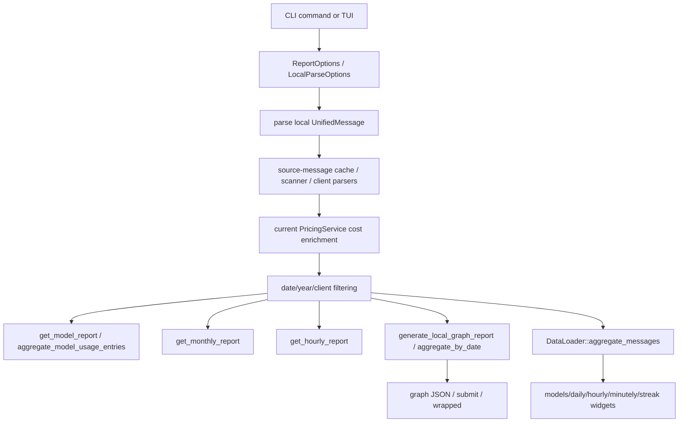

# Tokscale Report Generation and Aggregation

이 페이지는 DeepWiki `3.4.4 Report Generation and Aggregation`을 baseline으로 삼고, 현재 checkout `repos/tokscale/`의 실제 source code로 검증한 Tokscale의 report 생성·집계 흐름이다. upstream 입력과 가격 계산은 [[tokscale-data-flow-pipeline]], [[tokscale-session-parsing-and-source-cache]], [[tokscale-pricing-cost-and-cache]]와 연결된다. 터미널에서 이 report surface를 실제로 호출하는 명령어는 [[tokscale-cli-terminal-commands]]에 정리되어 있다. DeepWiki는 [[deepwiki-first-baseline]]에 해당하는 외부 second opinion이며, 아래 결론은 [[evidence-backed-analysis]] 원칙에 따라 source path로 확인했다.

## Verification snapshot

- Repository: `https://github.com/junhoyeo/tokscale`
- Local checkout: `repos/tokscale/`
- Verified commit: `aebe4ea8b9a80d84cb2ff0e3b3472db9ac34051d`
- DeepWiki baseline: `artifacts/tokscale/deepwiki/pages-md/3.4.4-report-generation-and-aggregation.md`

## Current-source corrections

DeepWiki의 큰 방향, 즉 `UnifiedMessage`를 가격 적용 후 model/month/day/hour/graph/wrapped view로 집계한다는 설명은 맞다. 다만 현재 source 기준으로는 다음 보정이 필요하다.

1. DeepWiki가 말하는 단일 `finalize_report()` 중심 구조는 현재 source의 public entrypoint 이름과 맞지 않는다. CLI/report path는 `get_model_report()`, `get_monthly_report()`, `get_hourly_report()`, `generate_graph()`/`generate_local_graph_report()`로 나뉘고, TUI는 별도의 `DataLoader::aggregate_messages()`를 사용한다 (`repos/tokscale/crates/tokscale-core/src/lib.rs:1600-1642`, `repos/tokscale/crates/tokscale-core/src/lib.rs:1656-1725`, `repos/tokscale/crates/tokscale-core/src/lib.rs:1746-1837`, `repos/tokscale/crates/tokscale-core/src/lib.rs:1926-1933`, `repos/tokscale/crates/tokscale-cli/src/tui/data/mod.rs:305-348`, `repos/tokscale/crates/tokscale-cli/src/tui/data/mod.rs:406-920`).
2. `GroupBy`는 DeepWiki 표의 4개보다 많다. 현재 enum에는 `Model`, `ClientModel`, `ClientProviderModel`, `WorkspaceModel`, `Session`, `ClientSession`이 있다 (`repos/tokscale/crates/tokscale-core/src/lib.rs:128-150`).
3. contribution graph intensity는 surface별 shape가 다르다. core `DailyContribution.intensity`와 wrapped `level`은 `u8` 0-4 bucket이고, TUI `GraphData`의 `ContributionDay.intensity`는 0.0-1.0 ratio다 (`repos/tokscale/crates/tokscale-core/src/lib.rs:323-331`, `repos/tokscale/crates/tokscale-core/src/aggregator.rs:704-728`, `repos/tokscale/crates/tokscale-cli/src/tui/data/mod.rs:136-145`, `repos/tokscale/crates/tokscale-cli/src/tui/data/mod.rs:990-1049`, `repos/tokscale/crates/tokscale-cli/src/commands/wrapped.rs:1322-1337`).
4. report aggregation 자체는 source-message cache를 직접 관리하지 않는다. cache hit/miss와 fingerprint invalidation은 parsing boundary에서 처리되고, hit된 cached message도 현재 pricing service로 다시 cost가 적용된 뒤 report aggregator로 넘어간다 (`repos/tokscale/crates/tokscale-core/src/lib.rs:633-683`, `repos/tokscale/crates/tokscale-core/src/lib.rs:2034-2079`).

## High-level flow

핵심 경계는 “parser/cache/pricing이 `UnifiedMessage` stream을 만들고, report/TUI layer가 같은 stream을 필요한 view model로 다시 묶는다”는 점이다. 따라서 비용과 token bucket의 authority는 `UnifiedMessage`와 pricing layer에 있고, report layer는 이를 재계산하지 않고 합산한다.

## 1. Model report path

`tokscale models --json|--light` 또는 non-TUI fallback은 CLI `run_models_report()`가 `ReportOptions`를 만든 뒤 core `get_model_report()`를 호출한다 (`repos/tokscale/crates/tokscale-cli/src/main.rs:468-513`, `repos/tokscale/crates/tokscale-cli/src/main.rs:1740-1777`). Core path는 다음 순서다.

1. `ReportOptions.home_dir`를 resolve하고, client filter가 없으면 `ClientId::ALL` plus `synthetic`을 기본값으로 쓴다 (`repos/tokscale/crates/tokscale-core/src/lib.rs:1600-1612`).
2. `load_pricing_for_local_parse()`로 fresh pricing 또는 stale cache fallback을 로드한다 (`repos/tokscale/crates/tokscale-core/src/lib.rs:1614`, `repos/tokscale/crates/tokscale-core/src/lib.rs:2034-2049`).
3. `parse_all_messages_with_pricing_with_env_strategy()`가 scan/parse/cache/pricing을 거친 `UnifiedMessage`를 만든다 (`repos/tokscale/crates/tokscale-core/src/lib.rs:1615-1621`).
4. `filter_messages_for_report()`로 기간/year/client filter를 적용한 뒤 `aggregate_model_usage_entries()`로 group key별 `ModelUsage`를 만든다 (`repos/tokscale/crates/tokscale-core/src/lib.rs:1623-1624`).
5. entry들의 input/output/cache read/cache write/message/cost를 합산해 `ModelReport`를 반환한다 (`repos/tokscale/crates/tokscale-core/src/lib.rs:1626-1642`).

`aggregate_model_usage_entries()`는 `normalize_model_for_grouping()`을 먼저 적용하고, `GroupBy`에 따라 key를 `model`, `client:model`, `client:provider:model`, `workspace:model`, `session:model`, `client:session:model` 중 하나로 만든다 (`repos/tokscale/crates/tokscale-core/src/lib.rs:1476-1499`). 이후 token bucket, message count, cost, performance metrics를 더하고, provider 문자열을 정렬/dedup한 뒤 cost 내림차순으로 정렬한다 (`repos/tokscale/crates/tokscale-core/src/lib.rs:1551-1589`).

## 2. Monthly and hourly report paths

`tokscale monthly`와 `tokscale hourly`도 CLI에서 `ReportOptions`를 만든 뒤 core 함수를 호출한다 (`repos/tokscale/crates/tokscale-cli/src/main.rs:515-583`, `repos/tokscale/crates/tokscale-cli/src/main.rs:2531-2565`, `repos/tokscale/crates/tokscale-cli/src/main.rs:2826-2860`). 둘 다 model report와 동일하게 pricing-loaded parse와 report filter를 먼저 수행한다.

- `get_monthly_report()`는 `msg.date[..7]`을 `YYYY-MM` key로 사용하고, month별 model set, input/output/cache read/cache write, message count, cost를 합산한다. invalid short date는 skip하고, output은 month 오름차순이다 (`repos/tokscale/crates/tokscale-core/src/lib.rs:1656-1725`).
- `get_hourly_report()`는 `msg.timestamp`가 있으면 local timezone 기준 `YYYY-MM-DD HH:00` bucket으로 자르고, timestamp가 없거나 invalid하면 `msg.date 00:00`으로 fallback한다. hour별 client set, normalized model set, token buckets, message count, `is_turn_start` 기반 turn count, reasoning, cost를 합산하고 hour 오름차순으로 반환한다 (`repos/tokscale/crates/tokscale-core/src/lib.rs:1728-1837`).

즉 monthly/hourly는 별도 graph accumulator를 쓰지 않고, filtered `UnifiedMessage`를 단순 bucket map으로 fold하는 report-specific aggregation이다.

## 3. Graph result path

`tokscale graph`는 CLI `run_graph_command()`에서 cursor sync/setup warning 처리를 한 뒤 `generate_local_graph_report()`를 호출하고, 반환된 `GraphResult`를 `TsTokenContributionData` JSON shape로 변환한다 (`repos/tokscale/crates/tokscale-cli/src/main.rs:611-630`, `repos/tokscale/crates/tokscale-cli/src/main.rs:4608-4707`, `repos/tokscale/crates/tokscale-cli/src/main.rs:4048-4160`). Core graph path는 더 구조화되어 있다.

1. `generate_local_graph_report()`는 local parse용 pricing fallback을 사용하고, `generate_graph()`는 strict `PricingService::get_or_init()`를 사용한다 (`repos/tokscale/crates/tokscale-core/src/lib.rs:1926-1933`).
2. `generate_graph_with_loaded_pricing()`는 parse → filter → `sessionize()`/time metrics → `aggregate_by_date()` → `generate_graph_result()` 순서로 처리한다 (`repos/tokscale/crates/tokscale-core/src/lib.rs:1840-1885`).
3. `aggregate_by_date()`는 `rayon` `into_par_iter().fold().reduce()`로 `DayAccumulator`를 병렬 생성/병합하고 날짜순 `DailyContribution`으로 변환한다 (`repos/tokscale/crates/tokscale-core/src/aggregator.rs:13-58`).
4. `DayAccumulator::add_message()`는 total tokens, cost, message count, token breakdown을 더하고, `client:normalized_model` key의 `ClientContribution`에 client/model/provider/token/cost/message breakdown을 합산한다 (`repos/tokscale/crates/tokscale-core/src/aggregator.rs:225-327`).
5. `generate_graph_result()`는 `calculate_summary()`, `calculate_years()`, date range, generated timestamp, package version, processing time을 붙여 최종 `GraphResult`를 만든다 (`repos/tokscale/crates/tokscale-core/src/aggregator.rs:103-148`, `repos/tokscale/crates/tokscale-core/src/aggregator.rs:189-219`, `repos/tokscale/crates/tokscale-core/src/lib.rs:300-389`).

Core graph의 intensity는 max daily cost 대비 ratio로 4/3/2/1/0을 부여한다. threshold는 `>=0.75`, `>=0.5`, `>=0.25`, `>0.0`, else `0`이다 (`repos/tokscale/crates/tokscale-core/src/aggregator.rs:704-728`).

## 4. TUI aggregation path

TUI는 core의 `ModelReport`/`MonthlyReport`를 그대로 쓰지 않는다. `DataLoader::load()`가 `LocalParseOptions`로 `parse_local_unified_messages()`를 호출한 뒤, TUI 전용 `UsageData`로 다시 aggregate한다 (`repos/tokscale/crates/tokscale-cli/src/tui/data/mod.rs:305-348`, `repos/tokscale/crates/tokscale-cli/src/tui/data/mod.rs:148-170`). 이 adapter가 필요한 이유는 TUI가 model list뿐 아니라 agent ranking, expandable daily source breakdown, hourly/minutely drilldown, contribution graph, streak를 동시에 렌더링하기 때문이다.

`DataLoader::aggregate_messages()`는 message loop 안에서 다음 view들을 동시에 채운다.

- `ModelUsage`: group key별 token/cost/performance/session count (`repos/tokscale/crates/tokscale-cli/src/tui/data/mod.rs:406-505`).
- `AgentUsage`: `msg.agent`가 있으면 OpenCode agent normalization 또는 일반 agent normalization 후 agent별 token/cost/message/client set 집계 (`repos/tokscale/crates/tokscale-cli/src/tui/data/mod.rs:507-552`).
- `DailyUsage`: `NaiveDate` bucket, source별 `DailySourceInfo`, model별 `DailyModelInfo`, turn count 집계 (`repos/tokscale/crates/tokscale-cli/src/tui/data/mod.rs:554-674`).
- `HourlyUsage`와 `MinutelyUsage`: local timezone timestamp bucket, missing timestamp fallback, client/model/color key, turn count 집계. minutely는 setting으로 enable된 경우에만 계산된다 (`repos/tokscale/crates/tokscale-cli/src/tui/data/mod.rs:676-857`).
- `GraphData`와 streak: daily list에서 1년치 contribution grid와 current/longest streak를 계산한다 (`repos/tokscale/crates/tokscale-cli/src/tui/data/mod.rs:888-919`, `repos/tokscale/crates/tokscale-cli/src/tui/data/mod.rs:990-1102`).

TUI graph intensity는 `usage.cost / max_cost`를 `0.0..1.0`으로 clamp한 floating ratio다. core graph/wrapped의 0-4 level과 다르므로 UI surface를 구분해서 읽어야 한다 (`repos/tokscale/crates/tokscale-cli/src/tui/data/mod.rs:990-1049`).

## 5. Wrapped report path

`tokscale wrapped`는 `main.rs`에서 `commands::wrapped::run()`으로 위임된다 (`repos/tokscale/crates/tokscale-cli/src/main.rs:675-690`, `repos/tokscale/crates/tokscale-cli/src/main.rs:3099-3125`). `wrapped.rs`는 PNG 렌더링을 위한 별도 summary builder다.

- `load_wrapped_data()`는 year range를 만들고 Cursor sync/cache 여부를 판단한 뒤, agent view가 필요하면 `parse_local_clients()`로 raw parsed local data를 별도 로드한다 (`repos/tokscale/crates/tokscale-cli/src/commands/wrapped.rs:160-239`).
- 같은 함수는 `generate_graph()`를 호출해 yearly `GraphResult`를 얻고, daily `ClientContribution`에서 top models/top clients를 cost 기준으로 3개씩 뽑는다 (`repos/tokscale/crates/tokscale-cli/src/commands/wrapped.rs:243-304`).
- OpenCode agent ranking은 `build_top_agents()`가 `parsed.messages` 중 `message.client == "opencode"`이고 agent가 있는 항목만 사용해 token/message 기준으로 만든다 (`repos/tokscale/crates/tokscale-cli/src/commands/wrapped.rs:356-410`).
- wrapped contribution level은 graph contribution cost를 max cost와 비교해 core graph와 같은 0-4 threshold로 다시 계산한다 (`repos/tokscale/crates/tokscale-cli/src/commands/wrapped.rs:315-327`, `repos/tokscale/crates/tokscale-cli/src/commands/wrapped.rs:1322-1337`).
- streak는 sorted date string을 순회해 오늘/어제까지 이어진 current streak와 전체 longest streak를 계산한다 (`repos/tokscale/crates/tokscale-cli/src/commands/wrapped.rs:329-337`, `repos/tokscale/crates/tokscale-cli/src/commands/wrapped.rs:1339-1393`).

## 6. Source-message cache boundary

Report generation을 이해할 때 cache는 두 가지로 분리해야 한다.

- **Source-message cache**는 `source-message-cache.bin`이며 schema version, lock file, max cache size, sample hash constants를 `message_cache.rs`에 둔다 (`repos/tokscale/crates/tokscale-core/src/message_cache.rs:13-21`).
- `SourceFingerprint`는 size, modified timestamp, 5개 4KB sample hash, full content hash, related file fingerprints를 가진다 (`repos/tokscale/crates/tokscale-core/src/message_cache.rs:98-177`). SQLite source는 `-wal`, Claude Code JSONL은 `.meta.json`과 cc-mirror variant file을 related file로 포함해 invalidation한다 (`repos/tokscale/crates/tokscale-core/src/message_cache.rs:128-155`).
- `load_or_parse_source_with_fingerprint_and_policy()`는 fingerprint가 같고 cached messages가 있으면 parser를 건너뛰지만, `cached_messages(cached, pricing)`을 통해 현재 pricing을 다시 적용한 메시지를 반환한다. fingerprint가 다르면 source parser를 실행하고 새 cache entry를 만든 뒤 pricing을 적용한다 (`repos/tokscale/crates/tokscale-core/src/lib.rs:633-683`).

따라서 source-message cache는 “file parsing 비용 절감” 계층이지 report aggregation cache가 아니다. report output은 cache hit 여부와 무관하게 현재 filter/group/pricing context로 다시 만들어진다.

## Durable interpretation

Tokscale의 report subsystem은 하나의 monolithic finalizer라기보다 세 개의 aggregation surface로 나뉜다.

1. **Core CLI reports**: model/month/hour table·JSON에 맞는 `ModelReport`, `MonthlyReport`, `HourlyReport`를 생성한다.
2. **Core graph/submission data**: 날짜별 `DailyContribution`과 `GraphResult`를 만들어 graph JSON, submit payload, wrapped의 기본 입력으로 쓴다.
3. **TUI adapter**: 같은 `UnifiedMessage` stream을 TUI 전용 `UsageData`로 재집계해 model/agent/daily/hourly/minutely/streak dashboard를 만든다.

이 설계의 핵심은 report layer가 parser별 세부 저장 형식을 모른다는 점이다. scanner, client parser, source-message cache, pricing lookup이 모두 `UnifiedMessage` boundary 앞에서 끝나고, report layer는 그 뒤의 token bucket·cost·timestamp·client/model/provider/session/workspace/agent field만 사용해 view-specific aggregate를 만든다.
