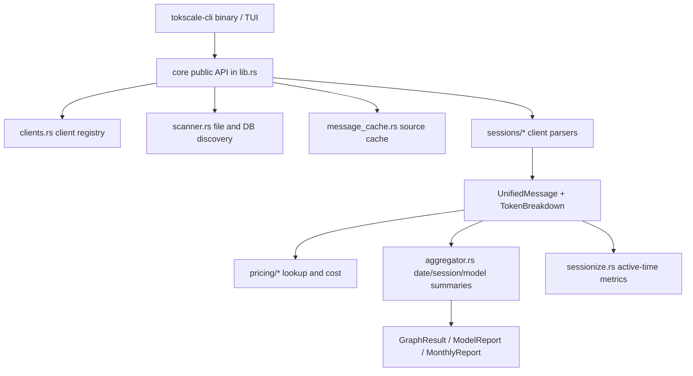

# Tokscale Rust Core Processing Layer

이 페이지는 DeepWiki `3.4.1 Core Architecture and NAPI Integration`을 baseline으로 삼되, 현재 checkout의 실제 Rust core 계층을 기준으로 다시 정리한 것이다. 데이터 처리의 전체 end-to-end 흐름은 [[tokscale-data-flow-pipeline]]에 있고, 여러 agent/client별 parser와 source cache mechanics는 [[tokscale-session-parsing-and-source-cache]]에 있다. 이 페이지는 그중 `crates/tokscale-core` 내부 계층과 CLI/package boundary에 집중한다. DeepWiki는 [[deepwiki-first-baseline]]이고, 아래 결론은 [[evidence-backed-analysis]] 원칙에 따라 `repos/tokscale/` source로 검증했다.

## Verification snapshot

- Repository: `https://github.com/junhoyeo/tokscale`
- Local checkout: `repos/tokscale/`
- Verified commit: `aebe4ea8b9a80d84cb2ff0e3b3472db9ac34051d`
- DeepWiki baseline: `artifacts/tokscale/deepwiki/pages-md/3.4.1-core-architecture-and-napi-integration.md`

## Current-source correction: NAPI claim is stale

DeepWiki는 `tokscale-core`가 NAPI-RS native addon으로 컴파일되어 TypeScript CLI가 직접 호출한다고 설명하지만, 현재 checkout 기준 production packaging은 다르다.

- `crates/tokscale-core/Cargo.toml`의 library crate type은 `rlib`뿐이다 (`repos/tokscale/crates/tokscale-core/Cargo.toml:10-12`).
- `tokscale-core` dependency list에는 `napi` 또는 `napi-derive`가 없다 (`repos/tokscale/crates/tokscale-core/Cargo.toml:13-35`).
- repo content search에서 `napi`는 README/lockfile의 간접 언급에 남아 있고, Rust source의 `#[napi]` entrypoint나 `packages/src/native.js` 구현은 현재 tree에 없다 (`repos/tokscale/README.md:1679-1680`, `repos/tokscale/packages/benchmarks/runner.ts:194-213`).
- 현재 npm wrapper `@tokscale/cli`는 platform-specific binary package에서 `tokscale` 실행 파일을 찾아 `spawnSync()`로 실행한다 (`repos/tokscale/packages/cli/src/index.ts:166-228`).
- CI도 NAPI addon이 아니라 `tokscale-cli` binary를 target별로 build/upload한다 (`repos/tokscale/.github/workflows/build-native.yml:24-63`, `repos/tokscale/.github/workflows/build-native.yml:100-114`).

따라서 현재 source 기준의 boundary는 “TypeScript → NAPI → Rust core”가 아니라 “npm/bin wrapper → standalone Rust CLI binary → `tokscale-core` Rust library”다.

## Core layer hierarchy

`tokscale-core`는 `lib.rs`에서 `aggregator`, `cc_mirror`, `clients`, `fs_atomic`, `mcp`, `message_cache`, `parser`, `paths`, `pricing`, `provider_identity`, `scanner`, `sessionize`, `sessions`를 module로 묶는다 (`repos/tokscale/crates/tokscale-core/src/lib.rs:1-15`). Public surface는 `aggregator`, `clients`, `parser`, `scanner`, `sessionize`, `UnifiedMessage` 등을 re-export한다 (`repos/tokscale/crates/tokscale-core/src/lib.rs:17-25`).

## 1. Public API and orchestration layer: `lib.rs`

`lib.rs`는 core의 orchestration hub다. CLI/TUI가 직접 다루는 `LocalParseOptions`, `ReportOptions`, `GroupBy`, `TokenBreakdown`, `ParsedMessage`, `ParsedMessages`, `ModelReport`, `GraphResult` 같은 타입과 report entrypoints가 여기에 모인다.

핵심 parse path는 다음과 같다.

1. `parse_local_unified_messages()`가 request를 resolve하고 local pricing service를 로드한다 (`repos/tokscale/crates/tokscale-core/src/lib.rs:2610-2624`).
2. `parse_local_unified_messages_resolved()`가 `parse_all_messages_with_pricing_with_env_strategy()`로 넘긴 뒤 date/year filter를 적용한다 (`repos/tokscale/crates/tokscale-core/src/lib.rs:2066-2080`).
3. `parse_all_messages_with_pricing_with_env_strategy()`가 scanner, cache, client parser, pricing 적용, dedup을 한 곳에서 조립한다 (`repos/tokscale/crates/tokscale-core/src/lib.rs:508-959`).

즉 `lib.rs`는 단순 type barrel이 아니라 data-collection pipeline을 구성하는 application service layer다.

## 2. Client registry layer: `clients.rs`

`clients.rs`는 지원 client의 canonical registry다.

- `PathRoot`는 home, XDG data, config, environment variable fallback을 표현한다 (`repos/tokscale/crates/tokscale-core/src/clients.rs:1-75`).
- `ClientDef`는 client id, root, relative path, file pattern, headless 여부, local parse 여부, default submit 여부를 가진다 (`repos/tokscale/crates/tokscale-core/src/clients.rs:77-99`).
- `define_clients!` macro가 `ClientId` enum, `CLIENTS` array, `parse_local()`, `submit_default()`, `iter()` 등을 함께 생성한다 (`repos/tokscale/crates/tokscale-core/src/clients.rs:102-170`).
- OpenCode, Claude, Codex, Cursor, Gemini 등의 기본 path/pattern 정의가 이 registry에 들어 있다 (`repos/tokscale/crates/tokscale-core/src/clients.rs:171-222`).

이 계층 덕분에 scanner/parser는 문자열 switch 대신 `ClientId`와 `ClientDef`를 중심으로 동작한다.

## 3. Discovery layer: `scanner.rs`

`scanner.rs`는 실제 filesystem 후보를 찾는 계층이다.

- `scan_directory()`는 `WalkDir` + `rayon::par_bridge()`로 directory를 병렬 순회하고 pattern별 file filter를 적용한다 (`repos/tokscale/crates/tokscale-core/src/scanner.rs:236-312`).
- `scan_all_clients_with_scanner_settings()`는 home, enabled clients, env roots, user scanner settings를 받아 scan task를 구성한다 (`repos/tokscale/crates/tokscale-core/src/scanner.rs:659-751`).
- task 실행은 `into_par_iter()`로 병렬화되고, overlapping root에서 발견된 중복 file path는 `HashSet<PathBuf>`로 제거된다 (`repos/tokscale/crates/tokscale-core/src/scanner.rs:1182-1199`).
- `ScanResult`는 단순 file list뿐 아니라 OpenCode SQLite DB, Hermes/Goose/Zed/Kiro 등 특수 path bucket도 포함한다 (`repos/tokscale/crates/tokscale-core/src/scanner.rs:72-93`).

## 4. Source cache layer: `message_cache.rs`

`message_cache.rs`는 repeated parse 비용을 줄이는 persistent cache 계층이다.

- cache 파일은 `source-message-cache.bin`이며 lock file과 schema version이 함께 정의된다 (`repos/tokscale/crates/tokscale-core/src/message_cache.rs:13-20`).
- `SourceFingerprint`는 file size, modified timestamp, sampled hashes, full content hash, related file fingerprints를 보관한다 (`repos/tokscale/crates/tokscale-core/src/message_cache.rs:105-177`).
- Codex용 incremental cache는 parser state, consumed byte offset, newline 여부, prefix hash를 보관한다 (`repos/tokscale/crates/tokscale-core/src/message_cache.rs:193-199`).
- `parse_all_messages_with_pricing_with_env_strategy()`는 cache hit이면 cached messages에 pricing만 다시 적용하고, miss이면 parser를 실행해 cache entry를 갱신한다 (`repos/tokscale/crates/tokscale-core/src/lib.rs:532-681`).

## 5. Parser layer: `sessions/*`

`sessions/`는 client-specific parser 계층이다. 현재 checkout에는 `amp`, `antigravity`, `claudecode`, `cline`, `codebuff`, `codex`, `copilot`, `cursor`, `gemini`, `goose`, `hermes`, `opencode`, `warp`, `zed` 등 다수의 parser module이 있다 (`repos/tokscale/crates/tokscale-core/src/sessions/mod.rs:1-34`).

공통 output은 `UnifiedMessage`다. 이 struct는 client/model/provider/session/workspace/timestamp/date, `TokenBreakdown`, cost, duration, message count, agent, dedup key, turn-start flag를 담는다 (`repos/tokscale/crates/tokscale-core/src/sessions/mod.rs:38-60`). Codex처럼 append-only JSONL 성격이 강한 source는 `CodexParseState`와 `consumed_offset`으로 incremental parse를 지원한다 (`repos/tokscale/crates/tokscale-core/src/sessions/codex.rs:166-199`, `repos/tokscale/crates/tokscale-core/src/sessions/codex.rs:242-279`).

## 6. Pricing layer: `pricing/*`

`pricing/`은 token bucket을 비용으로 enrich하는 계층이다. pricing source와 cache/cost calculation의 세부 흐름은 [[tokscale-pricing-cost-and-cache]]에 별도로 정리했다.

- `pricing/mod.rs`는 `aliases`, `cache`, `custom`, `litellm`, `lookup`, `models_dev`, `openrouter` 하위 module을 가진다 (`repos/tokscale/crates/tokscale-core/src/pricing/mod.rs:1-7`).
- `PricingService`는 custom pricing과 `PricingLookup`을 조합한다 (`repos/tokscale/crates/tokscale-core/src/pricing/mod.rs:27-63`).
- `fetch_inner()`는 LiteLLM, OpenRouter, models.dev 데이터를 `tokio::join!`으로 병렬 fetch하고 custom pricing과 합친다 (`repos/tokscale/crates/tokscale-core/src/pricing/mod.rs:130-152`).
- `PricingLookup`은 LiteLLM/OpenRouter/Cursor/models.dev map, lower-case index, model-part index, lookup cache를 갖고 alias, provider, prefix/suffix stripping을 처리한다 (`repos/tokscale/crates/tokscale-core/src/pricing/lookup.rs:88-105`, `repos/tokscale/crates/tokscale-core/src/pricing/lookup.rs:266-350`).

## 7. Aggregation and reporting layer: `aggregator.rs` + report functions

`aggregator.rs`는 `UnifiedMessage` stream을 report-friendly shape로 줄이는 계층이다.

- `aggregate_by_date()`는 `rayon` fold/reduce로 날짜별 accumulator를 만들고 `DailyContribution`으로 변환한 뒤 intensity를 계산한다 (`repos/tokscale/crates/tokscale-core/src/aggregator.rs:13-58`).
- `aggregate_by_session()`은 session id별 token/cost/client/model breakdown을 합산하고 최근 활동순으로 정렬한다 (`repos/tokscale/crates/tokscale-core/src/aggregator.rs:60-100`).
- `calculate_summary()`와 `generate_graph_result()`가 graph/report summary를 만든다 (`repos/tokscale/crates/tokscale-core/src/aggregator.rs:103-148`, `repos/tokscale/crates/tokscale-core/src/aggregator.rs:189-192`).
- `get_model_report()`는 parse → filter → `aggregate_model_usage_entries()` → totals 계산 순서로 동작한다 (`repos/tokscale/crates/tokscale-core/src/lib.rs:1599-1642`).
- `generate_graph_with_loaded_pricing()`는 parse → date filter → sessionize active-time metrics → daily aggregation → `GraphResult` 생성으로 이어진다 (`repos/tokscale/crates/tokscale-core/src/lib.rs:1840-1885`).

## Boundary with CLI and npm distribution

`crates/tokscale-cli`는 Rust binary crate이고 `tokscale-core`를 dependency로 갖는다 (`repos/tokscale/crates/tokscale-cli/Cargo.toml:10-20`). npm package `@tokscale/cli`는 JS implementation이 core 함수를 직접 호출하는 것이 아니라 platform package의 native binary를 찾아 실행하는 wrapper다 (`repos/tokscale/packages/cli/package.json:1-40`, `repos/tokscale/packages/cli/src/index.ts:166-228`). Platform package는 `bin/tokscale` 또는 `bin/tokscale.exe`를 포함하도록 구성된다 (`repos/tokscale/packages/cli-darwin-arm64/package.json:1-26`).

## Durable interpretation

현재 Tokscale의 Rust core 계층은 “NAPI addon”보다 “standalone binary가 사용하는 Rust library”로 이해하는 것이 정확하다. `tokscale-core`는 client registry, scanner, source cache, parser, pricing, aggregation/report를 한 crate 안에 분리된 module로 보유하고, `tokscale-cli`가 이를 호출해 CLI/TUI/social-submit용 결과를 만든다. DeepWiki의 NAPI 설명은 README의 오래된 표현과 benchmark stub의 흔적을 반영한 것으로 보이며, 현재 production build/package path는 target별 `tokscale-cli` binary 배포다.
