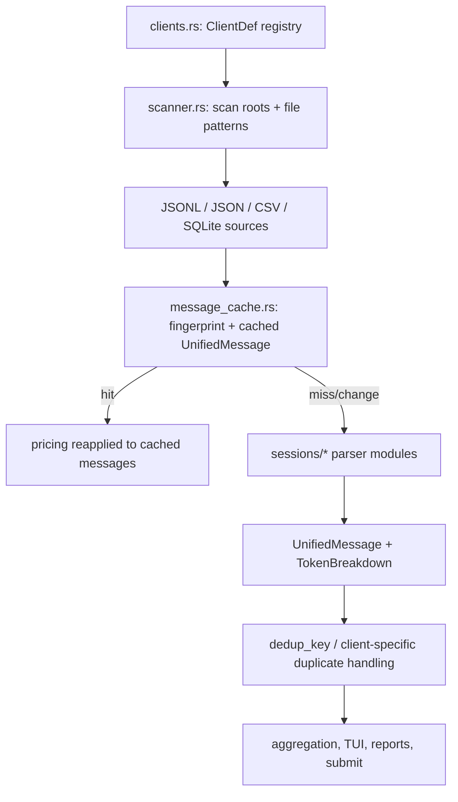

# Tokscale Session Parsing and Source Cache

이 페이지는 DeepWiki `3.4.2 Session Parsing and Data Sources`를 baseline으로 삼고, 현재 checkout `repos/tokscale/`에서 source-verified한 “여러 AI agent/client 로그를 어떻게 찾고, 반복 파싱을 어떻게 줄이고, 각 로그에서 어떤 데이터로 정규화하는가”에 대한 핵심 정리다. 프로젝트 전체 구조는 [[tokscale]], end-to-end ETL은 [[tokscale-data-flow-pipeline]], Rust core 계층은 [[tokscale-rust-core-processing-layer]]와 연결된다. DeepWiki는 [[deepwiki-first-baseline]]에 해당하는 외부 baseline이고, 아래 결론은 [[evidence-backed-analysis]] 원칙에 따라 실제 source path로 검증했다.

## Verification snapshot

- Repository: `https://github.com/junhoyeo/tokscale`
- Local checkout: `repos/tokscale/`
- Verified commit: `aebe4ea8b9a80d84cb2ff0e3b3472db9ac34051d`
- DeepWiki baseline: `artifacts/tokscale/deepwiki/pages-md/3.4.2-session-parsing-and-data-sources.md`

## 핵심 모델

Tokscale의 session parsing은 다음 4단계로 이해하면 된다.

핵심 output은 `sessions/mod.rs`의 `UnifiedMessage`다. 이 struct는 `client`, `model_id`, `provider_id`, `session_id`, `workspace_key`, `workspace_label`, `timestamp`, `date`, `TokenBreakdown`, `cost`, `duration_ms`, `message_count`, `agent`, `dedup_key`, `is_turn_start`를 담는다 (`repos/tokscale/crates/tokscale-core/src/sessions/mod.rs:38-60`). 즉 downstream은 원본이 JSONL인지 SQLite인지 CSV인지 몰라도 같은 message stream으로 처리한다.

## 1. 어떤 agent/client 로그를 읽을지는 registry가 결정한다

지원 client와 기본 저장 위치는 `clients.rs`의 `define_clients!` macro가 만든 `ClientId`/`CLIENTS` registry가 canonical source다.

- `ClientDef`는 `id`, root strategy, relative path, filename pattern, headless 여부, local parse 여부, submit default 여부를 가진다 (`repos/tokscale/crates/tokscale-core/src/clients.rs:77-99`).
- OpenCode는 XDG data의 `opencode/storage/message/*.json`, Claude Code는 `~/.claude/projects/*.jsonl`, Codex는 `CODEX_HOME` 또는 `~/.codex/sessions/*.jsonl`, Cursor는 `~/.config/tokscale/cursor-cache/usage*.csv`, Gemini는 `GEMINI_CLI_HOME` 또는 `~/.gemini/tmp/*.json|*.jsonl`로 정의되어 있다 (`repos/tokscale/crates/tokscale-core/src/clients.rs:171-222`).
- 현재 checkout의 registry는 28개 client를 갖는다. Qwen, RooCode, KiloCode, Mux, Kilo, Crush, Hermes, Copilot, Goose, Codebuff, Antigravity, Zed, Kiro, Trae, Warp, Cline, Gajae-Code, Grok 등도 같은 registry에 정의되어 있다 (`repos/tokscale/crates/tokscale-core/src/clients.rs:261-441`, `repos/tokscale/crates/tokscale-core/src/clients.rs:491-494`).

따라서 Tokscale은 “agent 로그 디렉터리를 임의로 전부 긁는 도구”라기보다, client별 known storage contract를 registry로 갖고 그 contract를 scanner/parser에 전달하는 구조다.

## 2. scanner는 파일 후보를 병렬로 모으고 중복 root를 정리한다

`scanner.rs`는 registry의 root/pattern과 사용자 설정을 결합해 실제 source 후보를 만든다.

- `scan_directory()`는 `WalkDir`를 `rayon::par_bridge()`로 병렬 순회하고, pattern별로 `*.json`, `*.jsonl`, `*.json|*.jsonl`, `usage*.csv`, `usage*.json`, `threads.db`, `state.db` 등을 filter한다 (`repos/tokscale/crates/tokscale-core/src/scanner.rs:236-335`).
- Cursor cache pattern `usage*.csv`는 archive directory를 제외하고 `usage.csv` 또는 `usage.<account>.csv`만 받아들이며 `usage.backup...csv`는 제외한다 (`repos/tokscale/crates/tokscale-core/src/scanner.rs:271-291`).
- `ScannerSettings`는 `~/.config/tokscale/settings.json`의 `scanner` key와 대응하며, extra OpenCode DB paths와 client별 extra scan paths를 표현한다 (`repos/tokscale/crates/tokscale-core/src/scanner.rs:30-63`).
- built-in extra scan path로 Claude의 `~/.claude/transcripts`와 cc-mirror project roots가 추가된다 (`repos/tokscale/crates/tokscale-core/src/scanner.rs:392-410`).
- OpenCode는 legacy JSON 파일뿐 아니라 `opencode.db`, `opencode-<channel>.db`를 별도로 discovery한다. WAL/SHM sidecar는 DB list에서는 제외된다 (`repos/tokscale/crates/tokscale-core/src/scanner.rs:425-493`).

`ScanResult`는 client별 file buckets 외에도 `opencode_dbs`, `synthetic_db`, `kilo_db`, `hermes_db`, `goose_db`, `zed_db`, `kiro_db`, `crush_dbs` 같은 특수 DB/path bucket을 별도로 가진다 (`repos/tokscale/crates/tokscale-core/src/scanner.rs:72-93`). 이 때문에 SQLite 계열은 일반 file bucket과 별도 parse path를 가질 수 있다.

## 3. 반복 파싱을 줄이는 source cache

반복 실행 시 모든 로그를 매번 full parse하지 않기 위해 `message_cache.rs`가 source-level persistent cache를 제공한다.

- cache 파일은 `source-message-cache.bin`, lock file은 `source-message-cache.lock`, schema version은 `CACHE_SCHEMA_VERSION`으로 정의된다 (`repos/tokscale/crates/tokscale-core/src/message_cache.rs:13-20`).
- cache 위치는 `paths::get_cache_dir()` 기반이고, config/cache dir을 쓸 수 없으면 runtime/temp fallback을 사용한다 (`repos/tokscale/crates/tokscale-core/src/message_cache.rs:23-61`).
- `SourceFingerprint`는 파일 size, modified nanoseconds, sample hashes, full content hash, related file fingerprints를 저장한다 (`repos/tokscale/crates/tokscale-core/src/message_cache.rs:105-177`).
- fingerprint sample은 최대 5개 지점에서 각 4096 bytes를 읽고, 별도로 전체 content hash도 SHA-256으로 계산한다 (`repos/tokscale/crates/tokscale-core/src/message_cache.rs:563-624`). 현재 source 기준으로는 DeepWiki가 말한 “start/middle/end sample”보다 더 강하게, sample + full content hash를 함께 가진다.
- SQLite fingerprint는 main DB와 `-wal` sidecar를 함께 본다. `-shm`은 테스트에서 의도적으로 fingerprint에 영향을 주지 않는 것으로 검증되어 있다 (`repos/tokscale/crates/tokscale-core/src/message_cache.rs:128-133`, `repos/tokscale/crates/tokscale-core/src/message_cache.rs:819-840`).
- Claude Code fingerprint는 sibling `.meta.json`과 cc-mirror `variant.json`도 related file로 포함해, subagent metadata나 mirror provider가 바뀌면 cache가 invalidation된다 (`repos/tokscale/crates/tokscale-core/src/message_cache.rs:135-155`, `repos/tokscale/crates/tokscale-core/src/message_cache.rs:843-923`).
- cache load/save는 `fs2` shared/exclusive lock을 사용하고, save는 temp file 작성 후 atomic replace를 사용한다 (`repos/tokscale/crates/tokscale-core/src/message_cache.rs:297-347`, `repos/tokscale/crates/tokscale-core/src/message_cache.rs:390-488`).

Core orchestration의 cache policy는 `lib.rs`에 있다. `load_or_parse_source_with_fingerprint_and_policy()`는 fingerprint가 cached entry와 같고 cached messages가 있으면 parser를 실행하지 않고 cached messages를 clone한 뒤 pricing만 다시 적용한다. miss/change이면 parser를 실행하고 cacheable result를 새 `CachedSourceEntry`로 저장한다 (`repos/tokscale/crates/tokscale-core/src/lib.rs:633-681`). 마지막에는 dirty cache만 저장한다 (`repos/tokscale/crates/tokscale-core/src/lib.rs:1398-1400`).

## 4. Codex는 append-only JSONL에 대해 incremental parse를 지원한다

Codex는 단순 cache hit/miss보다 더 세밀하다. JSONL 파일이 append-only로 커진 경우 기존 prefix를 다시 파싱하지 않고 새 tail만 파싱할 수 있다.

- `CodexIncrementalCache`는 `CodexParseState`, `consumed_offset`, newline 경계 여부, prefix hash를 저장한다 (`repos/tokscale/crates/tokscale-core/src/message_cache.rs:193-199`).
- incremental cache는 consumed offset이 newline으로 끝날 때만 만들어진다. 불완전한 마지막 줄이면 cache하지 않는다 (`repos/tokscale/crates/tokscale-core/src/message_cache.rs:651-667`, `repos/tokscale/crates/tokscale-core/src/message_cache.rs:967-977`).
- 새 파일이 기존 consumed offset보다 크고 cached prefix hash가 현재 파일 prefix와 같으면, `parse_codex_file_incremental(path, consumed_offset, saved_state)`로 tail만 읽는다 (`repos/tokscale/crates/tokscale-core/src/lib.rs:778-822`).
- prefix가 바뀌었거나 parser state가 안전하지 않으면 full reparse로 fallback하고 cache를 invalidation한다 (`repos/tokscale/crates/tokscale-core/src/lib.rs:753-828`).

Codex parser 자체도 stateful하다. `CodexParseState`는 current model, current turn start, previous token totals, headless 여부, session/fork metadata, provider, agent, workspace, pending turn-start를 들고 있다 (`repos/tokscale/crates/tokscale-core/src/sessions/codex.rs:166-189`). `parse_codex_reader()`는 line 단위로 읽은 byte 수를 `consumed_offset`에 누적하고, 각 line을 `simd_json::from_slice()`로 decode한다 (`repos/tokscale/crates/tokscale-core/src/sessions/codex.rs:242-279`).

Token 계산은 `event_msg`의 `token_count`를 중심으로 한다. `last_token_usage`를 increment의 primary source로 쓰고, `total_token_usage`는 monotonicity/dedup baseline으로 사용한다. out-of-order snapshot처럼 cumulative total이 잠깐 regresses하면 stale snapshot으로 보고 skip한다 (`repos/tokscale/crates/tokscale-core/src/sessions/codex.rs:428-489`). Fork/subagent child logs가 parent token history를 replay하는 경우 baseline 안에 들어오는 inherited snapshot은 skip하고, dedup key는 child file id가 아니라 fork parent/session metadata를 scope로 삼는다 (`repos/tokscale/crates/tokscale-core/src/sessions/codex.rs:290-359`, `repos/tokscale/crates/tokscale-core/src/sessions/codex.rs:535-554`, `repos/tokscale/crates/tokscale-core/src/sessions/codex.rs:721-771`).

## 5. Claude Code는 sidechain/subagent와 streaming duplicate를 별도로 처리한다

Claude Code parser는 `~/.claude/projects` JSONL을 읽되, subagent/sidechain 구조와 streaming duplicate를 다룬다.

- parser는 path에서 workspace key/label을 추출하고, cc-mirror metadata가 있으면 client id를 `cc-mirror/<name>` 형태로 바꾼다 (`repos/tokscale/crates/tokscale-core/src/sessions/claudecode.rs:326-340`, `repos/tokscale/crates/tokscale-core/src/sessions/claudecode.rs:644-663`).
- 첫 parseable entry에서 `isSidechain`을 보면 parent `sessionId`를 session id로 사용해 sidechain 파일 때문에 session count가 부풀지 않게 한다 (`repos/tokscale/crates/tokscale-core/src/sessions/claudecode.rs:404-419`).
- subagent 이름은 3단계로 resolve한다: sibling `.meta.json`의 `agentType`, parent session JSONL의 `tool_use`/`tool_result` join, 마지막 fallback `claude-code-subagent` (`repos/tokscale/crates/tokscale-core/src/sessions/claudecode.rs:84-129`).
- parent lookup은 `tool_use.id -> subagent_type`과 `tool_use_id -> agentId`를 만들고 이를 join해 `agentId -> subagent_type` map을 만든다 (`repos/tokscale/crates/tokscale-core/src/sessions/claudecode.rs:163-273`).
- assistant entry 중 usage가 있는 것만 `UnifiedMessage`로 만들며, token buckets는 Claude usage의 input/output/cache read/cache creation을 사용한다 (`repos/tokscale/crates/tokscale-core/src/sessions/claudecode.rs:468-588`).
- streaming response가 같은 `message.id`/`requestId`로 여러 번 기록되면 dedup map으로 기존 message를 찾아 per-field max merge를 수행한다 (`repos/tokscale/crates/tokscale-core/src/sessions/claudecode.rs:371-376`, `repos/tokscale/crates/tokscale-core/src/sessions/claudecode.rs:498-518`).
- user entry가 human turn이면 다음 assistant message에 `is_turn_start`를 표시하고, duration은 user/request timestamp와 assistant timestamp 차이로 계산한다 (`repos/tokscale/crates/tokscale-core/src/sessions/claudecode.rs:439-445`, `repos/tokscale/crates/tokscale-core/src/sessions/claudecode.rs:560-592`).

이 구조 때문에 Claude Code의 “여러 agent별 로그”는 단순히 별도 파일로 각각 counted 되는 것이 아니라, parent session id, sidechain agent label, dedup key, turn-start marker로 재해석되어 하나의 normalized message stream에 합쳐진다.

## 6. OpenCode/Kilo SQLite와 legacy JSON은 dedup 경계가 다르다

OpenCode는 최신 SQLite DB와 legacy JSON file을 모두 고려한다.

- core orchestration은 OpenCode SQLite DB를 먼저 parse하고 `opencode_seen` set에 dedup key를 넣은 뒤, legacy JSON file parse 결과와 overlap을 제거한다 (`repos/tokscale/crates/tokscale-core/src/lib.rs:844-894`).
- OpenCode SQLite parser는 `message` table에서 assistant role이며 tokens가 있는 rows만 query하고, modern schema에서는 `session.directory`를 workspace root로 join한다 (`repos/tokscale/crates/tokscale-core/src/sessions/opencode.rs:192-231`).
- row의 JSON payload는 `simd_json::from_slice()`로 `OpenCodeMessage`에 decode되고, role/model/tokens/cost/agent/mode/time/workspace를 `UnifiedMessage`로 옮긴다 (`repos/tokscale/crates/tokscale-core/src/sessions/opencode.rs:237-315`).
- SQLite 내부 duplicate는 timestamp/model/provider/tokens/cost/agent 기반 fingerprint로 collapse하고, 같은 message가 channel-suffixed DB에도 존재할 수 있어 orchestration layer에서도 dedup한다 (`repos/tokscale/crates/tokscale-core/src/sessions/opencode.rs:233-335`, `repos/tokscale/crates/tokscale-core/src/lib.rs:857-866`).
- OpenCode legacy JSON parser는 assistant role만 받고, `msg.id` 또는 file stem을 dedup key로 사용한다 (`repos/tokscale/crates/tokscale-core/src/sessions/opencode.rs:141-189`).

Kilo도 SQLite message table에서 `json_valid(m.data)`, assistant role, tokens presence를 조건으로 query하고, JSON payload의 model/provider/tokens/cost/agent/mode/time을 `UnifiedMessage`로 변환한다 (`repos/tokscale/crates/tokscale-core/src/sessions/kilo.rs:53-155`). 이 계열은 “파일 append tail”보다 “DB fingerprint + WAL sidecar tracking + message dedup”이 효율화의 핵심이다.

## 7. Cursor CSV와 Gemini JSON/JSONL은 format detection이 중요하다

Cursor는 remote usage export를 local CSV cache로 저장한 뒤 core가 CSV를 읽는다.

- `parse_cursor_file()`은 header가 `Date`와 `Model`을 포함하는지 확인하고, `Kind` column 및 column count로 v1/v2/v3 CSV format을 구분한다 (`repos/tokscale/crates/tokscale-core/src/sessions/cursor.rs:72-119`).
- v3는 `Date,Cloud Agent ID,Automation ID,Kind,Model,...` 형태라 model/input/cache/output/cost index가 v1/v2와 다르다 (`repos/tokscale/crates/tokscale-core/src/sessions/cursor.rs:102-119`).
- 각 row는 date, model, input with/without cache write, cache read, output, cost를 읽고 `cache_write = input_with_cache_write - input_without_cache_write`, `input = input_without_cache_write`로 normalize한다 (`repos/tokscale/crates/tokscale-core/src/sessions/cursor.rs:137-192`).
- session id는 account id와 date를 조합한 `cursor-<account>-<date>` 형태다 (`repos/tokscale/crates/tokscale-core/src/sessions/cursor.rs:121-182`).

Gemini는 legacy `session-*.json`, modern `tmp/<id>/chats/<file>.json`, current `session-*.jsonl` recording 등 여러 layout을 지원한다 (`repos/tokscale/crates/tokscale-core/src/sessions/gemini.rs:1-5`, `repos/tokscale/crates/tokscale-core/src/sessions/gemini.rs:99-180`). JSON session parse가 성공하면 `messages` 배열에서 token data와 model이 있는 message만 변환하고, JSON value/headless/JSONL fallback으로 이어진다 (`repos/tokscale/crates/tokscale-core/src/sessions/gemini.rs:148-180`, `repos/tokscale/crates/tokscale-core/src/sessions/gemini.rs:182-246`).

## Durable interpretation

Tokscale의 핵심은 “다양한 agent/client별 로그를 모두 같은 방식으로 읽는다”가 아니라, **client별 저장 contract와 parser 특성을 명확히 분리한 뒤 `UnifiedMessage`로 합치는 것**이다.

- Discovery 효율화: `ClientDef` registry + `WalkDir`/`rayon` scanner + extra scan paths + DB-specific discovery.
- Parse 효율화: source fingerprint cache로 unchanged source를 skip하고, Codex append-only JSONL은 saved state/offset으로 tail만 parse.
- Correctness 효율화: Claude sidechain parent/session/agent resolution, Codex fork replay skip, OpenCode SQLite/JSON overlap dedup, Cursor CSV version detection처럼 client별 중복과 schema drift를 parser 내부에서 흡수한다.
- Downstream 단순화: pricing, aggregation, TUI, report, submit은 원본 format 대신 `UnifiedMessage` stream만 보면 된다.

따라서 Tokscale을 분석할 때 가장 중요한 core knowledge는 `clients.rs` → `scanner.rs` → `message_cache.rs` → `sessions/*` → `UnifiedMessage`로 이어지는 session parsing/cache boundary다.
